# Chart guides

Graflume `0.1.0-alpha.0` exposes 41 distinct chart families through two package entrypoints. The default entrypoint contains 22 established families, while `graflume/complete` adds 11 advanced and 8 specialized families. The 165 documented presets include 117 public compatibility identifiers without duplicating the shared compiler, theme, Scene, Canvas renderer, interaction, or accessibility contracts.

Every family below is implemented today. Direction, curve, depth, radius, glyph, layout, and indicator differences are presets inside one family instead of separate discovery entries. The shared [composition and resolve manual](../composition.md) documents layer, facet, repeat, concat, nested-grid, and inset views with their exact scale/axis/legend boundary. The [scale and encoding manual](../scales-and-encodings.md) documents the canonical channel map, legacy facade, mathematical scale registry, mark-by-channel support boundary, and explicit out-of-bounds behavior.

Release-aware discovery uses the generated public catalog's optional `introducedIn` field. The `research-foundations-2026-08-25` release marks `ecdf`, `ccdf`, and `kde` as new executable modes inside the existing Distribution family; it does not add three duplicate family cards.

The directory contains one manual per representative family, not one file per compatible name. Each family manual keeps every integrated type visible in a compiled-output gallery and follows it with type-by-type selection guidance, required data fields, stable anchors, and minimal runnable Quick API examples. The shared [Cartesian axis manual](./axes.md) documents formatting, label layout, styles, scale direction, secondary axes, and axis-nearest tooltips. [Common chart interactions](./interactions.md) documents legends, highlights, reference bands, selection, safe runtime callouts, automatic mark-label layout and authoring, the inspection viewport, reset, fullscreen, PNG export, discrete playback, and the capability/constraint matrix for all 41 families. The [compatibility preset index](./compatibility-presets.md) maps 163 family presets, while [Declarative adapters](./adapters.md) covers the remaining two adapter names with the same visual-and-code structure; together they document all 165 Canvas presets.

Use `resolveSeriesType(identifier)` from `graflume/complete` to resolve case, spaces, hyphens, or underscores into the catalog's single representative family. `seriesCompatibilityCatalog` exposes all 117 identifier-to-family mappings for adapters and migration tools.

## Choose a chart

### Default entrypoint

| Family                              | Quick API        | Integrated presets                                                                 |
| ----------------------------------- | ---------------- | ---------------------------------------------------------------------------------- |
| [Annotation](./annotation.md)       | `annotation()`   | timeline annotations, event flags                                                  |
| [Area](./area.md)                   | `area()`         | stepped, smooth, polygon, stream                                                   |
| [Bar](./bar.md)                     | `bar()`          | horizontal, column, pictorial, bullet, cylinder, pyramid, lollipop, variable width |
| [Bubble](./bubble.md)               | `bubble()`       | coordinate and packed layouts                                                      |
| [Calendar](./calendar.md)           | `calendar()`     | calendar cells                                                                     |
| [Candlestick](./candlestick.md)     | `candlestick()`  | OHLC, HLC, derived, hollow bodies                                                  |
| [Combination](./combination.md)     | `combo()`        | layered series, Pareto                                                             |
| [Difference](./difference.md)       | `diff()`         | before/after difference                                                            |
| [Pie](./pie.md)                     | `pie()`          | pie, donut, variable radius                                                        |
| [Timeline and range](./timeline.md) | `timeline()`     | timeline, Gantt, horizontal range                                                  |
| [Gauge](./gauge.md)                 | `gauge()`        | dial, number, delta, bullet, and solid arc                                         |
| [Map](./map.md)                     | `map()`          | regions, points, bubbles, routes, density, tiles                                   |
| [Distribution](./distribution.md)   | `distribution()` | histogram, violin, box summary, bivariate cells and contours                       |
| [Interval](./interval.md)           | `intervals()`    | error, area range, column range, dumbbell                                          |
| [Line](./line.md)                   | `line()`         | straight, smooth, trend                                                            |
| [Motion](./motion.md)               | `motion()`       | frame-filtered scatter                                                             |
| [Hierarchy](./hierarchy.md)         | `treemap()`      | tree, organization, treemap, icicle, sunburst                                      |
| [Flow](./flow.md)                   | `sankey()`       | weighted flow                                                                      |
| [Scatter](./scatter.md)             | `scatter()`      | standard, emphasis, depth projection                                               |
| [Table](./table.md)                 | `table()`        | data table                                                                         |
| [Waterfall](./waterfall.md)         | `waterfall()`    | cumulative bridge                                                                  |
| [Word tree](./word-tree.md)         | `wordTree()`     | weighted word hierarchy                                                            |

### Complete opt-in entrypoint

Import these families from `graflume/complete`, or use the dedicated complete browser bundle.

| Family                                | Quick API         | Integrated presets                                        |
| ------------------------------------- | ----------------- | --------------------------------------------------------- |
| [Polar](./polar.md)                   | `polar()`         | radial line, point, bar, area, and radar                  |
| [Network](./network.md)               | `network()`       | node-link, arc, connection lines                          |
| [Chord](./chord.md)                   | `chord()`         | chord and dependency wheel                                |
| [Funnel](./funnel.md)                 | `funnel()`        | funnel, area-scaled stages, pyramid, portable depth faces |
| [Parallel coordinates](./parallel.md) | `parallel()`      | numeric paths and categorical ribbons                     |
| [Heatmap](./heatmap.md)               | `heatmap()`       | matrix and equal-area tile layouts                        |
| [Raster image](./image.md)            | `image()`         | interactive color and RGBA cells                          |
| [Ternary](./ternary.md)               | `ternary()`       | three-component compositions                              |
| [Smith](./smith.md)                   | `smith()`         | complex impedance traces                                  |
| [Scatter matrix](./scatter-matrix.md) | `scatterMatrix()` | pairwise plots and diagonal histograms                    |
| [Carpet](./carpet.md)                 | `carpet()`        | warped grids, points, and contours                        |

## Unified specialized series

The following catalog is generated from runtime metadata and contains only the eight specialized data meanings that remain distinct after consolidation.

<!-- SERIES_CATALOG_START -->

### Distribution series

| Chart                         | Quick API   | Portable mark | Canonical family |
| ----------------------------- | ----------- | ------------- | ---------------- |
| [Contour chart](./contour.md) | `contour()` | `contour`     | `contour`        |

### Radial series

| Chart                   | Quick API     | Portable mark | Canonical family |
| ----------------------- | ------------- | ------------- | ---------------- |
| [Item chart](./item.md) | `itemChart()` | `item`        | `item`           |

### Cartesian series

| Chart                                   | Quick API       | Portable mark | Canonical family |
| --------------------------------------- | --------------- | ------------- | ---------------- |
| [Vector field chart](./vector-field.md) | `vectorField()` | `vector`      | `vector-field`   |

### Relationship series

| Chart                         | Quick API     | Portable mark | Canonical family |
| ----------------------------- | ------------- | ------------- | ---------------- |
| [Venn diagram](./venn.md)     | `venn()`      | `venn`        | `venn`           |
| [Word cloud](./word-cloud.md) | `wordCloud()` | `word-cloud`  | `word-cloud`     |

### Financial series

| Chart                                       | Quick API         | Portable mark    | Canonical family |
| ------------------------------------------- | ----------------- | ---------------- | ---------------- |
| [Price blocks chart](./price-blocks.md)     | `priceBlocks()`   | `renko`          | `price-blocks`   |
| [Volume profile chart](./volume-profile.md) | `volumeProfile()` | `volume-profile` | `volume-profile` |

### Indicator series

| Chart                                                 | Quick API              | Portable mark | Canonical family      |
| ----------------------------------------------------- | ---------------------- | ------------- | --------------------- |
| [Technical indicator chart](./technical-indicator.md) | `technicalIndicator()` | `indicator`   | `technical-indicator` |

<!-- SERIES_CATALOG_END -->

The default, advanced, and specialized galleries render 41 distinct families. The specialized gallery shows eight cards and lists the compatible modes folded into each card. The smaller [introductory gallery](../../examples/cdn/chart-types.html) remains useful for a quick start.

Every family guide includes a current visual snapshot for every integrated preset, generated from the actual Graflume `compile()` Scene, followed by its runnable Quick API example. Run `npm run docs:snapshots` after a rendering or guide-example data change to rebuild and verify the assets deterministically.

## Visual themes

The built-in light and dark themes share one presentation-ready visual language:

- a balanced ten-color categorical palette and coordinated sequential/diverging ramps;
- low-contrast domain lines and grids, with the primary x grid off, primary y grid on, and secondary grids off by default;
- rounded line/path joins, outlined points, airier bars, and a clear title/subtitle rhythm;
- theme-aware surfaces and labels across radial, table, hierarchy, flow, and map charts;
- explicit `mark`, `axis`, and custom-theme values continuing to take precedence.

Reference themes are entries in the exported `builtInThemeCatalog`, not a closed picker list. `ggplot` reproduces ggplot2 4.0.3 `theme_gray()` structure and visual defaults: a white plot, grey panel, white major/minor grid, blank axis baselines, plain typography, count-aware HCL categorical colours, and the default continuous colour ramp. `r-base` reproduces the common R 4.6.1 base-graphics appearance normalized to a white 96 dpi PNG/browser canvas: no grid, black four-sided plot box and outward ticks, centered bold main title, open-circle points, the R 4 palette, and chart-specific bar, distribution, and pie fills. `matplotlib` reproduces Matplotlib 3.11.1's default style at its 640 × 480, 100 dpi reference: white axes, black four-sided spines, grid off, DejaVu Sans typography, tab10 marks, transparent patch edges, and the exact 256-entry viridis lookup table. All apply to all 41 Canvas families; chart types without a direct reference counterpart keep their Graflume geometry under the selected visual semantics. See [Chart themes](./themes.md) for exact tokens, precedence, Spatial coverage, and device-level limits.

Area marks use separate fill and top-line Scene paths, pie and donut labels include percentages when space permits, donut charts add a center total, and the structured layouts use curved Sankey bands plus two-dimensional treemap tiles. These are compiled Scene primitives rather than CSS or renderer-specific decorations, so the committed snapshots and Canvas renderer follow the same geometry.

## Current rendered output

The individual pages above show full-width implemented output. The following contact grid links representative families directly to their manuals.

| Cartesian                                                                           | Radial / distribution                                                                  | Structure / flow                                                           |
| ----------------------------------------------------------------------------------- | -------------------------------------------------------------------------------------- | -------------------------------------------------------------------------- |
| [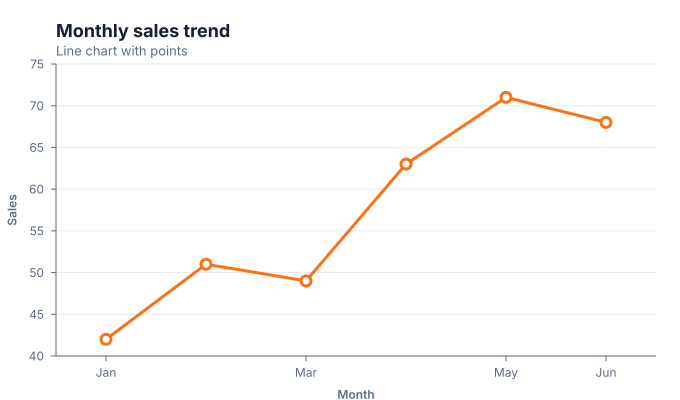](./line.md)                      | [](./pie.md)                            | [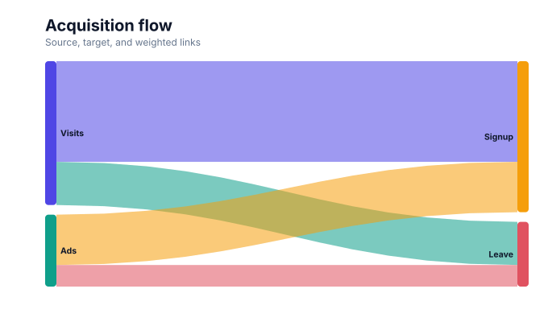](./flow.md)         |
| [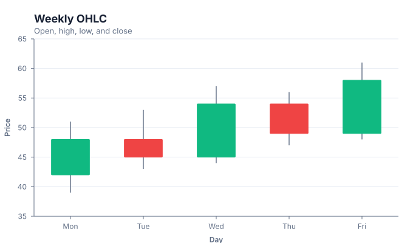](./candlestick.md) | [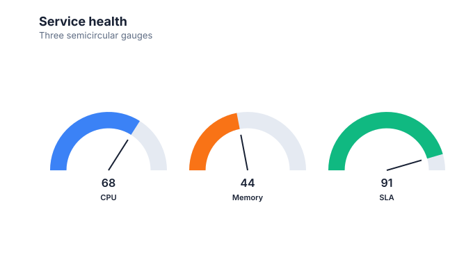](./gauge.md)                      | [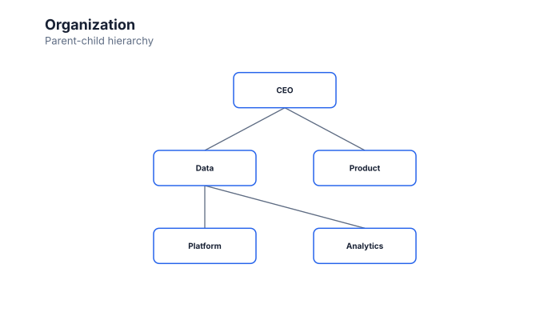](./hierarchy.md) |
| [](./waterfall.md)       | [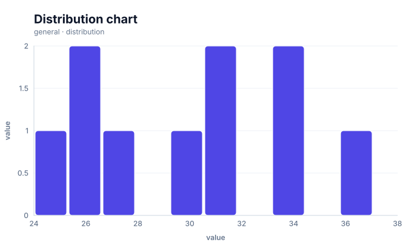](./distribution.md) | [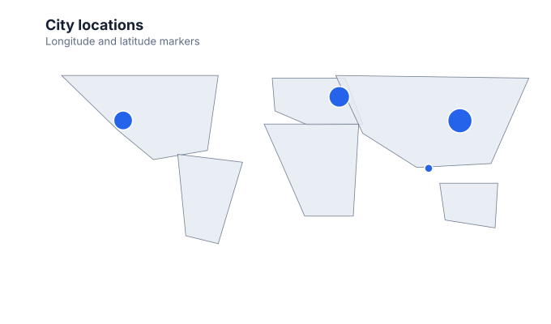](./map.md)                |
| [](./heatmap.md)             | [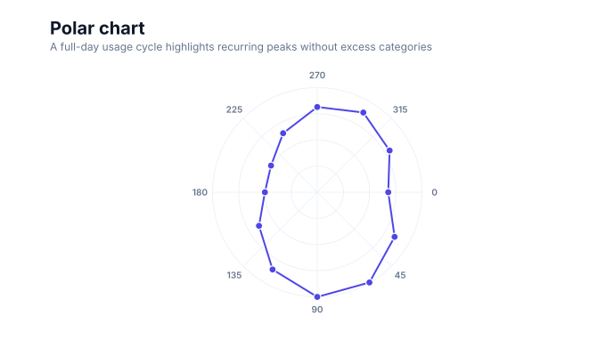](./polar.md)                      | [](./network.md)        |
| [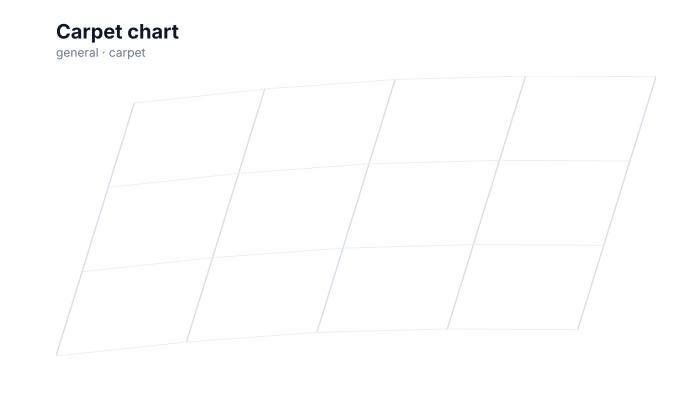](./carpet.md)                | [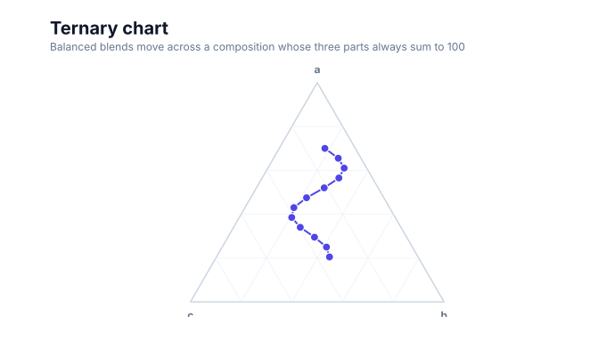](./ternary.md)                | [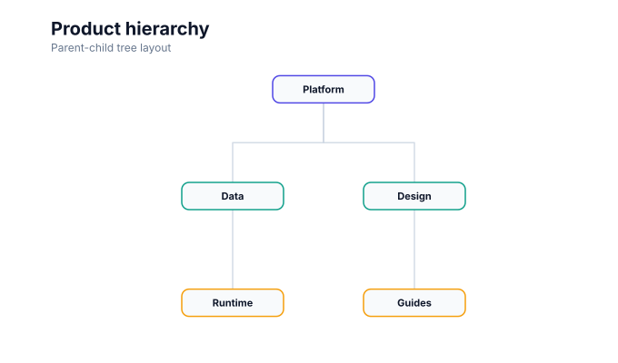](./hierarchy.md)        |

## Common Quick API shape

Every Quick API accepts a target, a row-oriented or columnar data source, and chart options:

```ts
import { line } from 'graflume';

const chart = line('#chart', data, {
  title: {
    text: 'Monthly sales',
    subtitle: 'USD thousands',
  },
  x: {
    field: 'month',
    type: 'ordinal',
    title: 'Month',
    axis: { grid: false },
  },
  y: {
    field: 'sales',
    type: 'quantitative',
    title: 'Sales',
    scale: { zero: false, nice: true },
  },
  mark: {
    stroke: '#4f46e5',
    lineWidth: 3,
    point: true,
  },
  theme: 'graflume-light',
  locale: 'en-US',
  interaction: {
    navigation: { maxZoom: 4, wheel: 'modifier' },
    controls: { zoom: true, reset: true, fullscreen: true, export: true },
    tooltip: {
      title: 'Monthly sales',
      trigger: 'axis',
      axis: 'x',
      fields: [
        { field: 'month', label: 'Month' },
        { field: 'sales', label: 'Sales', format: 'number', prefix: '$' },
      ],
    },
  },
  accessibility: {
    label: 'Monthly sales line chart',
    description: 'Sales rise from January through June with one dip in March.',
  },
});
```

The Quick API creates the same portable `ChartSpec 0.1` shape that can be passed to `create()`. Additional-family Quick APIs use the same options shape after importing from `graflume/complete`. JavaScript callbacks are not embedded in the portable spec.

## Data and encodings

### Row-oriented data

```ts
const data = [
  { month: 'Jan', sales: 42 },
  { month: 'Feb', sales: 51 },
  { month: 'Mar', sales: 49 },
];
```

### Columnar data

```ts
const data = {
  columns: {
    month: ['Jan', 'Feb', 'Mar'],
    sales: new Float64Array([42, 51, 49]),
  },
  length: 3,
};
```

Columnar `TypedArray` values remain zero-copy until a mutation-style operation requires row materialization.

### Encoding options

An encoding may be a field-name shorthand or a full object.

| Option                                | Meaning                                             |
| ------------------------------------- | --------------------------------------------------- |
| `field`                               | Data field to read                                  |
| `type`                                | `quantitative`, `temporal`, `ordinal`, or `nominal` |
| `title`                               | Axis title; defaults to the field name              |
| `scale.domain`                        | Explicit numeric pair or ordered categorical values |
| `scale.zero`                          | Include zero in a numeric domain                    |
| `scale.nice`                          | Expand a numeric domain to readable boundaries      |
| `scale.clamp`                         | Clamp numeric values to the scale range             |
| `scale.reverse`                       | Reverse the rendered scale direction                |
| `scale.paddingInner` / `paddingOuter` | Category-band spacing                               |
| `axisId`                              | Bind x to `x`/`x2`, or y to `y`/`y2`                |
| `axis`                                | Axis options or `false` to hide the axis            |

All active axes can be categorical, quantitative, or temporal. Layers sharing an `axisId` must use compatible field-type families. Specialized marks use `mark.fields` for additional channels such as `high`, `low`, `end`, `parent`, `target`, or `size`.

## Common chart options

| Option          | Current behavior                                                  |
| --------------- | ----------------------------------------------------------------- |
| `width`         | Number or `container`; defaults to responsive container width     |
| `height`        | Number or `container`; defaults to `400`                          |
| `padding`       | One number or per-side values                                     |
| `title`         | String or `{ text, subtitle, align }`                             |
| `description`   | Fallback accessible description                                   |
| `theme`         | An id from `builtInThemeCatalog` or a custom theme override       |
| `locale`        | Number/date formatting locale for axes                            |
| `renderer`      | `auto`, built-in `canvas` or `svg`, or a registered renderer name |
| `performance`   | `auto`, `standard`, `large`, or `ultra`                           |
| `interaction`   | Configure tooltips, inspection, controls, and opt-in playback     |
| `accessibility` | Canvas ARIA label and description                                 |
| `axes`          | Chart-level `x`/`x2`/`y`/`y2` axis defaults                       |

The Graflume light/dark defaults are x at the bottom, x2 at the top, y at the left, and y2 at the right, with only the primary y grid enabled. The `ggplot` profile enables primary x/y major and minor grids and hides their axis baselines. The `r-base` and `matplotlib` profiles disable grids and draw black axes, outward ticks, and a complete plot box, with their own typography and mark defaults. Chart-level settings are deeply merged with an encoding's `axis` override. See [Cartesian axes](./axes.md) for the complete function-free contract and runnable examples.

Quick APIs also accept `create` options for `autoResize`, manual width/height, and pixel ratio.

## Styling marks

The shared mark style surface is intentionally small:

| Option         | Used by                                 |
| -------------- | --------------------------------------- |
| `fill`         | bar, area, point, optional line points  |
| `stroke`       | line, area, point, optional bar outline |
| `opacity`      | all marks                               |
| `lineWidth`    | line/area stroke, point/bar outline     |
| `radius`       | point and optional line points          |
| `cornerRadius` | bar                                     |
| `point`        | line; renders interactive point circles |
| `position`     | bar layers; `overlay` or `group`        |
| `orientation`  | horizontal bar or vertical column       |
| `fields`       | named multi-channel data fields         |
| `options`      | mark-specific function-free JSON values |

Unsupported options are rejected by portable spec validation rather than silently evaluated as code.

## Events and chart lifecycle

```ts
const unsubscribe = chart.on('hover', ({ hit }) => {
  if (hit) console.log(hit.datum.datum);
});

chart.on('click', ({ hit }) => console.log(hit?.datum));
chart.on('resize', ({ width, height }) => console.log(width, height));
chart.on('viewchange', ({ view, reason }) => console.log(reason, view));
chart.on('playbackchange', ({ state, reason }) => console.log(reason, state.frame));
chart.on('fullscreenchange', ({ active }) => console.log({ active }));
chart.on('error', ({ error }) => console.error(error));

chart.setData(nextData);
chart.appendData([{ month: 'Apr', sales: 63 }]);
chart.setSpec(nextSpec);
chart.resize();
chart.zoomBy(1.25);
chart.panBy(24, 0);
chart.resetView();
chart.play();
chart.pause();
chart.step(1);
chart.seek(0);
chart.setPlaybackRate(2);
chart.setPlaybackLoop(true);
await chart.toggleFullscreen();
const png = chart.toDataURL('image/png');

unsubscribe();
chart.destroy();
```

`hover` and `click` return structured datum references. `getViewState()` reports `{ enabled, zoom, offsetX, offsetY }`; `getPlaybackState()` reports `{ enabled, frames, index, frame?, playing, rate, loop, mode }`. Inspection and playback mutators require their corresponding opt-in specification. See [Common chart interactions](./interactions.md) for event payloads, method constraints, and semantic playback policy. Authored streaming uses bounded ring storage; `enqueueData()` adds frame coalescing, cancellation, pause/follow-live and lazy history while the legacy synchronous update methods remain compatible.

### Built-in text-only tooltip

The built-in tooltip is opt-in. Use `interaction: { tooltip: true }` for a compact inferred field list with exact mark hit testing, or declare chart-specific content and a trigger explicitly:

```ts
interaction: {
  tooltip: {
    title: 'Forecast interval',
    trigger: 'axis',
    axis: 'x',
    fields: [
      { field: 'date', label: 'Date', format: 'date' },
      { field: 'low', label: 'Lower bound', format: 'number', fractionDigits: 1 },
      { field: 'high', label: 'Upper bound', format: 'number', fractionDigits: 1 },
    ],
  },
}
```

Supported formats are `auto`, `number`, `integer`, `percent`, `date`, `time`, and `datetime`. `dateStyle`, `timeStyle`, an IANA `timeZone`, `fractionDigits`, `prefix`, and `suffix` remain declarative and serializable. Number and temporal output follows the chart `locale`; an ISO date-only string such as `2026-08-23` is treated as a calendar date and does not shift to the previous day when `format: 'date'` is used in a western time zone. Portable JSON uses ISO strings or finite epoch-millisecond numbers; the JavaScript API also accepts `Date` objects. `percent` expects a ratio such as `0.42` and displays it as 42%.

`trigger: 'mark'` is the default for `tooltip: true` and for tooltip objects that omit `trigger`. It requires the pointer to hit rendered datum geometry. Ordered charts may opt into `trigger: 'axis'` with `axis: 'x'`, `'x2'`, `'y'`, or `'y2'`. In axis mode, an exact rendered-mark hit still has priority; otherwise a pointer in the plot or corresponding bounded axis region selects the nearest actual compiled datum from layers bound to that axis. Graflume does not interpolate a synthetic row between observations. The axis fallback controls only tooltip presentation, so structured `hover` and `click` events retain their exact rendered-mark hit semantics.

Tooltip titles, labels, and values are inserted with DOM `textContent`. Raw HTML, formatter callbacks, expressions, and runtime code evaluation are intentionally unsupported. Aggregate marks may attach derived fields, such as a bin boundary and count, to their hit target; those derived values take precedence over a representative source row when the same tooltip field is requested.

The pointer tooltip follows the pointer and is clamped to the chart surface. It adds `role="tooltip"` and temporarily connects the Canvas through `aria-describedby`. Pointer triggers remain pointer-only, while opt-in `accessibility.navigation` focuses bounded semantic marks and reuses the same safe tooltip content. `accessibility.table` can create a hidden or visible native table; a larger domain-specific table remains useful when `maxRows` omits data. Disabling `hover` disables pointer lookup. Large and ultra profiles disable pointer datum lookup, but their compiler semantic sidecar and opt-in native table remain independently bounded.

### Inspection, fullscreen, export, and playback

The built-in Canvas renderer supports an opt-in inspection viewport and compact controls for zoom/reset, fullscreen, PNG export, and discrete playback. Inspection magnifies and translates the complete compiled chart, including its title and axes. It does not change scale domains, re-bin data, fit a geographic region, or provide GIS/slippy-map navigation.

Playback requires an explicit field and follows distinct values in first-occurrence source order. It does not interpolate between frames. The native Motion path retains all source data and domains; generic filtering is deliberately gated by `filter: true` because it can change derived domains, aggregates, layouts, and path-dependent financial meaning. See [Common chart interactions](./interactions.md) for configuration, chart methods/events, the conservative allowlist, and the 41-family matrix.

## Interaction by mark

| Geometry                      | Current hit target                                                             |
| ----------------------------- | ------------------------------------------------------------------------------ |
| Rectangle/circle datum marks  | the whole rendered shape                                                       |
| Closed path datum marks       | the filled polygon, including pie and Sankey flow shapes                       |
| Line/open path marks          | optional points or companion datum shapes; the path itself is not a row target |
| Interactive datum text        | an approximate aligned and rotated text box                                    |
| Area marks with `point: true` | one datum circle per valid coordinate                                          |

For an exact interactive area or plain-line mark target, enable `point` or add a point layer. On an ordered chart, explicit axis mode can instead resolve the nearest actual datum without adding visible point marks. Large and ultra performance profiles disable datum hit lookup.

## Performance profiles

`auto` currently selects `standard` below 50,000 total rows, `large` below 1,000,000 rows, and `ultra` above that. The profiles bound rendered line points, circles, and bars to keep the browser responsive.

These thresholds are alpha safety limits, not a universal performance guarantee. Measure real devices and use aggregation or sampling before treating raw row counts as a rendering target.

## Accessibility checklist

Canvas charts should provide both structured Canvas metadata and a readable alternative near the chart.

```ts
accessibility: {
  label: 'Monthly sales bar chart',
  description: 'Six vertical bars compare January through June sales.',
}
```

Recommended page-level additions:

- a visible or collapsible text summary;
- a data table for exact values;
- keyboard-accessible controls outside the Canvas;
- a high-contrast or dark theme option;
- reduced-motion handling in surrounding UI.

Bounded native data tables and individual Canvas mark traversal are opt-in through `accessibility.table`, `accessibility.maxRows`, and `accessibility.navigation`. They do not virtualize or expose rows beyond the declared bound.

## Still planned, not presented as complete

- stacked and normalized stacks and direct-manipulation callout editing; portable programmatic callout authoring plus violin and density modes are implemented;
- full map boundary/projection packages, force-directed large-network layout, multi-stage Sankey layout, implicit Word Tree tokenization, and complete Vega grammar conversion;
- facets, concat, dashboards, linked views, and automatic cross-chart scale synchronization;
- shared multi-series or advanced collision-aware tooltip routing, rendered crosshair guides, automatic data tables, and keyboard mark traversal; reusable Canvas mark-label collision routing and authoring, native mark-aware legends, and keyboard legend visibility controls are implemented;
- WebGPU renderer parity. Native SVG vector rendering and [completed-chart snapshots](./interactions.md#save-and-reopen-a-completed-chart) are implemented; externally loaded map tiles remain Canvas-only. The separate `graflume/spatial` entrypoint already provides WebGL spatial/3D rendering; it does not yet mix GPU layers into a normal Canvas `ChartSpec` scene.
