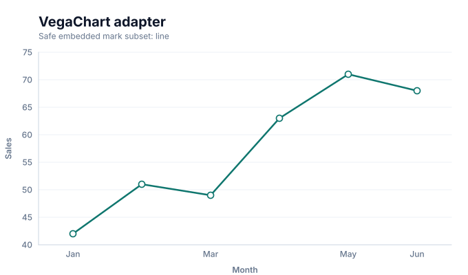
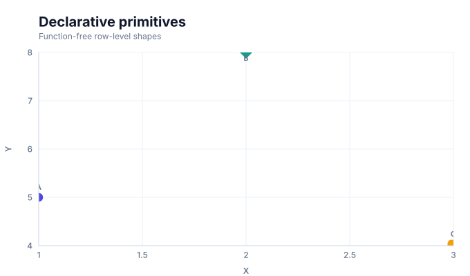

# Declarative adapters

Adapters translate a constrained external or custom declarative shape into Graflume's portable specification. They are compatibility surfaces, not additional chart families, so they do not appear in the 37-family discovery catalog.

| Adapter                  | Quick API     | Portable mark | Contract                                                              |
| ------------------------ | ------------- | ------------- | --------------------------------------------------------------------- |
| Portable adapter chart   | `vegaChart()` | `vega`        | Translates the supported function-free embedded mark subset.          |
| Declarative custom chart | `custom()`    | `custom`      | Builds row-level declarative primitives without executable callbacks. |

Both adapters reject executable callbacks and enter the ordinary validation, Scene compilation, rendering, interaction, and accessibility pipeline. Prefer a representative family Quick API when the data meaning already matches one of the [37 chart families](./README.md#choose-a-chart).

## Visual gallery

Every image below is generated from the current compiled Scene rather than drawn by hand. Select a name to jump to its data fields and implementation.

|                                                                                                                                                 |                                                                                                                                                           |
| ----------------------------------------------------------------------------------------------------------------------------------------------- | --------------------------------------------------------------------------------------------------------------------------------------------------------- |
| **[Portable adapter chart](#variant-vega)**<br>[](../assets/charts/vega.svg) | **[Declarative custom chart](#variant-custom)**<br>[](../assets/charts/custom.svg) |

## Type-by-type implementation

The snippets are minimal runnable examples. Change `#chart` to the target element and expand the inline rows with your data. Each example opts into Graflume's safe text-only tooltip with a chart-specific title and ordered fields; number and date formatting follows the declared `locale`. The Quick API applies the preset defaults while keeping the resulting specification function-free and serializable.

<a id="variant-vega"></a>

### Portable adapter chart

Use this preset when this preset matches the intended reading task. Translates the supported function-free embedded mark subset.

- **Quick API:** `vegaChart()`
- **Mode:** `adapter`
- **Portable mark:** `vega`
- **Required example fields:** `category`, `value`

```js
import { vegaChart } from 'graflume';

const data = [
  {
    category: 'P1',
    value: 24,
  },
  {
    category: 'P2',
    value: 29.916,
  },
  {
    category: 'P3',
    value: 33.54,
  },
  {
    category: 'P4',
    value: 33.72,
  },
];

vegaChart('#chart', data, {
  x: {
    field: 'category',
    type: 'ordinal',
    title: 'category',
  },
  y: {
    field: 'value',
    type: 'quantitative',
    title: 'value',
  },
  title: {
    text: 'Portable adapter chart',
    subtitle: 'custom family · adapter mode',
  },
  accessibility: {
    label: 'Portable adapter chart example',
    description: 'A compiled portable adapter chart example using the custom family.',
  },
  mark: {
    options: {
      mark: 'line',
    },
    point: true,
  },
  locale: 'en-US',
  interaction: {
    tooltip: {
      title: 'Portable adapter chart',
      fields: [
        {
          field: 'category',
          label: 'category',
          format: 'auto',
        },
        {
          field: 'value',
          label: 'value',
          format: 'number',
        },
      ],
    },
  },
});
```

<a id="variant-custom"></a>

### Declarative custom chart

Use this preset when this preset matches the intended reading task. Builds row-level declarative primitives without executable callbacks.

- **Quick API:** `custom()`
- **Mode:** `default`
- **Portable mark:** `custom`
- **Required example fields:** `x`, `y`, `shape`, `size`, `label`

```js
import { custom } from 'graflume/complete';

const data = [
  {
    x: 12,
    y: 42,
    shape: 'circle',
    size: 20,
    label: 'P1',
  },
  {
    x: 24,
    y: 55,
    shape: 'diamond',
    size: 85,
    label: 'P2',
  },
  {
    x: 38,
    y: 33,
    shape: 'circle',
    size: 55,
    label: 'P3',
  },
  {
    x: 51,
    y: 68,
    shape: 'diamond',
    size: 120,
    label: 'P4',
  },
];

custom('#chart', data, {
  x: {
    field: 'x',
    type: 'quantitative',
    title: 'x',
  },
  y: {
    field: 'y',
    type: 'quantitative',
    title: 'y',
  },
  title: {
    text: 'Declarative custom chart',
    subtitle: 'custom family · default mode',
  },
  accessibility: {
    label: 'Declarative custom chart example',
    description: 'A compiled declarative custom chart example using the custom family.',
  },
  mark: {
    fields: {
      shape: 'shape',
      size: 'size',
      label: 'label',
    },
  },
  locale: 'en-US',
  interaction: {
    tooltip: {
      title: 'Declarative custom chart',
      fields: [
        {
          field: 'x',
          label: 'x',
          format: 'number',
        },
        {
          field: 'y',
          label: 'y',
          format: 'number',
        },
        {
          field: 'shape',
          label: 'Shape',
          format: 'auto',
        },
        {
          field: 'size',
          label: 'Size',
          format: 'number',
        },
        {
          field: 'label',
          label: 'Label',
          format: 'auto',
        },
      ],
    },
  },
});
```

## Embedded mark adapter

`vegaChart()` accepts the documented safe mark subset under `mark.options.mark`. It is intended for migration of function-free line, area, bar, or point declarations; arbitrary transforms, expressions, signals, and remote loading are outside the portable contract.

## Declarative primitive adapter

`custom()` maps row fields such as shape, size, and label to built-in portable primitives. It does not execute a per-row rendering function or permit raw HTML.

## Verification

- Compiled snapshots: [embedded mark](../assets/charts/vega.svg) and [declarative primitives](../assets/charts/custom.svg)
- Runtime catalog: [`src/catalog`](../../src/catalog)
- Catalog tests: [`tests`](../../tests)

[Back to chart guides](./README.md)
