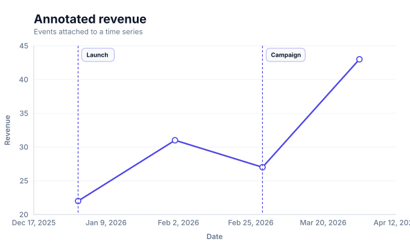
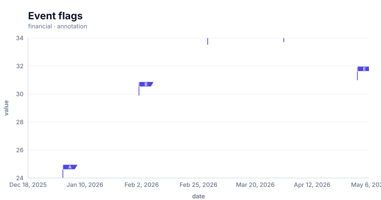

# Annotation charts

<!-- FAMILY_PRESETS_START -->

## Integrated presets

This is the single manual for the `annotation` family. Its canonical Quick API is `annotation()` from `graflume`, and its representative portable mark is `annotation`. The compatible names below remain callable, but they are modes or data-meaning presets rather than separate chart families.

| Compatible name                                   | Quick API             | Mode          | Portable mark | Functional difference                                                  |
| ------------------------------------------------- | --------------------- | ------------- | ------------- | ---------------------------------------------------------------------- |
| [Annotation chart](#variant-annotation)           | `annotation()`        | `default`     | `annotation`  | The canonical annotated trend presentation.                            |
| [Annotated timeline](#variant-annotated-timeline) | `annotatedTimeline()` | `timeline`    | `annotation`  | Uses the annotation family with the timeline compatibility name.       |
| [Event flags](#variant-event-flags)               | `eventFlags()`        | `event-flags` | `flags`       | Replaces long annotation pills with compact labels anchored to events. |

All presets reuse the same validation, normalization, scale, compiler, renderer-neutral Scene, interaction, accessibility, and serialization contracts. Direction, curve, layout, glyph, depth, financial-body, and indicator choices stay in function-free fields or options instead of selecting a second rendering engine. The remaining manually maintained sections describe the canonical/default presentation unless a preset row above states a different behavior.

## Visual gallery

Every image below is generated from the current compiled Scene rather than drawn by hand. Select a name to jump to its data fields and implementation.

|                                                                                                                                                       |                                                                                                                                                                                   |
| ----------------------------------------------------------------------------------------------------------------------------------------------------- | --------------------------------------------------------------------------------------------------------------------------------------------------------------------------------- |
| **[Annotation chart](#variant-annotation)**<br>[](../assets/charts/annotation.svg) | **[Annotated timeline](#variant-annotated-timeline)**<br>[](../assets/charts/annotated-timeline.svg) |
| **[Event flags](#variant-event-flags)**<br>[](../assets/charts/event-flags.svg)        |                                                                                                                                                                                   |

## Type-by-type implementation

The snippets are minimal runnable examples. Change `#chart` to the target element and expand the inline rows with your data. Each example opts into Graflume's safe text-only tooltip with a chart-specific title and ordered fields; number and date formatting follows the declared `locale`. This family uses `trigger: "axis"` with `axis: "x"`. An exact rendered-mark hit still has priority; otherwise Graflume selects the nearest actual datum on that axis without inventing an interpolated row. Tooltip interaction is a pointer-only convenience, so keep a readable summary or data table available for exact values and keyboard access. The Quick API applies the preset defaults while keeping the resulting specification function-free and serializable.

Every family can opt into the Canvas [inspection viewport, fullscreen, reset, and PNG controls](./interactions.md). Inspection magnifies and translates the complete already-rendered chart, including its title and axes; it is not data-domain or GIS zoom. Generated examples intentionally leave playback off. Add discrete playback only after selecting a meaningful frame field and reviewing the family-specific capability table.

Every family also accepts the shared portable [legend, highlight, selection, and callout contract](./interactions.md#legends-highlights-selection-and-callouts). Automatic legend semantics follow the compiled mark and palette where they are unambiguous; use explicit function-free items for a domain-specific series or category legend. Static datum/layer/range highlights and text-only top-level callouts remain available even when a family has no Cartesian point geometry.

<a id="variant-annotation"></a>

### Annotation chart

Use this preset when you need to place named events or notes on an ordered series. The canonical annotated trend presentation.

- **Quick API:** `annotation()`
- **Mode:** `default`
- **Portable mark:** `annotation`
- **Required example fields:** `date`, `value`, `annotation`

```js
import { annotation } from 'graflume';

const data = [
  {
    date: '2026-01-01',
    value: 22,
    annotation: 'Launch',
  },
  {
    date: '2026-02-01',
    value: 31,
    annotation: null,
  },
  {
    date: '2026-03-01',
    value: 27,
    annotation: 'Campaign',
  },
  {
    date: '2026-04-01',
    value: 43,
    annotation: null,
  },
];

annotation('#chart', data, {
  x: {
    field: 'date',
    type: 'temporal',
    title: 'date',
  },
  y: {
    field: 'value',
    type: 'quantitative',
    title: 'value',
  },
  title: {
    text: 'Annotation chart',
    subtitle: 'annotation family · default mode',
  },
  accessibility: {
    label: 'Annotation chart example',
    description: 'A compiled annotation chart example using the annotation family.',
  },
  mark: {
    fields: {
      annotation: 'annotation',
    },
    point: true,
  },
  locale: 'en-US',
  interaction: {
    tooltip: {
      title: 'Annotation chart',
      fields: [
        {
          field: 'date',
          label: 'date',
          format: 'date',
        },
        {
          field: 'value',
          label: 'value',
          format: 'number',
        },
        {
          field: 'annotation',
          label: 'Annotation',
          format: 'auto',
        },
      ],
      trigger: 'axis',
      axis: 'x',
    },
  },
});
```

<a id="variant-annotated-timeline"></a>

### Annotated timeline

Use this preset when you need to place named events or notes on an ordered series. Uses the annotation family with the timeline compatibility name.

- **Quick API:** `annotatedTimeline()`
- **Mode:** `timeline`
- **Portable mark:** `annotation`
- **Required example fields:** `date`, `value`, `annotation`

```js
import { annotatedTimeline } from 'graflume';

const data = [
  {
    date: '2026-01-01',
    value: 22,
    annotation: 'Launch',
  },
  {
    date: '2026-02-01',
    value: 31,
    annotation: null,
  },
  {
    date: '2026-03-01',
    value: 27,
    annotation: 'Campaign',
  },
  {
    date: '2026-04-01',
    value: 43,
    annotation: null,
  },
];

annotatedTimeline('#chart', data, {
  x: {
    field: 'date',
    type: 'temporal',
    title: 'date',
  },
  y: {
    field: 'value',
    type: 'quantitative',
    title: 'value',
  },
  title: {
    text: 'Annotated timeline',
    subtitle: 'annotation family · timeline mode',
  },
  accessibility: {
    label: 'Annotated timeline example',
    description: 'A compiled annotated timeline example using the annotation family.',
  },
  mark: {
    fields: {
      annotation: 'annotation',
    },
    point: true,
  },
  locale: 'en-US',
  interaction: {
    tooltip: {
      title: 'Annotated timeline',
      fields: [
        {
          field: 'date',
          label: 'date',
          format: 'date',
        },
        {
          field: 'value',
          label: 'value',
          format: 'number',
        },
        {
          field: 'annotation',
          label: 'Annotation',
          format: 'auto',
        },
      ],
      trigger: 'axis',
      axis: 'x',
    },
  },
});
```

<a id="variant-event-flags"></a>

### Event flags

Use this preset when you need to place named events or notes on an ordered series. Replaces long annotation pills with compact labels anchored to events.

- **Quick API:** `eventFlags()`
- **Mode:** `event-flags`
- **Portable mark:** `flags`
- **Required example fields:** `date`, `value`, `title`

```js
import { eventFlags } from 'graflume/complete';

const data = [
  {
    date: '2026-01-01',
    value: 24,
    title: 'A',
  },
  {
    date: '2026-02-01',
    value: 29.916,
    title: 'B',
  },
  {
    date: '2026-03-01',
    value: 33.54,
    title: 'C',
  },
  {
    date: '2026-04-01',
    value: 33.72,
    title: 'D',
  },
];

eventFlags('#chart', data, {
  x: {
    field: 'date',
    type: 'temporal',
    title: 'date',
  },
  y: {
    field: 'value',
    type: 'quantitative',
    title: 'value',
  },
  title: {
    text: 'Event flags',
    subtitle: 'annotation family · event-flags mode',
  },
  accessibility: {
    label: 'Event flags example',
    description: 'A compiled event flags example using the annotation family.',
  },
  mark: {
    fields: {
      title: 'title',
    },
  },
  locale: 'en-US',
  interaction: {
    tooltip: {
      title: 'Event flags',
      fields: [
        {
          field: 'date',
          label: 'date',
          format: 'date',
        },
        {
          field: 'value',
          label: 'value',
          format: 'number',
        },
        {
          field: 'title',
          label: 'Title',
          format: 'auto',
        },
      ],
      trigger: 'axis',
      axis: 'x',
    },
  },
});
```

<!-- FAMILY_PRESETS_END -->

Use an annotation chart when a time series must explain named events at specific dates.

## Implemented appearance

This image is generated from the current Graflume `compile()` Scene, not a hand-drawn mockup.


## Quick API

`Graflume.annotation()` creates the portable `annotation` mark (or documented alias mapping) and accepts the common target, data, and options arguments.

```ts
Graflume.annotation('#chart', data, {
  x: { field: 'date', type: 'temporal' },
  y: { field: 'value', type: 'quantitative' },
  mark: {
    fields: { annotation: 'event', annotationText: 'detail' },
    point: true,
  },
});
```

## Portable ChartSpec mapping

`x` is temporal, `y` is quantitative, and `mark.fields.annotation` names the short event-label field. `annotationText` may name a longer detail field.

The same result can be created with `Graflume.create()` and `mark: { type: 'annotation' }`. Named `mark.fields` and `mark.options` values are function-free and JSON-serializable, so they remain portable across JavaScript, future Python/R/Java builders, and stored specs.

## Data, ordering, and missing values

The compiler draws the canonical line path first, then adds a clipped vertical guide and theme-aware label pill for every non-empty annotation value. Missing x/y values split the line; missing annotations only suppress the guide.

Rows keep source order unless the compiler must establish a deterministic temporal or hierarchy order. Unsafe field names are rejected, callbacks are forbidden in portable specs, and invalid or unmappable values are skipped rather than evaluated.

## Styling and themes

The mark uses shared `fill`, `stroke`, `opacity`, `lineWidth`, `radius`, and `cornerRadius` options where the geometry makes them meaningful. Default colors, text, grid, focus, and palettes come from the active design-token theme and switch at runtime.

## Interaction and accessibility

Rendered datum shapes carry layer id, row index, and the original row for hover/click hit testing in the standard profile. Supply a concise `accessibility.label`, a useful `description`, and an adjacent text or table fallback. Canvas ARIA metadata does not replace keyboard-readable page content.

## Performance profiles

The same `standard`, `large`, `ultra`, and `auto` profiles apply. Complex layout marks currently favor deterministic bounded Scene output; aggregate or filter very large source data before rendering specialized diagrams.

## Current limitations

Annotation label collision avoidance, a side detail panel, range navigation, direct-manipulation editing, and multi-series annotation arbitration are not implemented yet. This canonical mark is an ordered event-series presentation; the separate [top-level callout contract](./interactions.md#legends-highlights-selection-and-callouts) can annotate any family and supports programmatic add/update/remove lifecycle methods.

## Runnable example and regression coverage

- [default-family CDN gallery](../../examples/cdn/complete-chart-types.html)
- [Chart catalog compile tests](../../tests/extended-chart-types.test.mjs)
- [Generated visual asset](../assets/charts/annotation.svg)

[Back to chart guides](./README.md)
