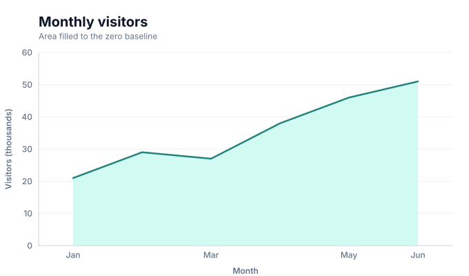
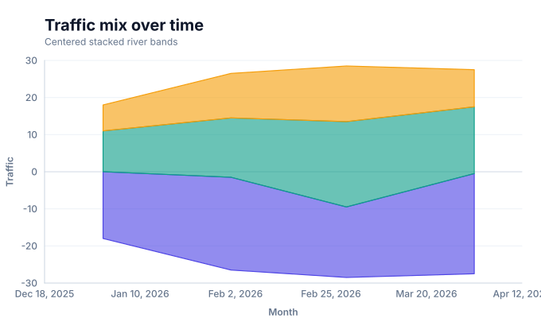
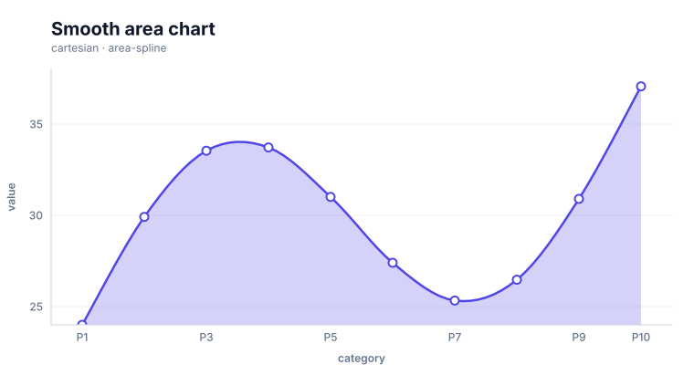
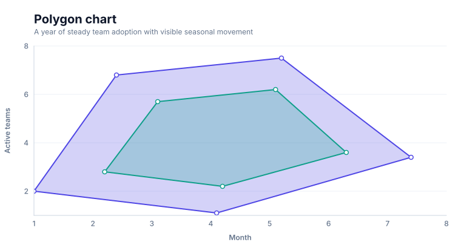
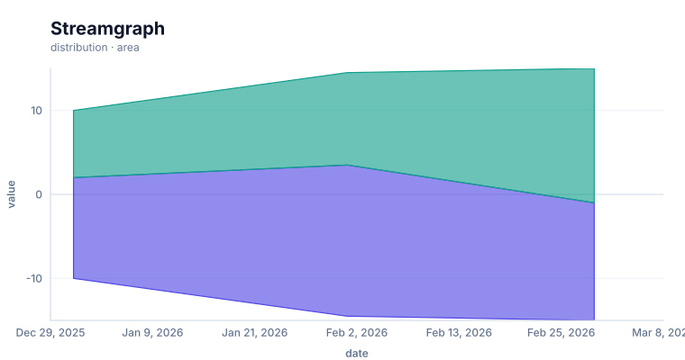

# Area charts

<!-- FAMILY_PRESETS_START -->

## Integrated presets

This is the single manual for the `area` family. Its canonical Quick API is `area()` from `graflume`, and its representative portable mark is `area`. The compatible names below remain callable, but they are modes or data-meaning presets rather than separate chart families.

| Compatible name                             | Quick API       | Mode          | Portable mark  | Functional difference                                          |
| ------------------------------------------- | --------------- | ------------- | -------------- | -------------------------------------------------------------- |
| [Area chart](#variant-area)                 | `area()`        | `default`     | `area`         | Fills an ordered series to its baseline.                       |
| [Stepped area chart](#variant-stepped-area) | `steppedArea()` | `stepped`     | `stepped-area` | Uses horizontal and vertical steps instead of direct segments. |
| [Theme river chart](#variant-theme-river)   | `themeRiver()`  | `stream`      | `theme-river`  | Centers stacked category bands around a shared baseline.       |
| [Smooth area chart](#variant-area-spline)   | `areaSpline()`  | `area-spline` | `smooth`       | Uses a sampled smooth upper path with an area fill.            |
| [Polygon chart](#variant-polygon)           | `polygon()`     | `polygon`     | `polygon`      | Closes ordered coordinates into a filled polygon.              |
| [Streamgraph](#variant-streamgraph)         | `streamgraph()` | `streamgraph` | `theme-river`  | Uses the centered multi-series stream presentation.            |

All presets reuse the same validation, normalization, scale, compiler, renderer-neutral Scene, interaction, accessibility, and serialization contracts. Direction, curve, layout, glyph, depth, financial-body, and indicator choices stay in function-free fields or options instead of selecting a second rendering engine. The remaining manually maintained sections describe the canonical/default presentation unless a preset row above states a different behavior.

## Visual gallery

Every image below is generated from the current compiled Scene rather than drawn by hand. Select a name to jump to its data fields and implementation.

|                                                                                                                                                            |                                                                                                                                                                 |
| ---------------------------------------------------------------------------------------------------------------------------------------------------------- | --------------------------------------------------------------------------------------------------------------------------------------------------------------- |
| **[Area chart](#variant-area)**<br>[](../assets/charts/area.svg)                                    | **[Stepped area chart](#variant-stepped-area)**<br>[](../assets/charts/stepped-area.svg) |
| **[Theme river chart](#variant-theme-river)**<br>[](../assets/charts/theme-river.svg) | **[Smooth area chart](#variant-area-spline)**<br>[](../assets/charts/area-spline.svg)      |
| **[Polygon chart](#variant-polygon)**<br>[](../assets/charts/polygon.svg)                     | **[Streamgraph](#variant-streamgraph)**<br>[](../assets/charts/streamgraph.svg)                  |

## Type-by-type implementation

The snippets are minimal runnable examples. Change `#chart` to the target element and expand the inline rows with your data. Each example opts into Graflume's safe text-only tooltip with a chart-specific title and ordered fields; number and date formatting follows the declared `locale`. This family uses `trigger: "axis"` with `axis: "x"`. An exact rendered-mark hit still has priority; otherwise Graflume selects the nearest actual datum on that axis without inventing an interpolated row. Tooltip interaction is a pointer-only convenience, so keep a readable summary or data table available for exact values and keyboard access. The Quick API applies the preset defaults while keeping the resulting specification function-free and serializable.

<a id="variant-area"></a>

### Area chart

Use this preset when the magnitude and continuity of an ordered series matter more than individual points. Fills an ordered series to its baseline.

- **Quick API:** `area()`
- **Mode:** `default`
- **Portable mark:** `area`
- **Required example fields:** `category`, `value`

```js
import { area } from 'graflume';

const data = [
  {
    category: 'P1',
    value: 24,
  },
  {
    category: 'P2',
    value: 29.916,
  },
  {
    category: 'P3',
    value: 33.54,
  },
  {
    category: 'P4',
    value: 33.72,
  },
];

area('#chart', data, {
  x: {
    field: 'category',
    type: 'ordinal',
    title: 'category',
  },
  y: {
    field: 'value',
    type: 'quantitative',
    title: 'value',
  },
  title: {
    text: 'Area chart',
    subtitle: 'area family · default mode',
  },
  accessibility: {
    label: 'Area chart example',
    description: 'A compiled area chart example using the area family.',
  },
  mark: {
    point: true,
  },
  locale: 'en-US',
  interaction: {
    tooltip: {
      title: 'Area chart',
      fields: [
        {
          field: 'category',
          label: 'category',
          format: 'auto',
        },
        {
          field: 'value',
          label: 'value',
          format: 'number',
        },
      ],
      trigger: 'axis',
      axis: 'x',
    },
  },
});
```

<a id="variant-stepped-area"></a>

### Stepped area chart

Use this preset when the magnitude and continuity of an ordered series matter more than individual points. Uses horizontal and vertical steps instead of direct segments.

- **Quick API:** `steppedArea()`
- **Mode:** `stepped`
- **Portable mark:** `stepped-area`
- **Required example fields:** `category`, `value`

```js
import { steppedArea } from 'graflume';

const data = [
  {
    category: 'P1',
    value: 24,
  },
  {
    category: 'P2',
    value: 29.916,
  },
  {
    category: 'P3',
    value: 33.54,
  },
  {
    category: 'P4',
    value: 33.72,
  },
];

steppedArea('#chart', data, {
  x: {
    field: 'category',
    type: 'ordinal',
    title: 'category',
  },
  y: {
    field: 'value',
    type: 'quantitative',
    title: 'value',
  },
  title: {
    text: 'Stepped area chart',
    subtitle: 'area family · stepped mode',
  },
  accessibility: {
    label: 'Stepped area chart example',
    description: 'A compiled stepped area chart example using the area family.',
  },
  mark: {
    point: true,
  },
  locale: 'en-US',
  interaction: {
    tooltip: {
      title: 'Stepped area chart',
      fields: [
        {
          field: 'category',
          label: 'category',
          format: 'auto',
        },
        {
          field: 'value',
          label: 'value',
          format: 'number',
        },
      ],
      trigger: 'axis',
      axis: 'x',
    },
  },
});
```

<a id="variant-theme-river"></a>

### Theme river chart

Use this preset when the magnitude and continuity of an ordered series matter more than individual points. Centers stacked category bands around a shared baseline.

- **Quick API:** `themeRiver()`
- **Mode:** `stream`
- **Portable mark:** `theme-river`
- **Required example fields:** `date`, `value`, `series`

```js
import { themeRiver } from 'graflume/complete';

const data = [
  {
    date: '2026-01-01',
    value: 12,
    series: 'A',
  },
  {
    date: '2026-01-01',
    value: 8,
    series: 'B',
  },
  {
    date: '2026-02-01',
    value: 18,
    series: 'A',
  },
  {
    date: '2026-02-01',
    value: 11,
    series: 'B',
  },
];

themeRiver('#chart', data, {
  x: {
    field: 'date',
    type: 'temporal',
    title: 'date',
  },
  y: {
    field: 'value',
    type: 'quantitative',
    title: 'value',
  },
  title: {
    text: 'Theme river chart',
    subtitle: 'area family · stream mode',
  },
  accessibility: {
    label: 'Theme river chart example',
    description: 'A compiled theme river chart example using the area family.',
  },
  mark: {
    fields: {
      category: 'series',
    },
  },
  locale: 'en-US',
  interaction: {
    tooltip: {
      title: 'Theme river chart',
      fields: [
        {
          field: 'date',
          label: 'date',
          format: 'date',
        },
        {
          field: 'value',
          label: 'value',
          format: 'number',
        },
        {
          field: 'series',
          label: 'Series',
          format: 'auto',
        },
      ],
      trigger: 'axis',
      axis: 'x',
    },
  },
});
```

<a id="variant-area-spline"></a>

### Smooth area chart

Use this preset when the magnitude and continuity of an ordered series matter more than individual points. Uses a sampled smooth upper path with an area fill.

- **Quick API:** `areaSpline()`
- **Mode:** `area-spline`
- **Portable mark:** `smooth`
- **Required example fields:** `category`, `value`

```js
import { areaSpline } from 'graflume/complete';

const data = [
  {
    category: 'P1',
    value: 24,
  },
  {
    category: 'P2',
    value: 29.916,
  },
  {
    category: 'P3',
    value: 33.54,
  },
  {
    category: 'P4',
    value: 33.72,
  },
];

areaSpline('#chart', data, {
  x: {
    field: 'category',
    type: 'ordinal',
    title: 'category',
  },
  y: {
    field: 'value',
    type: 'quantitative',
    title: 'value',
  },
  title: {
    text: 'Smooth area chart',
    subtitle: 'area family · area-spline mode',
  },
  accessibility: {
    label: 'Smooth area chart example',
    description: 'A compiled smooth area chart example using the area family.',
  },
  mark: {
    point: true,
    options: {
      area: true,
    },
  },
  locale: 'en-US',
  interaction: {
    tooltip: {
      title: 'Smooth area chart',
      fields: [
        {
          field: 'category',
          label: 'category',
          format: 'auto',
        },
        {
          field: 'value',
          label: 'value',
          format: 'number',
        },
      ],
      trigger: 'axis',
      axis: 'x',
    },
  },
});
```

<a id="variant-polygon"></a>

### Polygon chart

Use this preset when the magnitude and continuity of an ordered series matter more than individual points. Closes ordered coordinates into a filled polygon.

- **Quick API:** `polygon()`
- **Mode:** `polygon`
- **Portable mark:** `polygon`
- **Required example fields:** `x`, `y`, `series`

```js
import { polygon } from 'graflume/complete';

const data = [
  {
    x: 1,
    y: 2,
    series: 'A',
  },
  {
    x: 3,
    y: 7,
    series: 'A',
  },
  {
    x: 6,
    y: 3,
    series: 'A',
  },
  {
    x: 2,
    y: 3,
    series: 'B',
  },
];

polygon('#chart', data, {
  x: {
    field: 'x',
    type: 'quantitative',
    title: 'x',
  },
  y: {
    field: 'y',
    type: 'quantitative',
    title: 'y',
  },
  title: {
    text: 'Polygon chart',
    subtitle: 'area family · polygon mode',
  },
  accessibility: {
    label: 'Polygon chart example',
    description: 'A compiled polygon chart example using the area family.',
  },
  mark: {
    fields: {
      series: 'series',
    },
  },
  locale: 'en-US',
  interaction: {
    tooltip: {
      title: 'Polygon chart',
      fields: [
        {
          field: 'x',
          label: 'x',
          format: 'number',
        },
        {
          field: 'y',
          label: 'y',
          format: 'number',
        },
        {
          field: 'series',
          label: 'Series',
          format: 'auto',
        },
      ],
      trigger: 'axis',
      axis: 'x',
    },
  },
});
```

<a id="variant-streamgraph"></a>

### Streamgraph

Use this preset when the magnitude and continuity of an ordered series matter more than individual points. Uses the centered multi-series stream presentation.

- **Quick API:** `streamgraph()`
- **Mode:** `streamgraph`
- **Portable mark:** `theme-river`
- **Required example fields:** `date`, `value`, `series`

```js
import { streamgraph } from 'graflume/complete';

const data = [
  {
    date: '2026-01-01',
    value: 12,
    series: 'A',
  },
  {
    date: '2026-01-01',
    value: 8,
    series: 'B',
  },
  {
    date: '2026-02-01',
    value: 18,
    series: 'A',
  },
  {
    date: '2026-02-01',
    value: 11,
    series: 'B',
  },
];

streamgraph('#chart', data, {
  x: {
    field: 'date',
    type: 'temporal',
    title: 'date',
  },
  y: {
    field: 'value',
    type: 'quantitative',
    title: 'value',
  },
  title: {
    text: 'Streamgraph',
    subtitle: 'area family · streamgraph mode',
  },
  accessibility: {
    label: 'Streamgraph example',
    description: 'A compiled streamgraph example using the area family.',
  },
  mark: {
    fields: {
      category: 'series',
    },
  },
  locale: 'en-US',
  interaction: {
    tooltip: {
      title: 'Streamgraph',
      fields: [
        {
          field: 'date',
          label: 'date',
          format: 'date',
        },
        {
          field: 'value',
          label: 'value',
          format: 'number',
        },
        {
          field: 'series',
          label: 'Series',
          format: 'auto',
        },
      ],
      trigger: 'axis',
      axis: 'x',
    },
  },
});
```

<!-- FAMILY_PRESETS_END -->

Use an area chart to show an ordered trend while emphasizing magnitude relative to a baseline. The current Graflume area mark fills a single line down to zero.

## Implemented appearance

This snapshot shows the current zero-baseline fill, separate crisp top line, quiet axes, and title layout. The baseline is no longer outlined as part of the area stroke.


## Quick API

```ts
import { area } from 'graflume';

const chart = area('#chart', data, {
  title: 'Monthly visitors',
  x: { field: 'month', type: 'ordinal', axis: { grid: false } },
  y: {
    field: 'visitors',
    type: 'quantitative',
    title: 'Visitors (thousands)',
    scale: { zero: true, nice: true },
  },
  mark: {
    fill: '#ccfbf1',
    stroke: '#0f766e',
    lineWidth: 2.5,
    opacity: 0.9,
  },
  accessibility: {
    label: 'Monthly visitors area chart',
    description: 'The filled area shows visitor growth from January through June.',
  },
});
```

## Portable ChartSpec

```ts
Graflume.create('#chart', {
  specVersion: '0.1',
  data,
  mark: {
    type: 'area',
    fill: '#ccfbf1',
    stroke: '#0f766e',
    opacity: 0.9,
  },
  x: { field: 'month', type: 'ordinal' },
  y: { field: 'visitors', type: 'quantitative' },
});
```

## Baseline and data behavior

- The area mark always includes zero in the y domain.
- Valid top-line points form a fill polygon closed to zero plus a separate open stroke path.
- Input-row order determines the top-line order; data is not sorted automatically.
- Invalid x/y pairs are omitted. The current single polygon may bridge across omitted rows, so pre-filter or split discontinuous data into explicit layers.
- Min/max sampling uses the line-point performance budget.

## Interaction

The filled polygon does not currently expose exact per-row datum hit targets. The generated examples enable point circles and an x-axis tooltip: exact circles keep priority, while other eligible pointer positions resolve the nearest actual row. For structured hover/click hits without relying on the tooltip fallback, enable area points or overlay a point layer:

```ts
Graflume.create('#chart', {
  data,
  layers: [
    {
      id: 'area',
      mark: { type: 'area', fill: '#dbeafe', opacity: 0.85 },
      x: { field: 'month', type: 'ordinal' },
      y: { field: 'value', type: 'quantitative' },
    },
    {
      id: 'points',
      mark: { type: 'point', fill: '#4f46e5', radius: 4 },
      x: { field: 'month', type: 'ordinal' },
      y: { field: 'value', type: 'quantitative' },
    },
  ],
});
```

## Current limitations

- zero baseline only;
- no stacked, normalized, streamgraph, or between-two-lines area;
- one closed polygon per area layer;
- missing rows do not create separate area segments;
- no polygon-level per-row hit testing; use point targets or the explicit x-axis tooltip;
- no SVG/WebGL renderer parity yet.

## Runnable examples and tests

- [chart type gallery](../../examples/cdn/chart-types.html)
- [area regression test](../../tests/chart-types.test.mjs)

[Back to chart guides](./README.md)
