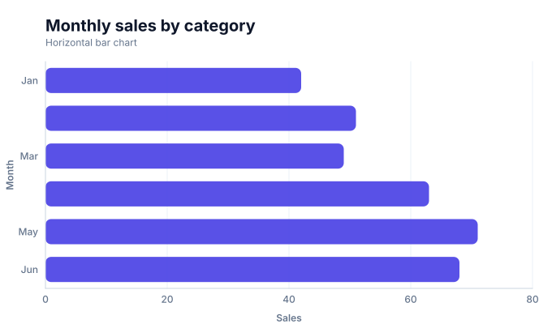
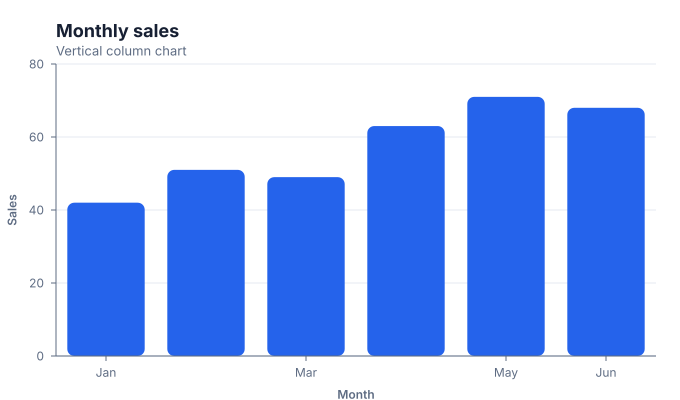
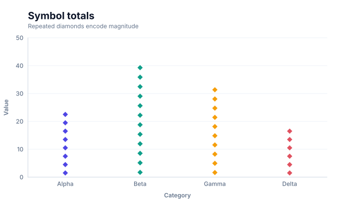
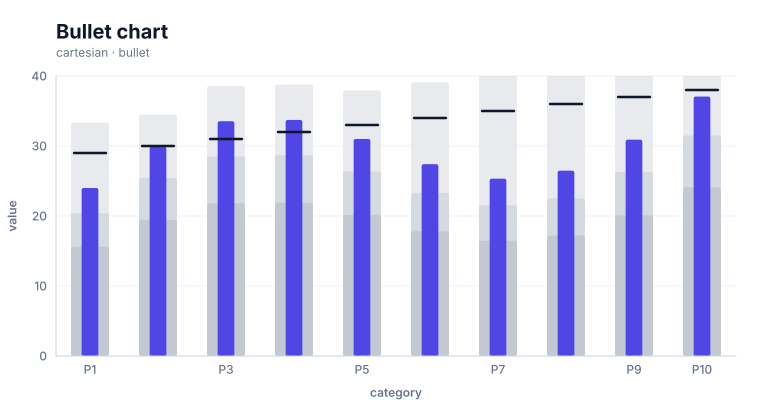
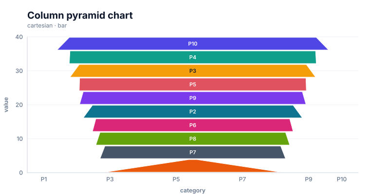
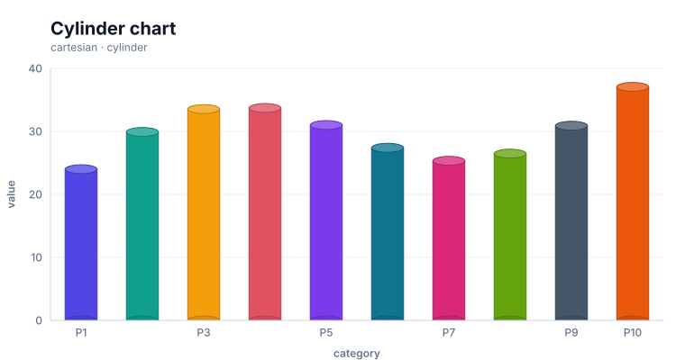
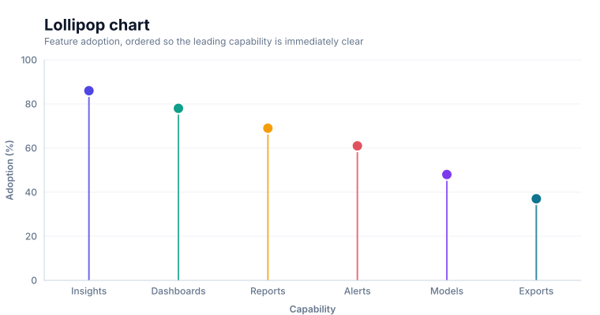
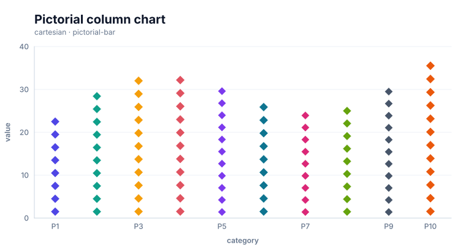
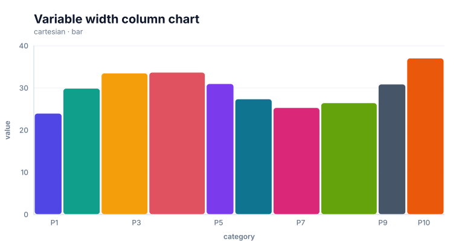

# Bar charts

<!-- FAMILY_PRESETS_START -->

## Integrated presets

This is the single manual for the `bar` family. Its canonical Quick API is `bar()` from `graflume`, and its representative portable mark is `bar`. The compatible names below remain callable, but they are modes or data-meaning presets rather than separate chart families.

| Compatible name             | Quick API           | Mode               | Portable mark   | Functional difference                                              |
| --------------------------- | ------------------- | ------------------ | --------------- | ------------------------------------------------------------------ |
| Bar chart                   | `horizontalBar()`   | `horizontal`       | `bar`           | Uses the canonical horizontal comparison orientation.              |
| Column chart                | `column()`          | `vertical`         | `bar`           | Rotates the shared bar geometry into vertical columns.             |
| Pictorial bar chart         | `pictorialBar()`    | `pictorial`        | `pictorial-bar` | Repeats symbols inside the shared categorical bar layout.          |
| Bullet chart                | `bullet()`          | `bullet`           | `bullet`        | Adds qualitative ranges and a target rule around the observed bar. |
| Column pyramid chart        | `columnPyramid()`   | `column-pyramid`   | `pyramid`       | Uses tapered vertical column bodies.                               |
| Cylinder chart              | `cylinder()`        | `cylinder`         | `cylinder`      | Adds portable elliptical caps to a column body.                    |
| Lollipop chart              | `lollipop()`        | `lollipop`         | `lollipop`      | Uses a baseline stem and emphasized endpoint.                      |
| Pictorial column chart      | `pictorialColumn()` | `pictorial-column` | `pictorial-bar` | Uses repeated symbols in the vertical column orientation.          |
| Variable width column chart | `variableWidth()`   | `variable-width`   | `variwide`      | Allocates category width from an additional quantitative field.    |

All presets reuse the same validation, normalization, scale, compiler, renderer-neutral Scene, interaction, accessibility, and serialization contracts. Direction, curve, layout, glyph, depth, financial-body, and indicator choices stay in function-free fields or options instead of selecting a second rendering engine. The remaining sections describe the canonical/default presentation unless a preset row above states a different behavior.

<details>
<summary>Open 9 compiled preset snapshots</summary>

| Preset                      | Current compiled output                                                                                                   |
| --------------------------- | ------------------------------------------------------------------------------------------------------------------------- |
| Bar chart                   | [](../assets/charts/bar.svg)                                         |
| Column chart                | [](../assets/charts/column.svg)                                |
| Pictorial bar chart         | [](../assets/charts/pictorial-bar.svg)           |
| Bullet chart                | [](../assets/charts/bullet.svg)                                |
| Column pyramid chart        | [](../assets/charts/column-pyramid.svg)        |
| Cylinder chart              | [](../assets/charts/cylinder.svg)                          |
| Lollipop chart              | [](../assets/charts/lollipop.svg)                          |
| Pictorial column chart      | [](../assets/charts/pictorial-column.svg)  |
| Variable width column chart | [](../assets/charts/variable-width.svg) |

</details>
<!-- FAMILY_PRESETS_END -->
Use a bar chart to compare quantitative values across discrete categories. In the explicit orientation APIs, `horizontalBar()` renders horizontal bars and `column()` renders vertical columns. The original `bar()` API remains a backward-compatible vertical alias.

## Implemented appearance

The following snapshot is generated from the current Graflume `compile()` Scene and uses the same primitives, coordinates, colors, opacity, clipping, and typography instructions as the Canvas renderer.

| Horizontal bar                                                                                    | Vertical column                                                                                          |
| ------------------------------------------------------------------------------------------------- | -------------------------------------------------------------------------------------------------------- |
|  |  |

## Quick API

```ts
import { horizontalBar } from 'graflume';

const chart = horizontalBar('#chart', data, {
  title: 'Monthly sales',
  x: {
    field: 'sales',
    type: 'quantitative',
    title: 'Sales',
    scale: { zero: true, nice: true },
  },
  y: {
    field: 'month',
    type: 'ordinal',
    title: 'Month',
    axis: { grid: false },
  },
  mark: {
    fill: '#4f46e5',
    stroke: '#3730a3',
    lineWidth: 1,
    cornerRadius: 8,
    opacity: 0.94,
  },
  accessibility: {
    label: 'Monthly sales bar chart',
    description: 'Three bars compare sales for January, February, and March.',
  },
});
```

## Portable ChartSpec

```ts
const spec = {
  specVersion: '0.1',
  data,
  mark: {
    type: 'bar',
    orientation: 'horizontal',
    fill: '#4f46e5',
    cornerRadius: 8,
  },
  x: {
    field: 'sales',
    type: 'quantitative',
    scale: { zero: true, nice: true },
  },
  y: { field: 'month', type: 'ordinal' },
};

Graflume.create('#chart', spec);
```

`horizontalBar()`, `column()`, and the existing `bar()` all compile to the same portable `bar` mark. Orientation is stored explicitly in `mark.orientation`, so serialization is unambiguous.

## Data behavior

- Horizontal bars use quantitative x and categorical y; vertical columns use categorical x and quantitative y.
- Both axes now support categorical, quantitative, or temporal scales when the selected mark can use them.
- Bar domains include zero automatically, even when `scale.zero` is omitted.
- Positive and negative values extend in opposite directions from the zero baseline.
- Rows with missing or non-mappable x/y pairs are skipped.
- Input category order is preserved unless an explicit categorical domain is supplied.

## Grouped bars

Set `position: 'group'` on every bar layer that should occupy a separate slot.

```ts
Graflume.create('#chart', {
  data: [
    { month: 'Jan', plan: 38, actual: 42 },
    { month: 'Feb', plan: 47, actual: 51 },
    { month: 'Mar', plan: 52, actual: 49 },
  ],
  layers: [
    {
      id: 'plan',
      mark: { type: 'bar', position: 'group', fill: '#7c3aed' },
      x: { field: 'month', type: 'ordinal' },
      y: { field: 'plan', type: 'quantitative' },
    },
    {
      id: 'actual',
      mark: { type: 'bar', position: 'group', fill: '#4f46e5' },
      x: { field: 'month', type: 'ordinal' },
      y: { field: 'actual', type: 'quantitative' },
    },
  ],
});
```

Without `position: 'group'`, multiple bar layers use overlay positioning.

## Interaction

Each rendered rectangle carries its layer id, row index, and original datum. Hover and click events work in the standard profile:

```ts
chart.on('click', ({ hit }) => {
  if (hit) console.log(hit.datum.layerId, hit.datum.datum);
});
```

Large and ultra profiles reduce rendered bars and disable per-bar hit testing.

## Current limitations

- no stacked or normalized stack calculation;
- no range, floating, or funnel semantics; waterfall uses its own portable mark;
- no native legend, tooltip, or data-label layout;
- no keyboard traversal of individual bars;
- no SVG/WebGL renderer parity yet.

## Runnable examples and tests

- [single-series example](../../examples/bar/index.html)
- [standalone grouped CDN example](../../examples/cdn/bar-chart.html)
- [chart type gallery](../../examples/cdn/chart-types.html)
- [default-family chart gallery](../../examples/cdn/complete-chart-types.html)
- [bar regression tests](../../tests/bar.test.mjs)

[Back to chart guides](./README.md)
