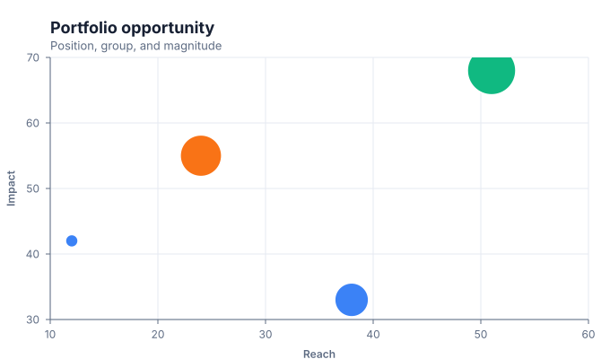
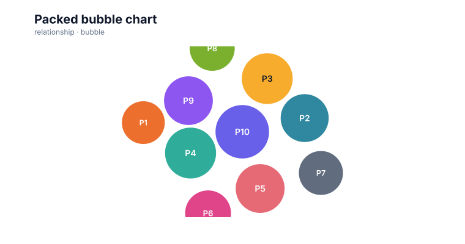

# Bubble charts

<!-- FAMILY_PRESETS_START -->

## Integrated presets

This is the single manual for the `bubble` family. Its canonical Quick API is `bubble()` from `graflume`, and its representative portable mark is `bubble`. The compatible names below remain callable, but they are modes or data-meaning presets rather than separate chart families.

| Compatible name     | Quick API        | Mode            | Portable mark   | Functional difference                                       |
| ------------------- | ---------------- | --------------- | --------------- | ----------------------------------------------------------- |
| Bubble chart        | `bubble()`       | `default`       | `bubble`        | Positions magnitude-scaled circles on coordinates.          |
| Packed bubble chart | `packedBubble()` | `packed-bubble` | `packed-bubble` | Uses deterministic collision-aware packing instead of axes. |

All presets reuse the same validation, normalization, scale, compiler, renderer-neutral Scene, interaction, accessibility, and serialization contracts. Direction, curve, layout, glyph, depth, financial-body, and indicator choices stay in function-free fields or options instead of selecting a second rendering engine. The remaining sections describe the canonical/default presentation unless a preset row above states a different behavior.

<details>
<summary>Open 2 compiled preset snapshots</summary>

| Preset              | Current compiled output                                                                                         |
| ------------------- | --------------------------------------------------------------------------------------------------------------- |
| Bubble chart        | [](../assets/charts/bubble.svg)                      |
| Packed bubble chart | [](../assets/charts/packed-bubble.svg) |

</details>
<!-- FAMILY_PRESETS_END -->
Use a bubble chart to compare two quantitative positions plus magnitude and an optional category.

## Implemented appearance

This image is generated from the current Graflume `compile()` Scene, not a hand-drawn mockup.


## Quick API

`Graflume.bubble()` creates the portable `bubble` mark (or documented alias mapping) and accepts the common target, data, and options arguments.

```ts
Graflume.bubble('#chart', data, {
  x: { field: 'reach', type: 'quantitative' },
  y: { field: 'impact', type: 'quantitative' },
  mark: {
    fields: { size: 'budget', color: 'team' },
    options: { minRadius: 6, maxRadius: 26 },
  },
});
```

## Portable ChartSpec mapping

`x` and `y` are quantitative. `mark.fields.size` supplies bubble area magnitude and `color` supplies a categorical palette key. `minRadius` and `maxRadius` are portable numeric options.

The same result can be created with `Graflume.create()` and `mark: { type: 'bubble' }`. Named `mark.fields` and `mark.options` values are function-free and JSON-serializable, so they remain portable across JavaScript, future Python/R/Java builders, and stored specs.

## Data, ordering, and missing values

Bubble radius uses a square-root scale so perceived area tracks magnitude. Missing positions are skipped; missing size uses the middle radius. Motion charts reuse this compiler after frame filtering.

Rows keep source order unless the compiler must establish a deterministic temporal or hierarchy order. Unsafe field names are rejected, callbacks are forbidden in portable specs, and invalid or unmappable values are skipped rather than evaluated.

## Styling and themes

The mark uses shared `fill`, `stroke`, `opacity`, `lineWidth`, `radius`, and `cornerRadius` options where the geometry makes them meaningful. Default colors, text, grid, focus, and palettes come from the active design-token theme and switch at runtime.

## Interaction and accessibility

Rendered datum shapes carry layer id, row index, and the original row for hover/click hit testing in the standard profile. Supply a concise `accessibility.label`, a useful `description`, and an adjacent text or table fallback. Canvas ARIA metadata does not replace keyboard-readable page content.

## Performance profiles

The same `standard`, `large`, `ultra`, and `auto` profiles apply. Complex layout marks currently favor deterministic bounded Scene output; aggregate or filter very large source data before rendering specialized diagrams.

## Current limitations

Automatic bubble-label placement, collision packing, and categorical legends are not implemented yet.

## Runnable example and regression coverage

- [default-family CDN gallery](../../examples/cdn/complete-chart-types.html)
- [Chart catalog compile tests](../../tests/extended-chart-types.test.mjs)
- [Generated visual asset](../assets/charts/bubble.svg)

[Back to chart guides](./README.md)
