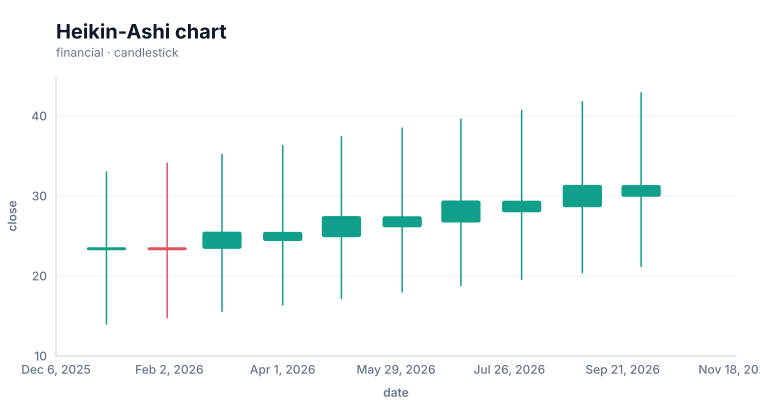
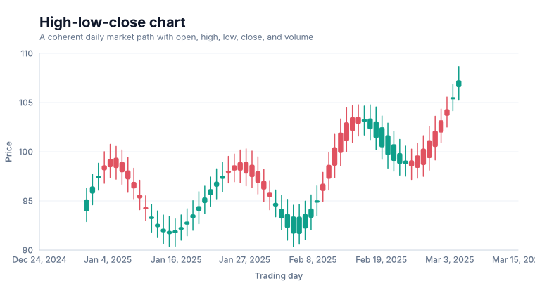
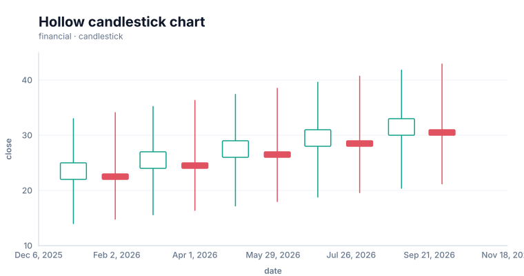
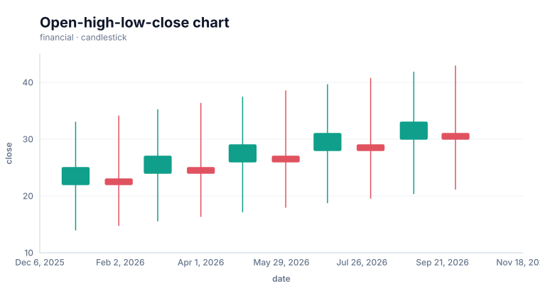

# Candlestick charts

<!-- FAMILY_PRESETS_START -->

## Integrated presets

This is the single manual for the `candlestick` family. Its canonical Quick API is `candlestick()` from `graflume`, and its representative portable mark is `candlestick`. The compatible names below remain callable, but they are modes or data-meaning presets rather than separate chart families.

| Compatible name           | Quick API             | Mode                  | Portable mark | Functional difference                                          |
| ------------------------- | --------------------- | --------------------- | ------------- | -------------------------------------------------------------- |
| Candlestick chart         | `candlestick()`       | `default`             | `candlestick` | Uses conventional open-high-low-close bodies and wicks.        |
| Heikin-Ashi chart         | `heikinAshi()`        | `heikin-ashi`         | `financial`   | Uses derived Heikin-Ashi open and close values.                |
| High-low-close chart      | `highLowClose()`      | `high-low-close`      | `financial`   | Shows high-low stems plus the close tick without an open tick. |
| Hollow candlestick chart  | `hollowCandlestick()` | `hollow-candlestick`  | `financial`   | Uses hollow and filled bodies to distinguish direction.        |
| Open-high-low-close chart | `openHighLowClose()`  | `open-high-low-close` | `financial`   | Shows open and close ticks on a high-low stem.                 |

All presets reuse the same validation, normalization, scale, compiler, renderer-neutral Scene, interaction, accessibility, and serialization contracts. Direction, curve, layout, glyph, depth, financial-body, and indicator choices stay in function-free fields or options instead of selecting a second rendering engine. The remaining sections describe the canonical/default presentation unless a preset row above states a different behavior.

<details>
<summary>Open 5 compiled preset snapshots</summary>

| Preset                    | Current compiled output                                                                                                           |
| ------------------------- | --------------------------------------------------------------------------------------------------------------------------------- |
| Candlestick chart         | [](../assets/charts/candlestick.svg)                         |
| Heikin-Ashi chart         | [](../assets/charts/heikin-ashi.svg)                         |
| High-low-close chart      | [](../assets/charts/high-low-close.svg)                |
| Hollow candlestick chart  | [](../assets/charts/hollow-candlestick.svg)    |
| Open-high-low-close chart | [](../assets/charts/open-high-low-close.svg) |

</details>
<!-- FAMILY_PRESETS_END -->
Use a candlestick chart for ordered open-high-low-close observations.

## Implemented appearance

This image is generated from the current Graflume `compile()` Scene, not a hand-drawn mockup.


## Quick API

`Graflume.candlestick()` creates the portable `candlestick` mark (or documented alias mapping) and accepts the common target, data, and options arguments.

```ts
Graflume.candlestick('#chart', data, {
  x: { field: 'day', type: 'ordinal' },
  y: { field: 'close', type: 'quantitative' },
  mark: { fields: { open: 'open', high: 'high', low: 'low', close: 'close' } },
});
```

## Portable ChartSpec mapping

`x` is an ordered category or time. `y` normally names close, while `fields.open`, `high`, `low`, and `close` identify OHLC columns.

The same result can be created with `Graflume.create()` and `mark: { type: 'candlestick' }`. Named `mark.fields` and `mark.options` values are function-free and JSON-serializable, so they remain portable across JavaScript, future Python/R/Java builders, and stored specs.

## Data, ordering, and missing values

The y domain includes every OHLC channel. Each row becomes a high-low wick and an open-close body; rising and falling bodies use separate colors.

Rows keep source order unless the compiler must establish a deterministic temporal or hierarchy order. Unsafe field names are rejected, callbacks are forbidden in portable specs, and invalid or unmappable values are skipped rather than evaluated.

## Styling and themes

The mark uses shared `fill`, `stroke`, `opacity`, `lineWidth`, `radius`, and `cornerRadius` options where the geometry makes them meaningful. Default colors, text, grid, focus, and palettes come from the active design-token theme and switch at runtime.

## Interaction and accessibility

Rendered datum shapes carry layer id, row index, and the original row for hover/click hit testing in the standard profile. Supply a concise `accessibility.label`, a useful `description`, and an adjacent text or table fallback. Canvas ARIA metadata does not replace keyboard-readable page content.

## Performance profiles

The same `standard`, `large`, `ultra`, and `auto` profiles apply. Complex layout marks currently favor deterministic bounded Scene output; aggregate or filter very large source data before rendering specialized diagrams.

## Current limitations

Volume panels, trading-session gaps, hollow-candle conventions, and financial indicators are not implemented yet.

## Runnable example and regression coverage

- [default-family CDN gallery](../../examples/cdn/complete-chart-types.html)
- [Chart catalog compile tests](../../tests/extended-chart-types.test.mjs)
- [Generated visual asset](../assets/charts/candlestick.svg)

[Back to chart guides](./README.md)
