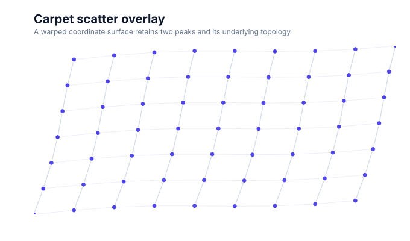
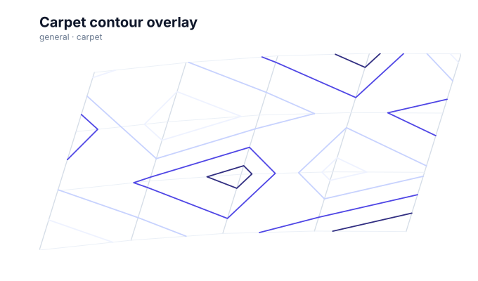

# Carpet charts

<!-- FAMILY_PRESETS_START -->

## Integrated presets

This is the single manual for the `carpet` family. Its canonical Quick API is `carpet()` from `graflume/complete`, and its representative portable mark is `carpet`. The compatible names below remain callable, but they are modes or data-meaning presets rather than separate chart families.

| Compatible name                                   | Quick API         | Mode      | Portable mark | Functional difference                              |
| ------------------------------------------------- | ----------------- | --------- | ------------- | -------------------------------------------------- |
| [Carpet chart](#variant-carpet)                   | `carpet()`        | `default` | `carpet`      | Shows the curvilinear logical coordinate grid.     |
| [Carpet scatter overlay](#variant-carpet-scatter) | `carpetScatter()` | `scatter` | `carpet`      | Overlays interactive points on the warped grid.    |
| [Carpet contour overlay](#variant-carpet-contour) | `carpetContour()` | `contour` | `carpet`      | Overlays actual value isolines on the warped grid. |

All presets reuse the same validation, normalization, scale, compiler, renderer-neutral Scene, interaction, accessibility, and serialization contracts. Direction, curve, layout, glyph, depth, financial-body, and indicator choices stay in function-free fields or options instead of selecting a second rendering engine. The remaining manually maintained sections describe the canonical/default presentation unless a preset row above states a different behavior.

## Visual gallery

Every image below is generated from the current compiled Scene rather than drawn by hand. Select a name to jump to its data fields and implementation.

|                                                                                                                                                                               |                                                                                                                                                                               |
| ----------------------------------------------------------------------------------------------------------------------------------------------------------------------------- | ----------------------------------------------------------------------------------------------------------------------------------------------------------------------------- |
| **[Carpet chart](#variant-carpet)**<br>[](../assets/charts/carpet.svg)                                             | **[Carpet scatter overlay](#variant-carpet-scatter)**<br>[](../assets/charts/carpet-scatter.svg) |
| **[Carpet contour overlay](#variant-carpet-contour)**<br>[](../assets/charts/carpet-contour.svg) |                                                                                                                                                                               |

## Type-by-type implementation

The snippets are minimal runnable examples. Change `#chart` to the target element and expand the inline rows with your data. Each example opts into Graflume's safe text-only tooltip with a chart-specific title and ordered fields; number and date formatting follows the declared `locale`. This family keeps `trigger: "mark"`, so the pointer must hit rendered datum geometry. Tooltip interaction is a pointer-only convenience, so keep a readable summary or data table available for exact values and keyboard access. The Quick API applies the preset defaults while keeping the resulting specification function-free and serializable.

Every family can opt into the Canvas [inspection viewport, fullscreen, reset, and PNG controls](./interactions.md). Inspection magnifies and translates the complete already-rendered chart, including its title and axes; it is not data-domain or GIS zoom. Generated examples intentionally leave playback off. Add discrete playback only after selecting a meaningful frame field and reviewing the family-specific capability table.

Every family also accepts the shared portable [legend, highlight, selection, and callout contract](./interactions.md#legends-highlights-selection-and-callouts). Automatic legend semantics follow the compiled mark and palette where they are unambiguous; use explicit function-free items for a domain-specific series or category legend. Static datum/layer/range highlights and text-only top-level callouts remain available even when a family has no Cartesian point geometry.

<a id="variant-carpet"></a>

### Carpet chart

Use this preset when logical coordinates must be read through a supplied curvilinear surface. Shows the curvilinear logical coordinate grid.

- **Quick API:** `carpet()`
- **Mode:** `default`
- **Portable mark:** `carpet`
- **Required example fields:** `a`, `b`, `px`, `py`, `value`

```js
import { carpet } from 'graflume/complete';

const data = [
  {
    a: 0,
    b: 0,
    px: 0,
    py: 0,
    value: 8,
  },
  {
    a: 1,
    b: 0,
    px: 1,
    py: 0.166,
    value: 15,
  },
  {
    a: 2,
    b: 0,
    px: 2,
    py: 0.28,
    value: 22,
  },
  {
    a: 3,
    b: 0,
    px: 3,
    py: 0.321,
    value: 29,
  },
];

carpet('#chart', data, {
  x: {
    field: 'a',
    type: 'quantitative',
    title: 'a',
  },
  y: {
    field: 'b',
    type: 'quantitative',
    title: 'b',
  },
  title: {
    text: 'Carpet chart',
    subtitle: 'carpet family · default mode',
  },
  accessibility: {
    label: 'Carpet chart example',
    description: 'A compiled carpet chart example using the carpet family.',
  },
  mark: {
    fields: {
      x: 'px',
      y: 'py',
      value: 'value',
    },
    options: {
      mode: 'grid',
      levels: 4,
    },
  },
  locale: 'en-US',
  interaction: {
    tooltip: {
      title: 'Carpet chart',
      fields: [
        {
          field: 'axis',
          label: 'Logical axis',
          format: 'auto',
        },
        {
          field: 'key',
          label: 'Logical key',
          format: 'auto',
        },
        {
          field: 'logicalCoordinate',
          label: 'Coordinate',
          format: 'auto',
        },
        {
          field: 'a',
          label: 'a',
          format: 'number',
        },
        {
          field: 'b',
          label: 'b',
          format: 'number',
        },
        {
          field: 'px',
          label: 'Px',
          format: 'number',
        },
        {
          field: 'py',
          label: 'Py',
          format: 'number',
        },
        {
          field: 'value',
          label: 'Value',
          format: 'number',
        },
      ],
      trigger: 'mark',
    },
  },
});
```

<a id="variant-carpet-scatter"></a>

### Carpet scatter overlay

Use this preset when logical coordinates must be read through a supplied curvilinear surface. Overlays interactive points on the warped grid.

- **Quick API:** `carpetScatter()`
- **Mode:** `scatter`
- **Portable mark:** `carpet`
- **Required example fields:** `a`, `b`, `px`, `py`, `value`

```js
import { carpetScatter } from 'graflume/complete';

const data = [
  {
    a: 0,
    b: 0,
    px: 0,
    py: 0,
    value: 8,
  },
  {
    a: 1,
    b: 0,
    px: 1,
    py: 0.166,
    value: 15,
  },
  {
    a: 2,
    b: 0,
    px: 2,
    py: 0.28,
    value: 22,
  },
  {
    a: 3,
    b: 0,
    px: 3,
    py: 0.321,
    value: 29,
  },
];

carpetScatter('#chart', data, {
  x: {
    field: 'a',
    type: 'quantitative',
    title: 'a',
  },
  y: {
    field: 'b',
    type: 'quantitative',
    title: 'b',
  },
  title: {
    text: 'Carpet scatter overlay',
    subtitle: 'carpet family · scatter mode',
  },
  accessibility: {
    label: 'Carpet scatter overlay example',
    description: 'A compiled carpet scatter overlay example using the carpet family.',
  },
  mark: {
    fields: {
      x: 'px',
      y: 'py',
      value: 'value',
    },
    options: {
      mode: 'scatter',
      levels: 4,
    },
  },
  locale: 'en-US',
  interaction: {
    tooltip: {
      title: 'Carpet scatter overlay',
      fields: [
        {
          field: 'axis',
          label: 'Logical axis',
          format: 'auto',
        },
        {
          field: 'key',
          label: 'Logical key',
          format: 'auto',
        },
        {
          field: 'logicalCoordinate',
          label: 'Coordinate',
          format: 'auto',
        },
        {
          field: 'a',
          label: 'a',
          format: 'number',
        },
        {
          field: 'b',
          label: 'b',
          format: 'number',
        },
        {
          field: 'px',
          label: 'Px',
          format: 'number',
        },
        {
          field: 'py',
          label: 'Py',
          format: 'number',
        },
        {
          field: 'value',
          label: 'Value',
          format: 'number',
        },
      ],
      trigger: 'mark',
    },
  },
});
```

<a id="variant-carpet-contour"></a>

### Carpet contour overlay

Use this preset when logical coordinates must be read through a supplied curvilinear surface. Overlays actual value isolines on the warped grid.

- **Quick API:** `carpetContour()`
- **Mode:** `contour`
- **Portable mark:** `carpet`
- **Required example fields:** `a`, `b`, `px`, `py`, `value`

```js
import { carpetContour } from 'graflume/complete';

const data = [
  {
    a: 0,
    b: 0,
    px: 0,
    py: 0,
    value: 8,
  },
  {
    a: 1,
    b: 0,
    px: 1,
    py: 0.166,
    value: 15,
  },
  {
    a: 2,
    b: 0,
    px: 2,
    py: 0.28,
    value: 22,
  },
  {
    a: 3,
    b: 0,
    px: 3,
    py: 0.321,
    value: 29,
  },
];

carpetContour('#chart', data, {
  x: {
    field: 'a',
    type: 'quantitative',
    title: 'a',
  },
  y: {
    field: 'b',
    type: 'quantitative',
    title: 'b',
  },
  title: {
    text: 'Carpet contour overlay',
    subtitle: 'carpet family · contour mode',
  },
  accessibility: {
    label: 'Carpet contour overlay example',
    description: 'A compiled carpet contour overlay example using the carpet family.',
  },
  mark: {
    fields: {
      x: 'px',
      y: 'py',
      value: 'value',
    },
    options: {
      mode: 'contour',
      levels: 4,
    },
  },
  locale: 'en-US',
  interaction: {
    tooltip: {
      title: 'Carpet contour overlay',
      fields: [
        {
          field: 'axis',
          label: 'Logical axis',
          format: 'auto',
        },
        {
          field: 'key',
          label: 'Logical key',
          format: 'auto',
        },
        {
          field: 'logicalCoordinate',
          label: 'Coordinate',
          format: 'auto',
        },
        {
          field: 'level',
          label: 'Contour level',
          format: 'number',
        },
        {
          field: 'minimumValue',
          label: 'Minimum value',
          format: 'number',
        },
        {
          field: 'maximumValue',
          label: 'Maximum value',
          format: 'number',
        },
        {
          field: 'valueField',
          label: 'Value field',
          format: 'auto',
        },
        {
          field: 'a',
          label: 'a',
          format: 'number',
        },
        {
          field: 'b',
          label: 'b',
          format: 'number',
        },
        {
          field: 'px',
          label: 'Px',
          format: 'number',
        },
        {
          field: 'py',
          label: 'Py',
          format: 'number',
        },
        {
          field: 'value',
          label: 'Value',
          format: 'number',
        },
      ],
      trigger: 'mark',
    },
  },
});
```

<!-- FAMILY_PRESETS_END -->

The `carpet` family lays a curvilinear coordinate grid over supplied physical positions and supports point or contour overlays on that same warped surface.

## Data contract

Use `x` and `y` as the logical carpet coordinates. Map physical positions with `mark.fields.x` and `mark.fields.y`; contour mode additionally names a quantitative value field. A rectangular logical grid produces the clearest result.

## Styling and interaction

Grid paths, scatter points, and contour isolines are compiled as distinct Scene geometry. Base grid paths expose the logical axis and key under the pointer. Contour mode uses the warped grid positions and marching-square density segments rather than recoloring points, and each isoline reports its derived level and observed value range before any representative source row.

## Accessibility and limits

Explain both logical axes and the physical coordinate meaning in surrounding text. Sparse or non-rectangular grids may leave contour gaps because the compiler does not invent missing measurements. Bounds, logical-axis groups, value ranges, and the logical cell index are built in one pass. Grid paths share the performance profile's line-point budget, scatter points use its point-mark budget, and contour grids and emitted segments are deterministically bounded before allocation.

## Verification

Focused tests assert the shared warped grid, interactive scatter overlay, actual contour path nodes, and bounded compilation of a 140,000-row grid without argument-spread or repeated full-table lookup failures.
