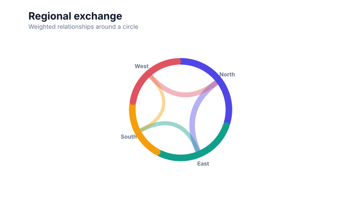
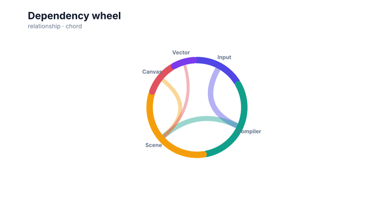

# Chord diagrams

<!-- FAMILY_PRESETS_START -->

## Integrated presets

This is the single manual for the `chord` family. Its canonical Quick API is `chord()` from `graflume/complete`, and its representative portable mark is `chord`. The compatible names below remain callable, but they are modes or data-meaning presets rather than separate chart families.

| Compatible name                               | Quick API           | Mode               | Portable mark | Functional difference                                |
| --------------------------------------------- | ------------------- | ------------------ | ------------- | ---------------------------------------------------- |
| [Chord diagram](#variant-chord)               | `chord()`           | `default`          | `chord`       | Uses circular weighted relationship bands.           |
| [Dependency wheel](#variant-dependency-wheel) | `dependencyWheel()` | `dependency-wheel` | `chord`       | Uses chord geometry with dependency-oriented naming. |

All presets reuse the same validation, normalization, scale, compiler, renderer-neutral Scene, interaction, accessibility, and serialization contracts. Direction, curve, layout, glyph, depth, financial-body, and indicator choices stay in function-free fields or options instead of selecting a second rendering engine. The remaining manually maintained sections describe the canonical/default presentation unless a preset row above states a different behavior.

## Visual gallery

Every image below is generated from the current compiled Scene rather than drawn by hand. Select a name to jump to its data fields and implementation.

|                                                                                                                                  |                                                                                                                                                                         |
| -------------------------------------------------------------------------------------------------------------------------------- | ----------------------------------------------------------------------------------------------------------------------------------------------------------------------- |
| **[Chord diagram](#variant-chord)**<br>[](../assets/charts/chord.svg) | **[Dependency wheel](#variant-dependency-wheel)**<br>[](../assets/charts/dependency-wheel.svg) |

## Type-by-type implementation

The snippets are minimal runnable examples. Change `#chart` to the target element and expand the inline rows with your data. Each example opts into Graflume's safe text-only tooltip with a chart-specific title and ordered fields; number and date formatting follows the declared `locale`. This family keeps `trigger: "mark"`, so the pointer must hit rendered datum geometry. Tooltip interaction is a pointer-only convenience, so keep a readable summary or data table available for exact values and keyboard access. The Quick API applies the preset defaults while keeping the resulting specification function-free and serializable.

Every family can opt into the Canvas [inspection viewport, fullscreen, reset, and PNG controls](./interactions.md). Inspection magnifies and translates the complete already-rendered chart, including its title and axes; it is not data-domain or GIS zoom. Generated examples intentionally leave playback off. Add discrete playback only after selecting a meaningful frame field and reviewing the family-specific capability table.

<a id="variant-chord"></a>

### Chord diagram

Use this preset when weighted relationships need a compact circular overview. Uses circular weighted relationship bands.

- **Quick API:** `chord()`
- **Mode:** `default`
- **Portable mark:** `chord`
- **Required example fields:** `source`, `value`, `target`

```js
import { chord } from 'graflume/complete';

const data = [
  {
    source: 'Input',
    value: 9,
    target: 'Compiler',
  },
  {
    source: 'Compiler',
    value: 8,
    target: 'Scene',
  },
  {
    source: 'Scene',
    value: 6,
    target: 'Canvas',
  },
  {
    source: 'Scene',
    value: 4,
    target: 'Vector',
  },
];

chord('#chart', data, {
  x: {
    field: 'source',
    type: 'ordinal',
    title: 'source',
  },
  y: {
    field: 'value',
    type: 'quantitative',
    title: 'value',
  },
  title: {
    text: 'Chord diagram',
    subtitle: 'chord family · default mode',
  },
  accessibility: {
    label: 'Chord diagram example',
    description: 'A compiled chord diagram example using the chord family.',
  },
  mark: {
    fields: {
      target: 'target',
      value: 'value',
    },
  },
  locale: 'en-US',
  interaction: {
    tooltip: {
      title: 'Chord diagram',
      fields: [
        {
          field: 'kind',
          label: 'Target',
          format: 'auto',
        },
        {
          field: 'node',
          label: 'Segment',
          format: 'auto',
        },
        {
          field: 'total',
          label: 'Total weight',
          format: 'number',
        },
        {
          field: 'source',
          label: 'From',
          format: 'auto',
        },
        {
          field: 'target',
          label: 'To',
          format: 'auto',
        },
        {
          field: 'value',
          label: 'Weight',
          format: 'number',
        },
      ],
      trigger: 'mark',
    },
  },
});
```

<a id="variant-dependency-wheel"></a>

### Dependency wheel

Use this preset when weighted relationships need a compact circular overview. Uses chord geometry with dependency-oriented naming.

- **Quick API:** `dependencyWheel()`
- **Mode:** `dependency-wheel`
- **Portable mark:** `chord`
- **Required example fields:** `source`, `value`, `target`

```js
import { dependencyWheel } from 'graflume/complete';

const data = [
  {
    source: 'Input',
    value: 9,
    target: 'Compiler',
  },
  {
    source: 'Compiler',
    value: 8,
    target: 'Scene',
  },
  {
    source: 'Scene',
    value: 6,
    target: 'Canvas',
  },
  {
    source: 'Scene',
    value: 4,
    target: 'Vector',
  },
];

dependencyWheel('#chart', data, {
  x: {
    field: 'source',
    type: 'ordinal',
    title: 'source',
  },
  y: {
    field: 'value',
    type: 'quantitative',
    title: 'value',
  },
  title: {
    text: 'Dependency wheel',
    subtitle: 'chord family · dependency-wheel mode',
  },
  accessibility: {
    label: 'Dependency wheel example',
    description: 'A compiled dependency wheel example using the chord family.',
  },
  axes: {
    x: false,
    y: false,
  },
  mark: {
    fields: {
      target: 'target',
      value: 'value',
    },
  },
  locale: 'en-US',
  interaction: {
    tooltip: {
      title: 'Dependency wheel',
      fields: [
        {
          field: 'kind',
          label: 'Target',
          format: 'auto',
        },
        {
          field: 'node',
          label: 'Segment',
          format: 'auto',
        },
        {
          field: 'total',
          label: 'Total weight',
          format: 'number',
        },
        {
          field: 'source',
          label: 'From',
          format: 'auto',
        },
        {
          field: 'target',
          label: 'To',
          format: 'auto',
        },
        {
          field: 'value',
          label: 'Weight',
          format: 'number',
        },
      ],
      trigger: 'mark',
    },
  },
});
```

<!-- FAMILY_PRESETS_END -->

[Back to the chart guide index](./README.md)


> This image is generated from the actual renderer-neutral `compile()` Scene and checked for staleness in CI.

## When to use it

Use a chord diagram for weighted flows among a limited set of categories when circular symmetry is useful.

## Data contract

`x` defaults to source, `mark.fields.target` names the target, and `y` or `mark.fields.value` supplies a non-negative weight.

### Named fields

`source`, `target`, and `value` form the flow table. Category order follows first appearance.

### Portable options

The current layout derives group arc lengths from incident totals. Standard mark colors, stroke, opacity, and line width remain available.

## Quick API

The additional families are opt-in so the default browser and module entrypoints remain small.

```js
import { chord } from 'graflume/complete';

chord('#chart', flows, {
  x: { field: 'source', type: 'nominal' },
  y: { field: 'amount', type: 'quantitative' },
  mark: { fields: { target: 'target', value: 'amount' } },
});
```

The same chart can be represented as a function-free portable specification with `mark.type: 'chord'`.

## Rendering behavior

The compiler aggregates category totals, allocates annular group sectors, labels them, and draws renderer-neutral weighted connection bands between source and target midpoints.

All output is compiled into the same renderer-neutral Scene used by Canvas and the checked SVG documentation snapshots. No second rendering engine is embedded.

## Interaction and accessibility

Group sectors and connection bands preserve datum metadata where available. Include an ordered flow table because thickness and crossings are not sufficient for precise non-visual reading.

## Performance

Keep category counts small. This alpha compiler favors deterministic scene portability over iterative crossing minimization.

## Current limitations

Subgroup arc allocation, directed arrow treatment, crossing minimization, ribbon tooltips, selection dimming, and label collision solving remain planned.
