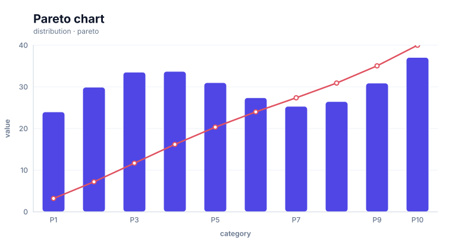

# Combination charts

<!-- FAMILY_PRESETS_START -->

## Integrated presets

This is the single manual for the `combination` family. Its canonical Quick API is `combo()` from `graflume`, and its representative portable mark is `multiple`. The compatible names below remain callable, but they are modes or data-meaning presets rather than separate chart families.

| Compatible name                 | Quick API  | Mode      | Portable mark | Functional difference                                          |
| ------------------------------- | ---------- | --------- | ------------- | -------------------------------------------------------------- |
| [Combo chart](#variant-combo)   | `combo()`  | `default` | `multiple`    | Layers compatible marks on shared scales.                      |
| [Pareto chart](#variant-pareto) | `pareto()` | `pareto`  | `pareto`      | Combines descending columns with a cumulative percentage path. |

All presets reuse the same validation, normalization, scale, compiler, renderer-neutral Scene, interaction, accessibility, and serialization contracts. Direction, curve, layout, glyph, depth, financial-body, and indicator choices stay in function-free fields or options instead of selecting a second rendering engine. The remaining manually maintained sections describe the canonical/default presentation unless a preset row above states a different behavior.

## Visual gallery

Every image below is generated from the current compiled Scene rather than drawn by hand. Select a name to jump to its data fields and implementation.

|                                                                                                                                          |                                                                                                                                   |
| ---------------------------------------------------------------------------------------------------------------------------------------- | --------------------------------------------------------------------------------------------------------------------------------- |
| **[Combo chart](#variant-combo)**<br>[](../assets/charts/combination.svg) | **[Pareto chart](#variant-pareto)**<br>[](../assets/charts/pareto.svg) |

## Type-by-type implementation

The snippets are minimal runnable examples. Change `#chart` to the target element and expand the inline rows with your data. Each example opts into Graflume's safe text-only tooltip with a chart-specific title and ordered fields; number and date formatting follows the declared `locale`. This family uses `trigger: "axis"` with `axis: "x"`. An exact rendered-mark hit still has priority; otherwise Graflume selects the nearest actual datum on that axis without inventing an interpolated row. Tooltip interaction is a pointer-only convenience, so keep a readable summary or data table available for exact values and keyboard access. The Quick API applies the preset defaults while keeping the resulting specification function-free and serializable.

Every family can opt into the Canvas [inspection viewport, fullscreen, reset, and PNG controls](./interactions.md). Inspection magnifies and translates the complete already-rendered chart, including its title and axes; it is not data-domain or GIS zoom. Generated examples intentionally leave playback off. Add discrete playback only after selecting a meaningful frame field and reviewing the family-specific capability table.

<a id="variant-combo"></a>

### Combo chart

Use this preset when different marks must share one coordinate system. Layers compatible marks on shared scales.

- **Quick API:** `combo()`
- **Mode:** `default`
- **Portable mark:** `multiple`
- **Required example fields:** `category`, `target`, `value`

```js
import { combo } from 'graflume';

const data = [
  {
    category: 'P1',
    target: 29,
    value: 24,
  },
  {
    category: 'P2',
    target: 30,
    value: 29.916,
  },
  {
    category: 'P3',
    target: 31,
    value: 33.54,
  },
  {
    category: 'P4',
    target: 32,
    value: 33.72,
  },
];

combo('#chart', data, {
  layers: [
    {
      id: 'volume',
      mark: {
        type: 'bar',
        fill: '#cbd5e1',
        opacity: 0.72,
      },
      x: {
        field: 'category',
        type: 'ordinal',
      },
      y: {
        field: 'target',
        type: 'quantitative',
      },
    },
    {
      id: 'actual',
      mark: {
        type: 'line',
        point: true,
        stroke: '#e05260',
      },
      x: {
        field: 'category',
        type: 'ordinal',
      },
      y: {
        field: 'value',
        type: 'quantitative',
      },
    },
  ],
  title: {
    text: 'Combo chart',
    subtitle: 'combination family · default mode',
  },
  accessibility: {
    label: 'Combo chart example',
    description: 'A compiled combo chart example using the combination family.',
  },
  locale: 'en-US',
  interaction: {
    tooltip: {
      title: 'Combo chart',
      fields: [
        {
          field: 'category',
          label: 'Category',
          format: 'auto',
        },
        {
          field: 'target',
          label: 'Target',
          format: 'number',
        },
        {
          field: 'value',
          label: 'Value',
          format: 'number',
        },
      ],
      trigger: 'axis',
      axis: 'x',
    },
  },
});
```

<a id="variant-pareto"></a>

### Pareto chart

Use this preset when different marks must share one coordinate system. Combines descending columns with a cumulative percentage path.

- **Quick API:** `pareto()`
- **Mode:** `pareto`
- **Portable mark:** `pareto`
- **Required example fields:** `category`, `value`

```js
import { pareto } from 'graflume/complete';

const data = [
  {
    category: 'P1',
    value: 24,
  },
  {
    category: 'P2',
    value: 29.916,
  },
  {
    category: 'P3',
    value: 33.54,
  },
  {
    category: 'P4',
    value: 33.72,
  },
];

pareto('#chart', data, {
  x: {
    field: 'category',
    type: 'ordinal',
    title: 'category',
  },
  y: {
    field: 'value',
    type: 'quantitative',
    title: 'value',
  },
  title: {
    text: 'Pareto chart',
    subtitle: 'combination family · pareto mode',
  },
  accessibility: {
    label: 'Pareto chart example',
    description: 'A compiled pareto chart example using the combination family.',
  },
  locale: 'en-US',
  interaction: {
    tooltip: {
      title: 'Pareto chart',
      fields: [
        {
          field: 'category',
          label: 'category',
          format: 'auto',
        },
        {
          field: 'value',
          label: 'value',
          format: 'number',
        },
      ],
      trigger: 'axis',
      axis: 'x',
    },
  },
});
```

<!-- FAMILY_PRESETS_END -->

Use a combination chart when two or more Cartesian mark layers should share a viewport and common scales. `combo()` is the Quick API for the same canonical `layers` contract accepted by `create()`.

## Implemented appearance

This output combines target bars with an actual-sales line and interactive point circles on one shared x/y scale.


## Shared-scale bar + line + points

```ts
import { combo } from 'graflume';

const data = [
  { month: 'Jan', target: 38, actual: 42 },
  { month: 'Feb', target: 47, actual: 51 },
  { month: 'Mar', target: 52, actual: 49 },
];

const chart = combo('#chart', data, {
  title: {
    text: 'Target and actual sales',
    subtitle: 'Shared y scale',
  },
  layers: [
    {
      id: 'target',
      zIndex: 0,
      mark: {
        type: 'bar',
        fill: '#cbd5e1',
        cornerRadius: 6,
        opacity: 0.72,
      },
      x: { field: 'month', type: 'ordinal', axis: { grid: false } },
      y: {
        field: 'target',
        type: 'quantitative',
        title: 'Sales',
        scale: { zero: true, nice: true },
      },
    },
    {
      id: 'actual',
      zIndex: 1,
      mark: {
        type: 'line',
        point: true,
        stroke: '#e05260',
        fill: '#ffffff',
        lineWidth: 3,
        radius: 5,
      },
      x: { field: 'month', type: 'ordinal' },
      y: { field: 'actual', type: 'quantitative' },
    },
  ],
  accessibility: {
    label: 'Target and actual sales combination chart',
    description: 'Target bars are overlaid with an actual-sales line and points.',
  },
});
```

## Scale resolution

The initial composition model resolves one shared x scale and one shared y scale across all visible layers.

- categorical x layers share the union of categories in encounter order;
- numeric/temporal domains use values from every visible layer;
- a bar or area y layer forces zero into the shared y domain;
- categorical and numeric families cannot be mixed on one shared axis;
- categorical y scales are supported for horizontal bars and interval layouts, but every layer on a shared axis must use the same type family;
- the first visible layer supplies shared axis formatting and scale-tuning options.

Independent/dual axes are not implemented yet. Do not imply a second axis by styling a layer differently.

## Shared and per-layer data

Layers inherit chart-level `data` unless they define their own source:

```ts
create('#chart', {
  layers: [
    {
      id: 'history',
      data: historicalRows,
      mark: { type: 'line' },
      x: { field: 'date', type: 'temporal' },
      y: { field: 'value', type: 'quantitative' },
    },
    {
      id: 'forecast',
      data: forecastRows,
      mark: { type: 'line', stroke: '#ea580c' },
      x: { field: 'date', type: 'temporal' },
      y: { field: 'value', type: 'quantitative' },
    },
  ],
});
```

For a multi-layer chart, provide `layerId` when replacing or appending layer data:

```ts
chart.setData(nextForecast, 'forecast');
chart.appendData(newForecastRows, 'forecast');
```

## Layer order and visibility

- `id` provides a stable update and datum reference.
- `zIndex` controls scene stacking; otherwise layer order is used.
- `visible: false` removes a layer from rendering and scale resolution.
- Every layer is clipped to the plot area.
- Line points, bars, and point layers can produce datum hit targets; paths and area polygons do not.

## Grouped bars inside a composition

All grouped bar layers participate in the same category slots:

```ts
mark: { type: 'bar', position: 'group' }
```

Use `group` consistently for the related bar layers. The default `overlay` position places bar layers on the same category center.

## Tooltip arbitration

Graflume's built-in axis tooltip can select the nearest actual datum on the shared x axis, while an exact rendered-mark hit retains priority. It does not synthesize interpolated values or build a separate per-layer aggregate: include every desired row field explicitly. Native legend merging and rendered crosshair arbitration remain outside the current contract.

```ts
chart.on('hover', ({ hit }) => {
  summary.textContent = hit ? JSON.stringify(hit.datum.datum) : 'No datum';
});
```

Use `textContent`, not raw HTML, when displaying user data.

A reviewed cumulative playback can reveal a shared ordered source across all layers by omitting `layerId`. For independent sources, target one explicit layer or ensure every affected source carries the same frame field and meaning. Generic filtering recompiles scale domains, so set explicit domains when visual stability matters. The common inspection viewport magnifies the complete compiled composition rather than synchronizing data domains; see [Common chart interactions](./interactions.md).

## Current limitations

- shared x/y scales only;
- no independent, dual, or multiple axes;
- no facet, repeat, concat, grid, dashboard, or inset layout;
- no linked brushing, cross-filtering, synchronized data-domain zoom, or rendered crosshair guide; whole-Canvas inspection is available;
- legend merging and synthesized per-layer shared tooltips are not built in;
- annotation, interval, and trendline marks can participate when their shared scales are compatible; reference bands and forecast semantics remain planned;
- no per-layer renderer selection.

## Runnable examples and tests

- [chart type gallery](../../examples/cdn/chart-types.html)
- [default-family chart gallery](../../examples/cdn/complete-chart-types.html)
- [combination regression test](../../tests/chart-types.test.mjs)

[Back to chart guides](./README.md)
