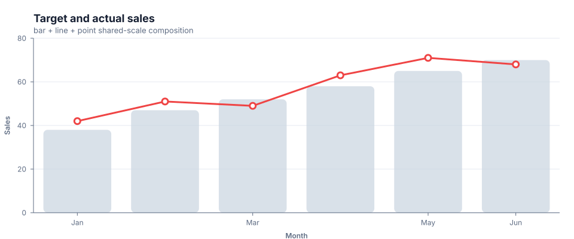

# Combination charts

Use a combination chart when two or more Cartesian mark layers should share a viewport and common scales. `combo()` is the Quick API for the same canonical `layers` contract accepted by `create()`.

## Implemented appearance

This output combines target bars with an actual-sales line and interactive point circles on one shared x/y scale.



## Shared-scale bar + line + points

```ts
import { combo } from 'graflume';

const data = [
  { month: 'Jan', target: 38, actual: 42 },
  { month: 'Feb', target: 47, actual: 51 },
  { month: 'Mar', target: 52, actual: 49 },
];

const chart = combo('#chart', data, {
  title: {
    text: 'Target and actual sales',
    subtitle: 'Shared y scale',
  },
  layers: [
    {
      id: 'target',
      zIndex: 0,
      mark: {
        type: 'bar',
        fill: '#cbd5e1',
        cornerRadius: 6,
        opacity: 0.72,
      },
      x: { field: 'month', type: 'ordinal', axis: { grid: false } },
      y: {
        field: 'target',
        type: 'quantitative',
        title: 'Sales',
        scale: { zero: true, nice: true },
      },
    },
    {
      id: 'actual',
      zIndex: 1,
      mark: {
        type: 'line',
        point: true,
        stroke: '#ef4444',
        fill: '#ffffff',
        lineWidth: 3,
        radius: 5,
      },
      x: { field: 'month', type: 'ordinal' },
      y: { field: 'actual', type: 'quantitative' },
    },
  ],
  accessibility: {
    label: 'Target and actual sales combination chart',
    description: 'Target bars are overlaid with an actual-sales line and points.',
  },
});
```

## Scale resolution

The initial composition model resolves one shared x scale and one shared y scale across all visible layers.

- categorical x layers share the union of categories in encounter order;
- numeric/temporal domains use values from every visible layer;
- a bar or area y layer forces zero into the shared y domain;
- categorical and numeric families cannot be mixed on one shared axis;
- categorical y scales are supported for horizontal bars and interval layouts, but every layer on a shared axis must use the same type family;
- the first visible layer supplies shared axis formatting and scale-tuning options.

Independent/dual axes are not implemented yet. Do not imply a second axis by styling a layer differently.

## Shared and per-layer data

Layers inherit chart-level `data` unless they define their own source:

```ts
create('#chart', {
  layers: [
    {
      id: 'history',
      data: historicalRows,
      mark: { type: 'line' },
      x: { field: 'date', type: 'temporal' },
      y: { field: 'value', type: 'quantitative' },
    },
    {
      id: 'forecast',
      data: forecastRows,
      mark: { type: 'line', stroke: '#f97316' },
      x: { field: 'date', type: 'temporal' },
      y: { field: 'value', type: 'quantitative' },
    },
  ],
});
```

For a multi-layer chart, provide `layerId` when replacing or appending layer data:

```ts
chart.setData(nextForecast, 'forecast');
chart.appendData(newForecastRows, 'forecast');
```

## Layer order and visibility

- `id` provides a stable update and datum reference.
- `zIndex` controls scene stacking; otherwise layer order is used.
- `visible: false` removes a layer from rendering and scale resolution.
- Every layer is clipped to the plot area.
- Line points, bars, and point layers can produce datum hit targets; paths and area polygons do not.

## Grouped bars inside a composition

All grouped bar layers participate in the same category slots:

```ts
mark: { type: 'bar', position: 'group' }
```

Use `group` consistently for the related bar layers. The default `overlay` position places bar layers on the same category center.

## Tooltip arbitration

Graflume emits the top hit result from the rendered scene and leaves presentation to application code. There is no native multi-series tooltip, legend merge, or crosshair arbitration yet.

```ts
chart.on('hover', ({ hit }) => {
  summary.textContent = hit ? JSON.stringify(hit.datum.datum) : 'No datum';
});
```

Use `textContent`, not raw HTML, when displaying user data.

## Current limitations

- shared x/y scales only;
- no independent, dual, or multiple axes;
- no facet, repeat, concat, grid, dashboard, or inset layout;
- no linked brushing, cross-filtering, synchronized zoom, or crosshair;
- no native legend merge or multi-layer tooltip;
- annotation, interval, and trendline marks can participate when their shared scales are compatible; reference bands and forecast semantics remain planned;
- no per-layer renderer selection.

## Runnable examples and tests

- [chart type gallery](../../examples/cdn/chart-types.html)
- [31-type complete chart gallery](../../examples/cdn/complete-chart-types.html)
- [combination regression test](../../tests/chart-types.test.mjs)

[Back to chart guides](./README.md)
