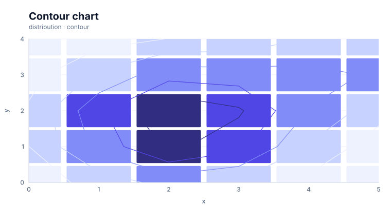

# Contour chart

<!-- FAMILY_PRESETS_START -->

## Integrated presets

This is the single manual for the `contour` family. Its canonical Quick API is `contour()` from `graflume/complete`, and its representative portable mark is `contour`. The compatible names below remain callable, but they are modes or data-meaning presets rather than separate chart families.

| Compatible name                   | Quick API   | Mode      | Portable mark | Functional difference                            |
| --------------------------------- | ----------- | --------- | ------------- | ------------------------------------------------ |
| [Contour chart](#variant-contour) | `contour()` | `default` | `contour`     | Uses the canonical presentation for this family. |

All presets reuse the same validation, normalization, scale, compiler, renderer-neutral Scene, interaction, accessibility, and serialization contracts. Direction, curve, layout, glyph, depth, financial-body, and indicator choices stay in function-free fields or options instead of selecting a second rendering engine. The remaining manually maintained sections describe the canonical/default presentation unless a preset row above states a different behavior.

## Visual gallery

Every image below is generated from the current compiled Scene rather than drawn by hand. Select a name to jump to its data fields and implementation.

|                                                                                                                                        |     |
| -------------------------------------------------------------------------------------------------------------------------------------- | --- |
| **[Contour chart](#variant-contour)**<br>[](../assets/charts/contour.svg) |     |

## Type-by-type implementation

The snippets are minimal runnable examples. Change `#chart` to the target element and expand the inline rows with your data. Each example opts into Graflume's safe text-only tooltip with a chart-specific title and ordered fields; number and date formatting follows the declared `locale`. This family keeps `trigger: "mark"`, so the pointer must hit rendered datum geometry. Pointer tooltip triggers remain a convenience; opt into `accessibility.table` and `accessibility.navigation` for the bounded native table and keyboard mark traversal, or provide a larger domain-specific table. The Quick API applies the preset defaults while keeping the resulting specification function-free and serializable.

Every family can opt into the Canvas [inspection viewport, fullscreen, reset, and PNG controls](./interactions.md). Inspection magnifies and translates the complete already-rendered chart, including its title and axes; it is not data-domain or GIS zoom. Generated examples intentionally leave playback off. Add discrete playback only after selecting a meaningful frame field and reviewing the family-specific capability table.

Every family also accepts the shared portable [legend, highlight, selection, and callout contract](./interactions.md#legends-highlights-selection-and-callouts). Automatic legend semantics follow the compiled mark and palette where they are unambiguous; use explicit function-free items for a domain-specific series or category legend. Static datum/layer/range highlights and text-only top-level callouts remain available even when a family has no Cartesian point geometry.

<a id="variant-contour"></a>

### Contour chart

Use this preset when a sampled surface must be read through value bands. Uses the canonical presentation for this family.

- **Quick API:** `contour()`
- **Mode:** `default`
- **Portable mark:** `contour`
- **Required example fields:** `x`, `y`, `value`

```js
import { contour } from 'graflume/complete';

const data = [
  {
    x: 0,
    y: 0,
    value: 19.342,
  },
  {
    x: 1,
    y: 0,
    value: 23.692,
  },
  {
    x: 2,
    y: 0,
    value: 30.375,
  },
  {
    x: 3,
    y: 0,
    value: 35.875,
  },
];

contour('#chart', data, {
  x: {
    field: 'x',
    type: 'quantitative',
    title: 'Horizontal bin',
  },
  y: {
    field: 'y',
    type: 'quantitative',
    title: 'Vertical bin',
  },
  title: {
    text: 'Contour chart',
    subtitle: 'contour family · default mode',
  },
  accessibility: {
    label:
      'Contour chart: Smooth peaks, a ridge, and a basin produce interpretable contour structure',
    description:
      'Smooth peaks, a ridge, and a basin produce interpretable contour structure. The example uses curated, deterministic data and exposes its exact values in a semantic table.',
  },
  mark: {
    fields: {
      value: 'value',
    },
  },
  locale: 'en-US',
  interaction: {
    tooltip: {
      title: 'Contour chart',
      fields: [
        {
          field: 'x',
          label: 'Horizontal bin',
          format: 'number',
        },
        {
          field: 'y',
          label: 'Vertical bin',
          format: 'number',
        },
        {
          field: 'value',
          label: 'Value',
          format: 'number',
        },
      ],
      trigger: 'mark',
    },
  },
});
```

<!-- FAMILY_PRESETS_END -->


This page documents the currently implemented **Contour chart** family in Graflume `0.1.0-alpha.0`. The image above is generated from the same compiled Scene used by the Canvas renderer.

## When to use it

Use this distribution chart when the visual relationship represented by **contour chart** is more informative than a plain line, bar, or table. Prefer a simpler chart when the extra geometry does not add analytical meaning.

## Quick API

Import the Quick API from the opt-in complete entrypoint:

```ts
import { contour } from 'graflume/complete';

const data = [
  {
    x: 0,
    y: 0,
    value: 10.430428503760513,
  },
  {
    x: 1,
    y: 0,
    value: 22.60710064972478,
  },
  {
    x: 2,
    y: 0,
    value: 32.82057616633438,
  },
  {
    x: 3,
    y: 0,
    value: 27.90803476586867,
  },
  {
    x: 4,
    y: 0,
    value: 14.663045869774965,
  },
];

contour('#chart', data, {
  x: {
    field: 'x',
    type: 'quantitative',
    title: 'x',
  },
  y: {
    field: 'y',
    type: 'quantitative',
    title: 'y',
  },
  mark: {
    fields: {
      value: 'value',
    },
  },
  title: {
    text: 'Contour chart',
    subtitle: 'distribution · contour',
  },
  accessibility: {
    label: 'Contour chart example',
    description: 'A compiled contour chart example using the contour family.',
  },
});
```

## Portable ChartSpec

```json
{
  "data": [
    {
      "x": 0,
      "y": 0,
      "value": 10.430428503760513
    },
    {
      "x": 1,
      "y": 0,
      "value": 22.60710064972478
    },
    {
      "x": 2,
      "y": 0,
      "value": 32.82057616633438
    },
    {
      "x": 3,
      "y": 0,
      "value": 27.90803476586867
    },
    {
      "x": 4,
      "y": 0,
      "value": 14.663045869774965
    }
  ],
  "mark": {
    "type": "contour",
    "fields": {
      "value": "value"
    }
  },
  "x": {
    "field": "x",
    "type": "quantitative",
    "title": "x"
  },
  "y": {
    "field": "y",
    "type": "quantitative",
    "title": "y"
  },
  "title": {
    "text": "Contour chart",
    "subtitle": "distribution · contour"
  },
  "accessibility": {
    "label": "Contour chart example",
    "description": "A compiled contour chart example using the contour family."
  }
}
```

## Canonical mapping

- User-facing family: `contour`
- Quick API: `contour()`
- Portable mark: `contour`
- Canonical family: `contour`
- Category: `distribution`

The family API and every compatible preset enter the same normalize, validate, scale, compiler, Scene, renderer, interaction, and accessibility path. No parallel rendering engine is created.

## Data, ordering, and missing values

Provide one finite scalar `mark.fields.value` for each unique quantitative x/y coordinate on a rectilinear grid. Coordinates are sorted numerically before extraction, so input row order does not change topology. A missing grid coordinate is a hole: every cell touching it is skipped instead of interpolating across unknown data. Duplicate x/y coordinates currently resolve to the last valid input row and should be deduplicated upstream when that choice is not meaningful.

## Implemented rendering behavior

The canonical mark runs deterministic marching squares over the scalar grid and stitches cell segments into open or closed isolines. `options.thresholds` supplies sorted explicit levels; otherwise `options.levels` (1–32) uses linear levels or Type-7 quantiles with `thresholdMethod: "quantile"`. Ambiguous 5/10 saddle cells default to a threshold-relative asymptotic decider using `Q = a*c - b*d`; `options.saddle: "high" | "low"` provides deterministic explicit connectivity. `showCells: false` hides the optional colored scalar cells without changing isolines. Bivariate distribution contours and carpet contours reuse the same topology extractor.

## Styling

Common `fill`, `stroke`, `opacity`, `lineWidth`, `radius`, and `cornerRadius` properties override theme defaults when the geometry supports them. Mark-specific function-free values live under `mark.options`. Themes remain responsible for background, text, grid, focus, categorical, sequential, and diverging tokens.

## Interaction and hit testing

Rendered isolines keep `layerId`, a representative `rowIndex`, exact threshold metadata, saddle policy, the full `sourceRowCount`, and a sorted `sourceRowIndices` prefix capped at 256; bivariate bins include all contributing rows before that tooltip cap is applied. Standard mode enables hit testing; large and ultra profiles may disable per-mark hit testing.

## Accessibility

Provide a concise `accessibility.label` and a description of the main pattern. Canvas output should be paired with the runtime data-table fallback. Do not encode a required distinction only with color, depth, angle, or area.

## Performance

Grid coordinates are deterministically thinned to `maxBarMarks` before canonical extraction when necessary, and emitted segments stop at half of `maxLinePoints` so the stitched point count remains bounded. Bivariate and carpet callers allocate from the same profile budgets. This is a synchronous main-thread extractor; pre-grid or aggregate very large inputs upstream.

## Current limitations

None remain in the audited P0/current-limitations boundary as of 2026-08-26. The `current-limitations-2026-08-26` implementation moved these former limitations into executable support:

- filled and banded contours with polygon-hole topology
- triangulated irregular samples
- smoothing

The separately cataloged P1/P2 research roadmap remains future work and is not presented as current runtime support. Exact implementation and test paths are recorded in [the completion evidence](../../catalog/graflume.current-limitations.evidence.json).

## Runnable references

- Snapshot generator: [`scripts/render-series-chart-snapshots.mjs`](../../scripts/render-series-chart-snapshots.mjs)
- Catalog test: [`tests/series-chart-types.test.mjs`](../../tests/series-chart-types.test.mjs)
- Complete CDN gallery: [`examples/cdn/series-chart-types.html`](../../examples/cdn/series-chart-types.html)
