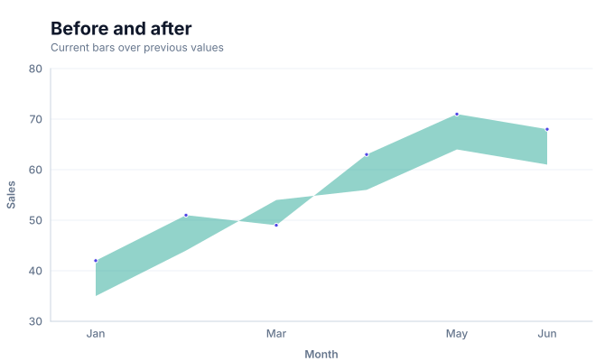

# Difference chart



This guide documents the consolidated **Difference chart** family. The image is generated from the actual compiled Scene used by the runtime renderer.

## When to use it

Compare an old and a new quantitative value at the same category and make the signed change visible.

## Canonical Quick API

```ts
import { diff } from 'graflume';

diff('#chart', data, {
  x: { field: 'month', type: 'ordinal' },
  y: { field: 'newValue', type: 'quantitative' },
  mark: { fields: { old: 'oldValue', new: 'newValue' } },
});
```

## Integrated presets

These names remain source-compatible, but discovery surfaces count them as modes of this family.

| Preset     | Quick API | Mode      | Portable mark |
| ---------- | --------- | --------- | ------------- |
| Diff chart | `diff()`  | `default` | `diff`        |

## Data contract

Declare the comparison columns with `mark.fields.old` and `mark.fields.new`. Categories stay on `x`; the new value normally remains on `y` for axes and tooltips. Missing required values skip only the affected row. Input order remains stable unless the selected layout documents a deterministic sort.

## Rendering and portability

Every preset normalizes into the same ChartSpec, validation, scale, compiler, renderer-neutral Scene, interaction, and accessibility pipeline. Mode differences use function-free `mark.fields` and `mark.options`; they do not create a second engine or a second top-level family.

## Styling and interaction

Use theme tokens or common `fill`, `stroke`, `opacity`, `lineWidth`, `radius`, and `cornerRadius` properties where the selected geometry supports them. Interactive datum shapes retain their source row and layer metadata; decorative labels, grids, and depth faces do not create duplicate targets.

## Accessibility and performance

Provide a concise `accessibility.label`, describe the principal comparison or structure, and pair Canvas output with the data-table fallback. Dense labels, relationship crossings, and multi-part interval geometry can produce several Scene nodes per row, so aggregate when individual marks stop adding analytical value.

## Verification

- Snapshot: [`docs/assets/charts/difference.svg`](../assets/charts/difference.svg)
- Runtime catalogs: [`src/catalog`](../../src/catalog)
- Catalog tests: [`tests`](../../tests)
