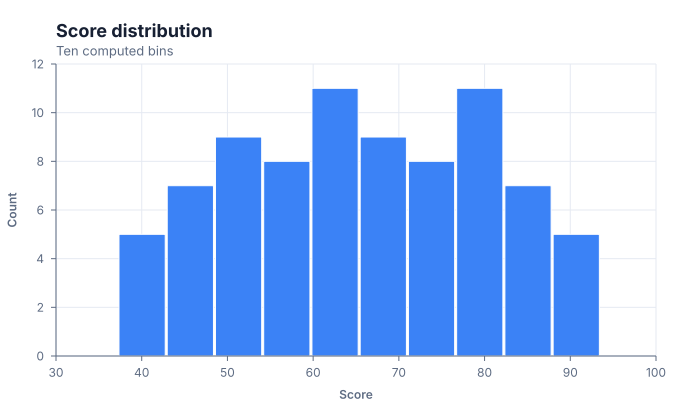
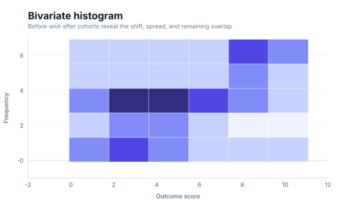
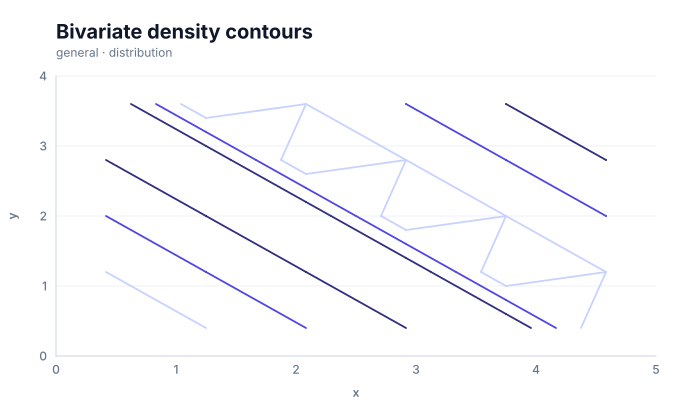
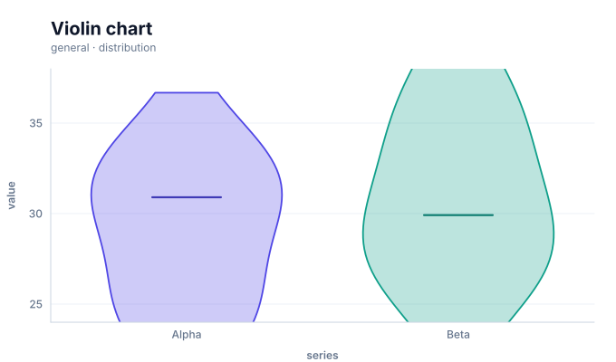
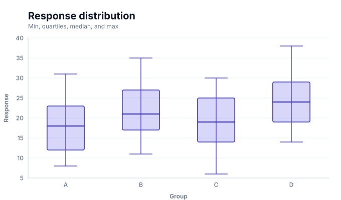
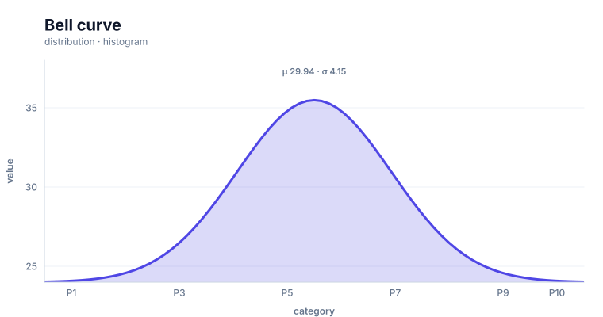

# Distribution charts

<!-- FAMILY_PRESETS_START -->

## Integrated presets

This is the single manual for the `distribution` family. Its canonical Quick API is `distribution()` from `graflume`, and its representative portable mark is `distribution`. The compatible names below remain callable, but they are modes or data-meaning presets rather than separate chart families.

| Compatible name                                             | Quick API              | Mode                   | Portable mark  | Functional difference                                                  |
| ----------------------------------------------------------- | ---------------------- | ---------------------- | -------------- | ---------------------------------------------------------------------- |
| [Distribution chart](#variant-distribution)                 | `distribution()`       | `histogram`            | `distribution` | Uses the canonical raw-sample histogram presentation.                  |
| [Histogram](#variant-histogram)                             | `histogram()`          | `histogram`            | `histogram`    | Bins samples into counts.                                              |
| [Bivariate histogram](#variant-histogram-2d)                | `histogram2d()`        | `histogram-2d`         | `distribution` | Bins two quantitative coordinates into rectangular heat cells.         |
| [Bivariate density contours](#variant-histogram-2d-contour) | `histogram2dContour()` | `histogram-2d-contour` | `distribution` | Traces density isolines over the complete bivariate bin grid.          |
| [Violin chart](#variant-violin)                             | `violin()`             | `violin`               | `distribution` | Estimates a mirrored kernel-density shape for each group.              |
| [Boxplot](#variant-boxplot)                                 | `boxplot()`            | `boxplot`              | `boxplot`      | Selects the `boxplot` presentation through the shared family pipeline. |
| [Bell curve](#variant-bell-curve)                           | `bellCurve()`          | `bell-curve`           | `distribution` | Derives and overlays a sampled normal-density curve.                   |

All presets reuse the same validation, normalization, scale, compiler, renderer-neutral Scene, interaction, accessibility, and serialization contracts. Direction, curve, layout, glyph, depth, financial-body, and indicator choices stay in function-free fields or options instead of selecting a second rendering engine. The remaining manually maintained sections describe the canonical/default presentation unless a preset row above states a different behavior.

## Visual gallery

Every image below is generated from the current compiled Scene rather than drawn by hand. Select a name to jump to its data fields and implementation.

|                                                                                                                                                                   |                                                                                                                                                                                                         |
| ----------------------------------------------------------------------------------------------------------------------------------------------------------------- | ------------------------------------------------------------------------------------------------------------------------------------------------------------------------------------------------------- |
| **[Distribution chart](#variant-distribution)**<br>[](../assets/charts/distribution.svg)   | **[Histogram](#variant-histogram)**<br>[](../assets/charts/histogram.svg)                                                                    |
| **[Bivariate histogram](#variant-histogram-2d)**<br>[](../assets/charts/histogram-2d.svg) | **[Bivariate density contours](#variant-histogram-2d-contour)**<br>[](../assets/charts/histogram-2d-contour.svg) |
| **[Violin chart](#variant-violin)**<br>[](../assets/charts/violin.svg)                                 | **[Boxplot](#variant-boxplot)**<br>[](../assets/charts/boxplot.svg)                                                                              |
| **[Bell curve](#variant-bell-curve)**<br>[](../assets/charts/bell-curve.svg)                         |                                                                                                                                                                                                         |

## Type-by-type implementation

The snippets are minimal runnable examples. Change `#chart` to the target element and expand the inline rows with your data. Each example opts into Graflume's safe text-only tooltip with a chart-specific title and ordered fields; number and date formatting follows the declared `locale`. This family uses `trigger: "axis"` with `axis: "x"`. An exact rendered-mark hit still has priority; otherwise Graflume selects the nearest actual datum on that axis without inventing an interpolated row. Tooltip interaction is a pointer-only convenience, so keep a readable summary or data table available for exact values and keyboard access. The Quick API applies the preset defaults while keeping the resulting specification function-free and serializable.

Every family can opt into the Canvas [inspection viewport, fullscreen, reset, and PNG controls](./interactions.md). Inspection magnifies and translates the complete already-rendered chart, including its title and axes; it is not data-domain or GIS zoom. Generated examples intentionally leave playback off. Add discrete playback only after selecting a meaningful frame field and reviewing the family-specific capability table.

<a id="variant-distribution"></a>

### Distribution chart

Use this preset when the shape or summary of one or two quantitative distributions matters. Uses the canonical raw-sample histogram presentation.

- **Quick API:** `distribution()`
- **Mode:** `histogram`
- **Portable mark:** `distribution`
- **Required example fields:** `value`, `series`

```js
import { distribution } from 'graflume';

const data = [
  {
    value: 24,
    series: 'Alpha',
  },
  {
    value: 29.916,
    series: 'Beta',
  },
  {
    value: 33.54,
    series: 'Alpha',
  },
  {
    value: 33.72,
    series: 'Beta',
  },
];

distribution('#chart', data, {
  x: {
    field: 'value',
    type: 'quantitative',
    title: 'value',
  },
  y: {
    field: 'value',
    type: 'quantitative',
    title: 'value',
  },
  title: {
    text: 'Distribution chart',
    subtitle: 'distribution family · histogram mode',
  },
  accessibility: {
    label: 'Distribution chart example',
    description: 'A compiled distribution chart example using the distribution family.',
  },
  mark: {
    fields: {
      group: 'series',
      value: 'value',
    },
    options: {
      mode: 'histogram',
    },
  },
  locale: 'en-US',
  interaction: {
    tooltip: {
      title: 'Distribution chart',
      fields: [
        {
          field: 'binStart',
          label: 'Bin start',
          format: 'number',
        },
        {
          field: 'binEnd',
          label: 'Bin end',
          format: 'number',
        },
        {
          field: 'count',
          label: 'Count',
          format: 'integer',
        },
        {
          field: 'proportion',
          label: 'Share',
          format: 'percent',
          fractionDigits: 1,
        },
        {
          field: 'value',
          label: 'value',
          format: 'number',
        },
        {
          field: 'series',
          label: 'Series',
          format: 'auto',
        },
      ],
      trigger: 'axis',
      axis: 'x',
    },
  },
});
```

<a id="variant-histogram"></a>

### Histogram

Use this preset when the shape or summary of one or two quantitative distributions matters. Bins samples into counts.

- **Quick API:** `histogram()`
- **Mode:** `histogram`
- **Portable mark:** `histogram`
- **Required example fields:** `value`

```js
import { histogram } from 'graflume';

const data = [
  {
    value: 24,
  },
  {
    value: 29.916,
  },
  {
    value: 33.54,
  },
  {
    value: 33.72,
  },
];

histogram('#chart', data, {
  x: {
    field: 'value',
    type: 'quantitative',
    title: 'value',
  },
  y: {
    field: 'value',
    type: 'quantitative',
    title: 'value',
  },
  title: {
    text: 'Histogram',
    subtitle: 'distribution family · histogram mode',
  },
  accessibility: {
    label: 'Histogram example',
    description: 'A compiled histogram example using the distribution family.',
  },
  mark: {
    options: {
      bins: 8,
    },
  },
  locale: 'en-US',
  interaction: {
    tooltip: {
      title: 'Histogram',
      fields: [
        {
          field: 'binStart',
          label: 'Bin start',
          format: 'number',
        },
        {
          field: 'binEnd',
          label: 'Bin end',
          format: 'number',
        },
        {
          field: 'count',
          label: 'Count',
          format: 'integer',
        },
        {
          field: 'proportion',
          label: 'Share',
          format: 'percent',
          fractionDigits: 1,
        },
        {
          field: 'value',
          label: 'value',
          format: 'number',
        },
      ],
      trigger: 'axis',
      axis: 'x',
    },
  },
});
```

<a id="variant-histogram-2d"></a>

### Bivariate histogram

Use this preset when the shape or summary of one or two quantitative distributions matters. Bins two quantitative coordinates into rectangular heat cells.

- **Quick API:** `histogram2d()`
- **Mode:** `histogram-2d`
- **Portable mark:** `distribution`
- **Required example fields:** `x`, `y`

```js
import { histogram2d } from 'graflume';

const data = [
  {
    x: 0,
    y: 0,
  },
  {
    x: 1,
    y: 0,
  },
  {
    x: 1,
    y: 0,
  },
  {
    x: 2,
    y: 0,
  },
];

histogram2d('#chart', data, {
  x: {
    field: 'x',
    type: 'quantitative',
    title: 'x',
  },
  y: {
    field: 'y',
    type: 'quantitative',
    title: 'y',
  },
  title: {
    text: 'Bivariate histogram',
    subtitle: 'distribution family · histogram-2d mode',
  },
  accessibility: {
    label: 'Bivariate histogram example',
    description: 'A compiled bivariate histogram example using the distribution family.',
  },
  mark: {
    options: {
      mode: 'histogram-2d',
      binsX: 6,
      binsY: 5,
      levels: 4,
    },
  },
  locale: 'en-US',
  interaction: {
    tooltip: {
      title: 'Bivariate histogram',
      fields: [
        {
          field: 'x',
          label: 'x',
          format: 'number',
        },
        {
          field: 'y',
          label: 'y',
          format: 'number',
        },
      ],
      trigger: 'axis',
      axis: 'x',
    },
  },
});
```

<a id="variant-histogram-2d-contour"></a>

### Bivariate density contours

Use this preset when the shape or summary of one or two quantitative distributions matters. Traces density isolines over the complete bivariate bin grid.

- **Quick API:** `histogram2dContour()`
- **Mode:** `histogram-2d-contour`
- **Portable mark:** `distribution`
- **Required example fields:** `x`, `y`

```js
import { histogram2dContour } from 'graflume';

const data = [
  {
    x: 0,
    y: 0,
  },
  {
    x: 1,
    y: 0,
  },
  {
    x: 1,
    y: 0,
  },
  {
    x: 2,
    y: 0,
  },
];

histogram2dContour('#chart', data, {
  x: {
    field: 'x',
    type: 'quantitative',
    title: 'x',
  },
  y: {
    field: 'y',
    type: 'quantitative',
    title: 'y',
  },
  title: {
    text: 'Bivariate density contours',
    subtitle: 'distribution family · histogram-2d-contour mode',
  },
  accessibility: {
    label: 'Bivariate density contours example',
    description: 'A compiled bivariate density contours example using the distribution family.',
  },
  mark: {
    options: {
      mode: 'histogram-2d-contour',
      binsX: 6,
      binsY: 5,
      levels: 4,
    },
  },
  locale: 'en-US',
  interaction: {
    tooltip: {
      title: 'Bivariate density contours',
      fields: [
        {
          field: 'level',
          label: 'Density level',
          format: 'number',
        },
        {
          field: 'minimumCount',
          label: 'Minimum count',
          format: 'integer',
        },
        {
          field: 'maximumCount',
          label: 'Maximum count',
          format: 'integer',
        },
        {
          field: 'binsX',
          label: 'X bins',
          format: 'integer',
        },
        {
          field: 'binsY',
          label: 'Y bins',
          format: 'integer',
        },
        {
          field: 'x',
          label: 'x',
          format: 'number',
        },
        {
          field: 'y',
          label: 'y',
          format: 'number',
        },
      ],
      trigger: 'axis',
      axis: 'x',
    },
  },
});
```

<a id="variant-violin"></a>

### Violin chart

Use this preset when the shape or summary of one or two quantitative distributions matters. Estimates a mirrored kernel-density shape for each group.

- **Quick API:** `violin()`
- **Mode:** `violin`
- **Portable mark:** `distribution`
- **Required example fields:** `series`, `value`

```js
import { violin } from 'graflume';

const data = [
  {
    series: 'Alpha',
    value: 24,
  },
  {
    series: 'Beta',
    value: 29.916,
  },
  {
    series: 'Alpha',
    value: 33.54,
  },
  {
    series: 'Beta',
    value: 33.72,
  },
];

violin('#chart', data, {
  x: {
    field: 'series',
    type: 'ordinal',
    title: 'series',
  },
  y: {
    field: 'value',
    type: 'quantitative',
    title: 'value',
  },
  title: {
    text: 'Violin chart',
    subtitle: 'distribution family · violin mode',
  },
  accessibility: {
    label: 'Violin chart example',
    description: 'A compiled violin chart example using the distribution family.',
  },
  mark: {
    fields: {
      group: 'series',
      value: 'value',
    },
    options: {
      mode: 'violin',
    },
  },
  locale: 'en-US',
  interaction: {
    tooltip: {
      title: 'Violin chart',
      fields: [
        {
          field: 'series',
          label: 'series',
          format: 'auto',
        },
        {
          field: 'value',
          label: 'value',
          format: 'number',
        },
      ],
      trigger: 'axis',
      axis: 'x',
    },
  },
});
```

<a id="variant-boxplot"></a>

### Boxplot

Use this preset when the shape or summary of one or two quantitative distributions matters. Selects the `boxplot` presentation through the shared family pipeline.

- **Quick API:** `boxplot()`
- **Mode:** `boxplot`
- **Portable mark:** `boxplot`
- **Required example fields:** `category`, `value`, `low`, `q1`, `median`, `q3`, `high`

```js
import { boxplot } from 'graflume/complete';

const data = [
  {
    category: 'Alpha',
    low: 12,
    q1: 19,
    median: 27,
    q3: 34,
    high: 43,
  },
  {
    category: 'Beta',
    low: 17,
    q1: 24,
    median: 31,
    q3: 39,
    high: 48,
  },
  {
    category: 'Gamma',
    low: 9,
    q1: 16,
    median: 22,
    q3: 29,
    high: 38,
  },
];

boxplot('#chart', data, {
  x: {
    field: 'category',
    type: 'ordinal',
    title: 'category',
  },
  y: {
    field: 'value',
    type: 'quantitative',
    title: 'value',
  },
  title: {
    text: 'Boxplot',
    subtitle: 'distribution family · boxplot mode',
  },
  accessibility: {
    label: 'Boxplot example',
    description: 'A compiled boxplot example using the distribution family.',
  },
  mark: {
    fields: {
      low: 'low',
      q1: 'q1',
      median: 'median',
      q3: 'q3',
      high: 'high',
    },
  },
  locale: 'en-US',
  interaction: {
    tooltip: {
      title: 'Boxplot',
      fields: [
        {
          field: 'category',
          label: 'category',
          format: 'auto',
        },
        {
          field: 'value',
          label: 'value',
          format: 'auto',
        },
        {
          field: 'low',
          label: 'Low',
          format: 'number',
        },
        {
          field: 'q1',
          label: 'Q1',
          format: 'number',
        },
        {
          field: 'median',
          label: 'Median',
          format: 'number',
        },
        {
          field: 'q3',
          label: 'Q3',
          format: 'number',
        },
        {
          field: 'high',
          label: 'High',
          format: 'number',
        },
      ],
      trigger: 'axis',
      axis: 'x',
    },
  },
});
```

<a id="variant-bell-curve"></a>

### Bell curve

Use this preset when the shape or summary of one or two quantitative distributions matters. Derives and overlays a sampled normal-density curve.

- **Quick API:** `bellCurve()`
- **Mode:** `bell-curve`
- **Portable mark:** `distribution`
- **Required example fields:** `value`, `series`

```js
import { bellCurve } from 'graflume/complete';

const data = [
  {
    value: 24,
    series: 'Alpha',
  },
  {
    value: 29.916,
    series: 'Beta',
  },
  {
    value: 33.54,
    series: 'Alpha',
  },
  {
    value: 33.72,
    series: 'Beta',
  },
];

bellCurve('#chart', data, {
  x: {
    field: 'value',
    type: 'quantitative',
    title: 'value',
  },
  y: {
    field: 'value',
    type: 'quantitative',
    title: 'value',
  },
  title: {
    text: 'Bell curve',
    subtitle: 'distribution family · bell-curve mode',
  },
  accessibility: {
    label: 'Bell curve example',
    description: 'A compiled bell curve example using the distribution family.',
  },
  mark: {
    fields: {
      group: 'series',
      value: 'value',
    },
    options: {
      mode: 'curve',
    },
  },
  locale: 'en-US',
  interaction: {
    tooltip: {
      title: 'Bell curve',
      fields: [
        {
          field: 'mean',
          label: 'Mean',
          format: 'number',
        },
        {
          field: 'standardDeviation',
          label: 'Standard deviation',
          format: 'number',
        },
        {
          field: 'sampleCount',
          label: 'Sample count',
          format: 'integer',
        },
        {
          field: 'minimum',
          label: 'Minimum',
          format: 'number',
        },
        {
          field: 'maximum',
          label: 'Maximum',
          format: 'number',
        },
        {
          field: 'value',
          label: 'value',
          format: 'number',
        },
        {
          field: 'series',
          label: 'Series',
          format: 'auto',
        },
      ],
      trigger: 'axis',
      axis: 'x',
    },
  },
});
```

<!-- FAMILY_PRESETS_END -->

Distribution charts share one portable `distribution` family for raw-sample histograms, density curves, violins, bivariate heat cells, bivariate density contours, and five-number summaries. Legacy `histogram()` and `boxplot()` calls remain compatible presets.

## Data contract

Use a quantitative value field for one-dimensional modes. Violin mode additionally accepts a grouping field. Bivariate modes use quantitative `x` and `y` encodings. Box mode accepts `low`, `q1`, `median`, `q3`, and `high` fields.

Missing or non-finite values are ignored. Omitted mode, the canonical `distribution` label, and unknown compatibility labels resolve to histogram mode through the same resolver used by axis-domain calculation. Histogram domains are derived from the accepted sample; bivariate contour mode records zero-density bins so isolines remain continuous around sparse peaks. Curve mode derives `mean ± 3.5σ` on x and density from zero through the normal peak on y, and both the axes and rendered curve use those same resolved scales.

## Styling and interaction

Portable fill, stroke, opacity, line width, bin counts, density sample count, and bandwidth options are supported where the selected mode uses them. Derived bins and density regions carry tooltip data; bivariate isolines expose their density level and count range, while the bell curve exposes its mean, standard deviation, sample count, and observed range instead of presenting one source row as the whole curve. Exact values should also remain available in an accessible summary or table.

## Performance and limits

Bin and density sampling options are bounded. Bivariate bin counts preserve their requested aspect ratio while fitting `maxBarMarks`, and density-isoline segments stop at the active line-point budget. Violin groups are deterministically limited so their combined density-path points stay within that same line budget, while the KDE source is sampled within the chart-wide point budget. The violin tooltip still reports exact count, minimum, maximum, mean, and median values from all valid rows; `densitySampleCount` makes the bounded approximation explicit. Statistics are computed in the compiler for histogram and violin modes; the box preset consumes a supplied five-number summary rather than recomputing it from raw rows.

## Verification

The family examples and SVG snapshots are compiled by the shared Scene pipeline and covered by the expanded two-dimensional and catalog tests.
