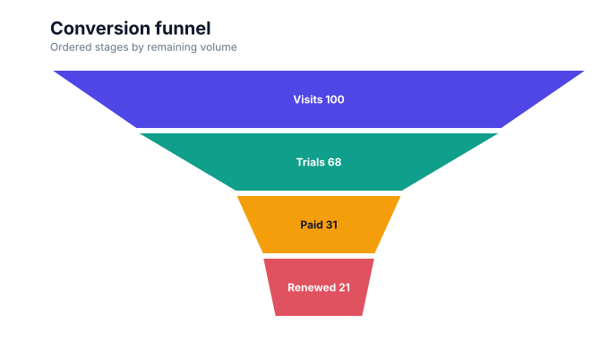
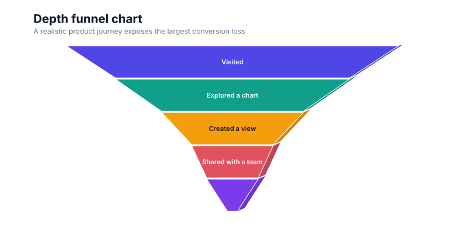
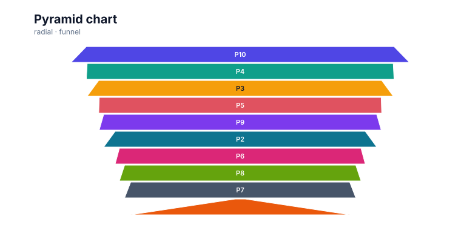
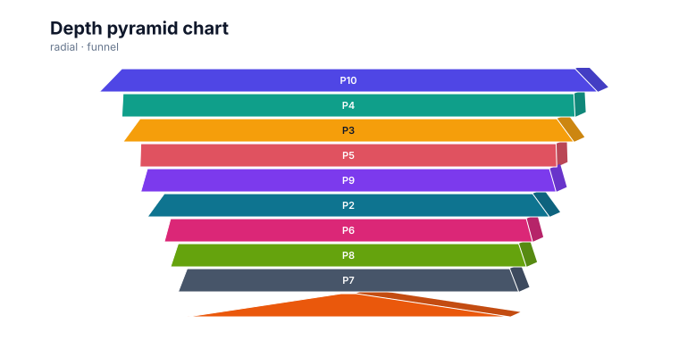

# Funnel charts

<!-- FAMILY_PRESETS_START -->

## Integrated presets

This is the single manual for the `funnel` family. Its canonical Quick API is `funnel()` from `graflume/complete`, and its representative portable mark is `funnel`. The compatible names below remain callable, but they are modes or data-meaning presets rather than separate chart families.

| Compatible name     | Quick API     | Mode         | Portable mark | Functional difference                                    |
| ------------------- | ------------- | ------------ | ------------- | -------------------------------------------------------- |
| Funnel chart        | `funnel()`    | `default`    | `funnel`      | Uses decreasing centered stages.                         |
| Depth funnel chart  | `funnel3d()`  | `funnel-3d`  | `pyramid`     | Adds portable depth faces to funnel stages.              |
| Pyramid chart       | `pyramid()`   | `pyramid`    | `pyramid`     | Reverses the stage emphasis into a pyramid presentation. |
| Depth pyramid chart | `pyramid3d()` | `pyramid-3d` | `pyramid`     | Adds portable depth faces to pyramid stages.             |

All presets reuse the same validation, normalization, scale, compiler, renderer-neutral Scene, interaction, accessibility, and serialization contracts. Direction, curve, layout, glyph, depth, financial-body, and indicator choices stay in function-free fields or options instead of selecting a second rendering engine. The remaining sections describe the canonical/default presentation unless a preset row above states a different behavior.

<details>
<summary>Open 4 compiled preset snapshots</summary>

| Preset              | Current compiled output                                                                                   |
| ------------------- | --------------------------------------------------------------------------------------------------------- |
| Funnel chart        | [](../assets/charts/funnel.svg)                |
| Depth funnel chart  | [](../assets/charts/funnel-3d.svg)    |
| Pyramid chart       | [](../assets/charts/pyramid.svg)             |
| Depth pyramid chart | [](../assets/charts/pyramid-3d.svg) |

</details>
<!-- FAMILY_PRESETS_END -->
[Back to the chart guide index](./README.md)


> This image is generated from the actual renderer-neutral `compile()` Scene and checked for staleness in CI.

## When to use it

Use a funnel chart to show ordered stage attrition such as visits, trials, purchases, and renewals.

## Data contract

`x` supplies the stage label and `y` supplies a non-negative value. Rows are sorted descending by default.

### Named fields

No additional fields are required; the primary encodings define each stage.

### Portable options

`sort: false` preserves input order. Normal mark fill, stroke, opacity, and line width options apply to the stage polygons.

## Quick API

The additional families are opt-in so the default browser and module entrypoints remain small.

```js
import { funnel } from 'graflume/complete';

funnel('#chart', stages, {
  x: { field: 'stage', type: 'ordinal' },
  y: { field: 'value', type: 'quantitative' },
  mark: { options: { sort: true } },
});
```

The same chart can be represented as a function-free portable specification with `mark.type: 'funnel'`.

## Rendering behavior

Each row becomes a centered trapezoid whose width is proportional to the largest value. Labels and rounded values are drawn inside sufficiently wide stages.

All output is compiled into the same renderer-neutral Scene used by Canvas and the checked SVG documentation snapshots. No second rendering engine is embedded.

## Interaction and accessibility

Every stage polygon retains its source row. Include stage values and conversion rates in a table or description rather than relying only on width.

## Performance

Funnel charts are cheap to render and intended for a small ordered sequence. Long stage lists should use bars instead.

## Current limitations

Automatic conversion percentages, two-sided funnels, compare mode, label overflow handling, and editable stage order are not implemented yet.
