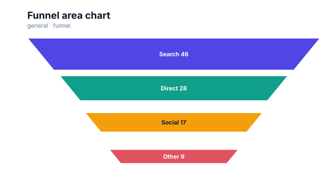

# Funnel charts

<!-- FAMILY_PRESETS_START -->

## Integrated presets

This is the single manual for the `funnel` family. Its canonical Quick API is `funnel()` from `graflume/complete`, and its representative portable mark is `funnel`. The compatible names below remain callable, but they are modes or data-meaning presets rather than separate chart families.

| Compatible name                            | Quick API      | Mode         | Portable mark | Functional difference                                       |
| ------------------------------------------ | -------------- | ------------ | ------------- | ----------------------------------------------------------- |
| [Funnel chart](#variant-funnel)            | `funnel()`     | `default`    | `funnel`      | Uses decreasing centered stages.                            |
| [Funnel area chart](#variant-funnel-area)  | `funnelArea()` | `area`       | `funnel`      | Scales both stage dimensions so visible area follows value. |
| [Depth funnel chart](#variant-funnel-3d)   | `funnel3d()`   | `funnel-3d`  | `pyramid`     | Adds portable depth faces to funnel stages.                 |
| [Pyramid chart](#variant-pyramid)          | `pyramid()`    | `pyramid`    | `pyramid`     | Reverses the stage emphasis into a pyramid presentation.    |
| [Depth pyramid chart](#variant-pyramid-3d) | `pyramid3d()`  | `pyramid-3d` | `pyramid`     | Adds portable depth faces to pyramid stages.                |

All presets reuse the same validation, normalization, scale, compiler, renderer-neutral Scene, interaction, accessibility, and serialization contracts. Direction, curve, layout, glyph, depth, financial-body, and indicator choices stay in function-free fields or options instead of selecting a second rendering engine. The remaining manually maintained sections describe the canonical/default presentation unless a preset row above states a different behavior.

## Visual gallery

Every image below is generated from the current compiled Scene rather than drawn by hand. Select a name to jump to its data fields and implementation.

|                                                                                                                                                             |                                                                                                                                                            |
| ----------------------------------------------------------------------------------------------------------------------------------------------------------- | ---------------------------------------------------------------------------------------------------------------------------------------------------------- |
| **[Funnel chart](#variant-funnel)**<br>[](../assets/charts/funnel.svg)                           | **[Funnel area chart](#variant-funnel-area)**<br>[](../assets/charts/funnel-area.svg) |
| **[Depth funnel chart](#variant-funnel-3d)**<br>[](../assets/charts/funnel-3d.svg)      | **[Pyramid chart](#variant-pyramid)**<br>[](../assets/charts/pyramid.svg)                     |
| **[Depth pyramid chart](#variant-pyramid-3d)**<br>[](../assets/charts/pyramid-3d.svg) |                                                                                                                                                            |

## Type-by-type implementation

The snippets are minimal runnable examples. Change `#chart` to the target element and expand the inline rows with your data. Each example opts into Graflume's safe text-only tooltip with a chart-specific title and ordered fields; number and date formatting follows the declared `locale`. This family keeps `trigger: "mark"`, so the pointer must hit rendered datum geometry. Pointer tooltip triggers remain a convenience; opt into `accessibility.table` and `accessibility.navigation` for the bounded native table and keyboard mark traversal, or provide a larger domain-specific table. The Quick API applies the preset defaults while keeping the resulting specification function-free and serializable.

Every family can opt into the Canvas [inspection viewport, fullscreen, reset, and PNG controls](./interactions.md). Inspection magnifies and translates the complete already-rendered chart, including its title and axes; it is not data-domain or GIS zoom. Generated examples intentionally leave playback off. Add discrete playback only after selecting a meaningful frame field and reviewing the family-specific capability table.

Every family also accepts the shared portable [legend, highlight, selection, and callout contract](./interactions.md#legends-highlights-selection-and-callouts). Automatic legend semantics follow the compiled mark and palette where they are unambiguous; use explicit function-free items for a domain-specific series or category legend. Static datum/layer/range highlights and text-only top-level callouts remain available even when a family has no Cartesian point geometry.

<a id="variant-funnel"></a>

### Funnel chart

Use this preset when ordered stages and their decreasing or increasing magnitude must be compared. Uses decreasing centered stages.

- **Quick API:** `funnel()`
- **Mode:** `default`
- **Portable mark:** `funnel`
- **Required example fields:** `category`, `value`

```js
import { funnel } from 'graflume/complete';

const data = [
  {
    category: 'Visited',
    value: 12000,
  },
  {
    category: 'Explored a chart',
    value: 8450,
  },
  {
    category: 'Created a view',
    value: 5120,
  },
  {
    category: 'Shared with a team',
    value: 2940,
  },
];

funnel('#chart', data, {
  x: {
    field: 'category',
    type: 'ordinal',
    title: 'Journey stage',
  },
  y: {
    field: 'value',
    type: 'quantitative',
    title: 'Teams',
  },
  title: {
    text: 'Funnel chart',
    subtitle: 'funnel family · default mode',
  },
  accessibility: {
    label: 'Funnel chart: A realistic product journey exposes the largest conversion loss',
    description:
      'A realistic product journey exposes the largest conversion loss. The example uses curated, deterministic data and exposes its exact values in a semantic table.',
  },
  axes: {
    x: false,
    y: false,
  },
  mark: {
    options: {
      mode: 'default',
    },
  },
  locale: 'en-US',
  interaction: {
    tooltip: {
      title: 'Funnel chart',
      fields: [
        {
          field: 'category',
          label: 'Journey stage',
          format: 'auto',
        },
        {
          field: 'value',
          label: 'Teams',
          format: 'number',
        },
      ],
      trigger: 'mark',
    },
  },
});
```

<a id="variant-funnel-area"></a>

### Funnel area chart

Use this preset when ordered stages and their decreasing or increasing magnitude must be compared. Scales both stage dimensions so visible area follows value.

- **Quick API:** `funnelArea()`
- **Mode:** `area`
- **Portable mark:** `funnel`
- **Required example fields:** `category`, `value`

```js
import { funnelArea } from 'graflume/complete';

const data = [
  {
    category: 'Visited',
    value: 12000,
  },
  {
    category: 'Explored a chart',
    value: 8450,
  },
  {
    category: 'Created a view',
    value: 5120,
  },
  {
    category: 'Shared with a team',
    value: 2940,
  },
];

funnelArea('#chart', data, {
  x: {
    field: 'category',
    type: 'ordinal',
    title: 'Journey stage',
  },
  y: {
    field: 'value',
    type: 'quantitative',
    title: 'Teams',
  },
  title: {
    text: 'Funnel area chart',
    subtitle: 'funnel family · area mode',
  },
  accessibility: {
    label: 'Funnel area chart: A realistic product journey exposes the largest conversion loss',
    description:
      'A realistic product journey exposes the largest conversion loss. The example uses curated, deterministic data and exposes its exact values in a semantic table.',
  },
  axes: {
    x: false,
    y: false,
  },
  mark: {
    options: {
      mode: 'area',
    },
  },
  locale: 'en-US',
  interaction: {
    tooltip: {
      title: 'Funnel area chart',
      fields: [
        {
          field: 'category',
          label: 'Journey stage',
          format: 'auto',
        },
        {
          field: 'value',
          label: 'Teams',
          format: 'number',
        },
      ],
      trigger: 'mark',
    },
  },
});
```

<a id="variant-funnel-3d"></a>

### Depth funnel chart

Use this preset when ordered stages and their decreasing or increasing magnitude must be compared. Adds portable depth faces to funnel stages.

- **Quick API:** `funnel3d()`
- **Mode:** `funnel-3d`
- **Portable mark:** `pyramid`
- **Required example fields:** `category`, `value`

```js
import { funnel3d } from 'graflume/complete';

const data = [
  {
    category: 'Visited',
    value: 12000,
  },
  {
    category: 'Explored a chart',
    value: 8450,
  },
  {
    category: 'Created a view',
    value: 5120,
  },
  {
    category: 'Shared with a team',
    value: 2940,
  },
];

funnel3d('#chart', data, {
  x: {
    field: 'category',
    type: 'ordinal',
    title: 'Journey stage',
  },
  y: {
    field: 'value',
    type: 'quantitative',
    title: 'Teams',
  },
  title: {
    text: 'Depth funnel chart',
    subtitle: 'funnel family · funnel-3d mode',
  },
  accessibility: {
    label: 'Depth funnel chart: A realistic product journey exposes the largest conversion loss',
    description:
      'A realistic product journey exposes the largest conversion loss. The example uses curated, deterministic data and exposes its exact values in a semantic table.',
  },
  axes: {
    x: false,
    y: false,
  },
  mark: {
    options: {
      variant: 'funnel-3d',
    },
  },
  locale: 'en-US',
  interaction: {
    tooltip: {
      title: 'Depth funnel chart',
      fields: [
        {
          field: 'category',
          label: 'Journey stage',
          format: 'auto',
        },
        {
          field: 'value',
          label: 'Teams',
          format: 'number',
        },
      ],
      trigger: 'mark',
    },
  },
});
```

<a id="variant-pyramid"></a>

### Pyramid chart

Use this preset when ordered stages and their decreasing or increasing magnitude must be compared. Reverses the stage emphasis into a pyramid presentation.

- **Quick API:** `pyramid()`
- **Mode:** `pyramid`
- **Portable mark:** `pyramid`
- **Required example fields:** `category`, `value`

```js
import { pyramid } from 'graflume/complete';

const data = [
  {
    category: 'Visited',
    value: 12000,
  },
  {
    category: 'Explored a chart',
    value: 8450,
  },
  {
    category: 'Created a view',
    value: 5120,
  },
  {
    category: 'Shared with a team',
    value: 2940,
  },
];

pyramid('#chart', data, {
  x: {
    field: 'category',
    type: 'ordinal',
    title: 'Journey stage',
  },
  y: {
    field: 'value',
    type: 'quantitative',
    title: 'Teams',
  },
  title: {
    text: 'Pyramid chart',
    subtitle: 'funnel family · pyramid mode',
  },
  accessibility: {
    label: 'Pyramid chart: A realistic product journey exposes the largest conversion loss',
    description:
      'A realistic product journey exposes the largest conversion loss. The example uses curated, deterministic data and exposes its exact values in a semantic table.',
  },
  axes: {
    x: false,
    y: false,
  },
  mark: {
    options: {
      variant: 'pyramid',
    },
  },
  locale: 'en-US',
  interaction: {
    tooltip: {
      title: 'Pyramid chart',
      fields: [
        {
          field: 'category',
          label: 'Journey stage',
          format: 'auto',
        },
        {
          field: 'value',
          label: 'Teams',
          format: 'number',
        },
      ],
      trigger: 'mark',
    },
  },
});
```

<a id="variant-pyramid-3d"></a>

### Depth pyramid chart

Use this preset when ordered stages and their decreasing or increasing magnitude must be compared. Adds portable depth faces to pyramid stages.

- **Quick API:** `pyramid3d()`
- **Mode:** `pyramid-3d`
- **Portable mark:** `pyramid`
- **Required example fields:** `category`, `value`

```js
import { pyramid3d } from 'graflume/complete';

const data = [
  {
    category: 'Visited',
    value: 12000,
  },
  {
    category: 'Explored a chart',
    value: 8450,
  },
  {
    category: 'Created a view',
    value: 5120,
  },
  {
    category: 'Shared with a team',
    value: 2940,
  },
];

pyramid3d('#chart', data, {
  x: {
    field: 'category',
    type: 'ordinal',
    title: 'Journey stage',
  },
  y: {
    field: 'value',
    type: 'quantitative',
    title: 'Teams',
  },
  title: {
    text: 'Depth pyramid chart',
    subtitle: 'funnel family · pyramid-3d mode',
  },
  accessibility: {
    label: 'Depth pyramid chart: A realistic product journey exposes the largest conversion loss',
    description:
      'A realistic product journey exposes the largest conversion loss. The example uses curated, deterministic data and exposes its exact values in a semantic table.',
  },
  axes: {
    x: false,
    y: false,
  },
  mark: {
    options: {
      variant: 'pyramid-3d',
    },
  },
  locale: 'en-US',
  interaction: {
    tooltip: {
      title: 'Depth pyramid chart',
      fields: [
        {
          field: 'category',
          label: 'Journey stage',
          format: 'auto',
        },
        {
          field: 'value',
          label: 'Teams',
          format: 'number',
        },
      ],
      trigger: 'mark',
    },
  },
});
```

<!-- FAMILY_PRESETS_END -->

[Back to the chart guide index](./README.md)


> This image is generated from the actual renderer-neutral `compile()` Scene and checked for staleness in CI.

## When to use it

Use a funnel chart to show ordered stage attrition such as visits, trials, purchases, and renewals.

## Data contract

`x` supplies the stage label and `y` supplies a non-negative value. Rows are sorted descending by default.

### Named fields

No additional fields are required; the primary encodings define each stage.

### Portable options

`sort: false` preserves input order. Normal mark fill, stroke, opacity, and line width options apply to the stage polygons.

## Quick API

The additional families are opt-in so the default browser and module entrypoints remain small.

```js
import { funnel } from 'graflume/complete';

funnel('#chart', stages, {
  x: { field: 'stage', type: 'ordinal' },
  y: { field: 'value', type: 'quantitative' },
  mark: { options: { sort: true } },
});
```

The same chart can be represented as a function-free portable specification with `mark.type: 'funnel'`.

## Rendering behavior

Each row becomes a centered trapezoid whose width is proportional to the largest value. Labels and rounded values are drawn inside sufficiently wide stages.

All output is compiled into the same renderer-neutral Scene used by Canvas and the checked SVG documentation snapshots. No second rendering engine is embedded.

## Interaction and accessibility

Every stage polygon retains its source row. Include stage values and conversion rates in a table or description rather than relying only on width.

## Performance

Funnel charts are cheap to render and intended for a small ordered sequence. Long stage lists should use bars instead.

## Current limitations

None remain in the audited P0/current-limitations boundary as of 2026-08-26. The `current-limitations-2026-08-26` implementation moved these former limitations into executable support:

- conversion/dropoff/cumulative semantics
- neck configuration
- outside label solver

The separately cataloged P1/P2 research roadmap remains future work and is not presented as current runtime support. Exact implementation and test paths are recorded in [the completion evidence](../../catalog/graflume.current-limitations.evidence.json).
