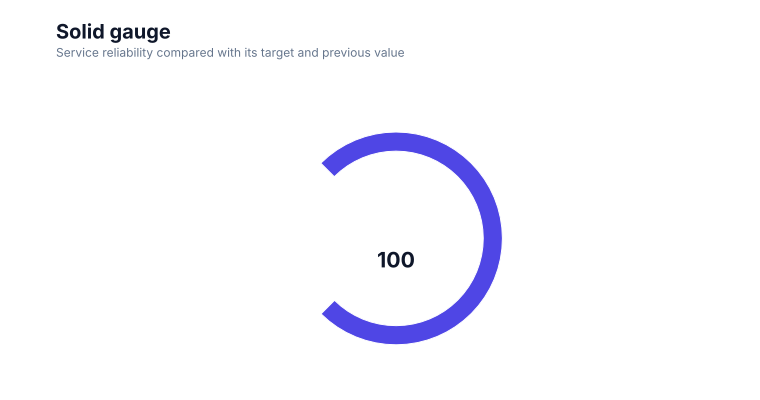

# Gauge charts

<!-- FAMILY_PRESETS_START -->

## Integrated presets

This is the single manual for the `gauge` family. Its canonical Quick API is `gauge()` from `graflume`, and its representative portable mark is `gauge`. The compatible names below remain callable, but they are modes or data-meaning presets rather than separate chart families.

| Compatible name                     | Quick API      | Mode          | Portable mark | Functional difference                         |
| ----------------------------------- | -------------- | ------------- | ------------- | --------------------------------------------- |
| [Gauge chart](#variant-gauge)       | `gauge()`      | `default`     | `gauge`       | Uses a dial, reference ticks, and needle.     |
| [Solid gauge](#variant-solid-gauge) | `solidGauge()` | `solid-gauge` | `solid-gauge` | Uses concentric filled arcs without a needle. |

All presets reuse the same validation, normalization, scale, compiler, renderer-neutral Scene, interaction, accessibility, and serialization contracts. Direction, curve, layout, glyph, depth, financial-body, and indicator choices stay in function-free fields or options instead of selecting a second rendering engine. The remaining manually maintained sections describe the canonical/default presentation unless a preset row above states a different behavior.

## Visual gallery

Every image below is generated from the current compiled Scene rather than drawn by hand. Select a name to jump to its data fields and implementation.

|                                                                                                                              |                                                                                                                                                |
| ---------------------------------------------------------------------------------------------------------------------------- | ---------------------------------------------------------------------------------------------------------------------------------------------- |
| **[Gauge chart](#variant-gauge)**<br>[](../assets/charts/gauge.svg) | **[Solid gauge](#variant-solid-gauge)**<br>[](../assets/charts/solid-gauge.svg) |

## Type-by-type implementation

The snippets are minimal runnable examples. Change `#chart` to the target element and expand the inline rows with your data. Each example opts into Graflume's safe text-only tooltip with a chart-specific title and ordered fields; number and date formatting follows the declared `locale`. This family keeps `trigger: "mark"`, so the pointer must hit rendered datum geometry. Tooltip interaction is a pointer-only convenience, so keep a readable summary or data table available for exact values and keyboard access. The Quick API applies the preset defaults while keeping the resulting specification function-free and serializable.

<a id="variant-gauge"></a>

### Gauge chart

Use this preset when a small set of current values must be judged against a known range. Uses a dial, reference ticks, and needle.

- **Quick API:** `gauge()`
- **Mode:** `default`
- **Portable mark:** `gauge`
- **Required example fields:** `category`, `value`

```js
import { gauge } from 'graflume';

const data = [
  {
    category: 'Search',
    value: 46,
  },
  {
    category: 'Direct',
    value: 28,
  },
  {
    category: 'Social',
    value: 17,
  },
  {
    category: 'Other',
    value: 9,
  },
];

gauge('#chart', data, {
  x: {
    field: 'category',
    type: 'ordinal',
    title: 'category',
  },
  y: {
    field: 'value',
    type: 'quantitative',
    title: 'value',
  },
  title: {
    text: 'Gauge chart',
    subtitle: 'gauge family · default mode',
  },
  accessibility: {
    label: 'Gauge chart example',
    description: 'A compiled gauge chart example using the gauge family.',
  },
  mark: {
    options: {
      min: 0,
      max: 100,
    },
  },
  locale: 'en-US',
  interaction: {
    tooltip: {
      title: 'Gauge chart',
      fields: [
        {
          field: 'category',
          label: 'category',
          format: 'auto',
        },
        {
          field: 'value',
          label: 'value',
          format: 'number',
        },
      ],
      trigger: 'mark',
    },
  },
});
```

<a id="variant-solid-gauge"></a>

### Solid gauge

Use this preset when a small set of current values must be judged against a known range. Uses concentric filled arcs without a needle.

- **Quick API:** `solidGauge()`
- **Mode:** `solid-gauge`
- **Portable mark:** `solid-gauge`
- **Required example fields:** `category`, `value`

```js
import { solidGauge } from 'graflume/complete';

const data = [
  {
    category: 'P1',
    value: 24,
  },
  {
    category: 'P2',
    value: 29.916,
  },
  {
    category: 'P3',
    value: 33.54,
  },
  {
    category: 'P4',
    value: 33.72,
  },
];

solidGauge('#chart', data, {
  x: {
    field: 'category',
    type: 'ordinal',
    title: 'category',
  },
  y: {
    field: 'value',
    type: 'quantitative',
    title: 'value',
  },
  title: {
    text: 'Solid gauge',
    subtitle: 'gauge family · solid-gauge mode',
  },
  accessibility: {
    label: 'Solid gauge example',
    description: 'A compiled solid gauge example using the gauge family.',
  },
  axes: {
    x: false,
    y: false,
  },
  mark: {
    options: {
      min: 0,
      max: 100,
    },
  },
  locale: 'en-US',
  interaction: {
    tooltip: {
      title: 'Solid gauge',
      fields: [
        {
          field: 'category',
          label: 'category',
          format: 'auto',
        },
        {
          field: 'value',
          label: 'value',
          format: 'number',
        },
      ],
      trigger: 'mark',
    },
  },
});
```

<!-- FAMILY_PRESETS_END -->

Use gauges for a few current values against a common bounded range.

## Implemented appearance

This image is generated from the current Graflume `compile()` Scene, not a hand-drawn mockup.


## Quick API

`Graflume.gauge()` creates the portable `gauge` mark (or documented alias mapping) and accepts the common target, data, and options arguments.

```ts
Graflume.gauge('#chart', data, {
  x: { field: 'metric', type: 'nominal' },
  y: { field: 'value', type: 'quantitative' },
  mark: { options: { min: 0, max: 100 } },
});
```

## Portable ChartSpec mapping

`x` supplies gauge labels, `y` supplies values, and `mark.options.min`/`max` define the range.

The same result can be created with `Graflume.create()` and `mark: { type: 'gauge' }`. Named `mark.fields` and `mark.options` values are function-free and JSON-serializable, so they remain portable across JavaScript, future Python/R/Java builders, and stored specs.

## Data, ordering, and missing values

Each row receives a semicircular track, proportional colored arc, five quiet reference ticks, a rounded needle and hub, value, and label. Values are clamped to the configured range.

Rows keep source order unless the compiler must establish a deterministic temporal or hierarchy order. Unsafe field names are rejected, callbacks are forbidden in portable specs, and invalid or unmappable values are skipped rather than evaluated.

## Styling and themes

The mark uses shared `fill`, `stroke`, `opacity`, `lineWidth`, `radius`, and `cornerRadius` options where the geometry makes them meaningful. Default colors, text, grid, focus, and palettes come from the active design-token theme and switch at runtime.

## Interaction and accessibility

Rendered datum shapes carry layer id, row index, and the original row for hover/click hit testing in the standard profile. Supply a concise `accessibility.label`, a useful `description`, and an adjacent text or table fallback. Canvas ARIA metadata does not replace keyboard-readable page content.

## Performance profiles

The same `standard`, `large`, `ultra`, and `auto` profiles apply. Complex layout marks currently favor deterministic bounded Scene output; aggregate or filter very large source data before rendering specialized diagrams.

## Current limitations

Threshold bands, custom tick labels, animation, and needle easing are not implemented yet.

## Runnable example and regression coverage

- [default-family CDN gallery](../../examples/cdn/complete-chart-types.html)
- [Chart catalog compile tests](../../tests/extended-chart-types.test.mjs)
- [Generated visual asset](../assets/charts/gauge.svg)

[Back to chart guides](./README.md)
