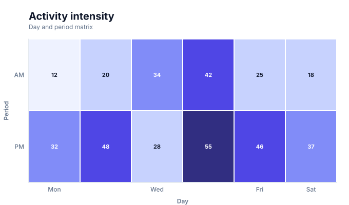
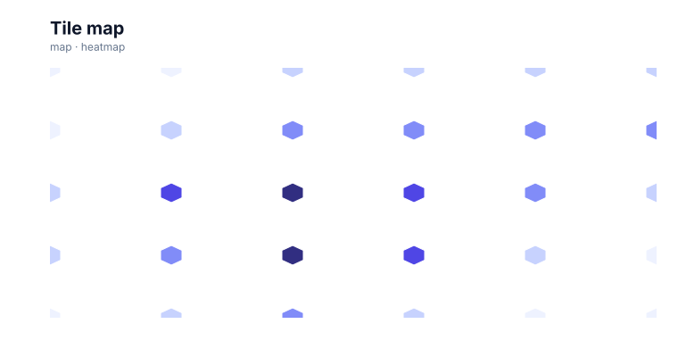

# Heatmaps

<!-- FAMILY_PRESETS_START -->

## Integrated presets

This is the single manual for the `heatmap` family. Its canonical Quick API is `heatmap()` from `graflume/complete`, and its representative portable mark is `heatmap`. The compatible names below remain callable, but they are modes or data-meaning presets rather than separate chart families.

| Compatible name               | Quick API   | Mode       | Portable mark | Functional difference                                        |
| ----------------------------- | ----------- | ---------- | ------------- | ------------------------------------------------------------ |
| [Heatmap](#variant-heatmap)   | `heatmap()` | `default`  | `heatmap`     | Uses a rectangular value matrix.                             |
| [Tile map](#variant-tile-map) | `tileMap()` | `tile-map` | `tilemap`     | Uses equal-area square, circle, diamond, or hexagonal tiles. |

All presets reuse the same validation, normalization, scale, compiler, renderer-neutral Scene, interaction, accessibility, and serialization contracts. Direction, curve, layout, glyph, depth, financial-body, and indicator choices stay in function-free fields or options instead of selecting a second rendering engine. The remaining manually maintained sections describe the canonical/default presentation unless a preset row above states a different behavior.

## Visual gallery

Every image below is generated from the current compiled Scene rather than drawn by hand. Select a name to jump to its data fields and implementation.

|                                                                                                                            |                                                                                                                                 |
| -------------------------------------------------------------------------------------------------------------------------- | ------------------------------------------------------------------------------------------------------------------------------- |
| **[Heatmap](#variant-heatmap)**<br>[](../assets/charts/heatmap.svg) | **[Tile map](#variant-tile-map)**<br>[](../assets/charts/tile-map.svg) |

## Type-by-type implementation

The snippets are minimal runnable examples. Change `#chart` to the target element and expand the inline rows with your data. Each example opts into Graflume's safe text-only tooltip with a chart-specific title and ordered fields; number and date formatting follows the declared `locale`. The Quick API applies the preset defaults while keeping the resulting specification function-free and serializable.

<a id="variant-heatmap"></a>

### Heatmap

Use this preset when two discrete dimensions and one value should be scanned as a matrix. Uses a rectangular value matrix.

- **Quick API:** `heatmap()`
- **Mode:** `default`
- **Portable mark:** `heatmap`
- **Required example fields:** `x`, `y`

```js
import { heatmap } from 'graflume/complete';

const data = [
  {
    x: 0,
    y: 0,
  },
  {
    x: 1,
    y: 0,
  },
  {
    x: 2,
    y: 0,
  },
  {
    x: 3,
    y: 0,
  },
];

heatmap('#chart', data, {
  x: {
    field: 'x',
    type: 'quantitative',
    title: 'x',
  },
  y: {
    field: 'y',
    type: 'quantitative',
    title: 'y',
  },
  title: {
    text: 'Heatmap',
    subtitle: 'heatmap family · default mode',
  },
  accessibility: {
    label: 'Heatmap example',
    description: 'A compiled heatmap example using the heatmap family.',
  },
  locale: 'en-US',
  interaction: {
    tooltip: {
      title: 'Heatmap',
      fields: [
        {
          field: 'x',
          label: 'x',
          format: 'number',
        },
        {
          field: 'y',
          label: 'y',
          format: 'number',
        },
      ],
    },
  },
});
```

<a id="variant-tile-map"></a>

### Tile map

Use this preset when two discrete dimensions and one value should be scanned as a matrix. Uses equal-area square, circle, diamond, or hexagonal tiles.

- **Quick API:** `tileMap()`
- **Mode:** `tile-map`
- **Portable mark:** `tilemap`
- **Required example fields:** `x`, `y`, `value`

```js
import { tileMap } from 'graflume/complete';

const data = [
  {
    x: 0,
    y: 0,
    value: 10.43,
  },
  {
    x: 1,
    y: 0,
    value: 22.607,
  },
  {
    x: 2,
    y: 0,
    value: 32.821,
  },
  {
    x: 3,
    y: 0,
    value: 27.908,
  },
];

tileMap('#chart', data, {
  x: {
    field: 'x',
    type: 'quantitative',
    title: 'x',
  },
  y: {
    field: 'y',
    type: 'quantitative',
    title: 'y',
  },
  title: {
    text: 'Tile map',
    subtitle: 'heatmap family · tile-map mode',
  },
  accessibility: {
    label: 'Tile map example',
    description: 'A compiled tile map example using the heatmap family.',
  },
  axes: {
    x: false,
    y: false,
  },
  mark: {
    fields: {
      value: 'value',
    },
  },
  locale: 'en-US',
  interaction: {
    tooltip: {
      title: 'Tile map',
      fields: [
        {
          field: 'x',
          label: 'x',
          format: 'number',
        },
        {
          field: 'y',
          label: 'y',
          format: 'number',
        },
        {
          field: 'value',
          label: 'Value',
          format: 'number',
        },
      ],
    },
  },
});
```

<!-- FAMILY_PRESETS_END -->

[Back to the chart guide index](./README.md)


> This image is generated from the actual renderer-neutral `compile()` Scene and checked for staleness in CI.

## When to use it

Use a heatmap to show intensity across two categorical dimensions.

## Data contract

`x` and `y` identify categorical cells. `mark.fields.value` or the primary `y` field supplies the numeric intensity; using a distinct value field is recommended.

### Named fields

`value` defaults to a field named `value`. The first-seen x and y categories determine cell order.

### Portable options

`labels: false` hides in-cell values. `cellGap` controls the clear space between neighboring cells and defaults to `1` pixel, so the matrix reads as one continuous surface while the background-colored stroke keeps each boundary identifiable. Sequential colors are interpolated from the active theme and text contrast is chosen automatically.

## Quick API

The additional families are opt-in so the default browser and module entrypoints remain small.

```js
import { heatmap } from 'graflume/complete';

heatmap('#chart', cells, {
  x: { field: 'day', type: 'ordinal' },
  y: { field: 'period', type: 'ordinal' },
  mark: { fields: { value: 'activity' }, options: { labels: true } },
});
```

The same chart can be represented as a function-free portable specification with `mark.type: 'heatmap'`.

## Rendering behavior

The compiler creates a band cell for each valid row, normalizes values across the observed extent, and emits interactive rectangles with a one-pixel default gap, a subtle one-pixel corner radius, and optional labels. Explicit `cellGap`, `stroke`, `lineWidth`, and `cornerRadius` values remain available when a denser or more separated matrix is required.

All output is compiled into the same renderer-neutral Scene used by Canvas and the checked SVG documentation snapshots. No second rendering engine is embedded.

## Interaction and accessibility

Each cell retains its source row and has contrast-aware text when large enough. Provide a table fallback and describe the scale direction and strongest cells.

## Performance

Scene cost is linear in populated cells. Very dense matrices should use tiled aggregation and a WebGL renderer package.

## Current limitations

Missing-cell patterns, continuous axes, clustered ordering, dendrograms, color legends, and tile-level LOD are not implemented yet.
