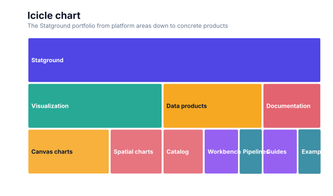
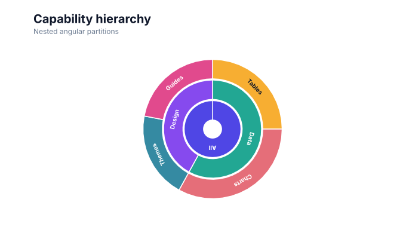
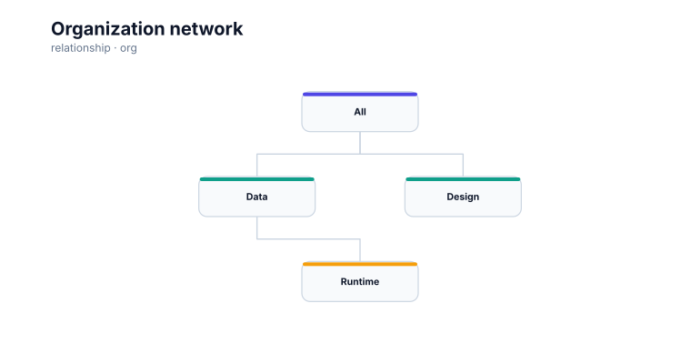
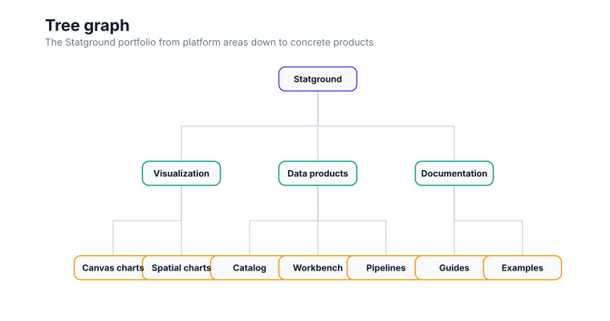
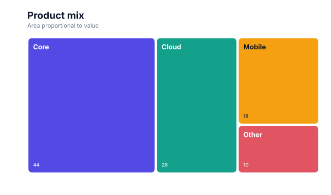

# Hierarchy chart

<!-- FAMILY_PRESETS_START -->

## Integrated presets

This is the single manual for the `hierarchy` family. Its canonical Quick API is `treemap()` from `graflume`, and its representative portable mark is `treemap`. The compatible names below remain callable, but they are modes or data-meaning presets rather than separate chart families.

| Compatible name                                       | Quick API               | Mode                   | Portable mark | Functional difference                                        |
| ----------------------------------------------------- | ----------------------- | ---------------------- | ------------- | ------------------------------------------------------------ |
| [Organization chart](#variant-org)                    | `org()`                 | `organization`         | `org`         | Uses a compact organization-card layout.                     |
| [Tree map](#variant-treemap)                          | `treemap()`             | `treemap`              | `treemap`     | Allocates nested rectangles by hierarchy value.              |
| [Icicle chart](#variant-icicle)                       | `icicle()`              | `icicle`               | `treemap`     | Allocates hierarchy depth to stacked horizontal bands.       |
| [Tree chart](#variant-tree)                           | `tree()`                | `tree`                 | `tree`        | Uses a parent-child node-link tree layout.                   |
| [Sunburst chart](#variant-sunburst)                   | `sunburst()`            | `sunburst`             | `sunburst`    | Uses radial hierarchy partitions.                            |
| [Organization network](#variant-organization-network) | `organizationNetwork()` | `organization-network` | `org`         | Uses organization semantics with relationship styling.       |
| [Tree graph](#variant-tree-graph)                     | `treeGraph()`           | `tree-graph`           | `tree`        | Uses the hierarchy data contract with graph-like connectors. |

All presets reuse the same validation, normalization, scale, compiler, renderer-neutral Scene, interaction, accessibility, and serialization contracts. Direction, curve, layout, glyph, depth, financial-body, and indicator choices stay in function-free fields or options instead of selecting a second rendering engine. The remaining manually maintained sections describe the canonical/default presentation unless a preset row above states a different behavior.

## Visual gallery

Every image below is generated from the current compiled Scene rather than drawn by hand. Select a name to jump to its data fields and implementation.

|                                                                                                                                             |                                                                                                                                                                                             |
| ------------------------------------------------------------------------------------------------------------------------------------------- | ------------------------------------------------------------------------------------------------------------------------------------------------------------------------------------------- |
| **[Organization chart](#variant-org)**<br>[](../assets/charts/org.svg)        | **[Tree map](#variant-treemap)**<br>[](../assets/charts/treemap.svg)                                                                |
| **[Icicle chart](#variant-icicle)**<br>[](../assets/charts/icicle.svg)           | **[Tree chart](#variant-tree)**<br>[](../assets/charts/tree.svg)                                                                     |
| **[Sunburst chart](#variant-sunburst)**<br>[](../assets/charts/sunburst.svg) | **[Organization network](#variant-organization-network)**<br>[](../assets/charts/organization-network.svg) |
| **[Tree graph](#variant-tree-graph)**<br>[](../assets/charts/tree-graph.svg)   |                                                                                                                                                                                             |

## Type-by-type implementation

The snippets are minimal runnable examples. Change `#chart` to the target element and expand the inline rows with your data. Each example opts into Graflume's safe text-only tooltip with a chart-specific title and ordered fields; number and date formatting follows the declared `locale`. This family keeps `trigger: "mark"`, so the pointer must hit rendered datum geometry. Pointer tooltip triggers remain a convenience; opt into `accessibility.table` and `accessibility.navigation` for the bounded native table and keyboard mark traversal, or provide a larger domain-specific table. The Quick API applies the preset defaults while keeping the resulting specification function-free and serializable.

Every family can opt into the Canvas [inspection viewport, fullscreen, reset, and PNG controls](./interactions.md). Inspection magnifies and translates the complete already-rendered chart, including its title and axes; it is not data-domain or GIS zoom. Generated examples intentionally leave playback off. Add discrete playback only after selecting a meaningful frame field and reviewing the family-specific capability table.

Every family also accepts the shared portable [legend, highlight, selection, and callout contract](./interactions.md#legends-highlights-selection-and-callouts). Automatic legend semantics follow the compiled mark and palette where they are unambiguous; use explicit function-free items for a domain-specific series or category legend. Static datum/layer/range highlights and text-only top-level callouts remain available even when a family has no Cartesian point geometry.

<a id="variant-org"></a>

### Organization chart

Use this preset when parent-child structure and relative size must be inspected together. Uses a compact organization-card layout.

- **Quick API:** `org()`
- **Mode:** `organization`
- **Portable mark:** `org`
- **Required example fields:** `id`, `value`, `parent`

```js
import { org } from 'graflume';

const data = [
  {
    id: 'All',
    value: 12,
    parent: '',
  },
  {
    id: 'Data',
    value: 8,
    parent: 'All',
  },
  {
    id: 'Design',
    value: 7,
    parent: 'All',
  },
  {
    id: 'Runtime',
    value: 5,
    parent: 'Data',
  },
];

org('#chart', data, {
  x: {
    field: 'id',
    type: 'ordinal',
    title: 'id',
  },
  y: {
    field: 'value',
    type: 'quantitative',
    title: 'value',
  },
  title: {
    text: 'Organization chart',
    subtitle: 'hierarchy family · organization mode',
  },
  accessibility: {
    label: 'Organization chart example',
    description: 'A compiled organization chart example using the hierarchy family.',
  },
  mark: {
    fields: {
      parent: 'parent',
    },
  },
  locale: 'en-US',
  interaction: {
    tooltip: {
      title: 'Organization chart',
      fields: [
        {
          field: 'id',
          label: 'id',
          format: 'auto',
        },
        {
          field: 'value',
          label: 'value',
          format: 'number',
        },
        {
          field: 'parent',
          label: 'Parent',
          format: 'auto',
        },
      ],
      trigger: 'mark',
    },
  },
});
```

<a id="variant-treemap"></a>

### Tree map

Use this preset when parent-child structure and relative size must be inspected together. Allocates nested rectangles by hierarchy value.

- **Quick API:** `treemap()`
- **Mode:** `treemap`
- **Portable mark:** `treemap`
- **Required example fields:** `id`, `value`, `parent`

```js
import { treemap } from 'graflume';

const data = [
  {
    id: 'All',
    value: 12,
    parent: '',
  },
  {
    id: 'Data',
    value: 8,
    parent: 'All',
  },
  {
    id: 'Design',
    value: 7,
    parent: 'All',
  },
  {
    id: 'Runtime',
    value: 5,
    parent: 'Data',
  },
];

treemap('#chart', data, {
  x: {
    field: 'id',
    type: 'ordinal',
    title: 'id',
  },
  y: {
    field: 'value',
    type: 'quantitative',
    title: 'value',
  },
  title: {
    text: 'Tree map',
    subtitle: 'hierarchy family · treemap mode',
  },
  accessibility: {
    label: 'Tree map example',
    description: 'A compiled tree map example using the hierarchy family.',
  },
  mark: {
    fields: {
      parent: 'parent',
    },
    options: {},
  },
  locale: 'en-US',
  interaction: {
    tooltip: {
      title: 'Tree map',
      fields: [
        {
          field: 'id',
          label: 'id',
          format: 'auto',
        },
        {
          field: 'value',
          label: 'value',
          format: 'number',
        },
        {
          field: 'parent',
          label: 'Parent',
          format: 'auto',
        },
      ],
      trigger: 'mark',
    },
  },
});
```

<a id="variant-icicle"></a>

### Icicle chart

Use this preset when parent-child structure and relative size must be inspected together. Allocates hierarchy depth to stacked horizontal bands.

- **Quick API:** `icicle()`
- **Mode:** `icicle`
- **Portable mark:** `treemap`
- **Required example fields:** `id`, `value`, `parent`

```js
import { icicle } from 'graflume';

const data = [
  {
    id: 'All',
    value: 12,
    parent: '',
  },
  {
    id: 'Data',
    value: 8,
    parent: 'All',
  },
  {
    id: 'Design',
    value: 7,
    parent: 'All',
  },
  {
    id: 'Runtime',
    value: 5,
    parent: 'Data',
  },
];

icicle('#chart', data, {
  x: {
    field: 'id',
    type: 'ordinal',
    title: 'id',
  },
  y: {
    field: 'value',
    type: 'quantitative',
    title: 'value',
  },
  title: {
    text: 'Icicle chart',
    subtitle: 'hierarchy family · icicle mode',
  },
  accessibility: {
    label: 'Icicle chart example',
    description: 'A compiled icicle chart example using the hierarchy family.',
  },
  mark: {
    fields: {
      parent: 'parent',
    },
    options: {
      mode: 'icicle',
    },
  },
  locale: 'en-US',
  interaction: {
    tooltip: {
      title: 'Icicle chart',
      fields: [
        {
          field: 'id',
          label: 'id',
          format: 'auto',
        },
        {
          field: 'value',
          label: 'value',
          format: 'number',
        },
        {
          field: 'parent',
          label: 'Parent',
          format: 'auto',
        },
      ],
      trigger: 'mark',
    },
  },
});
```

<a id="variant-tree"></a>

### Tree chart

Use this preset when parent-child structure and relative size must be inspected together. Uses a parent-child node-link tree layout.

- **Quick API:** `tree()`
- **Mode:** `tree`
- **Portable mark:** `tree`
- **Required example fields:** `id`, `value`, `parent`

```js
import { tree } from 'graflume/complete';

const data = [
  {
    id: 'All',
    value: 12,
    parent: '',
  },
  {
    id: 'Data',
    value: 8,
    parent: 'All',
  },
  {
    id: 'Design',
    value: 7,
    parent: 'All',
  },
  {
    id: 'Runtime',
    value: 5,
    parent: 'Data',
  },
];

tree('#chart', data, {
  x: {
    field: 'id',
    type: 'ordinal',
    title: 'id',
  },
  y: {
    field: 'value',
    type: 'quantitative',
    title: 'value',
  },
  title: {
    text: 'Tree chart',
    subtitle: 'hierarchy family · tree mode',
  },
  accessibility: {
    label: 'Tree chart example',
    description: 'A compiled tree chart example using the hierarchy family.',
  },
  mark: {
    fields: {
      parent: 'parent',
    },
  },
  locale: 'en-US',
  interaction: {
    tooltip: {
      title: 'Tree chart',
      fields: [
        {
          field: 'id',
          label: 'id',
          format: 'auto',
        },
        {
          field: 'value',
          label: 'value',
          format: 'number',
        },
        {
          field: 'parent',
          label: 'Parent',
          format: 'auto',
        },
      ],
      trigger: 'mark',
    },
  },
});
```

<a id="variant-sunburst"></a>

### Sunburst chart

Use this preset when parent-child structure and relative size must be inspected together. Uses radial hierarchy partitions.

- **Quick API:** `sunburst()`
- **Mode:** `sunburst`
- **Portable mark:** `sunburst`
- **Required example fields:** `id`, `value`, `parent`

```js
import { sunburst } from 'graflume/complete';

const data = [
  {
    id: 'All',
    value: 12,
    parent: '',
  },
  {
    id: 'Data',
    value: 8,
    parent: 'All',
  },
  {
    id: 'Design',
    value: 7,
    parent: 'All',
  },
  {
    id: 'Runtime',
    value: 5,
    parent: 'Data',
  },
];

sunburst('#chart', data, {
  x: {
    field: 'id',
    type: 'ordinal',
    title: 'id',
  },
  y: {
    field: 'value',
    type: 'quantitative',
    title: 'value',
  },
  title: {
    text: 'Sunburst chart',
    subtitle: 'hierarchy family · sunburst mode',
  },
  accessibility: {
    label: 'Sunburst chart example',
    description: 'A compiled sunburst chart example using the hierarchy family.',
  },
  mark: {
    fields: {
      parent: 'parent',
    },
    options: {},
  },
  locale: 'en-US',
  interaction: {
    tooltip: {
      title: 'Sunburst chart',
      fields: [
        {
          field: 'id',
          label: 'id',
          format: 'auto',
        },
        {
          field: 'value',
          label: 'value',
          format: 'number',
        },
        {
          field: 'parent',
          label: 'Parent',
          format: 'auto',
        },
      ],
      trigger: 'mark',
    },
  },
});
```

<a id="variant-organization-network"></a>

### Organization network

Use this preset when parent-child structure and relative size must be inspected together. Uses organization semantics with relationship styling.

- **Quick API:** `organizationNetwork()`
- **Mode:** `organization-network`
- **Portable mark:** `org`
- **Required example fields:** `id`, `value`, `parent`

```js
import { organizationNetwork } from 'graflume/complete';

const data = [
  {
    id: 'All',
    value: 12,
    parent: '',
  },
  {
    id: 'Data',
    value: 8,
    parent: 'All',
  },
  {
    id: 'Design',
    value: 7,
    parent: 'All',
  },
  {
    id: 'Runtime',
    value: 5,
    parent: 'Data',
  },
];

organizationNetwork('#chart', data, {
  x: {
    field: 'id',
    type: 'ordinal',
    title: 'id',
  },
  y: {
    field: 'value',
    type: 'quantitative',
    title: 'value',
  },
  title: {
    text: 'Organization network',
    subtitle: 'hierarchy family · organization-network mode',
  },
  accessibility: {
    label: 'Organization network example',
    description: 'A compiled organization network example using the hierarchy family.',
  },
  axes: {
    x: false,
    y: false,
  },
  mark: {
    fields: {
      parent: 'parent',
    },
  },
  locale: 'en-US',
  interaction: {
    tooltip: {
      title: 'Organization network',
      fields: [
        {
          field: 'id',
          label: 'id',
          format: 'auto',
        },
        {
          field: 'value',
          label: 'value',
          format: 'number',
        },
        {
          field: 'parent',
          label: 'Parent',
          format: 'auto',
        },
      ],
      trigger: 'mark',
    },
  },
});
```

<a id="variant-tree-graph"></a>

### Tree graph

Use this preset when parent-child structure and relative size must be inspected together. Uses the hierarchy data contract with graph-like connectors.

- **Quick API:** `treeGraph()`
- **Mode:** `tree-graph`
- **Portable mark:** `tree`
- **Required example fields:** `id`, `value`, `parent`

```js
import { treeGraph } from 'graflume/complete';

const data = [
  {
    id: 'All',
    value: 12,
    parent: '',
  },
  {
    id: 'Data',
    value: 8,
    parent: 'All',
  },
  {
    id: 'Design',
    value: 7,
    parent: 'All',
  },
  {
    id: 'Runtime',
    value: 5,
    parent: 'Data',
  },
];

treeGraph('#chart', data, {
  x: {
    field: 'id',
    type: 'ordinal',
    title: 'id',
  },
  y: {
    field: 'value',
    type: 'quantitative',
    title: 'value',
  },
  title: {
    text: 'Tree graph',
    subtitle: 'hierarchy family · tree-graph mode',
  },
  accessibility: {
    label: 'Tree graph example',
    description: 'A compiled tree graph example using the hierarchy family.',
  },
  axes: {
    x: false,
    y: false,
  },
  mark: {
    fields: {
      parent: 'parent',
    },
  },
  locale: 'en-US',
  interaction: {
    tooltip: {
      title: 'Tree graph',
      fields: [
        {
          field: 'id',
          label: 'id',
          format: 'auto',
        },
        {
          field: 'value',
          label: 'value',
          format: 'number',
        },
        {
          field: 'parent',
          label: 'Parent',
          format: 'auto',
        },
      ],
      trigger: 'mark',
    },
  },
});
```

<!-- FAMILY_PRESETS_END -->



This guide documents the consolidated **Hierarchy chart** family. The image is generated from the actual compiled Scene used by the runtime renderer.

## When to use it

Explore parent-child structure. Tree, organization, nested rectangles, and radial partitions are layouts of the same hierarchy meaning.

## Canonical Quick API

```ts
import { treemap } from 'graflume';

treemap('#chart', data, {
  x: { field: 'id', type: 'nominal' },
  y: { field: 'value', type: 'quantitative' },
  mark: { fields: { parent: 'parent' } },
});
```

## Data contract

Supply a node id plus a parent field. Root rows use an empty parent; an optional quantitative value controls area or angular extent. Missing required values skip only the affected row. Input order remains stable unless the selected layout documents a deterministic sort.

## Rendering and portability

Every preset normalizes into the same ChartSpec, validation, scale, compiler, renderer-neutral Scene, interaction, and accessibility pipeline. Mode differences use function-free `mark.fields` and `mark.options`; they do not create a second engine or a second top-level family.

## Styling and interaction

Use theme tokens or common `fill`, `stroke`, `opacity`, `lineWidth`, `radius`, and `cornerRadius` properties where the selected geometry supports them. Interactive datum shapes retain their source row and layer metadata; decorative labels, grids, and depth faces do not create duplicate targets.

## Accessibility and performance

Provide a concise `accessibility.label`, describe the principal comparison or structure, and pair Canvas output with the data-table fallback. Dense labels, relationship crossings, and multi-part interval geometry can produce several Scene nodes per row, so aggregate when individual marks stop adding analytical value.

## Verification

Advanced circle-pack, dendrogram, radial-tree, collapse, re-root/zoom,
breadcrumb, and search options are documented in the
[structure and relationship analytics guide](../relationship-analytics.md#hierarchy-tree).

- Snapshot: [`docs/assets/charts/hierarchy.svg`](../assets/charts/hierarchy.svg)
- Runtime catalogs: [`src/catalog`](../../src/catalog)
- Catalog tests: [`tests`](../../tests)
