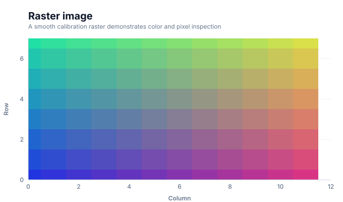

# Raster image charts

<!-- FAMILY_PRESETS_START -->

## Integrated presets

This is the single manual for the `image` family. Its canonical Quick API is `image()` from `graflume/complete`, and its representative portable mark is `image`. The compatible names below remain callable, but they are modes or data-meaning presets rather than separate chart families.

| Compatible name                | Quick API | Mode      | Portable mark | Functional difference                                            |
| ------------------------------ | --------- | --------- | ------------- | ---------------------------------------------------------------- |
| [Raster image](#variant-image) | `image()` | `default` | `image`       | Renders explicit color or RGBA rows as interactive raster cells. |

All presets reuse the same validation, normalization, scale, compiler, renderer-neutral Scene, interaction, accessibility, and serialization contracts. Direction, curve, layout, glyph, depth, financial-body, and indicator choices stay in function-free fields or options instead of selecting a second rendering engine. The remaining manually maintained sections describe the canonical/default presentation unless a preset row above states a different behavior.

## Visual gallery

Every image below is generated from the current compiled Scene rather than drawn by hand. Select a name to jump to its data fields and implementation.

|                                                                                                                                |     |
| ------------------------------------------------------------------------------------------------------------------------------ | --- |
| **[Raster image](#variant-image)**<br>[](../assets/charts/image.svg) |     |

## Type-by-type implementation

The snippets are minimal runnable examples. Change `#chart` to the target element and expand the inline rows with your data. Each example opts into Graflume's safe text-only tooltip with a chart-specific title and ordered fields; number and date formatting follows the declared `locale`. This family keeps `trigger: "mark"`, so the pointer must hit rendered datum geometry. Pointer tooltip triggers remain a convenience; opt into `accessibility.table` and `accessibility.navigation` for the bounded native table and keyboard mark traversal, or provide a larger domain-specific table. The Quick API applies the preset defaults while keeping the resulting specification function-free and serializable.

Every family can opt into the Canvas [inspection viewport, fullscreen, reset, and PNG controls](./interactions.md). Inspection magnifies and translates the complete already-rendered chart, including its title and axes; it is not data-domain or GIS zoom. Generated examples intentionally leave playback off. Add discrete playback only after selecting a meaningful frame field and reviewing the family-specific capability table.

Every family also accepts the shared portable [legend, highlight, selection, and callout contract](./interactions.md#legends-highlights-selection-and-callouts). Automatic legend semantics follow the compiled mark and palette where they are unambiguous; use explicit function-free items for a domain-specific series or category legend. Static datum/layer/range highlights and text-only top-level callouts remain available even when a family has no Cartesian point geometry.

<a id="variant-image"></a>

### Raster image

Use this preset when a bounded color matrix must preserve row-level pixel semantics. Renders explicit color or RGBA rows as interactive raster cells.

- **Quick API:** `image()`
- **Mode:** `default`
- **Portable mark:** `image`
- **Required example fields:** `x`, `y`, `red`, `green`, `blue`

```js
import { image } from 'graflume/complete';

const data = [
  {
    x: 0,
    y: 0,
    red: 32,
    green: 52,
    blue: 224,
  },
  {
    x: 1,
    y: 0,
    red: 49,
    green: 52,
    blue: 216,
  },
  {
    x: 2,
    y: 0,
    red: 66,
    green: 52,
    blue: 207,
  },
  {
    x: 3,
    y: 0,
    red: 82,
    green: 52,
    blue: 199,
  },
];

image('#chart', data, {
  x: {
    field: 'x',
    type: 'quantitative',
    title: 'Column',
  },
  y: {
    field: 'y',
    type: 'quantitative',
    title: 'Row',
  },
  title: {
    text: 'Raster image',
    subtitle: 'image family · default mode',
  },
  accessibility: {
    label: 'Raster image: A smooth calibration raster demonstrates color and pixel inspection',
    description:
      'A smooth calibration raster demonstrates color and pixel inspection. The example uses curated, deterministic data and exposes its exact values in a semantic table.',
  },
  mark: {
    fields: {
      red: 'red',
      green: 'green',
      blue: 'blue',
    },
  },
  locale: 'en-US',
  interaction: {
    tooltip: {
      title: 'Raster image',
      fields: [
        {
          field: 'x',
          label: 'Column',
          format: 'number',
        },
        {
          field: 'y',
          label: 'Row',
          format: 'number',
        },
        {
          field: 'red',
          label: 'Red',
          format: 'number',
        },
        {
          field: 'green',
          label: 'Green',
          format: 'number',
        },
        {
          field: 'blue',
          label: 'Blue',
          format: 'number',
        },
      ],
      trigger: 'mark',
    },
  },
});
```

<!-- FAMILY_PRESETS_END -->

The `image` family renders a data-backed raster from discrete cell coordinates. Each input row becomes a real interactive Scene rectangle rather than a decorative bitmap overlay.

## Data contract

Use `x` and `y` for row-backed pixel or cell positions. Supply either a portable color field or numeric `red`, `green`, `blue`, and optional `alpha` fields. Duplicate coordinates follow input order. For a dense function-free raster, set `mark.options.raster` to `{ width, height, channels, values, extent?, origin? }`. Channels may be scalar, RGB, or RGBA; `origin` is `upper` or `lower`.

## Styling and interaction

Cells use the declared color or RGBA channels and may opt into a small gap or stroke. Dense rasters accept `resampling: "nearest" | "bilinear" | "bicubic"`, scalar `window`, a hexadecimal `colormap`, and global `alpha`. Every materialized raster cell reports its data coordinate, sampled channels, RGBA result, extent, origin, and filter in the portable tooltip contract.

## Performance and limits

This mode is intended for bounded matrices and raster previews. Valid rows are sampled deterministically against the active `maxBarMarks` budget. Dense raster output dimensions are reduced proportionally when their requested product exceeds that same budget, and sampling clamps safely at image edges. Large photographic images should remain ordinary image assets; this compiler intentionally does not fetch remote pixels.

## Verification

The catalog fixture asserts one interactive RGB Scene cell per valid row and generates the committed SVG preview from compiled output.
