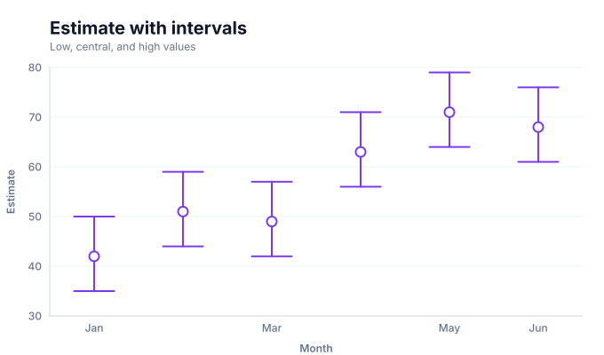
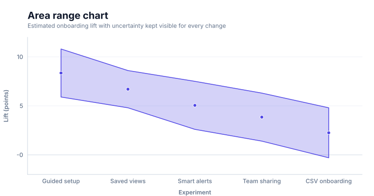
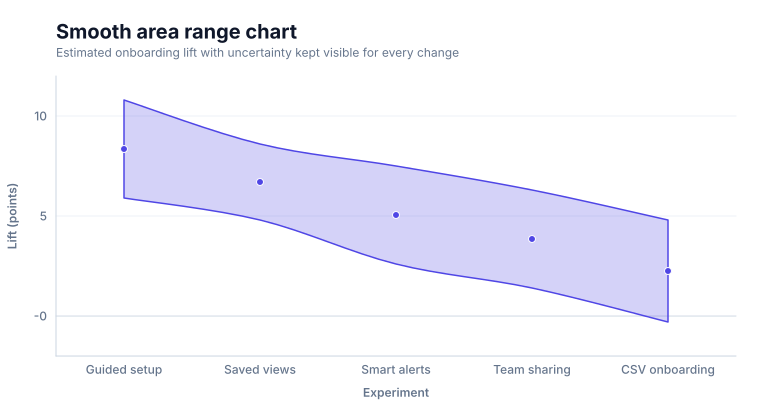
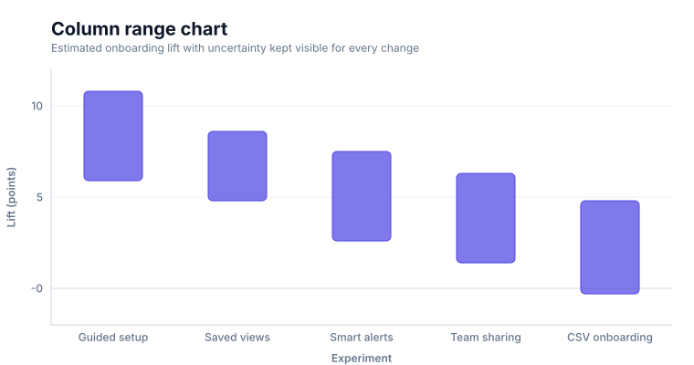
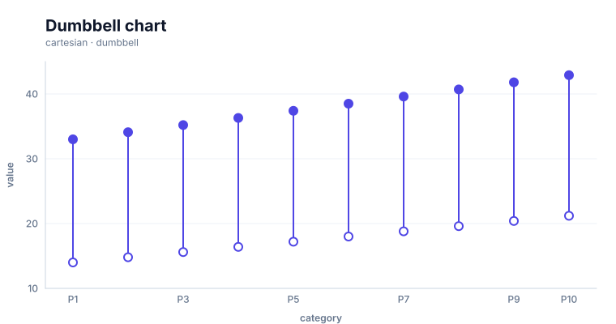
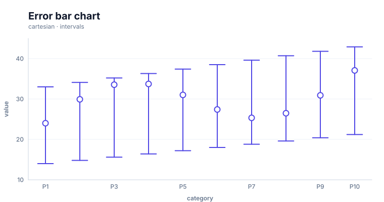

# Interval chart

<!-- FAMILY_PRESETS_START -->

## Integrated presets

This is the single manual for the `interval` family. Its canonical Quick API is `intervals()` from `graflume`, and its representative portable mark is `interval`. The compatible names below remain callable, but they are modes or data-meaning presets rather than separate chart families.

| Compatible name                                       | Quick API           | Mode                | Portable mark | Functional difference                                     |
| ----------------------------------------------------- | ------------------- | ------------------- | ------------- | --------------------------------------------------------- |
| [Intervals](#variant-intervals)                       | `intervals()`       | `default`           | `interval`    | Uses a central point with low/high stems and caps.        |
| [Area range chart](#variant-area-range)               | `areaRange()`       | `area-range`        | `range`       | Fills the band between low and high values.               |
| [Smooth area range chart](#variant-area-spline-range) | `areaSplineRange()` | `area-spline-range` | `range`       | Smooths both edges of a low/high band.                    |
| [Column range chart](#variant-column-range)           | `columnRange()`     | `column-range`      | `range`       | Uses one floating vertical column per low/high pair.      |
| [Dumbbell chart](#variant-dumbbell)                   | `dumbbell()`        | `dumbbell`          | `range`       | Connects two endpoints and emphasizes both values.        |
| [Error bar chart](#variant-error-bar)                 | `errorBar()`        | `error-bar`         | `interval`    | Uses a low/high stem and compact caps around an estimate. |

All presets reuse the same validation, normalization, scale, compiler, renderer-neutral Scene, interaction, accessibility, and serialization contracts. Direction, curve, layout, glyph, depth, financial-body, and indicator choices stay in function-free fields or options instead of selecting a second rendering engine. The remaining manually maintained sections describe the canonical/default presentation unless a preset row above states a different behavior.

## Visual gallery

Every image below is generated from the current compiled Scene rather than drawn by hand. Select a name to jump to its data fields and implementation.

|                                                                                                                                                                                          |                                                                                                                                                                 |
| ---------------------------------------------------------------------------------------------------------------------------------------------------------------------------------------- | --------------------------------------------------------------------------------------------------------------------------------------------------------------- |
| **[Intervals](#variant-intervals)**<br>[](../assets/charts/intervals.svg)                                                     | **[Area range chart](#variant-area-range)**<br>[](../assets/charts/area-range.svg)           |
| **[Smooth area range chart](#variant-area-spline-range)**<br>[](../assets/charts/area-spline-range.svg) | **[Column range chart](#variant-column-range)**<br>[](../assets/charts/column-range.svg) |
| **[Dumbbell chart](#variant-dumbbell)**<br>[](../assets/charts/dumbbell.svg)                                              | **[Error bar chart](#variant-error-bar)**<br>[](../assets/charts/error-bar.svg)                |

## Type-by-type implementation

The snippets are minimal runnable examples. Change `#chart` to the target element and expand the inline rows with your data. Each example opts into Graflume's safe text-only tooltip with a chart-specific title and ordered fields; number and date formatting follows the declared `locale`. This family uses `trigger: "axis"` with `axis: "x"`. An exact rendered-mark hit still has priority; otherwise Graflume selects the nearest actual datum on that axis without inventing an interpolated row. Pointer tooltip triggers remain a convenience; opt into `accessibility.table` and `accessibility.navigation` for the bounded native table and keyboard mark traversal, or provide a larger domain-specific table. The Quick API applies the preset defaults while keeping the resulting specification function-free and serializable.

Every family can opt into the Canvas [inspection viewport, fullscreen, reset, and PNG controls](./interactions.md). Inspection magnifies and translates the complete already-rendered chart, including its title and axes; it is not data-domain or GIS zoom. Generated examples intentionally leave playback off. Add discrete playback only after selecting a meaningful frame field and reviewing the family-specific capability table.

Every family also accepts the shared portable [legend, highlight, selection, and callout contract](./interactions.md#legends-highlights-selection-and-callouts). Automatic legend semantics follow the compiled mark and palette where they are unambiguous; use explicit function-free items for a domain-specific series or category legend. Static datum/layer/range highlights and text-only top-level callouts remain available even when a family has no Cartesian point geometry.

<a id="variant-intervals"></a>

### Intervals

Use this preset when a central value and its lower and upper bounds must be compared. Uses a central point with low/high stems and caps.

- **Quick API:** `intervals()`
- **Mode:** `default`
- **Portable mark:** `interval`
- **Required example fields:** `category`, `value`, `low`, `high`

```js
import { intervals } from 'graflume';

const data = [
  {
    category: 'P1',
    value: 24,
    low: 14,
    high: 33,
  },
  {
    category: 'P2',
    value: 29.916,
    low: 14.8,
    high: 34.1,
  },
  {
    category: 'P3',
    value: 33.54,
    low: 15.6,
    high: 35.2,
  },
  {
    category: 'P4',
    value: 33.72,
    low: 16.4,
    high: 36.3,
  },
];

intervals('#chart', data, {
  x: {
    field: 'category',
    type: 'ordinal',
    title: 'category',
  },
  y: {
    field: 'value',
    type: 'quantitative',
    title: 'value',
  },
  title: {
    text: 'Intervals',
    subtitle: 'interval family · default mode',
  },
  accessibility: {
    label: 'Intervals example',
    description: 'A compiled intervals example using the interval family.',
  },
  mark: {
    fields: {
      low: 'low',
      high: 'high',
    },
  },
  locale: 'en-US',
  interaction: {
    tooltip: {
      title: 'Intervals',
      fields: [
        {
          field: 'category',
          label: 'category',
          format: 'auto',
        },
        {
          field: 'value',
          label: 'value',
          format: 'number',
        },
        {
          field: 'low',
          label: 'Low',
          format: 'number',
        },
        {
          field: 'high',
          label: 'High',
          format: 'number',
        },
      ],
      trigger: 'axis',
      axis: 'x',
    },
  },
});
```

<a id="variant-area-range"></a>

### Area range chart

Use this preset when a central value and its lower and upper bounds must be compared. Fills the band between low and high values.

- **Quick API:** `areaRange()`
- **Mode:** `area-range`
- **Portable mark:** `range`
- **Required example fields:** `category`, `value`, `low`, `high`

```js
import { areaRange } from 'graflume/complete';

const data = [
  {
    category: 'P1',
    value: 24,
    low: 14,
    high: 33,
  },
  {
    category: 'P2',
    value: 29.916,
    low: 14.8,
    high: 34.1,
  },
  {
    category: 'P3',
    value: 33.54,
    low: 15.6,
    high: 35.2,
  },
  {
    category: 'P4',
    value: 33.72,
    low: 16.4,
    high: 36.3,
  },
];

areaRange('#chart', data, {
  x: {
    field: 'category',
    type: 'ordinal',
    title: 'category',
  },
  y: {
    field: 'value',
    type: 'quantitative',
    title: 'value',
  },
  title: {
    text: 'Area range chart',
    subtitle: 'interval family · area-range mode',
  },
  accessibility: {
    label: 'Area range chart example',
    description: 'A compiled area range chart example using the interval family.',
  },
  mark: {
    fields: {
      low: 'low',
      high: 'high',
    },
    options: {
      mode: 'area',
      smooth: false,
    },
  },
  locale: 'en-US',
  interaction: {
    tooltip: {
      title: 'Area range chart',
      fields: [
        {
          field: 'category',
          label: 'category',
          format: 'auto',
        },
        {
          field: 'value',
          label: 'value',
          format: 'number',
        },
        {
          field: 'low',
          label: 'Low',
          format: 'number',
        },
        {
          field: 'high',
          label: 'High',
          format: 'number',
        },
      ],
      trigger: 'axis',
      axis: 'x',
    },
  },
});
```

<a id="variant-area-spline-range"></a>

### Smooth area range chart

Use this preset when a central value and its lower and upper bounds must be compared. Smooths both edges of a low/high band.

- **Quick API:** `areaSplineRange()`
- **Mode:** `area-spline-range`
- **Portable mark:** `range`
- **Required example fields:** `category`, `value`, `low`, `high`

```js
import { areaSplineRange } from 'graflume/complete';

const data = [
  {
    category: 'P1',
    value: 24,
    low: 14,
    high: 33,
  },
  {
    category: 'P2',
    value: 29.916,
    low: 14.8,
    high: 34.1,
  },
  {
    category: 'P3',
    value: 33.54,
    low: 15.6,
    high: 35.2,
  },
  {
    category: 'P4',
    value: 33.72,
    low: 16.4,
    high: 36.3,
  },
];

areaSplineRange('#chart', data, {
  x: {
    field: 'category',
    type: 'ordinal',
    title: 'category',
  },
  y: {
    field: 'value',
    type: 'quantitative',
    title: 'value',
  },
  title: {
    text: 'Smooth area range chart',
    subtitle: 'interval family · area-spline-range mode',
  },
  accessibility: {
    label: 'Smooth area range chart example',
    description: 'A compiled smooth area range chart example using the interval family.',
  },
  mark: {
    fields: {
      low: 'low',
      high: 'high',
    },
    options: {
      mode: 'area',
      smooth: true,
    },
  },
  locale: 'en-US',
  interaction: {
    tooltip: {
      title: 'Smooth area range chart',
      fields: [
        {
          field: 'category',
          label: 'category',
          format: 'auto',
        },
        {
          field: 'value',
          label: 'value',
          format: 'number',
        },
        {
          field: 'low',
          label: 'Low',
          format: 'number',
        },
        {
          field: 'high',
          label: 'High',
          format: 'number',
        },
      ],
      trigger: 'axis',
      axis: 'x',
    },
  },
});
```

<a id="variant-column-range"></a>

### Column range chart

Use this preset when a central value and its lower and upper bounds must be compared. Uses one floating vertical column per low/high pair.

- **Quick API:** `columnRange()`
- **Mode:** `column-range`
- **Portable mark:** `range`
- **Required example fields:** `category`, `value`, `low`, `high`

```js
import { columnRange } from 'graflume/complete';

const data = [
  {
    category: 'P1',
    value: 24,
    low: 14,
    high: 33,
  },
  {
    category: 'P2',
    value: 29.916,
    low: 14.8,
    high: 34.1,
  },
  {
    category: 'P3',
    value: 33.54,
    low: 15.6,
    high: 35.2,
  },
  {
    category: 'P4',
    value: 33.72,
    low: 16.4,
    high: 36.3,
  },
];

columnRange('#chart', data, {
  x: {
    field: 'category',
    type: 'ordinal',
    title: 'category',
  },
  y: {
    field: 'value',
    type: 'quantitative',
    title: 'value',
  },
  title: {
    text: 'Column range chart',
    subtitle: 'interval family · column-range mode',
  },
  accessibility: {
    label: 'Column range chart example',
    description: 'A compiled column range chart example using the interval family.',
  },
  mark: {
    fields: {
      low: 'low',
      high: 'high',
    },
    options: {
      mode: 'column',
      smooth: false,
    },
  },
  locale: 'en-US',
  interaction: {
    tooltip: {
      title: 'Column range chart',
      fields: [
        {
          field: 'category',
          label: 'category',
          format: 'auto',
        },
        {
          field: 'value',
          label: 'value',
          format: 'number',
        },
        {
          field: 'low',
          label: 'Low',
          format: 'number',
        },
        {
          field: 'high',
          label: 'High',
          format: 'number',
        },
      ],
      trigger: 'axis',
      axis: 'x',
    },
  },
});
```

<a id="variant-dumbbell"></a>

### Dumbbell chart

Use this preset when a central value and its lower and upper bounds must be compared. Connects two endpoints and emphasizes both values.

- **Quick API:** `dumbbell()`
- **Mode:** `dumbbell`
- **Portable mark:** `range`
- **Required example fields:** `category`, `value`, `low`, `high`

```js
import { dumbbell } from 'graflume/complete';

const data = [
  {
    category: 'P1',
    value: 24,
    low: 14,
    high: 33,
  },
  {
    category: 'P2',
    value: 29.916,
    low: 14.8,
    high: 34.1,
  },
  {
    category: 'P3',
    value: 33.54,
    low: 15.6,
    high: 35.2,
  },
  {
    category: 'P4',
    value: 33.72,
    low: 16.4,
    high: 36.3,
  },
];

dumbbell('#chart', data, {
  x: {
    field: 'category',
    type: 'ordinal',
    title: 'category',
  },
  y: {
    field: 'value',
    type: 'quantitative',
    title: 'value',
  },
  title: {
    text: 'Dumbbell chart',
    subtitle: 'interval family · dumbbell mode',
  },
  accessibility: {
    label: 'Dumbbell chart example',
    description: 'A compiled dumbbell chart example using the interval family.',
  },
  mark: {
    fields: {
      low: 'low',
      high: 'high',
    },
    options: {
      mode: 'dumbbell',
      smooth: false,
    },
  },
  locale: 'en-US',
  interaction: {
    tooltip: {
      title: 'Dumbbell chart',
      fields: [
        {
          field: 'category',
          label: 'category',
          format: 'auto',
        },
        {
          field: 'value',
          label: 'value',
          format: 'number',
        },
        {
          field: 'low',
          label: 'Low',
          format: 'number',
        },
        {
          field: 'high',
          label: 'High',
          format: 'number',
        },
      ],
      trigger: 'axis',
      axis: 'x',
    },
  },
});
```

<a id="variant-error-bar"></a>

### Error bar chart

Use this preset when a central value and its lower and upper bounds must be compared. Uses a low/high stem and compact caps around an estimate.

- **Quick API:** `errorBar()`
- **Mode:** `error-bar`
- **Portable mark:** `interval`
- **Required example fields:** `category`, `value`, `low`, `high`

```js
import { errorBar } from 'graflume/complete';

const data = [
  {
    category: 'P1',
    value: 24,
    low: 14,
    high: 33,
  },
  {
    category: 'P2',
    value: 29.916,
    low: 14.8,
    high: 34.1,
  },
  {
    category: 'P3',
    value: 33.54,
    low: 15.6,
    high: 35.2,
  },
  {
    category: 'P4',
    value: 33.72,
    low: 16.4,
    high: 36.3,
  },
];

errorBar('#chart', data, {
  x: {
    field: 'category',
    type: 'ordinal',
    title: 'category',
  },
  y: {
    field: 'value',
    type: 'quantitative',
    title: 'value',
  },
  title: {
    text: 'Error bar chart',
    subtitle: 'interval family · error-bar mode',
  },
  accessibility: {
    label: 'Error bar chart example',
    description: 'A compiled error bar chart example using the interval family.',
  },
  mark: {
    fields: {
      low: 'low',
      high: 'high',
    },
  },
  locale: 'en-US',
  interaction: {
    tooltip: {
      title: 'Error bar chart',
      fields: [
        {
          field: 'category',
          label: 'category',
          format: 'auto',
        },
        {
          field: 'value',
          label: 'value',
          format: 'number',
        },
        {
          field: 'low',
          label: 'Low',
          format: 'number',
        },
        {
          field: 'high',
          label: 'High',
          format: 'number',
        },
      ],
      trigger: 'axis',
      axis: 'x',
    },
  },
});
```

<!-- FAMILY_PRESETS_END -->


This guide documents the consolidated **Interval chart** family. The image is generated from the actual compiled Scene used by the runtime renderer.

## When to use it

Show uncertainty, a low/high band, a column range, or a two-endpoint comparison without presenting those layouts as unrelated chart families.

## Canonical Quick API

```ts
import { intervals } from 'graflume';

intervals('#chart', data, {
  x: { field: 'month', type: 'ordinal' },
  y: { field: 'value', type: 'quantitative' },
  mark: { fields: { low: 'low', high: 'high' }, options: { mode: 'area' } },
});
```

## Data contract

Declare `low` and `high` in `mark.fields`. Choose area, column, dumbbell, or error presentation through the listed preset API and its function-free mark options. Missing required values skip only the affected row. Input order remains stable unless the selected layout documents a deterministic sort.

## Rendering and portability

Every preset normalizes into the same ChartSpec, validation, scale, compiler, renderer-neutral Scene, interaction, and accessibility pipeline. Mode differences use function-free `mark.fields` and `mark.options`; they do not create a second engine or a second top-level family.

## Styling and interaction

Use theme tokens or common `fill`, `stroke`, `opacity`, `lineWidth`, `radius`, and `cornerRadius` properties where the selected geometry supports them. Interactive datum shapes retain their source row and layer metadata; decorative labels, grids, and depth faces do not create duplicate targets.

## Accessibility and performance

Provide a concise `accessibility.label`, describe the principal comparison or structure, and pair Canvas output with the data-table fallback. Dense labels, relationship crossings, and multi-part interval geometry can produce several Scene nodes per row, so aggregate when individual marks stop adding analytical value.

## Verification

- Snapshot: [`docs/assets/charts/interval.svg`](../assets/charts/interval.svg)
- Runtime catalogs: [`src/catalog`](../../src/catalog)
- Catalog tests: [`tests`](../../tests)
