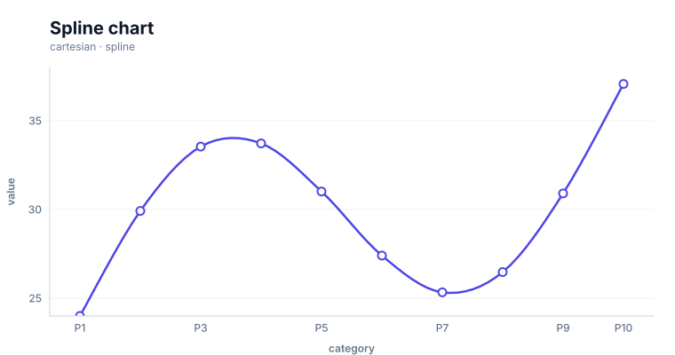

# Line charts

<!-- FAMILY_PRESETS_START -->

## Integrated presets

This is the single manual for the `line` family. Its canonical Quick API is `line()` from `graflume`, and its representative portable mark is `line`. The compatible names below remain callable, but they are modes or data-meaning presets rather than separate chart families.

| Compatible name                 | Quick API     | Mode      | Portable mark | Functional difference                                |
| ------------------------------- | ------------- | --------- | ------------- | ---------------------------------------------------- |
| [Line chart](#variant-line)     | `line()`      | `default` | `line`        | Uses direct ordered line segments.                   |
| [Trendline](#variant-trendline) | `trendline()` | `trend`   | `trendline`   | Derives a regression trend from the coordinate rows. |
| [Spline chart](#variant-spline) | `spline()`    | `spline`  | `smooth`      | Uses a sampled smooth path.                          |

All presets reuse the same validation, normalization, scale, compiler, renderer-neutral Scene, interaction, accessibility, and serialization contracts. Direction, curve, layout, glyph, depth, financial-body, and indicator choices stay in function-free fields or options instead of selecting a second rendering engine. The remaining manually maintained sections describe the canonical/default presentation unless a preset row above states a different behavior.

## Visual gallery

Every image below is generated from the current compiled Scene rather than drawn by hand. Select a name to jump to its data fields and implementation.

|                                                                                                                                   |                                                                                                                                      |
| --------------------------------------------------------------------------------------------------------------------------------- | ------------------------------------------------------------------------------------------------------------------------------------ |
| **[Line chart](#variant-line)**<br>[](../assets/charts/line.svg)           | **[Trendline](#variant-trendline)**<br>[](../assets/charts/trendline.svg) |
| **[Spline chart](#variant-spline)**<br>[](../assets/charts/spline.svg) |                                                                                                                                      |

## Type-by-type implementation

The snippets are minimal runnable examples. Change `#chart` to the target element and expand the inline rows with your data. Each example opts into Graflume's safe text-only tooltip with a chart-specific title and ordered fields; number and date formatting follows the declared `locale`. This family uses `trigger: "axis"` with `axis: "x"`. An exact rendered-mark hit still has priority; otherwise Graflume selects the nearest actual datum on that axis without inventing an interpolated row. Tooltip interaction is a pointer-only convenience, so keep a readable summary or data table available for exact values and keyboard access. The Quick API applies the preset defaults while keeping the resulting specification function-free and serializable.

<a id="variant-line"></a>

### Line chart

Use this preset when change across an ordered domain is the main reading task. Uses direct ordered line segments.

- **Quick API:** `line()`
- **Mode:** `default`
- **Portable mark:** `line`
- **Required example fields:** `category`, `value`

```js
import { line } from 'graflume';

const data = [
  {
    category: 'P1',
    value: 24,
  },
  {
    category: 'P2',
    value: 29.916,
  },
  {
    category: 'P3',
    value: 33.54,
  },
  {
    category: 'P4',
    value: 33.72,
  },
];

line('#chart', data, {
  x: {
    field: 'category',
    type: 'ordinal',
    title: 'category',
  },
  y: {
    field: 'value',
    type: 'quantitative',
    title: 'value',
  },
  title: {
    text: 'Line chart',
    subtitle: 'line family · default mode',
  },
  accessibility: {
    label: 'Line chart example',
    description: 'A compiled line chart example using the line family.',
  },
  mark: {
    point: true,
  },
  locale: 'en-US',
  interaction: {
    tooltip: {
      title: 'Line chart',
      fields: [
        {
          field: 'category',
          label: 'category',
          format: 'auto',
        },
        {
          field: 'value',
          label: 'value',
          format: 'number',
        },
      ],
      trigger: 'axis',
      axis: 'x',
    },
  },
});
```

<a id="variant-trendline"></a>

### Trendline

Use this preset when change across an ordered domain is the main reading task. Derives a regression trend from the coordinate rows.

- **Quick API:** `trendline()`
- **Mode:** `trend`
- **Portable mark:** `trendline`
- **Required example fields:** `category`, `value`

```js
import { trendline } from 'graflume';

const data = [
  {
    category: 'P1',
    value: 24,
  },
  {
    category: 'P2',
    value: 29.916,
  },
  {
    category: 'P3',
    value: 33.54,
  },
  {
    category: 'P4',
    value: 33.72,
  },
];

trendline('#chart', data, {
  x: {
    field: 'category',
    type: 'ordinal',
    title: 'category',
  },
  y: {
    field: 'value',
    type: 'quantitative',
    title: 'value',
  },
  title: {
    text: 'Trendline',
    subtitle: 'line family · trend mode',
  },
  accessibility: {
    label: 'Trendline example',
    description: 'A compiled trendline example using the line family.',
  },
  mark: {
    point: true,
  },
  locale: 'en-US',
  interaction: {
    tooltip: {
      title: 'Trendline',
      fields: [
        {
          field: 'category',
          label: 'category',
          format: 'auto',
        },
        {
          field: 'value',
          label: 'value',
          format: 'number',
        },
      ],
      trigger: 'axis',
      axis: 'x',
    },
  },
});
```

<a id="variant-spline"></a>

### Spline chart

Use this preset when change across an ordered domain is the main reading task. Uses a sampled smooth path.

- **Quick API:** `spline()`
- **Mode:** `spline`
- **Portable mark:** `smooth`
- **Required example fields:** `category`, `value`

```js
import { spline } from 'graflume/complete';

const data = [
  {
    category: 'P1',
    value: 24,
  },
  {
    category: 'P2',
    value: 29.916,
  },
  {
    category: 'P3',
    value: 33.54,
  },
  {
    category: 'P4',
    value: 33.72,
  },
];

spline('#chart', data, {
  x: {
    field: 'category',
    type: 'ordinal',
    title: 'category',
  },
  y: {
    field: 'value',
    type: 'quantitative',
    title: 'value',
  },
  title: {
    text: 'Spline chart',
    subtitle: 'line family · spline mode',
  },
  accessibility: {
    label: 'Spline chart example',
    description: 'A compiled spline chart example using the line family.',
  },
  mark: {
    point: true,
    options: {
      area: false,
    },
  },
  locale: 'en-US',
  interaction: {
    tooltip: {
      title: 'Spline chart',
      fields: [
        {
          field: 'category',
          label: 'category',
          format: 'auto',
        },
        {
          field: 'value',
          label: 'value',
          format: 'number',
        },
      ],
      trigger: 'axis',
      axis: 'x',
    },
  },
});
```

<!-- FAMILY_PRESETS_END -->

Use a line chart for an ordered sequence such as time, rank, distance, or another progression. Graflume connects valid input rows in their current order and can add interactive point circles.

## Implemented appearance

This is the current compiled output for a line chart with `mark.point: true`.


## Quick API

```ts
import { line } from 'graflume';

const chart = line('#chart', data, {
  title: {
    text: 'Monthly revenue',
    subtitle: 'Actual result',
  },
  x: { field: 'month', type: 'ordinal', axis: { grid: false } },
  y: {
    field: 'revenue',
    type: 'quantitative',
    scale: { zero: false, nice: true },
  },
  mark: {
    stroke: '#ea580c',
    lineWidth: 3,
    point: true,
    radius: 5,
    fill: '#ffffff',
  },
});
```

## Portable ChartSpec

```ts
Graflume.create('#chart', {
  specVersion: '0.1',
  data,
  mark: {
    type: 'line',
    stroke: '#ea580c',
    lineWidth: 3,
    point: true,
  },
  x: { field: 'month', type: 'ordinal' },
  y: { field: 'revenue', type: 'quantitative' },
});
```

## Ordering and missing values

- Graflume connects points in input-row order; it does not sort automatically.
- Sort temporal or quantitative x values before rendering when order matters.
- An invalid or missing x/y pair ends the current line segment.
- A later valid row starts a new segment.
- `scale.zero` defaults to false for a line, so the y domain can focus on the observed range.

```ts
const ordered = [...rows].sort((a, b) => a.timestamp.localeCompare(b.timestamp));
```

## Line points and interaction

The line path itself is not a datum hit target. Enable `mark.point` to render interactive circles:

```ts
mark: {
  type: 'line',
  point: true,
  radius: 5,
}
```

Each circle retains the original row. Without points, structured `hover` and `click` events can still fire at the chart surface but normally return `hit: null` for the line. An explicit x-axis tooltip can still present the nearest actual row as a pointer-only fallback; it does not change those event results.

## Large data behavior

Line marks use min/max sampling to preserve endpoints and local extrema within the current point budget. Optional point circles use a separate stride-sampling budget.

- `standard`: up to 100,000 line points and hit-tested optional points;
- `large`: line points become viewport-aware and hit testing is disabled;
- `ultra`: stronger line reduction and no per-mark hit testing.

Pre-aggregate or downsample when every source observation is not visually distinguishable.

## Current limitations

- straight connected segments only; no curve/interpolation setting;
- no step line, range line, confidence band, or error bar;
- no automatic sorting or time-window transform;
- no native legend or rendered crosshair guide;
- no path-level datum hit testing;
- no SVG/WebGL renderer parity yet.

## Runnable examples and tests

- [chart type gallery](../../examples/cdn/chart-types.html)
- [line regression test](../../tests/chart-types.test.mjs)

[Back to chart guides](./README.md)
