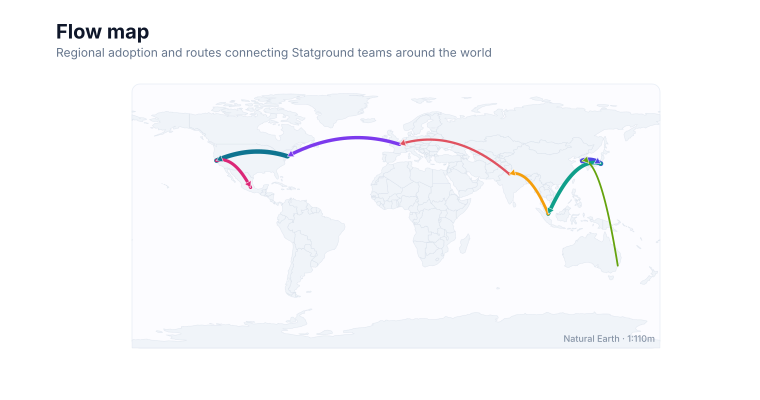
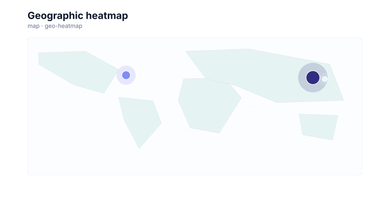
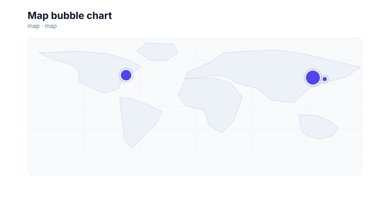
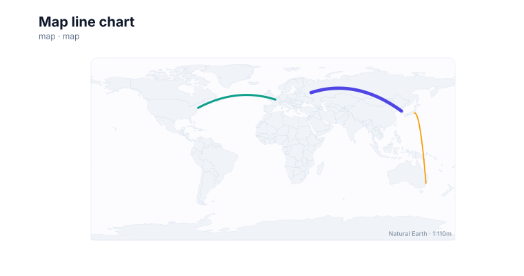
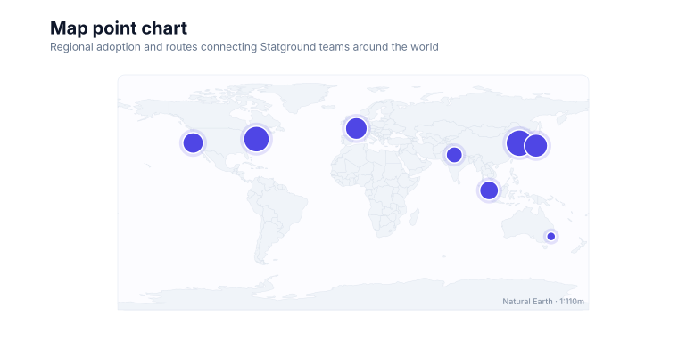
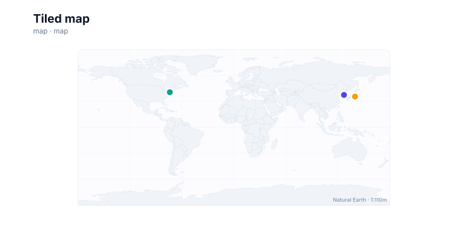

# Maps

<!-- FAMILY_PRESETS_START -->

## Integrated presets

This is the single manual for the `map` family. Its canonical Quick API is `map()` from `graflume`, and its representative portable mark is `map`. The compatible names below remain callable, but they are modes or data-meaning presets rather than separate chart families.

| Compatible name                            | Quick API      | Mode          | Portable mark | Functional difference                                                                                                                           |
| ------------------------------------------ | -------------- | ------------- | ------------- | ----------------------------------------------------------------------------------------------------------------------------------------------- |
| [Geographic region chart](#variant-geo)    | `geo()`        | `region`      | `geo`         | Joins named regions to the built-in 177-feature Natural Earth world basemap; the example uses choropleth mode while bubble remains the default. |
| [Map](#variant-map)                        | `map()`        | `default`     | `map`         | Projects valid longitude and latitude rows over the built-in Natural Earth world basemap.                                                       |
| [Flow map](#variant-flow-map)              | `flowMap()`    | `flow-map`    | `geo-flow`    | Adds weighted directional routes over the shared static political basemap.                                                                      |
| [Geographic heatmap](#variant-geo-heatmap) | `geoHeatmap()` | `geo-heatmap` | `geo-heatmap` | Maps geographic intensity into nested heat circles over country boundaries.                                                                     |
| [Map bubble chart](#variant-map-bubble)    | `mapBubble()`  | `map-bubble`  | `map`         | Scales projected point radius by value over country boundaries.                                                                                 |
| [Map line chart](#variant-map-line)        | `mapLine()`    | `map-line`    | `geo-line`    | Draws curved geographic routes without flow weighting over the shared basemap.                                                                  |
| [Map point chart](#variant-map-point)      | `mapPoint()`   | `map-point`   | `map`         | Uses fixed-size projected point markers over the shared basemap.                                                                                |
| [Tiled map](#variant-tiled-map)            | `tiledMap()`   | `tiled-map`   | `tiled-map`   | Retains the historical compatibility name for projected points on the built-in political basemap; it does not request or simulate web tiles.    |

All presets reuse the same validation, normalization, scale, compiler, renderer-neutral Scene, interaction, accessibility, and serialization contracts. Direction, curve, layout, glyph, depth, financial-body, and indicator choices stay in function-free fields or options instead of selecting a second rendering engine. The remaining manually maintained sections describe the canonical/default presentation unless a preset row above states a different behavior.

## Visual gallery

Every image below is generated from the current compiled Scene rather than drawn by hand. Select a name to jump to its data fields and implementation.

|                                                                                                                                                       |                                                                                                                                                              |
| ----------------------------------------------------------------------------------------------------------------------------------------------------- | ------------------------------------------------------------------------------------------------------------------------------------------------------------ |
| **[Geographic region chart](#variant-geo)**<br>[](../assets/charts/geo.svg)        | **[Map](#variant-map)**<br>[](../assets/charts/map.svg)                                                       |
| **[Flow map](#variant-flow-map)**<br>[](../assets/charts/flow-map.svg)                       | **[Geographic heatmap](#variant-geo-heatmap)**<br>[](../assets/charts/geo-heatmap.svg) |
| **[Map bubble chart](#variant-map-bubble)**<br>[](../assets/charts/map-bubble.svg) | **[Map line chart](#variant-map-line)**<br>[](../assets/charts/map-line.svg)                  |
| **[Map point chart](#variant-map-point)**<br>[](../assets/charts/map-point.svg)      | **[Tiled map](#variant-tiled-map)**<br>[](../assets/charts/tiled-map.svg)                         |

## Type-by-type implementation

The snippets are minimal runnable examples. Change `#chart` to the target element and expand the inline rows with your data. Each example opts into Graflume's safe text-only tooltip with a chart-specific title and ordered fields; number and date formatting follows the declared `locale`. This family keeps `trigger: "mark"`, so the pointer must hit rendered datum geometry. Pointer tooltip triggers remain a convenience; opt into `accessibility.table` and `accessibility.navigation` for the bounded native table and keyboard mark traversal, or provide a larger domain-specific table. The Quick API applies the preset defaults while keeping the resulting specification function-free and serializable.

Every family can opt into the Canvas [inspection viewport, fullscreen, reset, and PNG controls](./interactions.md). Inspection magnifies and translates the complete already-rendered chart, including its title and axes; it is not data-domain or GIS zoom. Generated examples intentionally leave playback off. Add discrete playback only after selecting a meaningful frame field and reviewing the family-specific capability table.

Every family also accepts the shared portable [legend, highlight, selection, and callout contract](./interactions.md#legends-highlights-selection-and-callouts). Automatic legend semantics follow the compiled mark and palette where they are unambiguous; use explicit function-free items for a domain-specific series or category legend. Static datum/layer/range highlights and text-only top-level callouts remain available even when a family has no Cartesian point geometry.

<a id="variant-geo"></a>

### Geographic region chart

Use this preset when values or relationships must be interpreted geographically. Joins named regions to the built-in 177-feature Natural Earth world basemap; the example uses choropleth mode while bubble remains the default.

- **Quick API:** `geo()`
- **Mode:** `region`
- **Portable mark:** `geo`
- **Required example fields:** `region`, `value`

```js
import { geo } from 'graflume';

const data = [
  {
    region: 'KR',
    value: 72,
  },
  {
    region: 'United States',
    value: 88,
  },
  {
    region: 'Brazil',
    value: 41,
  },
  {
    region: 'RUS',
    value: 63,
  },
];

geo('#chart', data, {
  x: {
    field: 'region',
    type: 'ordinal',
    title: 'region',
  },
  y: {
    field: 'value',
    type: 'quantitative',
    title: 'value',
  },
  title: {
    text: 'Geographic region chart',
    subtitle: 'map family · region mode',
  },
  accessibility: {
    label: 'Geographic region chart example',
    description: 'A compiled geographic region chart example using the map family.',
  },
  mark: {
    options: {
      mode: 'choropleth',
    },
  },
  locale: 'en-US',
  interaction: {
    tooltip: {
      title: 'Geographic region chart',
      fields: [
        {
          field: 'region',
          label: 'region',
          format: 'auto',
        },
        {
          field: 'value',
          label: 'value',
          format: 'number',
        },
      ],
      trigger: 'mark',
    },
  },
});
```

<a id="variant-map"></a>

### Map

Use this preset when values or relationships must be interpreted geographically. Projects valid longitude and latitude rows over the built-in Natural Earth world basemap.

- **Quick API:** `map()`
- **Mode:** `default`
- **Portable mark:** `map`
- **Required example fields:** `longitude`, `latitude`, `value`

```js
import { map } from 'graflume';

const data = [
  {
    longitude: 126.98,
    latitude: 37.57,
    value: 72,
  },
  {
    longitude: -74,
    latitude: 40.71,
    value: 55,
  },
  {
    longitude: 139.69,
    latitude: 35.68,
    value: 43,
  },
];

map('#chart', data, {
  x: {
    field: 'longitude',
    type: 'quantitative',
    title: 'longitude',
  },
  y: {
    field: 'latitude',
    type: 'quantitative',
    title: 'latitude',
  },
  title: {
    text: 'Map',
    subtitle: 'map family · default mode',
  },
  accessibility: {
    label: 'Map example',
    description: 'A compiled map example using the map family.',
  },
  mark: {
    fields: {
      size: 'value',
    },
  },
  locale: 'en-US',
  interaction: {
    tooltip: {
      title: 'Map',
      fields: [
        {
          field: 'longitude',
          label: 'longitude',
          format: 'number',
        },
        {
          field: 'latitude',
          label: 'latitude',
          format: 'number',
        },
        {
          field: 'value',
          label: 'Value',
          format: 'number',
        },
      ],
      trigger: 'mark',
    },
  },
});
```

<a id="variant-flow-map"></a>

### Flow map

Use this preset when values or relationships must be interpreted geographically. Adds weighted directional routes over the shared static political basemap.

- **Quick API:** `flowMap()`
- **Mode:** `flow-map`
- **Portable mark:** `geo-flow`
- **Required example fields:** `longitude`, `latitude`, `longitude2`, `latitude2`, `value`

```js
import { flowMap } from 'graflume/complete';

const data = [
  {
    longitude: 126.98,
    latitude: 37.57,
    longitude2: 37.62,
    latitude2: 55.75,
    value: 72,
  },
  {
    longitude: -74,
    latitude: 40.71,
    longitude2: 2.35,
    latitude2: 48.86,
    value: 55,
  },
  {
    longitude: 139.69,
    latitude: 35.68,
    longitude2: 151.21,
    latitude2: -33.87,
    value: 43,
  },
];

flowMap('#chart', data, {
  x: {
    field: 'longitude',
    type: 'quantitative',
    title: 'longitude',
  },
  y: {
    field: 'latitude',
    type: 'quantitative',
    title: 'latitude',
  },
  title: {
    text: 'Flow map',
    subtitle: 'map family · flow-map mode',
  },
  accessibility: {
    label: 'Flow map example',
    description: 'A compiled flow map example using the map family.',
  },
  axes: {
    x: false,
    y: false,
  },
  mark: {
    fields: {
      longitude2: 'longitude2',
      latitude2: 'latitude2',
      value: 'value',
    },
  },
  locale: 'en-US',
  interaction: {
    tooltip: {
      title: 'Flow map',
      fields: [
        {
          field: 'longitude',
          label: 'longitude',
          format: 'number',
        },
        {
          field: 'latitude',
          label: 'latitude',
          format: 'number',
        },
        {
          field: 'longitude2',
          label: 'Longitude2',
          format: 'number',
        },
        {
          field: 'latitude2',
          label: 'Latitude2',
          format: 'number',
        },
        {
          field: 'value',
          label: 'Value',
          format: 'number',
        },
      ],
      trigger: 'mark',
    },
  },
});
```

<a id="variant-geo-heatmap"></a>

### Geographic heatmap

Use this preset when values or relationships must be interpreted geographically. Maps geographic intensity into nested heat circles over country boundaries.

- **Quick API:** `geoHeatmap()`
- **Mode:** `geo-heatmap`
- **Portable mark:** `geo-heatmap`
- **Required example fields:** `longitude`, `latitude`, `value`

```js
import { geoHeatmap } from 'graflume/complete';

const data = [
  {
    longitude: 126.98,
    latitude: 37.57,
    value: 72,
  },
  {
    longitude: -74,
    latitude: 40.71,
    value: 55,
  },
  {
    longitude: 139.69,
    latitude: 35.68,
    value: 43,
  },
];

geoHeatmap('#chart', data, {
  x: {
    field: 'longitude',
    type: 'quantitative',
    title: 'longitude',
  },
  y: {
    field: 'latitude',
    type: 'quantitative',
    title: 'latitude',
  },
  title: {
    text: 'Geographic heatmap',
    subtitle: 'map family · geo-heatmap mode',
  },
  accessibility: {
    label: 'Geographic heatmap example',
    description: 'A compiled geographic heatmap example using the map family.',
  },
  axes: {
    x: false,
    y: false,
  },
  mark: {
    fields: {
      value: 'value',
    },
  },
  locale: 'en-US',
  interaction: {
    tooltip: {
      title: 'Geographic heatmap',
      fields: [
        {
          field: 'longitude',
          label: 'longitude',
          format: 'number',
        },
        {
          field: 'latitude',
          label: 'latitude',
          format: 'number',
        },
        {
          field: 'value',
          label: 'Value',
          format: 'number',
        },
      ],
      trigger: 'mark',
    },
  },
});
```

<a id="variant-map-bubble"></a>

### Map bubble chart

Use this preset when values or relationships must be interpreted geographically. Scales projected point radius by value over country boundaries.

- **Quick API:** `mapBubble()`
- **Mode:** `map-bubble`
- **Portable mark:** `map`
- **Required example fields:** `longitude`, `latitude`, `value`

```js
import { mapBubble } from 'graflume/complete';

const data = [
  {
    longitude: 126.98,
    latitude: 37.57,
    value: 72,
  },
  {
    longitude: -74,
    latitude: 40.71,
    value: 55,
  },
  {
    longitude: 139.69,
    latitude: 35.68,
    value: 43,
  },
];

mapBubble('#chart', data, {
  x: {
    field: 'longitude',
    type: 'quantitative',
    title: 'longitude',
  },
  y: {
    field: 'latitude',
    type: 'quantitative',
    title: 'latitude',
  },
  title: {
    text: 'Map bubble chart',
    subtitle: 'map family · map-bubble mode',
  },
  accessibility: {
    label: 'Map bubble chart example',
    description: 'A compiled map bubble chart example using the map family.',
  },
  axes: {
    x: false,
    y: false,
  },
  mark: {
    fields: {
      size: 'value',
    },
  },
  locale: 'en-US',
  interaction: {
    tooltip: {
      title: 'Map bubble chart',
      fields: [
        {
          field: 'longitude',
          label: 'longitude',
          format: 'number',
        },
        {
          field: 'latitude',
          label: 'latitude',
          format: 'number',
        },
        {
          field: 'value',
          label: 'Value',
          format: 'number',
        },
      ],
      trigger: 'mark',
    },
  },
});
```

<a id="variant-map-line"></a>

### Map line chart

Use this preset when values or relationships must be interpreted geographically. Draws curved geographic routes without flow weighting over the shared basemap.

- **Quick API:** `mapLine()`
- **Mode:** `map-line`
- **Portable mark:** `geo-line`
- **Required example fields:** `longitude`, `latitude`, `longitude2`, `latitude2`, `value`

```js
import { mapLine } from 'graflume/complete';

const data = [
  {
    longitude: 126.98,
    latitude: 37.57,
    longitude2: 37.62,
    latitude2: 55.75,
    value: 72,
  },
  {
    longitude: -74,
    latitude: 40.71,
    longitude2: 2.35,
    latitude2: 48.86,
    value: 55,
  },
  {
    longitude: 139.69,
    latitude: 35.68,
    longitude2: 151.21,
    latitude2: -33.87,
    value: 43,
  },
];

mapLine('#chart', data, {
  x: {
    field: 'longitude',
    type: 'quantitative',
    title: 'longitude',
  },
  y: {
    field: 'latitude',
    type: 'quantitative',
    title: 'latitude',
  },
  title: {
    text: 'Map line chart',
    subtitle: 'map family · map-line mode',
  },
  accessibility: {
    label: 'Map line chart example',
    description: 'A compiled map line chart example using the map family.',
  },
  axes: {
    x: false,
    y: false,
  },
  mark: {
    fields: {
      longitude2: 'longitude2',
      latitude2: 'latitude2',
      value: 'value',
    },
  },
  locale: 'en-US',
  interaction: {
    tooltip: {
      title: 'Map line chart',
      fields: [
        {
          field: 'longitude',
          label: 'longitude',
          format: 'number',
        },
        {
          field: 'latitude',
          label: 'latitude',
          format: 'number',
        },
        {
          field: 'longitude2',
          label: 'Longitude2',
          format: 'number',
        },
        {
          field: 'latitude2',
          label: 'Latitude2',
          format: 'number',
        },
        {
          field: 'value',
          label: 'Value',
          format: 'number',
        },
      ],
      trigger: 'mark',
    },
  },
});
```

<a id="variant-map-point"></a>

### Map point chart

Use this preset when values or relationships must be interpreted geographically. Uses fixed-size projected point markers over the shared basemap.

- **Quick API:** `mapPoint()`
- **Mode:** `map-point`
- **Portable mark:** `map`
- **Required example fields:** `longitude`, `latitude`, `value`

```js
import { mapPoint } from 'graflume/complete';

const data = [
  {
    longitude: 126.98,
    latitude: 37.57,
    value: 72,
  },
  {
    longitude: -74,
    latitude: 40.71,
    value: 55,
  },
  {
    longitude: 139.69,
    latitude: 35.68,
    value: 43,
  },
];

mapPoint('#chart', data, {
  x: {
    field: 'longitude',
    type: 'quantitative',
    title: 'longitude',
  },
  y: {
    field: 'latitude',
    type: 'quantitative',
    title: 'latitude',
  },
  title: {
    text: 'Map point chart',
    subtitle: 'map family · map-point mode',
  },
  accessibility: {
    label: 'Map point chart example',
    description: 'A compiled map point chart example using the map family.',
  },
  axes: {
    x: false,
    y: false,
  },
  mark: {
    fields: {
      size: 'value',
    },
  },
  locale: 'en-US',
  interaction: {
    tooltip: {
      title: 'Map point chart',
      fields: [
        {
          field: 'longitude',
          label: 'longitude',
          format: 'number',
        },
        {
          field: 'latitude',
          label: 'latitude',
          format: 'number',
        },
        {
          field: 'value',
          label: 'Value',
          format: 'number',
        },
      ],
      trigger: 'mark',
    },
  },
});
```

<a id="variant-tiled-map"></a>

### Tiled map

Use this preset when values or relationships must be interpreted geographically. Retains the historical compatibility name for projected points on the built-in political basemap; it does not request or simulate web tiles.

- **Quick API:** `tiledMap()`
- **Mode:** `tiled-map`
- **Portable mark:** `tiled-map`
- **Required example fields:** `longitude`, `latitude`

```js
import { tiledMap } from 'graflume/complete';

const data = [
  {
    longitude: 126.98,
    latitude: 37.57,
  },
  {
    longitude: -74,
    latitude: 40.71,
  },
  {
    longitude: 139.69,
    latitude: 35.68,
  },
];

tiledMap('#chart', data, {
  x: {
    field: 'longitude',
    type: 'quantitative',
    title: 'longitude',
  },
  y: {
    field: 'latitude',
    type: 'quantitative',
    title: 'latitude',
  },
  title: {
    text: 'Tiled map',
    subtitle: 'map family · tiled-map mode',
  },
  accessibility: {
    label: 'Tiled map example',
    description: 'A compiled tiled map example using the map family.',
  },
  axes: {
    x: false,
    y: false,
  },
  mark: {
    options: {
      graticule: true,
    },
  },
  locale: 'en-US',
  interaction: {
    tooltip: {
      title: 'Tiled map',
      fields: [
        {
          field: 'longitude',
          label: 'longitude',
          format: 'number',
        },
        {
          field: 'latitude',
          label: 'latitude',
          format: 'number',
        },
      ],
      trigger: 'mark',
    },
  },
});
```

<!-- FAMILY_PRESETS_END -->

Use a map for country-level statistical comparison, longitude/latitude points, or routes without a remote tile dependency. Graflume embeds a versioned Natural Earth Admin-0 1:110m world basemap, so the same portable specification compiles deterministically in the browser, tests, and DOM-free environments.

## Implemented appearance

This image is generated from the current Graflume `compile()` Scene, not a hand-drawn mockup.


## Quick API

`Graflume.map()` creates the portable `map` mark (or documented alias mapping) and accepts the common target, data, and options arguments.

```ts
Graflume.map('#chart', data, {
  x: { field: 'longitude', type: 'quantitative' },
  y: { field: 'latitude', type: 'quantitative' },
  mark: {
    fields: { size: 'population' },
    options: {
      basemap: 'natural-earth',
      graticule: true,
      attribution: true,
    },
  },
});
```

## Portable ChartSpec mapping

For `map`, `x` is longitude, `y` is latitude, and optional `fields.size` scales marker radius. Longitude must be between -180 and 180 and latitude between -90 and 90. Rows outside those bounds are skipped.

For `geo`, `x` is a country identifier or name and `y` is its quantitative value. Bubble mode remains the compatibility default. Set `mark.options.mode` to `choropleth` to fill matched country geometry instead. Region matching accepts the Natural Earth feature identifier, available ISO alpha-2/alpha-3 and numeric codes, names and aliases, plus compatibility names such as `KR`, `US`, `UK`, `South Korea`, and `대한민국`.

The same result can be created with `Graflume.create()` and `mark: { type: 'map' }`. Named `mark.fields` and `mark.options` values are function-free and JSON-serializable, so they remain portable across JavaScript, future Python/R/Java builders, and stored specs.

## Geographic options

These options are stored under `mark.options` and apply to `map`, `geo`, `geo-line`, `geo-flow`, `geo-heatmap`, and `tiled-map` where relevant.

| Option             | Accepted values                             | Default           | Effect                                                                                          |
| ------------------ | ------------------------------------------- | ----------------- | ----------------------------------------------------------------------------------------------- |
| `basemap`          | `"natural-earth"`, `"none"`                 | `"natural-earth"` | Draws the embedded world surface and country boundaries, or suppresses the complete background. |
| `graticule`        | boolean                                     | `false`           | Draws five longitude and five latitude reference lines.                                         |
| `attribution`      | boolean                                     | `true`            | Shows the compact `Natural Earth · 1:110m` source label.                                        |
| `oceanFill`        | CSS color string                            | theme-derived     | Sets the world viewport background.                                                             |
| `landFill`         | CSS color string                            | theme-derived     | Sets the unbound country fill.                                                                  |
| `countryStroke`    | CSS color string                            | theme-derived     | Sets country boundary color.                                                                    |
| `countryLineWidth` | finite number greater than or equal to zero | `0.55`            | Sets country boundary width in Canvas pixels.                                                   |
| `mode`             | `"bubble"`, `"choropleth"`                  | `"bubble"`        | Selects center-point bubbles or country fills for the `geo` mark.                               |

`basemap: "none"` removes the ocean surface, country geometry, graticule, and attribution while preserving data points, bubbles, heat circles, or routes.

## Data, ordering, and missing values

The generated basemap contains 177 Natural Earth v5.1.2 Admin-0 features at 1:110m resolution. It is compiled into the package and never fetched at runtime. Graflume projects it into a centered, undistorted 2:1 equirectangular viewport. Country polygons retain compound rings and use even-odd filling so holes remain visible. Natural Earth publishes this dataset in the public domain; the pinned source commit and checksum are recorded by the reproducible generator and third-party notice.

Markers use a quiet halo plus an interactive foreground circle. Choropleth countries carry the matched source row for the same mark-level tooltip and data-event behavior. Unrecognized region names and nonnumeric or out-of-range coordinates are skipped rather than guessed.

Rows keep source order unless the compiler must establish a deterministic temporal or hierarchy order. Unsafe field names are rejected, callbacks are forbidden in portable specs, and invalid or unmappable values are skipped rather than evaluated.

GeoJSON input accepts every standard geometry, including recursively nested `GeometryCollection` members. A geographic `clip: [west, south, east, north]` is evaluated after `rotate` and longitude wrapping, matching `projectMapPosition()`: points outside the rectangle are omitted, line entries and exits retain their exact boundary intersections as independent Canvas subpaths, and polygon rings are clipped against all four edges. Multi-line and multi-polygon members use the same rules. Feature tooltip metadata continues to report the authored parent geometry and properties.

Bounds that cross the dateline retain their short unwrapped span for fitting—for example, `west: 179, east: 181` fits two degrees rather than 358. Great-circle routes and other geographic lines split at the antimeridian before projection, so the renderer never joins opposite world edges with a false long segment.

## Styling and themes

The mark uses shared `fill`, `stroke`, `opacity`, `lineWidth`, `radius`, and `cornerRadius` options where the data geometry makes them meaningful. `oceanFill`, `landFill`, `countryStroke`, and `countryLineWidth` style the basemap independently. Default colors, text, grid, focus, and palettes come from the active design-token theme and switch at runtime. Choropleth values interpolate across the active sequential palette.

## Interaction and accessibility

Rendered datum shapes carry layer id, row index, and the original row for hover/click hit testing in the standard profile. The neutral basemap itself is noninteractive; choropleth overlays are interactive compound paths. Supply a concise `accessibility.label`, a useful `description`, and an adjacent text or table fallback. Canvas ARIA metadata does not replace keyboard-readable page content.

The common inspection viewport can magnify and pan the complete rendered Canvas, including the title, basemap, and labels. It does not alter the equirectangular projection, fit a region, request higher-resolution boundaries, or load tiles. See [Common chart interactions](./interactions.md).

## Performance profiles

The same `standard`, `large`, `ultra`, and `auto` profiles apply. Every visible basemap compiles the fixed 177-feature boundary dataset in addition to the source rows. Aggregate or filter very large point, route, and heat datasets before rendering; set `basemap: "none"` when a geographic background is unnecessary.

## Current limitations

None remain in the audited P0/current-limitations boundary as of 2026-08-26. The `current-limitations-2026-08-26` implementation moved these former limitations into executable support:

- source/layer/projection lifecycle
- GeoJSON and TopoJSON
- general fit and clip policy
- flat geodesics
- provider-backed tile lifecycle, cache and attribution

The separately cataloged P1/P2 research roadmap remains future work and is not presented as current runtime support. Exact implementation and test paths are recorded in [the completion evidence](../../catalog/graflume.current-limitations.evidence.json).

## Runnable example and regression coverage

- [default-family CDN gallery](../../examples/cdn/complete-chart-types.html)
- [Chart catalog compile tests](../../tests/extended-chart-types.test.mjs)
- [Generated visual asset](../assets/charts/map.svg)

[Back to chart guides](./README.md)
