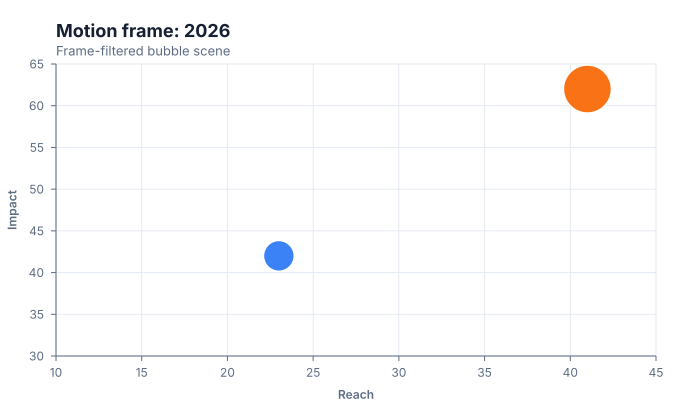

# Motion charts

<!-- FAMILY_PRESETS_START -->

## Integrated presets

This is the single manual for the `motion` family. Its canonical Quick API is `motion()` from `graflume`, and its representative portable mark is `motion`. The compatible names below remain callable, but they are modes or data-meaning presets rather than separate chart families.

| Compatible name | Quick API  | Mode      | Portable mark | Functional difference                            |
| --------------- | ---------- | --------- | ------------- | ------------------------------------------------ |
| Motion chart    | `motion()` | `default` | `motion`      | Uses the canonical presentation for this family. |

All presets reuse the same validation, normalization, scale, compiler, renderer-neutral Scene, interaction, accessibility, and serialization contracts. Direction, curve, layout, glyph, depth, financial-body, and indicator choices stay in function-free fields or options instead of selecting a second rendering engine. The remaining sections describe the canonical/default presentation unless a preset row above states a different behavior.

<details>
<summary>Open 1 compiled preset snapshot</summary>

| Preset       | Current compiled output                                                                    |
| ------------ | ------------------------------------------------------------------------------------------ |
| Motion chart | [](../assets/charts/motion.svg) |

</details>
<!-- FAMILY_PRESETS_END -->
Use the Motion compatibility type to render a chosen time frame as a bubble scene.

## Implemented appearance

This image is generated from the current Graflume `compile()` Scene, not a hand-drawn mockup.


## Quick API

`Graflume.motion()` creates the portable `motion` mark (or documented alias mapping) and accepts the common target, data, and options arguments.

```ts
Graflume.motion('#chart', data, {
  x: { field: 'income', type: 'quantitative' },
  y: { field: 'lifeExpectancy', type: 'quantitative' },
  mark: {
    fields: { size: 'population', color: 'country', time: 'year' },
    options: { frame: '2026' },
  },
});
```

## Portable ChartSpec mapping

`x`/`y` are positions; fields may name `size`, `color`, and `time`; `mark.options.frame` selects rows whose time value matches.

The same result can be created with `Graflume.create()` and `mark: { type: 'motion' }`. Named `mark.fields` and `mark.options` values are function-free and JSON-serializable, so they remain portable across JavaScript, future Python/R/Java builders, and stored specs.

## Data, ordering, and missing values

The selected frame is rendered with the bubble compiler. Change the frame with `chart.setSpec()` to build a controlled animation outside the portable spec.

Rows keep source order unless the compiler must establish a deterministic temporal or hierarchy order. Unsafe field names are rejected, callbacks are forbidden in portable specs, and invalid or unmappable values are skipped rather than evaluated.

## Styling and themes

The mark uses shared `fill`, `stroke`, `opacity`, `lineWidth`, `radius`, and `cornerRadius` options where the geometry makes them meaningful. Default colors, text, grid, focus, and palettes come from the active design-token theme and switch at runtime.

## Interaction and accessibility

Rendered datum shapes carry layer id, row index, and the original row for hover/click hit testing in the standard profile. Supply a concise `accessibility.label`, a useful `description`, and an adjacent text or table fallback. Canvas ARIA metadata does not replace keyboard-readable page content.

## Performance profiles

The same `standard`, `large`, `ultra`, and `auto` profiles apply. Complex layout marks currently favor deterministic bounded Scene output; aggregate or filter very large source data before rendering specialized diagrams.

## Current limitations

Automatic playback controls, trails, interpolation, and frame tweening are not implemented. The historical Flash Motion Chart is treated as a compatibility category.

## Runnable example and regression coverage

- [default-family CDN gallery](../../examples/cdn/complete-chart-types.html)
- [Chart catalog compile tests](../../tests/extended-chart-types.test.mjs)
- [Generated visual asset](../assets/charts/motion.svg)

[Back to chart guides](./README.md)
