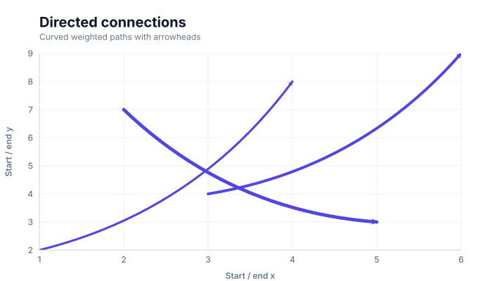
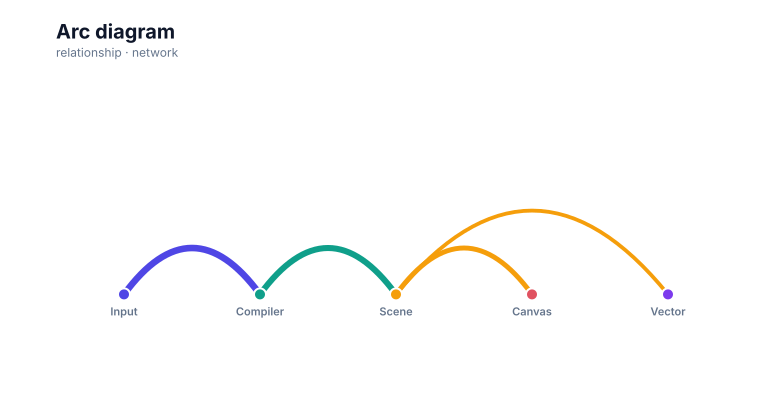
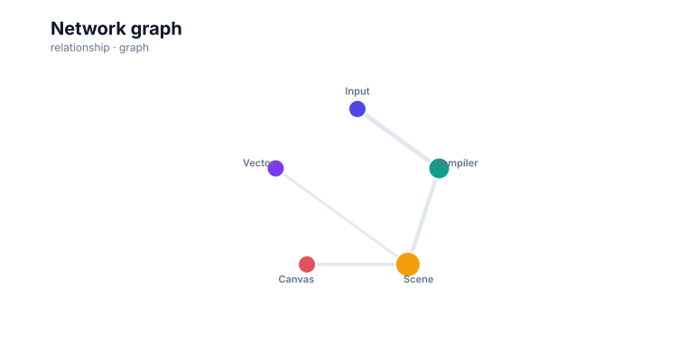
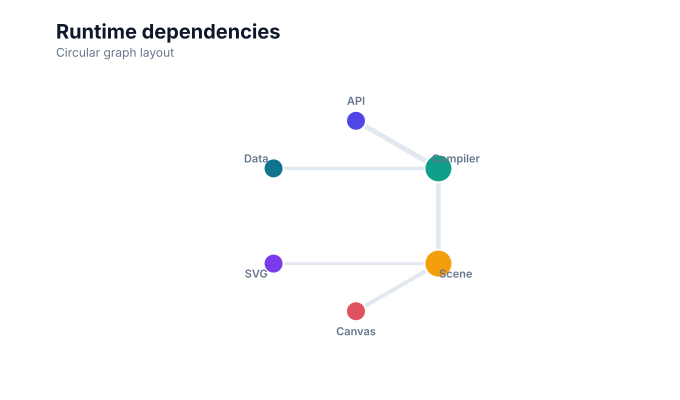

# Network chart

<!-- FAMILY_PRESETS_START -->

## Integrated presets

This is the single manual for the `network` family. Its canonical Quick API is `network()` from `graflume/complete`, and its representative portable mark is `graph`. The compatible names below remain callable, but they are modes or data-meaning presets rather than separate chart families.

| Compatible name                         | Quick API        | Mode            | Portable mark | Functional difference                                     |
| --------------------------------------- | ---------------- | --------------- | ------------- | --------------------------------------------------------- |
| [Graph chart](#variant-graph)           | `graph()`        | `node-link`     | `graph`       | Uses the deterministic node-link layout.                  |
| [Connection lines](#variant-lines)      | `lines()`        | `connections`   | `lines`       | Shows direct source-to-target connection paths.           |
| [Arc diagram](#variant-arc-diagram)     | `arcDiagram()`   | `arc-diagram`   | `arc-diagram` | Places nodes on one baseline and draws arcs between them. |
| [Network graph](#variant-network-graph) | `networkGraph()` | `network-graph` | `graph`       | Keeps the legacy network graph name for node-link mode.   |

All presets reuse the same validation, normalization, scale, compiler, renderer-neutral Scene, interaction, accessibility, and serialization contracts. Direction, curve, layout, glyph, depth, financial-body, and indicator choices stay in function-free fields or options instead of selecting a second rendering engine. The remaining manually maintained sections describe the canonical/default presentation unless a preset row above states a different behavior.

## Visual gallery

Every image below is generated from the current compiled Scene rather than drawn by hand. Select a name to jump to its data fields and implementation.

|                                                                                                                                                |                                                                                                                                                          |
| ---------------------------------------------------------------------------------------------------------------------------------------------- | -------------------------------------------------------------------------------------------------------------------------------------------------------- |
| **[Graph chart](#variant-graph)**<br>[](../assets/charts/graph.svg)                   | **[Connection lines](#variant-lines)**<br>[](../assets/charts/lines.svg)                   |
| **[Arc diagram](#variant-arc-diagram)**<br>[](../assets/charts/arc-diagram.svg) | **[Network graph](#variant-network-graph)**<br>[](../assets/charts/network-graph.svg) |

## Type-by-type implementation

The snippets are minimal runnable examples. Change `#chart` to the target element and expand the inline rows with your data. The Quick API applies the preset defaults while keeping the resulting specification function-free and serializable.

<a id="variant-graph"></a>

### Graph chart

Use this preset when entities and their connections are more important than a Cartesian axis. Uses the deterministic node-link layout.

- **Quick API:** `graph()`
- **Mode:** `node-link`
- **Portable mark:** `graph`
- **Required example fields:** `source`, `value`, `target`

```js
import { graph } from 'graflume/complete';

const data = [
  {
    source: 'Input',
    value: 9,
    target: 'Compiler',
  },
  {
    source: 'Compiler',
    value: 8,
    target: 'Scene',
  },
  {
    source: 'Scene',
    value: 6,
    target: 'Canvas',
  },
  {
    source: 'Scene',
    value: 4,
    target: 'Vector',
  },
];

graph('#chart', data, {
  x: {
    field: 'source',
    type: 'ordinal',
    title: 'source',
  },
  y: {
    field: 'value',
    type: 'quantitative',
    title: 'value',
  },
  title: {
    text: 'Graph chart',
    subtitle: 'network family · node-link mode',
  },
  accessibility: {
    label: 'Graph chart example',
    description: 'A compiled graph chart example using the network family.',
  },
  mark: {
    fields: {
      target: 'target',
      value: 'value',
    },
  },
});
```

<a id="variant-lines"></a>

### Connection lines

Use this preset when entities and their connections are more important than a Cartesian axis. Shows direct source-to-target connection paths.

- **Quick API:** `lines()`
- **Mode:** `connections`
- **Portable mark:** `lines`
- **Required example fields:** `source`, `value`, `target`

```js
import { lines } from 'graflume/complete';

const data = [
  {
    source: 'Input',
    value: 9,
    target: 'Compiler',
  },
  {
    source: 'Compiler',
    value: 8,
    target: 'Scene',
  },
  {
    source: 'Scene',
    value: 6,
    target: 'Canvas',
  },
  {
    source: 'Scene',
    value: 4,
    target: 'Vector',
  },
];

lines('#chart', data, {
  x: {
    field: 'source',
    type: 'ordinal',
    title: 'source',
  },
  y: {
    field: 'value',
    type: 'quantitative',
    title: 'value',
  },
  title: {
    text: 'Connection lines',
    subtitle: 'network family · connections mode',
  },
  accessibility: {
    label: 'Connection lines example',
    description: 'A compiled connection lines example using the network family.',
  },
  mark: {
    fields: {
      target: 'target',
    },
  },
});
```

<a id="variant-arc-diagram"></a>

### Arc diagram

Use this preset when entities and their connections are more important than a Cartesian axis. Places nodes on one baseline and draws arcs between them.

- **Quick API:** `arcDiagram()`
- **Mode:** `arc-diagram`
- **Portable mark:** `arc-diagram`
- **Required example fields:** `source`, `value`, `target`

```js
import { arcDiagram } from 'graflume/complete';

const data = [
  {
    source: 'Input',
    value: 9,
    target: 'Compiler',
  },
  {
    source: 'Compiler',
    value: 8,
    target: 'Scene',
  },
  {
    source: 'Scene',
    value: 6,
    target: 'Canvas',
  },
  {
    source: 'Scene',
    value: 4,
    target: 'Vector',
  },
];

arcDiagram('#chart', data, {
  x: {
    field: 'source',
    type: 'ordinal',
    title: 'source',
  },
  y: {
    field: 'value',
    type: 'quantitative',
    title: 'value',
  },
  title: {
    text: 'Arc diagram',
    subtitle: 'network family · arc-diagram mode',
  },
  accessibility: {
    label: 'Arc diagram example',
    description: 'A compiled arc diagram example using the network family.',
  },
  axes: {
    x: false,
    y: false,
  },
  mark: {
    fields: {
      target: 'target',
      value: 'value',
    },
  },
});
```

<a id="variant-network-graph"></a>

### Network graph

Use this preset when entities and their connections are more important than a Cartesian axis. Keeps the legacy network graph name for node-link mode.

- **Quick API:** `networkGraph()`
- **Mode:** `network-graph`
- **Portable mark:** `graph`
- **Required example fields:** `source`, `value`, `target`

```js
import { networkGraph } from 'graflume/complete';

const data = [
  {
    source: 'Input',
    value: 9,
    target: 'Compiler',
  },
  {
    source: 'Compiler',
    value: 8,
    target: 'Scene',
  },
  {
    source: 'Scene',
    value: 6,
    target: 'Canvas',
  },
  {
    source: 'Scene',
    value: 4,
    target: 'Vector',
  },
];

networkGraph('#chart', data, {
  x: {
    field: 'source',
    type: 'ordinal',
    title: 'source',
  },
  y: {
    field: 'value',
    type: 'quantitative',
    title: 'value',
  },
  title: {
    text: 'Network graph',
    subtitle: 'network family · network-graph mode',
  },
  accessibility: {
    label: 'Network graph example',
    description: 'A compiled network graph example using the network family.',
  },
  axes: {
    x: false,
    y: false,
  },
  mark: {
    fields: {
      target: 'target',
      value: 'value',
    },
  },
});
```

<!-- FAMILY_PRESETS_END -->



This guide documents the consolidated **Network chart** family. The image is generated from the actual compiled Scene used by the runtime renderer.

## When to use it

Show relationships among nodes while choosing node-link, arc, or direct connection geometry as a layout mode.

## Canonical Quick API

```ts
import { network } from 'graflume/complete';

network('#chart', data, {
  x: { field: 'source', type: 'nominal' },
  y: { field: 'value', type: 'quantitative' },
  mark: { fields: { target: 'target' }, options: { mode: 'arc' } },
});
```

## Data contract

Declare source and target fields and an optional weight. `network()` accepts `mark.options.mode` values `node-link`, `arc`, and `connections`. Missing required values skip only the affected row. Input order remains stable unless the selected layout documents a deterministic sort.

## Rendering and portability

Every preset normalizes into the same ChartSpec, validation, scale, compiler, renderer-neutral Scene, interaction, and accessibility pipeline. Mode differences use function-free `mark.fields` and `mark.options`; they do not create a second engine or a second top-level family.

## Styling and interaction

Use theme tokens or common `fill`, `stroke`, `opacity`, `lineWidth`, `radius`, and `cornerRadius` properties where the selected geometry supports them. Interactive datum shapes retain their source row and layer metadata; decorative labels, grids, and depth faces do not create duplicate targets.

## Accessibility and performance

Provide a concise `accessibility.label`, describe the principal comparison or structure, and pair Canvas output with the data-table fallback. Dense labels, relationship crossings, and multi-part interval geometry can produce several Scene nodes per row, so aggregate when individual marks stop adding analytical value.

## Verification

- Snapshot: [`docs/assets/charts/network.svg`](../assets/charts/network.svg)
- Runtime catalogs: [`src/catalog`](../../src/catalog)
- Catalog tests: [`tests`](../../tests)
