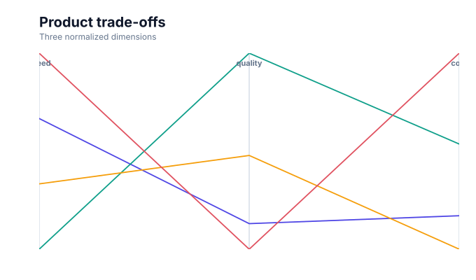

# Parallel coordinates

<!-- FAMILY_PRESETS_START -->

## Integrated presets

This is the single manual for the `parallel` family. Its canonical Quick API is `parallel()` from `graflume/complete`, and its representative portable mark is `parallel`. The compatible names below remain callable, but they are modes or data-meaning presets rather than separate chart families.

| Compatible name                           | Quick API    | Mode      | Portable mark | Functional difference                            |
| ----------------------------------------- | ------------ | --------- | ------------- | ------------------------------------------------ |
| [Parallel coordinates](#variant-parallel) | `parallel()` | `default` | `parallel`    | Uses the canonical presentation for this family. |

All presets reuse the same validation, normalization, scale, compiler, renderer-neutral Scene, interaction, accessibility, and serialization contracts. Direction, curve, layout, glyph, depth, financial-body, and indicator choices stay in function-free fields or options instead of selecting a second rendering engine. The remaining manually maintained sections describe the canonical/default presentation unless a preset row above states a different behavior.

## Visual gallery

Every image below is generated from the current compiled Scene rather than drawn by hand. Select a name to jump to its data fields and implementation.

|                                                                                                                                                         |     |
| ------------------------------------------------------------------------------------------------------------------------------------------------------- | --- |
| **[Parallel coordinates](#variant-parallel)**<br>[](../assets/charts/parallel.svg) |     |

## Type-by-type implementation

The snippets are minimal runnable examples. Change `#chart` to the target element and expand the inline rows with your data. The Quick API applies the preset defaults while keeping the resulting specification function-free and serializable.

<a id="variant-parallel"></a>

### Parallel coordinates

Use this preset when many quantitative dimensions must be compared for each row. Uses the canonical presentation for this family.

- **Quick API:** `parallel()`
- **Mode:** `default`
- **Portable mark:** `parallel`
- **Required example fields:** `name`, `speed`

```js
import { parallel } from 'graflume/complete';

const data = [
  {
    name: 'Alpha',
    speed: 82,
  },
  {
    name: 'Beta',
    speed: 66,
  },
  {
    name: 'Gamma',
    speed: 91,
  },
];

parallel('#chart', data, {
  x: {
    field: 'name',
    type: 'ordinal',
    title: 'name',
  },
  y: {
    field: 'speed',
    type: 'quantitative',
    title: 'speed',
  },
  title: {
    text: 'Parallel coordinates',
    subtitle: 'parallel family · default mode',
  },
  accessibility: {
    label: 'Parallel coordinates example',
    description: 'A compiled parallel coordinates example using the parallel family.',
  },
  mark: {
    options: {
      dimensions: ['speed', 'quality', 'cost'],
    },
  },
});
```

<!-- FAMILY_PRESETS_END -->

[Back to the chart guide index](./README.md)


> This image is generated from the actual renderer-neutral `compile()` Scene and checked for staleness in CI.

## When to use it

Use parallel coordinates to inspect multivariate profiles across several quantitative dimensions.

## Data contract

`mark.options.dimensions` is an array of two or more numeric field names. `x` normally identifies the row or series, while `y` may repeat the first numeric dimension.

### Named fields

`mark.fields.color` or `group` may provide a categorical palette key. Dimensions are declared in `mark.options.dimensions` because their count is dynamic.

### Portable options

`dimensions` controls axis order. Each dimension receives an independent finite min/max domain derived from its column.

## Quick API

The additional families are opt-in so the default browser and module entrypoints remain small.

```js
import { parallel } from 'graflume/complete';

parallel('#chart', products, {
  x: { field: 'product', type: 'nominal' },
  y: { field: 'speed', type: 'quantitative' },
  mark: { options: { dimensions: ['speed', 'quality', 'cost', 'reach'] } },
});
```

The same chart can be represented as a function-free portable specification with `mark.type: 'parallel'`.

## Rendering behavior

The compiler draws one vertical axis per dimension with min/max labels, then maps every valid row to an interactive polyline crossing those axes.

All output is compiled into the same renderer-neutral Scene used by Canvas and the checked SVG documentation snapshots. No second rendering engine is embedded.

## Interaction and accessibility

Each polyline carries a source row. Provide a data table and a description of the strongest trade-offs; exact values are hard to recover visually.

## Performance

Polyline count equals row count. Large data should use sampling, opacity reduction, density aggregation, or a future GPU renderer.

## Current limitations

Axis brushing, reordering, inversion, categorical dimensions, bundled polylines, density mode, and built-in legends are not implemented yet.
