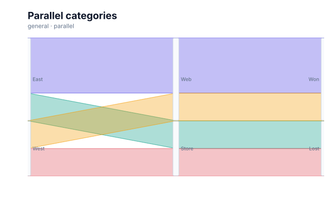

# Parallel coordinates

<!-- FAMILY_PRESETS_START -->

## Integrated presets

This is the single manual for the `parallel` family. Its canonical Quick API is `parallel()` from `graflume/complete`, and its representative portable mark is `parallel`. The compatible names below remain callable, but they are modes or data-meaning presets rather than separate chart families.

| Compatible name                                     | Quick API              | Mode         | Portable mark | Functional difference                                   |
| --------------------------------------------------- | ---------------------- | ------------ | ------------- | ------------------------------------------------------- |
| [Parallel coordinates](#variant-parallel)           | `parallel()`           | `default`    | `parallel`    | Uses the canonical presentation for this family.        |
| [Parallel categories](#variant-parallel-categories) | `parallelCategories()` | `categories` | `parallel`    | Aggregates categorical paths into proportional ribbons. |

All presets reuse the same validation, normalization, scale, compiler, renderer-neutral Scene, interaction, accessibility, and serialization contracts. Direction, curve, layout, glyph, depth, financial-body, and indicator choices stay in function-free fields or options instead of selecting a second rendering engine. The remaining manually maintained sections describe the canonical/default presentation unless a preset row above states a different behavior.

## Visual gallery

Every image below is generated from the current compiled Scene rather than drawn by hand. Select a name to jump to its data fields and implementation.

|                                                                                                                                                         |                                                                                                                                                                                        |
| ------------------------------------------------------------------------------------------------------------------------------------------------------- | -------------------------------------------------------------------------------------------------------------------------------------------------------------------------------------- |
| **[Parallel coordinates](#variant-parallel)**<br>[](../assets/charts/parallel.svg) | **[Parallel categories](#variant-parallel-categories)**<br>[](../assets/charts/parallel-categories.svg) |

## Type-by-type implementation

The snippets are minimal runnable examples. Change `#chart` to the target element and expand the inline rows with your data. Each example opts into Graflume's safe text-only tooltip with a chart-specific title and ordered fields; number and date formatting follows the declared `locale`. This family keeps `trigger: "mark"`, so the pointer must hit rendered datum geometry. Tooltip interaction is a pointer-only convenience, so keep a readable summary or data table available for exact values and keyboard access. The Quick API applies the preset defaults while keeping the resulting specification function-free and serializable.

Every family can opt into the Canvas [inspection viewport, fullscreen, reset, and PNG controls](./interactions.md). Inspection magnifies and translates the complete already-rendered chart, including its title and axes; it is not data-domain or GIS zoom. Generated examples intentionally leave playback off. Add discrete playback only after selecting a meaningful frame field and reviewing the family-specific capability table.

Every family also accepts the shared portable [legend, highlight, selection, and callout contract](./interactions.md#legends-highlights-selection-and-callouts). Automatic legend semantics follow the compiled mark and palette where they are unambiguous; use explicit function-free items for a domain-specific series or category legend. Static datum/layer/range highlights and text-only top-level callouts remain available even when a family has no Cartesian point geometry.

<a id="variant-parallel"></a>

### Parallel coordinates

Use this preset when many quantitative dimensions must be compared for each row. Uses the canonical presentation for this family.

- **Quick API:** `parallel()`
- **Mode:** `default`
- **Portable mark:** `parallel`
- **Required example fields:** `name`, `speed`, `quality`, `cost`

```js
import { parallel } from 'graflume/complete';

const data = [
  {
    name: 'Alpha',
    speed: 82,
    quality: 74,
    cost: 61,
  },
  {
    name: 'Beta',
    speed: 66,
    quality: 88,
    cost: 73,
  },
  {
    name: 'Gamma',
    speed: 91,
    quality: 69,
    cost: 54,
  },
];

parallel('#chart', data, {
  x: {
    field: 'name',
    type: 'ordinal',
    title: 'name',
  },
  y: {
    field: 'speed',
    type: 'quantitative',
    title: 'speed',
  },
  title: {
    text: 'Parallel coordinates',
    subtitle: 'parallel family · default mode',
  },
  accessibility: {
    label: 'Parallel coordinates example',
    description: 'A compiled parallel coordinates example using the parallel family.',
  },
  mark: {
    options: {
      mode: 'coordinates',
      dimensions: ['speed', 'quality', 'cost'],
    },
  },
  locale: 'en-US',
  interaction: {
    tooltip: {
      title: 'Parallel coordinates',
      fields: [
        {
          field: 'name',
          label: 'name',
          format: 'auto',
        },
        {
          field: 'speed',
          label: 'speed',
          format: 'number',
        },
        {
          field: 'quality',
          label: 'Quality',
          format: 'number',
        },
        {
          field: 'cost',
          label: 'Cost',
          format: 'number',
        },
      ],
      trigger: 'mark',
    },
  },
});
```

<a id="variant-parallel-categories"></a>

### Parallel categories

Use this preset when categorical stages and the frequency of each complete path must be compared. Aggregates categorical paths into proportional ribbons.

- **Quick API:** `parallelCategories()`
- **Mode:** `categories`
- **Portable mark:** `parallel`
- **Required example fields:** `region`, `value`, `channel`, `outcome`

```js
import { parallelCategories } from 'graflume/complete';

const data = [
  {
    region: 'East',
    value: 1,
    channel: 'Web',
    outcome: 'Won',
  },
  {
    region: 'East',
    value: 1,
    channel: 'Web',
    outcome: 'Won',
  },
  {
    region: 'East',
    value: 1,
    channel: 'Store',
    outcome: 'Lost',
  },
  {
    region: 'West',
    value: 1,
    channel: 'Web',
    outcome: 'Won',
  },
];

parallelCategories('#chart', data, {
  x: {
    field: 'region',
    type: 'ordinal',
    title: 'region',
  },
  y: {
    field: 'value',
    type: 'quantitative',
    title: 'value',
  },
  title: {
    text: 'Parallel categories',
    subtitle: 'parallel family · categories mode',
  },
  accessibility: {
    label: 'Parallel categories example',
    description: 'A compiled parallel categories example using the parallel family.',
  },
  mark: {
    options: {
      mode: 'categories',
      dimensions: ['region', 'channel', 'outcome'],
    },
  },
  locale: 'en-US',
  interaction: {
    tooltip: {
      title: 'Parallel categories',
      fields: [
        {
          field: 'region',
          label: 'region',
          format: 'auto',
        },
        {
          field: 'value',
          label: 'value',
          format: 'number',
        },
        {
          field: 'channel',
          label: 'Channel',
          format: 'auto',
        },
        {
          field: 'outcome',
          label: 'Outcome',
          format: 'auto',
        },
      ],
      trigger: 'mark',
    },
  },
});
```

<!-- FAMILY_PRESETS_END -->

[Back to the chart guide index](./README.md)


> This image is generated from the actual renderer-neutral `compile()` Scene and checked for staleness in CI.

## When to use it

Use parallel coordinates to inspect multivariate profiles across several quantitative dimensions.
Use parallel categories when the same question involves categorical stages and the frequency of
each path matters more than a per-row numeric profile.

## Data contract

`mark.options.dimensions` is an array of two or more field names. In the default `coordinates`
mode they should be numeric. In `categories` mode they are treated as categorical values and
complete rows are aggregated into unique paths. `x` normally identifies the row or first
category, while `y` may repeat the first numeric dimension or provide a portable value field.

### Named fields

`mark.fields.color` or `group` may provide a categorical palette key for coordinates. Dimensions
are declared in `mark.options.dimensions` because their count is dynamic. Parallel categories
derive the ribbon count from repeated complete category combinations.

### Portable options

`dimensions` controls axis order. Coordinate dimensions receive independent finite min/max
domains. Category blocks and ribbons use one shared count-to-pixel scale so the stacked flow
thickness is preserved at every axis.

## Quick API

The additional families are opt-in so the default browser and module entrypoints remain small.

```js
import { parallel, parallelCategories } from 'graflume/complete';

parallel('#chart', products, {
  x: { field: 'product', type: 'nominal' },
  y: { field: 'speed', type: 'quantitative' },
  mark: { options: { dimensions: ['speed', 'quality', 'cost', 'reach'] } },
});

parallelCategories('#category-chart', journeys, {
  x: { field: 'region', type: 'nominal' },
  y: { field: 'value', type: 'quantitative' },
  mark: {
    options: { mode: 'categories', dimensions: ['region', 'channel', 'outcome'] },
  },
});
```

The same chart can be represented as a function-free portable specification with `mark.type: 'parallel'`.

## Rendering behavior

The coordinate compiler draws one vertical axis per dimension with min/max labels, then maps every
valid row to an interactive polyline crossing those axes. The category compiler aggregates unique
paths into proportional ribbons and stacks each ribbon inside its category block without overlap.

All output is compiled into the same renderer-neutral Scene used by Canvas and the checked SVG documentation snapshots. No second rendering engine is embedded.

## Interaction and accessibility

Each polyline or aggregated ribbon carries a representative source row. Category ribbon tooltips
also expose the full path and aggregated count. Provide a data table and a description of the
strongest trade-offs; exact values are hard to recover visually.

## Performance

Coordinate output should use sampling or opacity reduction for large row counts. Category mode
limits the number of first-seen unique combinations deterministically from the active performance
profile; later occurrences of retained combinations still contribute to their counts. Categories
that are only present in combinations beyond that budget are omitted from the rendered summary.

## Current limitations

Axis brushing, drag reordering, inversion, bundled coordinate polylines, and density mode are not
implemented yet. The shared layer legend and explicit portable category items are available.
Categorical dimensions and proportional stacked ribbons are implemented through
`mode: 'categories'`; they are an aggregated view rather than a lossless replacement for an
unbounded high-cardinality table.
