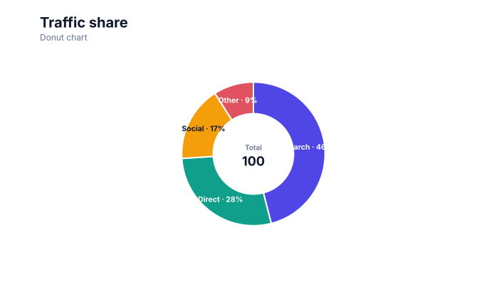
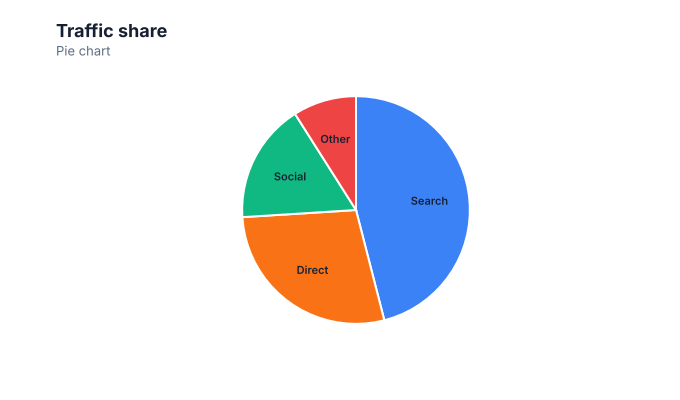
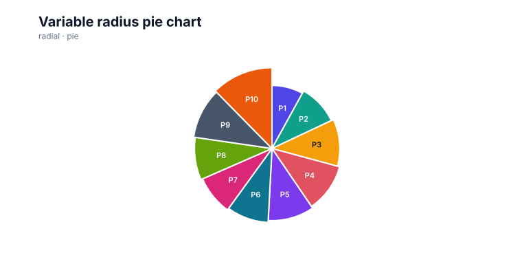

# Pie charts

<!-- FAMILY_PRESETS_START -->

## Integrated presets

This is the single manual for the `pie` family. Its canonical Quick API is `pie()` from `graflume`, and its representative portable mark is `pie`. The compatible names below remain callable, but they are modes or data-meaning presets rather than separate chart families.

| Compatible name                                    | Quick API       | Mode           | Portable mark  | Functional difference                                        |
| -------------------------------------------------- | --------------- | -------------- | -------------- | ------------------------------------------------------------ |
| [Donut chart](#variant-donut)                      | `donut()`       | `donut`        | `pie`          | Adds an inner radius and center summary to the pie geometry. |
| [Pie chart](#variant-pie)                          | `pie()`         | `default`      | `pie`          | Uses equal-radius sectors for part-to-whole comparison.      |
| [Variable radius pie chart](#variant-variable-pie) | `variablePie()` | `variable-pie` | `variable-pie` | Uses a second value to vary each sector radius.              |

All presets reuse the same validation, normalization, scale, compiler, renderer-neutral Scene, interaction, accessibility, and serialization contracts. Direction, curve, layout, glyph, depth, financial-body, and indicator choices stay in function-free fields or options instead of selecting a second rendering engine. The remaining manually maintained sections describe the canonical/default presentation unless a preset row above states a different behavior.

## Visual gallery

Every image below is generated from the current compiled Scene rather than drawn by hand. Select a name to jump to its data fields and implementation.

|                                                                                                                                                                               |                                                                                                                    |
| ----------------------------------------------------------------------------------------------------------------------------------------------------------------------------- | ------------------------------------------------------------------------------------------------------------------ |
| **[Donut chart](#variant-donut)**<br>[](../assets/charts/donut.svg)                                                  | **[Pie chart](#variant-pie)**<br>[](../assets/charts/pie.svg) |
| **[Variable radius pie chart](#variant-variable-pie)**<br>[](../assets/charts/variable-pie.svg) |                                                                                                                    |

## Type-by-type implementation

The snippets are minimal runnable examples. Change `#chart` to the target element and expand the inline rows with your data. The Quick API applies the preset defaults while keeping the resulting specification function-free and serializable.

<a id="variant-donut"></a>

### Donut chart

Use this preset when a small number of positive values form one meaningful whole. Adds an inner radius and center summary to the pie geometry.

- **Quick API:** `donut()`
- **Mode:** `donut`
- **Portable mark:** `pie`
- **Required example fields:** `category`, `value`

```js
import { donut } from 'graflume';

const data = [
  {
    category: 'Search',
    value: 46,
  },
  {
    category: 'Direct',
    value: 28,
  },
  {
    category: 'Social',
    value: 17,
  },
  {
    category: 'Other',
    value: 9,
  },
];

donut('#chart', data, {
  x: {
    field: 'category',
    type: 'ordinal',
    title: 'category',
  },
  y: {
    field: 'value',
    type: 'quantitative',
    title: 'value',
  },
  title: {
    text: 'Donut chart',
    subtitle: 'pie family · donut mode',
  },
  accessibility: {
    label: 'Donut chart example',
    description: 'A compiled donut chart example using the pie family.',
  },
  mark: {
    options: {
      innerRadius: 0.56,
    },
  },
});
```

<a id="variant-pie"></a>

### Pie chart

Use this preset when a small number of positive values form one meaningful whole. Uses equal-radius sectors for part-to-whole comparison.

- **Quick API:** `pie()`
- **Mode:** `default`
- **Portable mark:** `pie`
- **Required example fields:** `category`, `value`

```js
import { pie } from 'graflume';

const data = [
  {
    category: 'Search',
    value: 46,
  },
  {
    category: 'Direct',
    value: 28,
  },
  {
    category: 'Social',
    value: 17,
  },
  {
    category: 'Other',
    value: 9,
  },
];

pie('#chart', data, {
  x: {
    field: 'category',
    type: 'ordinal',
    title: 'category',
  },
  y: {
    field: 'value',
    type: 'quantitative',
    title: 'value',
  },
  title: {
    text: 'Pie chart',
    subtitle: 'pie family · default mode',
  },
  accessibility: {
    label: 'Pie chart example',
    description: 'A compiled pie chart example using the pie family.',
  },
  mark: {},
});
```

<a id="variant-variable-pie"></a>

### Variable radius pie chart

Use this preset when a small number of positive values form one meaningful whole. Uses a second value to vary each sector radius.

- **Quick API:** `variablePie()`
- **Mode:** `variable-pie`
- **Portable mark:** `variable-pie`
- **Required example fields:** `category`, `value`, `radius`

```js
import { variablePie } from 'graflume/complete';

const data = [
  {
    category: 'P1',
    value: 24,
    radius: 9,
  },
  {
    category: 'P2',
    value: 29.916,
    radius: 11,
  },
  {
    category: 'P3',
    value: 33.54,
    radius: 13,
  },
  {
    category: 'P4',
    value: 33.72,
    radius: 15,
  },
];

variablePie('#chart', data, {
  x: {
    field: 'category',
    type: 'ordinal',
    title: 'category',
  },
  y: {
    field: 'value',
    type: 'quantitative',
    title: 'value',
  },
  title: {
    text: 'Variable radius pie chart',
    subtitle: 'pie family · variable-pie mode',
  },
  accessibility: {
    label: 'Variable radius pie chart example',
    description: 'A compiled variable radius pie chart example using the pie family.',
  },
  axes: {
    x: false,
    y: false,
  },
  mark: {
    fields: {
      radius: 'radius',
    },
  },
});
```

<!-- FAMILY_PRESETS_END -->

Use a pie chart for a small number of positive part-to-whole values.

## Implemented appearance

This image is generated from the current Graflume `compile()` Scene, not a hand-drawn mockup.


## Quick API

`Graflume.pie()` creates the portable `pie` mark (or documented alias mapping) and accepts the common target, data, and options arguments.

```ts
Graflume.pie('#chart', data, {
  x: { field: 'channel', type: 'nominal' },
  y: { field: 'share', type: 'quantitative' },
});
```

## Portable ChartSpec mapping

`x` supplies labels and positive quantitative `y` values determine angles. Slice order follows input order.

The same result can be created with `Graflume.create()` and `mark: { type: 'pie' }`. Named `mark.fields` and `mark.options` values are function-free and JSON-serializable, so they remain portable across JavaScript, future Python/R/Java builders, and stored specs.

## Data, ordering, and missing values

The compiler emits closed polygonal arc paths with palette colors, percentage-aware labels, and whole-slice hit testing. Large slices use high-contrast internal labels; smaller visible slices use short leader lines. Non-positive values are omitted.

Rows keep source order unless the compiler must establish a deterministic temporal or hierarchy order. Unsafe field names are rejected, callbacks are forbidden in portable specs, and invalid or unmappable values are skipped rather than evaluated.

## Styling and themes

The mark uses shared `fill`, `stroke`, `opacity`, `lineWidth`, `radius`, and `cornerRadius` options where the geometry makes them meaningful. Default colors, text, grid, focus, and palettes come from the active design-token theme and switch at runtime.

## Interaction and accessibility

Rendered datum shapes carry layer id, row index, and the original row for hover/click hit testing in the standard profile. Supply a concise `accessibility.label`, a useful `description`, and an adjacent text or table fallback. Canvas ARIA metadata does not replace keyboard-readable page content.

## Performance profiles

The same `standard`, `large`, `ultra`, and `auto` profiles apply. Complex layout marks currently favor deterministic bounded Scene output; aggregate or filter very large source data before rendering specialized diagrams.

## Current limitations

Automatic collision solving for dense external labels, exploded slices, 3D, and hierarchical rings are not implemented yet. Use a small number of slices or lower `mark.options.labelLimit` for dense data.

## Runnable example and regression coverage

- [default-family CDN gallery](../../examples/cdn/complete-chart-types.html)
- [Chart catalog compile tests](../../tests/extended-chart-types.test.mjs)
- [Generated visual asset](../assets/charts/pie.svg)

[Back to chart guides](./README.md)
