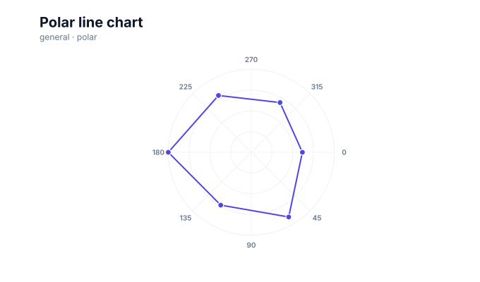
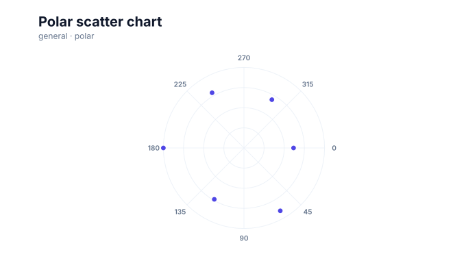
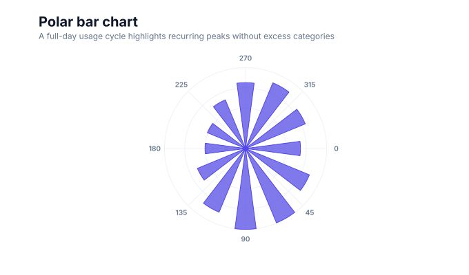

# Polar charts

<!-- FAMILY_PRESETS_START -->

## Integrated presets

This is the single manual for the `polar` family. Its canonical Quick API is `polar()` from `graflume/complete`, and its representative portable mark is `polar`. The compatible names below remain callable, but they are modes or data-meaning presets rather than separate chart families.

| Compatible name                               | Quick API        | Mode      | Portable mark | Functional difference                                                |
| --------------------------------------------- | ---------------- | --------- | ------------- | -------------------------------------------------------------------- |
| [Polar chart](#variant-polar)                 | `polar()`        | `default` | `polar`       | Uses an ordered radial line as the canonical polar presentation.     |
| [Radar chart](#variant-radar)                 | `radar()`        | `radar`   | `radar`       | Selects the `radar` presentation through the shared family pipeline. |
| [Polar line chart](#variant-polar-line)       | `polarLine()`    | `line`    | `polar`       | Connects values in angular order.                                    |
| [Polar scatter chart](#variant-polar-scatter) | `polarScatter()` | `scatter` | `polar`       | Shows radial points without a connecting path.                       |
| [Polar bar chart](#variant-polar-bar)         | `polarBar()`     | `bar`     | `polar`       | Uses angular sectors whose radius encodes value.                     |

All presets reuse the same validation, normalization, scale, compiler, renderer-neutral Scene, interaction, accessibility, and serialization contracts. Direction, curve, layout, glyph, depth, financial-body, and indicator choices stay in function-free fields or options instead of selecting a second rendering engine. The remaining manually maintained sections describe the canonical/default presentation unless a preset row above states a different behavior.

## Visual gallery

Every image below is generated from the current compiled Scene rather than drawn by hand. Select a name to jump to its data fields and implementation.

|                                                                                                                                                       |                                                                                                                                                                      |
| ----------------------------------------------------------------------------------------------------------------------------------------------------- | -------------------------------------------------------------------------------------------------------------------------------------------------------------------- |
| **[Polar chart](#variant-polar)**<br>[](../assets/charts/polar.svg)                          | **[Radar chart](#variant-radar)**<br>[](../assets/charts/radar.svg)                                         |
| **[Polar line chart](#variant-polar-line)**<br>[](../assets/charts/polar-line.svg) | **[Polar scatter chart](#variant-polar-scatter)**<br>[](../assets/charts/polar-scatter.svg) |
| **[Polar bar chart](#variant-polar-bar)**<br>[](../assets/charts/polar-bar.svg)      |                                                                                                                                                                      |

## Type-by-type implementation

The snippets are minimal runnable examples. Change `#chart` to the target element and expand the inline rows with your data. Each example opts into Graflume's safe text-only tooltip with a chart-specific title and ordered fields; number and date formatting follows the declared `locale`. This family keeps `trigger: "mark"`, so the pointer must hit rendered datum geometry. Pointer tooltip triggers remain a convenience; opt into `accessibility.table` and `accessibility.navigation` for the bounded native table and keyboard mark traversal, or provide a larger domain-specific table. The Quick API applies the preset defaults while keeping the resulting specification function-free and serializable.

Every family can opt into the Canvas [inspection viewport, fullscreen, reset, and PNG controls](./interactions.md). Inspection magnifies and translates the complete already-rendered chart, including its title and axes; it is not data-domain or GIS zoom. Generated examples intentionally leave playback off. Add discrete playback only after selecting a meaningful frame field and reviewing the family-specific capability table.

Every family also accepts the shared portable [legend, highlight, selection, and callout contract](./interactions.md#legends-highlights-selection-and-callouts). Automatic legend semantics follow the compiled mark and palette where they are unambiguous; use explicit function-free items for a domain-specific series or category legend. Static datum/layer/range highlights and text-only top-level callouts remain available even when a family has no Cartesian point geometry.

<a id="variant-polar"></a>

### Polar chart

Use this preset when angle and radius, or several normalized indicators, define the reading task. Uses an ordered radial line as the canonical polar presentation.

- **Quick API:** `polar()`
- **Mode:** `default`
- **Portable mark:** `polar`
- **Required example fields:** `angle`, `value`, `series`

```js
import { polar } from 'graflume/complete';

const data = [
  {
    angle: 0,
    value: 57.76,
    series: 'Daily cycle',
  },
  {
    angle: 30,
    value: 72.69,
    series: 'Daily cycle',
  },
  {
    angle: 60,
    value: 84.89,
    series: 'Daily cycle',
  },
  {
    angle: 90,
    value: 85.28,
    series: 'Daily cycle',
  },
];

polar('#chart', data, {
  x: {
    field: 'angle',
    type: 'quantitative',
    title: 'Angle',
  },
  y: {
    field: 'value',
    type: 'quantitative',
    title: 'Activity index',
  },
  title: {
    text: 'Polar chart',
    subtitle: 'polar family · default mode',
  },
  accessibility: {
    label:
      'Polar chart: A full-day usage cycle highlights recurring peaks without excess categories',
    description:
      'A full-day usage cycle highlights recurring peaks without excess categories. The example uses curated, deterministic data and exposes its exact values in a semantic table.',
  },
  axes: {
    x: false,
    y: false,
  },
  mark: {
    fields: {
      series: 'series',
    },
    options: {
      mode: 'line',
      closed: true,
    },
  },
  locale: 'en-US',
  interaction: {
    tooltip: {
      title: 'Polar chart',
      fields: [
        {
          field: 'angle',
          label: 'Angle',
          format: 'number',
        },
        {
          field: 'value',
          label: 'Activity index',
          format: 'number',
        },
        {
          field: 'series',
          label: 'Series',
          format: 'auto',
        },
      ],
      trigger: 'mark',
    },
  },
});
```

<a id="variant-radar"></a>

### Radar chart

Use this preset when angle and radius, or several normalized indicators, define the reading task. Selects the `radar` presentation through the shared family pipeline.

- **Quick API:** `radar()`
- **Mode:** `radar`
- **Portable mark:** `radar`
- **Required example fields:** `indicator`, `value`, `series`

```js
import { radar } from 'graflume/complete';

const data = [
  {
    indicator: 'Speed',
    value: 82,
    series: 'Current',
  },
  {
    indicator: 'Clarity',
    value: 74,
    series: 'Current',
  },
  {
    indicator: 'Coverage',
    value: 91,
    series: 'Current',
  },
  {
    indicator: 'Accessibility',
    value: 79,
    series: 'Current',
  },
];

radar('#chart', data, {
  x: {
    field: 'indicator',
    type: 'ordinal',
    title: 'Angle',
  },
  y: {
    field: 'value',
    type: 'quantitative',
    title: 'Activity index',
  },
  title: {
    text: 'Radar chart',
    subtitle: 'polar family · radar mode',
  },
  accessibility: {
    label:
      'Radar chart: A full-day usage cycle highlights recurring peaks without excess categories',
    description:
      'A full-day usage cycle highlights recurring peaks without excess categories. The example uses curated, deterministic data and exposes its exact values in a semantic table.',
  },
  axes: {
    x: false,
    y: false,
  },
  mark: {
    fields: {
      series: 'series',
    },
  },
  locale: 'en-US',
  interaction: {
    tooltip: {
      title: 'Radar chart',
      fields: [
        {
          field: 'indicator',
          label: 'Angle',
          format: 'auto',
        },
        {
          field: 'value',
          label: 'Activity index',
          format: 'number',
        },
        {
          field: 'series',
          label: 'Series',
          format: 'auto',
        },
      ],
      trigger: 'mark',
    },
  },
});
```

<a id="variant-polar-line"></a>

### Polar line chart

Use this preset when angle and radius, or several normalized indicators, define the reading task. Connects values in angular order.

- **Quick API:** `polarLine()`
- **Mode:** `line`
- **Portable mark:** `polar`
- **Required example fields:** `angle`, `value`, `series`

```js
import { polarLine } from 'graflume/complete';

const data = [
  {
    angle: 0,
    value: 57.76,
    series: 'Daily cycle',
  },
  {
    angle: 30,
    value: 72.69,
    series: 'Daily cycle',
  },
  {
    angle: 60,
    value: 84.89,
    series: 'Daily cycle',
  },
  {
    angle: 90,
    value: 85.28,
    series: 'Daily cycle',
  },
];

polarLine('#chart', data, {
  x: {
    field: 'angle',
    type: 'quantitative',
    title: 'Angle',
  },
  y: {
    field: 'value',
    type: 'quantitative',
    title: 'Activity index',
  },
  title: {
    text: 'Polar line chart',
    subtitle: 'polar family · line mode',
  },
  accessibility: {
    label:
      'Polar line chart: A full-day usage cycle highlights recurring peaks without excess categories',
    description:
      'A full-day usage cycle highlights recurring peaks without excess categories. The example uses curated, deterministic data and exposes its exact values in a semantic table.',
  },
  axes: {
    x: false,
    y: false,
  },
  mark: {
    fields: {
      series: 'series',
    },
    options: {
      mode: 'line',
      closed: true,
    },
  },
  locale: 'en-US',
  interaction: {
    tooltip: {
      title: 'Polar line chart',
      fields: [
        {
          field: 'angle',
          label: 'Angle',
          format: 'number',
        },
        {
          field: 'value',
          label: 'Activity index',
          format: 'number',
        },
        {
          field: 'series',
          label: 'Series',
          format: 'auto',
        },
      ],
      trigger: 'mark',
    },
  },
});
```

<a id="variant-polar-scatter"></a>

### Polar scatter chart

Use this preset when angle and radius, or several normalized indicators, define the reading task. Shows radial points without a connecting path.

- **Quick API:** `polarScatter()`
- **Mode:** `scatter`
- **Portable mark:** `polar`
- **Required example fields:** `angle`, `value`, `series`

```js
import { polarScatter } from 'graflume/complete';

const data = [
  {
    angle: 0,
    value: 57.76,
    series: 'Daily cycle',
  },
  {
    angle: 30,
    value: 72.69,
    series: 'Daily cycle',
  },
  {
    angle: 60,
    value: 84.89,
    series: 'Daily cycle',
  },
  {
    angle: 90,
    value: 85.28,
    series: 'Daily cycle',
  },
];

polarScatter('#chart', data, {
  x: {
    field: 'angle',
    type: 'quantitative',
    title: 'Angle',
  },
  y: {
    field: 'value',
    type: 'quantitative',
    title: 'Activity index',
  },
  title: {
    text: 'Polar scatter chart',
    subtitle: 'polar family · scatter mode',
  },
  accessibility: {
    label:
      'Polar scatter chart: A full-day usage cycle highlights recurring peaks without excess categories',
    description:
      'A full-day usage cycle highlights recurring peaks without excess categories. The example uses curated, deterministic data and exposes its exact values in a semantic table.',
  },
  axes: {
    x: false,
    y: false,
  },
  mark: {
    fields: {
      series: 'series',
    },
    options: {
      mode: 'scatter',
      closed: true,
    },
  },
  locale: 'en-US',
  interaction: {
    tooltip: {
      title: 'Polar scatter chart',
      fields: [
        {
          field: 'angle',
          label: 'Angle',
          format: 'number',
        },
        {
          field: 'value',
          label: 'Activity index',
          format: 'number',
        },
        {
          field: 'series',
          label: 'Series',
          format: 'auto',
        },
      ],
      trigger: 'mark',
    },
  },
});
```

<a id="variant-polar-bar"></a>

### Polar bar chart

Use this preset when angle and radius, or several normalized indicators, define the reading task. Uses angular sectors whose radius encodes value.

- **Quick API:** `polarBar()`
- **Mode:** `bar`
- **Portable mark:** `polar`
- **Required example fields:** `angle`, `value`, `series`

```js
import { polarBar } from 'graflume/complete';

const data = [
  {
    angle: 0,
    value: 57.76,
    series: 'Daily cycle',
  },
  {
    angle: 30,
    value: 72.69,
    series: 'Daily cycle',
  },
  {
    angle: 60,
    value: 84.89,
    series: 'Daily cycle',
  },
  {
    angle: 90,
    value: 85.28,
    series: 'Daily cycle',
  },
];

polarBar('#chart', data, {
  x: {
    field: 'angle',
    type: 'quantitative',
    title: 'Angle',
  },
  y: {
    field: 'value',
    type: 'quantitative',
    title: 'Activity index',
  },
  title: {
    text: 'Polar bar chart',
    subtitle: 'polar family · bar mode',
  },
  accessibility: {
    label:
      'Polar bar chart: A full-day usage cycle highlights recurring peaks without excess categories',
    description:
      'A full-day usage cycle highlights recurring peaks without excess categories. The example uses curated, deterministic data and exposes its exact values in a semantic table.',
  },
  axes: {
    x: false,
    y: false,
  },
  mark: {
    fields: {
      series: 'series',
    },
    options: {
      mode: 'bar',
      closed: true,
    },
  },
  locale: 'en-US',
  interaction: {
    tooltip: {
      title: 'Polar bar chart',
      fields: [
        {
          field: 'angle',
          label: 'Angle',
          format: 'number',
        },
        {
          field: 'value',
          label: 'Activity index',
          format: 'number',
        },
        {
          field: 'series',
          label: 'Series',
          format: 'auto',
        },
      ],
      trigger: 'mark',
    },
  },
});
```

<!-- FAMILY_PRESETS_END -->

The `polar` family places values by angle and radius. It integrates line, point, area, radial-bar, and radar-profile presentations while preserving the legacy `radar()` Quick API.

## Data contract

The `x` field supplies degrees by default, radians when requested, or ordered category labels. The quantitative `y` field supplies radius. An optional series field separates multiple paths or profiles.

## Styling and interaction

Rings and spokes are renderer-neutral Scene nodes. Lines, points, areas, and bars accept the shared fill, stroke, opacity, radius, and line options. Every datum mark participates in native hit testing; grid geometry does not.

## Accessibility and limits

Provide a readable summary for profile comparisons and preserve the input table for exact values. Polar inspection magnifies the compiled Canvas; it does not change the angular or radial data domains. Series are grouped in one pass. Point, line-point, and bar output share chart-wide performance quotas, categorical spokes are deterministically bounded rather than growing without limit, and an explicit bar angle is clamped to one full turn before arc allocation.

## Verification

The integrated presets compile to distinct line, point, area, bar, and legacy radar geometry in the catalog regression suite.
