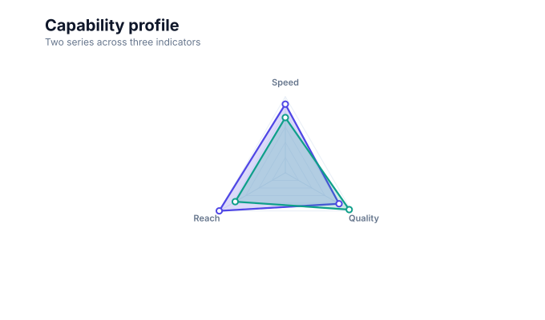

# Radar charts

<!-- FAMILY_PRESETS_START -->

## Integrated presets

This is the single manual for the `radar` family. Its canonical Quick API is `radar()` from `graflume/complete`, and its representative portable mark is `radar`. The compatible names below remain callable, but they are modes or data-meaning presets rather than separate chart families.

| Compatible name               | Quick API | Mode      | Portable mark | Functional difference                            |
| ----------------------------- | --------- | --------- | ------------- | ------------------------------------------------ |
| [Radar chart](#variant-radar) | `radar()` | `default` | `radar`       | Uses the canonical presentation for this family. |

All presets reuse the same validation, normalization, scale, compiler, renderer-neutral Scene, interaction, accessibility, and serialization contracts. Direction, curve, layout, glyph, depth, financial-body, and indicator choices stay in function-free fields or options instead of selecting a second rendering engine. The remaining manually maintained sections describe the canonical/default presentation unless a preset row above states a different behavior.

## Visual gallery

Every image below is generated from the current compiled Scene rather than drawn by hand. Select a name to jump to its data fields and implementation.

|                                                                                                                              |     |
| ---------------------------------------------------------------------------------------------------------------------------- | --- |
| **[Radar chart](#variant-radar)**<br>[](../assets/charts/radar.svg) |     |

## Type-by-type implementation

The snippets are minimal runnable examples. Change `#chart` to the target element and expand the inline rows with your data. Each example opts into Graflume's safe text-only tooltip with a chart-specific title and ordered fields; number and date formatting follows the declared `locale`. This family keeps `trigger: "mark"`, so the pointer must hit rendered datum geometry. Tooltip interaction is a pointer-only convenience, so keep a readable summary or data table available for exact values and keyboard access. The Quick API applies the preset defaults while keeping the resulting specification function-free and serializable.

<a id="variant-radar"></a>

### Radar chart

Use this preset when several normalized indicators must be compared as a profile. Uses the canonical presentation for this family.

- **Quick API:** `radar()`
- **Mode:** `default`
- **Portable mark:** `radar`
- **Required example fields:** `indicator`, `value`, `series`

```js
import { radar } from 'graflume/complete';

const data = [
  {
    indicator: 'Speed',
    value: 82,
    series: 'Alpha',
  },
  {
    indicator: 'Quality',
    value: 74,
    series: 'Alpha',
  },
  {
    indicator: 'Reach',
    value: 91,
    series: 'Alpha',
  },
  {
    indicator: 'Speed',
    value: 66,
    series: 'Beta',
  },
];

radar('#chart', data, {
  x: {
    field: 'indicator',
    type: 'ordinal',
    title: 'indicator',
  },
  y: {
    field: 'value',
    type: 'quantitative',
    title: 'value',
  },
  title: {
    text: 'Radar chart',
    subtitle: 'radar family · default mode',
  },
  accessibility: {
    label: 'Radar chart example',
    description: 'A compiled radar chart example using the radar family.',
  },
  mark: {
    fields: {
      series: 'series',
    },
  },
  locale: 'en-US',
  interaction: {
    tooltip: {
      title: 'Radar chart',
      fields: [
        {
          field: 'indicator',
          label: 'indicator',
          format: 'auto',
        },
        {
          field: 'value',
          label: 'value',
          format: 'number',
        },
        {
          field: 'series',
          label: 'Series',
          format: 'auto',
        },
      ],
      trigger: 'mark',
    },
  },
});
```

<!-- FAMILY_PRESETS_END -->

[Back to the chart guide index](./README.md)


> This image is generated from the actual renderer-neutral `compile()` Scene and checked for staleness in CI.

## When to use it

Use a radar chart to compare several normalized indicators across a small number of series.

## Data contract

`x` names the indicator, `y` supplies its numeric value, and `mark.fields.series` identifies the series. At least three distinct indicators are required.

### Named fields

`series` groups rows into polygons. The primary `x` and `y` encodings supply indicator and value.

### Portable options

`max` fixes the radial maximum and `rings` controls 1–8 reference polygons. Without `max`, the compiler derives a positive maximum from the data.

## Quick API

The additional families are opt-in so the default browser and module entrypoints remain small.

```js
import { radar } from 'graflume/complete';

radar('#chart', data, {
  x: { field: 'indicator', type: 'nominal' },
  y: { field: 'value', type: 'quantitative' },
  mark: { fields: { series: 'series' }, options: { max: 100, rings: 5 } },
});
```

The same chart can be represented as a function-free portable specification with `mark.type: 'radar'`.

## Rendering behavior

The compiler creates renderer-neutral polygon grids, radial axes, labels, translucent series areas, outlines, and interactive data points. Each series follows the first-seen indicator order.

All output is compiled into the same renderer-neutral Scene used by Canvas and the checked SVG documentation snapshots. No second rendering engine is embedded.

## Interaction and accessibility

Each visible point carries its original row for hover and click hit testing. Provide an accessibility label and a textual table fallback when exact multi-axis comparison matters.

## Performance

Scene size grows with indicators × series. Keep the number of axes and polygons modest; dense radar overlays become difficult to read before rendering cost becomes the main constraint.

## Current limitations

Axis-specific maxima, negative radial domains, built-in legends, polygon-label collision solving, and drag editing are not implemented yet.
