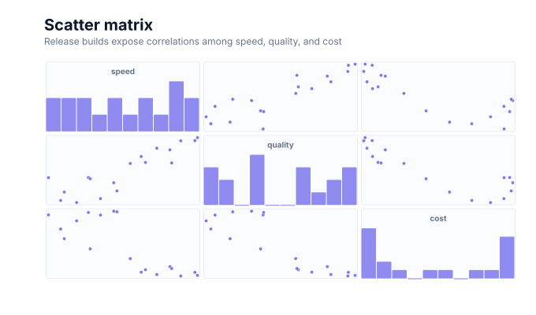

# Scatter matrix charts

<!-- FAMILY_PRESETS_START -->

## Integrated presets

This is the single manual for the `scatter-matrix` family. Its canonical Quick API is `scatterMatrix()` from `graflume/complete`, and its representative portable mark is `scatter-matrix`. The compatible names below remain callable, but they are modes or data-meaning presets rather than separate chart families.

| Compatible name                           | Quick API         | Mode      | Portable mark    | Functional difference                                     |
| ----------------------------------------- | ----------------- | --------- | ---------------- | --------------------------------------------------------- |
| [Scatter matrix](#variant-scatter-matrix) | `scatterMatrix()` | `default` | `scatter-matrix` | Combines diagonal histograms with pairwise scatter cells. |

All presets reuse the same validation, normalization, scale, compiler, renderer-neutral Scene, interaction, accessibility, and serialization contracts. Direction, curve, layout, glyph, depth, financial-body, and indicator choices stay in function-free fields or options instead of selecting a second rendering engine. The remaining manually maintained sections describe the canonical/default presentation unless a preset row above states a different behavior.

## Visual gallery

Every image below is generated from the current compiled Scene rather than drawn by hand. Select a name to jump to its data fields and implementation.

|                                                                                                                                                               |     |
| ------------------------------------------------------------------------------------------------------------------------------------------------------------- | --- |
| **[Scatter matrix](#variant-scatter-matrix)**<br>[](../assets/charts/scatter-matrix.svg) |     |

## Type-by-type implementation

The snippets are minimal runnable examples. Change `#chart` to the target element and expand the inline rows with your data. Each example opts into Graflume's safe text-only tooltip with a chart-specific title and ordered fields; number and date formatting follows the declared `locale`. This family keeps `trigger: "mark"`, so the pointer must hit rendered datum geometry. Pointer tooltip triggers remain a convenience; opt into `accessibility.table` and `accessibility.navigation` for the bounded native table and keyboard mark traversal, or provide a larger domain-specific table. The Quick API applies the preset defaults while keeping the resulting specification function-free and serializable.

Every family can opt into the Canvas [inspection viewport, fullscreen, reset, and PNG controls](./interactions.md). Inspection magnifies and translates the complete already-rendered chart, including its title and axes; it is not data-domain or GIS zoom. Generated examples intentionally leave playback off. Add discrete playback only after selecting a meaningful frame field and reviewing the family-specific capability table.

Every family also accepts the shared portable [legend, highlight, selection, and callout contract](./interactions.md#legends-highlights-selection-and-callouts). Automatic legend semantics follow the compiled mark and palette where they are unambiguous; use explicit function-free items for a domain-specific series or category legend. Static datum/layer/range highlights and text-only top-level callouts remain available even when a family has no Cartesian point geometry.

<a id="variant-scatter-matrix"></a>

### Scatter matrix

Use this preset when several quantitative dimensions require pairwise comparison. Combines diagonal histograms with pairwise scatter cells.

- **Quick API:** `scatterMatrix()`
- **Mode:** `default`
- **Portable mark:** `scatter-matrix`
- **Required example fields:** `speed`, `quality`, `cost`

```js
import { scatterMatrix } from 'graflume/complete';

const data = [
  {
    speed: 82,
    quality: 74,
    cost: 61,
  },
  {
    speed: 66,
    quality: 88,
    cost: 73,
  },
  {
    speed: 91,
    quality: 69,
    cost: 54,
  },
  {
    speed: 75,
    quality: 81,
    cost: 67,
  },
];

scatterMatrix('#chart', data, {
  x: {
    field: 'speed',
    type: 'quantitative',
    title: 'speed',
  },
  y: {
    field: 'quality',
    type: 'quantitative',
    title: 'quality',
  },
  title: {
    text: 'Scatter matrix',
    subtitle: 'scatter-matrix family · default mode',
  },
  accessibility: {
    label: 'Scatter matrix example',
    description: 'A compiled scatter matrix example using the scatter-matrix family.',
  },
  mark: {
    options: {
      dimensions: ['speed', 'quality', 'cost'],
    },
  },
  locale: 'en-US',
  interaction: {
    tooltip: {
      title: 'Scatter matrix',
      fields: [
        {
          field: 'speed',
          label: 'speed',
          format: 'number',
        },
        {
          field: 'quality',
          label: 'quality',
          format: 'number',
        },
        {
          field: 'cost',
          label: 'Cost',
          format: 'number',
        },
      ],
      trigger: 'mark',
    },
  },
});
```

<!-- FAMILY_PRESETS_END -->

The `scatter-matrix` family compares several quantitative dimensions in a square matrix of pairwise plots.

## Data contract

List quantitative field names in `mark.options.dimensions`. The diagonal shows compact one-dimensional histograms; off-diagonal cells show pairwise scatter points. Rows missing either field are skipped only in the affected cell.

## Styling and interaction

Cell frames, diagonal bins, labels, and points are compiled through the shared Scene pipeline. Off-diagonal points remain row-addressable for native hit testing and tooltips.

## Performance and limits

The number of cells grows with the square of the dimension count and dimensions are capped at eight. Off-diagonal cells share one chart-wide `maxPointMarks` budget: the compiler assigns a deterministic base-plus-remainder quota to every pair and samples valid original rows evenly within that quota. The limit therefore applies to the complete matrix, not independently to each cell.

## Verification

Tests assert the full cell matrix, diagonal rectangles, off-diagonal interactive points, and an exact 8,000-point `ultra` result for 1,000 rows across eight dimensions.
