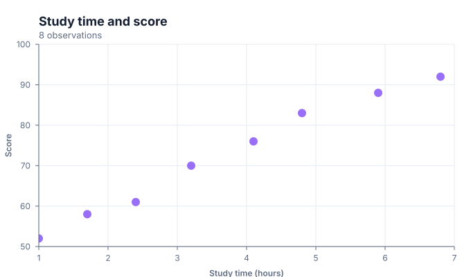
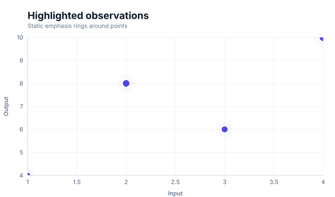
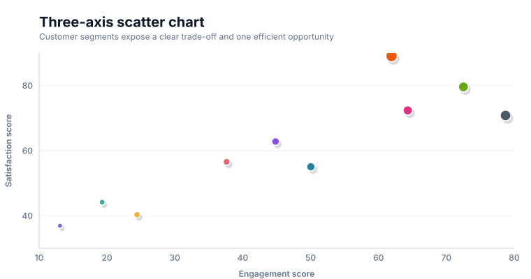

# Scatter charts

<!-- FAMILY_PRESETS_START -->

## Integrated presets

This is the single manual for the `scatter` family. Its canonical Quick API is `scatter()` from `graflume`, and its representative portable mark is `point`. The compatible names below remain callable, but they are modes or data-meaning presets rather than separate chart families.

| Compatible name                                 | Quick API         | Mode         | Portable mark    | Functional difference                                 |
| ----------------------------------------------- | ----------------- | ------------ | ---------------- | ----------------------------------------------------- |
| [Scatter chart](#variant-scatter)               | `scatter()`       | `default`    | `point`          | Uses ordinary coordinate points.                      |
| [Effect scatter chart](#variant-effect-scatter) | `effectScatter()` | `emphasis`   | `effect-scatter` | Adds a portable emphasis halo to selected points.     |
| [Three-axis scatter chart](#variant-scatter-3d) | `scatter3d()`     | `scatter-3d` | `scatter-3d`     | Projects a third channel into portable 2D depth cues. |

All presets reuse the same validation, normalization, scale, compiler, renderer-neutral Scene, interaction, accessibility, and serialization contracts. Direction, curve, layout, glyph, depth, financial-body, and indicator choices stay in function-free fields or options instead of selecting a second rendering engine. The remaining manually maintained sections describe the canonical/default presentation unless a preset row above states a different behavior.

## Visual gallery

Every image below is generated from the current compiled Scene rather than drawn by hand. Select a name to jump to its data fields and implementation.

|                                                                                                                                                                       |                                                                                                                                                                           |
| --------------------------------------------------------------------------------------------------------------------------------------------------------------------- | ------------------------------------------------------------------------------------------------------------------------------------------------------------------------- |
| **[Scatter chart](#variant-scatter)**<br>[](../assets/charts/scatter.svg)                                | **[Effect scatter chart](#variant-effect-scatter)**<br>[](../assets/charts/effect-scatter.svg) |
| **[Three-axis scatter chart](#variant-scatter-3d)**<br>[](../assets/charts/scatter-3d.svg) |                                                                                                                                                                           |

## Type-by-type implementation

The snippets are minimal runnable examples. Change `#chart` to the target element and expand the inline rows with your data. The Quick API applies the preset defaults while keeping the resulting specification function-free and serializable.

<a id="variant-scatter"></a>

### Scatter chart

Use this preset when the relationship between quantitative coordinates must be inspected. Uses ordinary coordinate points.

- **Quick API:** `scatter()`
- **Mode:** `default`
- **Portable mark:** `point`
- **Required example fields:** `x`, `y`

```js
import { scatter } from 'graflume';

const data = [
  {
    x: 12,
    y: 42,
  },
  {
    x: 24,
    y: 55,
  },
  {
    x: 38,
    y: 33,
  },
  {
    x: 51,
    y: 68,
  },
];

scatter('#chart', data, {
  x: {
    field: 'x',
    type: 'quantitative',
    title: 'x',
  },
  y: {
    field: 'y',
    type: 'quantitative',
    title: 'y',
  },
  title: {
    text: 'Scatter chart',
    subtitle: 'scatter family · default mode',
  },
  accessibility: {
    label: 'Scatter chart example',
    description: 'A compiled scatter chart example using the scatter family.',
  },
});
```

<a id="variant-effect-scatter"></a>

### Effect scatter chart

Use this preset when the relationship between quantitative coordinates must be inspected. Adds a portable emphasis halo to selected points.

- **Quick API:** `effectScatter()`
- **Mode:** `emphasis`
- **Portable mark:** `effect-scatter`
- **Required example fields:** `x`, `y`, `size`, `group`

```js
import { effectScatter } from 'graflume/complete';

const data = [
  {
    x: 12,
    y: 42,
    size: 20,
    group: 'A',
  },
  {
    x: 24,
    y: 55,
    size: 85,
    group: 'B',
  },
  {
    x: 38,
    y: 33,
    size: 55,
    group: 'A',
  },
  {
    x: 51,
    y: 68,
    size: 120,
    group: 'C',
  },
];

effectScatter('#chart', data, {
  x: {
    field: 'x',
    type: 'quantitative',
    title: 'x',
  },
  y: {
    field: 'y',
    type: 'quantitative',
    title: 'y',
  },
  title: {
    text: 'Effect scatter chart',
    subtitle: 'scatter family · emphasis mode',
  },
  accessibility: {
    label: 'Effect scatter chart example',
    description: 'A compiled effect scatter chart example using the scatter family.',
  },
  mark: {
    fields: {
      size: 'size',
      color: 'group',
    },
  },
});
```

<a id="variant-scatter-3d"></a>

### Three-axis scatter chart

Use this preset when the relationship between quantitative coordinates must be inspected. Projects a third channel into portable 2D depth cues.

- **Quick API:** `scatter3d()`
- **Mode:** `scatter-3d`
- **Portable mark:** `scatter-3d`
- **Required example fields:** `value`, `high`, `z`

```js
import { scatter3d } from 'graflume/complete';

const data = [
  {
    value: 24,
    high: 33,
    z: 5,
  },
  {
    value: 29.916,
    high: 34.1,
    z: 6,
  },
  {
    value: 33.54,
    high: 35.2,
    z: 7,
  },
  {
    value: 33.72,
    high: 36.3,
    z: 8,
  },
];

scatter3d('#chart', data, {
  x: {
    field: 'value',
    type: 'quantitative',
    title: 'value',
  },
  y: {
    field: 'high',
    type: 'quantitative',
    title: 'high',
  },
  title: {
    text: 'Three-axis scatter chart',
    subtitle: 'scatter family · scatter-3d mode',
  },
  accessibility: {
    label: 'Three-axis scatter chart example',
    description: 'A compiled three-axis scatter chart example using the scatter family.',
  },
  mark: {
    fields: {
      z: 'z',
    },
  },
});
```

<!-- FAMILY_PRESETS_END -->

Use a scatter chart to explore the relationship, clustering, spread, or outliers between two quantitative fields. In Graflume, `scatter()` is an ergonomic alias for the portable `point` mark.

## Implemented appearance

The current point compiler renders one circle for every valid x/y pair. This snapshot uses the same canonical `point` mark produced by `scatter()`.


## Quick API

```ts
import { scatter } from 'graflume';

const chart = scatter('#chart', data, {
  title: 'Study time and score',
  x: {
    field: 'hours',
    type: 'quantitative',
    title: 'Study time (hours)',
    scale: { zero: true, nice: true },
  },
  y: {
    field: 'score',
    type: 'quantitative',
    title: 'Score',
    scale: { zero: false, nice: true },
  },
  mark: {
    fill: '#7c3aed',
    stroke: '#ffffff',
    lineWidth: 2,
    radius: 7,
    opacity: 0.88,
  },
});
```

`point()` accepts the same options:

```ts
import { point } from 'graflume';

point('#chart', data, options);
```

## Portable ChartSpec

There is no `scatter` portable mark in `ChartSpec 0.1`. Serialize the chart as `point`:

```json
{
  "specVersion": "0.1",
  "data": [
    { "hours": 1, "score": 52 },
    { "hours": 2.5, "score": 64 },
    { "hours": 4, "score": 79 }
  ],
  "mark": {
    "type": "point",
    "fill": "#7c3aed",
    "radius": 7
  },
  "x": { "field": "hours", "type": "quantitative" },
  "y": { "field": "score", "type": "quantitative" }
}
```

This keeps browser, server, AI, and future Python/R/Java builders on one canonical contract.

## Data behavior

- A circle is rendered for each row with valid, mappable x and y values.
- Rows with a missing or invalid pair are skipped without changing the original row indices.
- Quantitative x/y fields are the standard scatter configuration; temporal fields are also accepted by the shared scale runtime.
- `scale.zero` is opt-in for points, allowing a focused observed domain by default.
- Point order follows input order, but visual position is determined by the scales.

## Interaction and large data

Each circle is a structured hover/click target in the standard profile:

```ts
chart.on('hover', ({ hit }) => {
  if (hit) console.log(hit.datum.rowIndex, hit.datum.datum);
});
```

The standard profile renders at most 25,000 point marks. Large and ultra profiles apply stronger bounds and disable per-point hit testing. For dense clouds, binning, hexbin, density, or WebGL rendering is planned but not yet implemented.

## Current limitations

- one shared radius and style per point layer;
- no field encoding for color, radius, shape, or opacity;
- no jitter, beeswarm, regression, density, hexbin, or brushing transform;
- no spatial index or GPU picking;
- no native legend/tooltip;
- no WebGL renderer yet.

## Runnable examples and tests

- [chart type gallery](../../examples/cdn/chart-types.html)
- [scatter regression test](../../tests/chart-types.test.mjs)

[Back to chart guides](./README.md)
