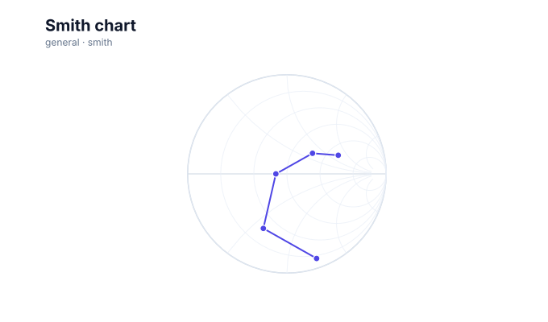

# Smith charts

<!-- FAMILY_PRESETS_START -->

## Integrated presets

This is the single manual for the `smith` family. Its canonical Quick API is `smith()` from `graflume/complete`, and its representative portable mark is `smith`. The compatible names below remain callable, but they are modes or data-meaning presets rather than separate chart families.

| Compatible name               | Quick API | Mode      | Portable mark | Functional difference                                              |
| ----------------------------- | --------- | --------- | ------------- | ------------------------------------------------------------------ |
| [Smith chart](#variant-smith) | `smith()` | `default` | `smith`       | Transforms complex impedance onto resistance and reactance curves. |

All presets reuse the same validation, normalization, scale, compiler, renderer-neutral Scene, interaction, accessibility, and serialization contracts. Direction, curve, layout, glyph, depth, financial-body, and indicator choices stay in function-free fields or options instead of selecting a second rendering engine. The remaining manually maintained sections describe the canonical/default presentation unless a preset row above states a different behavior.

## Visual gallery

Every image below is generated from the current compiled Scene rather than drawn by hand. Select a name to jump to its data fields and implementation.

|                                                                                                                              |     |
| ---------------------------------------------------------------------------------------------------------------------------- | --- |
| **[Smith chart](#variant-smith)**<br>[](../assets/charts/smith.svg) |     |

## Type-by-type implementation

The snippets are minimal runnable examples. Change `#chart` to the target element and expand the inline rows with your data. Each example opts into Graflume's safe text-only tooltip with a chart-specific title and ordered fields; number and date formatting follows the declared `locale`. This family keeps `trigger: "mark"`, so the pointer must hit rendered datum geometry. Tooltip interaction is a pointer-only convenience, so keep a readable summary or data table available for exact values and keyboard access. The Quick API applies the preset defaults while keeping the resulting specification function-free and serializable.

Every family can opt into the Canvas [inspection viewport, fullscreen, reset, and PNG controls](./interactions.md). Inspection magnifies and translates the complete already-rendered chart, including its title and axes; it is not data-domain or GIS zoom. Generated examples intentionally leave playback off. Add discrete playback only after selecting a meaningful frame field and reviewing the family-specific capability table.

Every family also accepts the shared portable [legend, highlight, selection, and callout contract](./interactions.md#legends-highlights-selection-and-callouts). Automatic legend semantics follow the compiled mark and palette where they are unambiguous; use explicit function-free items for a domain-specific series or category legend. Static datum/layer/range highlights and text-only top-level callouts remain available even when a family has no Cartesian point geometry.

<a id="variant-smith"></a>

### Smith chart

Use this preset when normalized complex impedance must be inspected on a reflection grid. Transforms complex impedance onto resistance and reactance curves.

- **Quick API:** `smith()`
- **Mode:** `default`
- **Portable mark:** `smith`
- **Required example fields:** `real`, `imaginary`

```js
import { smith } from 'graflume/complete';

const data = [
  {
    real: 0.15,
    imaginary: -1.4,
  },
  {
    real: 0.35,
    imaginary: -0.6,
  },
  {
    real: 0.8,
    imaginary: 0,
  },
  {
    real: 1.5,
    imaginary: 0.7,
  },
];

smith('#chart', data, {
  x: {
    field: 'real',
    type: 'quantitative',
    title: 'real',
  },
  y: {
    field: 'imaginary',
    type: 'quantitative',
    title: 'imaginary',
  },
  title: {
    text: 'Smith chart',
    subtitle: 'smith family · default mode',
  },
  accessibility: {
    label: 'Smith chart example',
    description: 'A compiled smith chart example using the smith family.',
  },
  mark: {
    options: {
      mode: 'line',
    },
  },
  locale: 'en-US',
  interaction: {
    tooltip: {
      title: 'Smith chart',
      fields: [
        {
          field: 'real',
          label: 'real',
          format: 'number',
        },
        {
          field: 'imaginary',
          label: 'imaginary',
          format: 'number',
        },
      ],
      trigger: 'mark',
    },
  },
});
```

<!-- FAMILY_PRESETS_END -->

The `smith` family maps normalized complex impedance into reflection-coefficient coordinates using a conventional resistance and reactance grid.

## Data contract

Use the quantitative `x` field for the real component and `y` for the imaginary component, or override them through `real` and `imaginary` mark fields. Source order defines the optional line path.

## Styling and interaction

The frame, resistance circles, reactance curves, trace, and points are compiled as portable Scene geometry. Trace points retain their source rows for hit testing and tooltips.

## Accessibility and limits

Label normalized units and expose the original complex values in a table. This is a two-dimensional impedance transform; it does not perform network simulation or frequency interpolation. Series are grouped in one pass and the retained trace points share the active point and line budgets.

## Verification

The focused catalog test asserts a real grid and transformed interactive trace points rather than a generic scatter alias.
