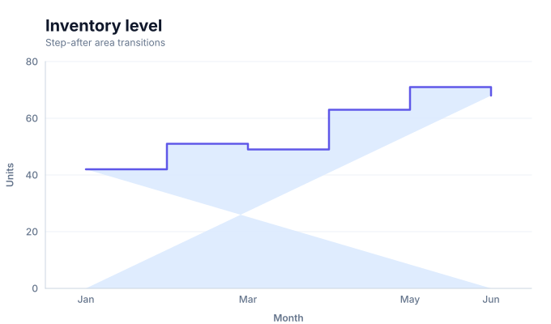

# Stepped area charts

Use a stepped area chart when values change at discrete boundaries rather than continuously.

## Implemented appearance

This image is generated from the current Graflume `compile()` Scene, not a hand-drawn mockup.



## Quick API

`Graflume.steppedArea()` creates the portable `stepped-area` mark (or documented alias mapping) and accepts the common target, data, and options arguments.

```ts
Graflume.steppedArea('#chart', data, {
  x: { field: 'month', type: 'ordinal' },
  y: { field: 'inventory', type: 'quantitative' },
});
```

## Portable ChartSpec mapping

`x` is ordered and `y` is quantitative. The mark uses step-after transitions, fills to zero, and keeps the stepped top stroke separate so the baseline is not outlined.

The same result can be created with `Graflume.create()` and `mark: { type: 'stepped-area' }`. Named `mark.fields` and `mark.options` values are function-free and JSON-serializable, so they remain portable across JavaScript, future Python/R/Java builders, and stored specs.

## Data, ordering, and missing values

Each new x adds a horizontal segment at the previous y and then a vertical transition. Missing values are skipped.

Rows keep source order unless the compiler must establish a deterministic temporal or hierarchy order. Unsafe field names are rejected, callbacks are forbidden in portable specs, and invalid or unmappable values are skipped rather than evaluated.

## Styling and themes

The mark uses shared `fill`, `stroke`, `opacity`, `lineWidth`, `radius`, and `cornerRadius` options where the geometry makes them meaningful. Default colors, text, grid, focus, and palettes come from the active design-token theme and switch at runtime.

## Interaction and accessibility

Rendered datum shapes carry layer id, row index, and the original row for hover/click hit testing in the standard profile. Supply a concise `accessibility.label`, a useful `description`, and an adjacent text or table fallback. Canvas ARIA metadata does not replace keyboard-readable page content.

## Performance profiles

The same `standard`, `large`, `ultra`, and `auto` profiles apply. Complex layout marks currently favor deterministic bounded Scene output; aggregate or filter very large source data before rendering specialized diagrams.

## Current limitations

Step-before/center modes, stacking, and missing-value segment breaks are not configurable yet.

## Runnable example and regression coverage

- [31-type standalone CDN gallery](../../examples/cdn/complete-chart-types.html)
- [Chart catalog compile tests](../../tests/extended-chart-types.test.mjs)
- [Generated visual asset](../assets/charts/stepped-area.svg)

[Back to chart guides](./README.md)
