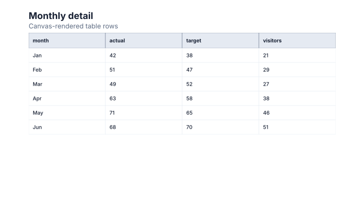

# Table charts

<!-- FAMILY_PRESETS_START -->

## Integrated presets

This is the single manual for the `table` family. Its canonical Quick API is `table()` from `graflume`, and its representative portable mark is `table`. The compatible names below remain callable, but they are modes or data-meaning presets rather than separate chart families.

| Compatible name               | Quick API | Mode      | Portable mark | Functional difference                            |
| ----------------------------- | --------- | --------- | ------------- | ------------------------------------------------ |
| [Table chart](#variant-table) | `table()` | `default` | `table`       | Uses the canonical presentation for this family. |

All presets reuse the same validation, normalization, scale, compiler, renderer-neutral Scene, interaction, accessibility, and serialization contracts. Direction, curve, layout, glyph, depth, financial-body, and indicator choices stay in function-free fields or options instead of selecting a second rendering engine. The remaining manually maintained sections describe the canonical/default presentation unless a preset row above states a different behavior.

## Visual gallery

Every image below is generated from the current compiled Scene rather than drawn by hand. Select a name to jump to its data fields and implementation.

|                                                                                                                              |     |
| ---------------------------------------------------------------------------------------------------------------------------- | --- |
| **[Table chart](#variant-table)**<br>[](../assets/charts/table.svg) |     |

## Type-by-type implementation

The snippets are minimal runnable examples. Change `#chart` to the target element and expand the inline rows with your data. Each example opts into Graflume's safe text-only tooltip with a chart-specific title and ordered fields; number and date formatting follows the declared `locale`. This family keeps `trigger: "mark"`, so the pointer must hit rendered datum geometry. Pointer tooltip triggers remain a convenience; opt into `accessibility.table` and `accessibility.navigation` for the bounded native table and keyboard mark traversal, or provide a larger domain-specific table. The Quick API applies the preset defaults while keeping the resulting specification function-free and serializable.

Every family can opt into the Canvas [inspection viewport, fullscreen, reset, and PNG controls](./interactions.md). Inspection magnifies and translates the complete already-rendered chart, including its title and axes; it is not data-domain or GIS zoom. Generated examples intentionally leave playback off. Add discrete playback only after selecting a meaningful frame field and reviewing the family-specific capability table.

Every family also accepts the shared portable [legend, highlight, selection, and callout contract](./interactions.md#legends-highlights-selection-and-callouts). Automatic legend semantics follow the compiled mark and palette where they are unambiguous; use explicit function-free items for a domain-specific series or category legend. Static datum/layer/range highlights and text-only top-level callouts remain available even when a family has no Cartesian point geometry.

<a id="variant-table"></a>

### Table chart

Use this preset when exact row values are more important than geometric comparison. Uses the canonical presentation for this family.

- **Quick API:** `table()`
- **Mode:** `default`
- **Portable mark:** `table`
- **Required example fields:** `category`, `value`, `target`

```js
import { table } from 'graflume';

const data = [
  {
    category: 'P1',
    value: 24,
    target: 29,
  },
  {
    category: 'P2',
    value: 29.916,
    target: 30,
  },
  {
    category: 'P3',
    value: 33.54,
    target: 31,
  },
  {
    category: 'P4',
    value: 33.72,
    target: 32,
  },
];

table('#chart', data, {
  x: {
    field: 'category',
    type: 'ordinal',
    title: 'category',
  },
  y: {
    field: 'value',
    type: 'quantitative',
    title: 'value',
  },
  title: {
    text: 'Table chart',
    subtitle: 'table family · default mode',
  },
  accessibility: {
    label: 'Table chart example',
    description: 'A compiled table chart example using the table family.',
  },
  mark: {
    options: {
      columns: ['category', 'value', 'target'],
    },
  },
  locale: 'en-US',
  interaction: {
    tooltip: {
      title: 'Table chart',
      fields: [
        {
          field: 'category',
          label: 'category',
          format: 'auto',
        },
        {
          field: 'value',
          label: 'value',
          format: 'number',
        },
        {
          field: 'target',
          label: 'Target',
          format: 'number',
        },
      ],
      trigger: 'mark',
    },
  },
});
```

<!-- FAMILY_PRESETS_END -->

Use the table chart when exact values matter more than shape.

## Implemented appearance

This image is generated from the current Graflume `compile()` Scene, not a hand-drawn mockup.


## Quick API

`Graflume.table()` creates the portable `table` mark (or documented alias mapping) and accepts the common target, data, and options arguments.

```ts
Graflume.table('#chart', data, {
  x: { field: 'name', type: 'nominal' },
  y: { field: 'value', type: 'quantitative' },
  mark: { options: { columns: ['name', 'value', 'status'], rowHeight: 28 } },
});
```

## Portable ChartSpec mapping

`mark.options.columns` is an ordered string array of data fields. Without it, x and y fields are shown.

The same result can be created with `Graflume.create()` and `mark: { type: 'table' }`. Named `mark.fields` and `mark.options` values are function-free and JSON-serializable, so they remain portable across JavaScript, future Python/R/Java builders, and stored specs.

## Data, ordering, and missing values

Theme-tinted headers, alternating row surfaces, subtle grid cells, and stronger type hierarchy are compiled to Scene primitives. Rows that fit in the plot are interactive.

Rows keep source order unless the compiler must establish a deterministic temporal or hierarchy order. Unsafe field names are rejected, callbacks are forbidden in portable specs, and invalid or unmappable values are skipped rather than evaluated.

## Styling and themes

The mark uses shared `fill`, `stroke`, `opacity`, `lineWidth`, `radius`, and `cornerRadius` options where the geometry makes them meaningful. Default colors, text, grid, focus, and palettes come from the active design-token theme and switch at runtime.

## Interaction and accessibility

Rendered datum shapes carry layer id, row index, and the original row for hover/click hit testing in the standard profile. Supply a concise `accessibility.label`, a useful `description`, and an adjacent text or table fallback. Canvas ARIA metadata does not replace keyboard-readable page content.

The inspection viewport can magnify the rendered Scene table, but it is not sorting, paging, frozen-column navigation, or browser text zoom. Playback filtering is normally inappropriate for an exact-value reference because rows disappear by frame. Keep the adjacent semantic HTML table available to assistive technology and ordinary browser search; see [Common chart interactions](./interactions.md).

## Performance profiles

The same `standard`, `large`, `ultra`, and `auto` profiles apply. Complex layout marks currently favor deterministic bounded Scene output; aggregate or filter very large source data before rendering specialized diagrams.

## Current limitations

Sorting UI, paging, frozen columns, cell formatters, text wrapping, and native HTML accessibility are not implemented. Provide an HTML table fallback for production accessibility.

## Runnable example and regression coverage

- [default-family CDN gallery](../../examples/cdn/complete-chart-types.html)
- [Chart catalog compile tests](../../tests/extended-chart-types.test.mjs)
- [Generated visual asset](../assets/charts/table.svg)

[Back to chart guides](./README.md)
