# Technical indicator chart

<!-- FAMILY_PRESETS_START -->

## Integrated presets

This is the single manual for the `technical-indicator` family. Its canonical Quick API is `technicalIndicator()` from `graflume/complete`, and its representative portable mark is `indicator`. The compatible names below remain callable, but they are modes or data-meaning presets rather than separate chart families.

| Compatible name                                                                         | Quick API                              | Mode                                    | Portable mark | Functional difference                                                                                                         |
| --------------------------------------------------------------------------------------- | -------------------------------------- | --------------------------------------- | ------------- | ----------------------------------------------------------------------------------------------------------------------------- |
| [Acceleration bands](#variant-acceleration-bands)                                       | `accelerationBands()`                  | `acceleration-bands`                    | `indicator`   | Selects acceleration bands semantics and uses supplied indicator columns in the current release.                              |
| [Awesome oscillator](#variant-awesome-oscillator)                                       | `awesomeOscillator()`                  | `awesome-oscillator`                    | `indicator`   | Selects awesome oscillator semantics and uses supplied indicator columns in the current release.                              |
| [Absolute price oscillator](#variant-absolute-price-oscillator)                         | `absolutePriceOscillator()`            | `absolute-price-oscillator`             | `indicator`   | Selects absolute price oscillator semantics and uses supplied indicator columns in the current release.                       |
| [Aroon indicator](#variant-aroon)                                                       | `aroon()`                              | `aroon`                                 | `indicator`   | Selects aroon indicator semantics and uses supplied indicator columns in the current release.                                 |
| [Aroon oscillator](#variant-aroon-oscillator)                                           | `aroonOscillator()`                    | `aroon-oscillator`                      | `indicator`   | Selects aroon oscillator semantics and uses supplied indicator columns in the current release.                                |
| [Average true range](#variant-average-true-range)                                       | `averageTrueRange()`                   | `average-true-range`                    | `indicator`   | Selects average true range semantics and uses supplied indicator columns in the current release.                              |
| [Volatility bands](#variant-volatility-bands)                                           | `volatilityBands()`                    | `volatility-bands`                      | `indicator`   | Selects volatility bands semantics and uses supplied indicator columns in the current release.                                |
| [Commodity channel index](#variant-commodity-channel-index)                             | `commodityChannelIndex()`              | `commodity-channel-index`               | `indicator`   | Selects commodity channel index semantics and uses supplied indicator columns in the current release.                         |
| [Chaikin oscillator](#variant-chaikin-oscillator)                                       | `chaikinOscillator()`                  | `chaikin-oscillator`                    | `indicator`   | Selects chaikin oscillator semantics and uses supplied indicator columns in the current release.                              |
| [Chaikin money flow](#variant-chaikin-money-flow)                                       | `chaikinMoneyFlow()`                   | `chaikin-money-flow`                    | `indicator`   | Selects chaikin money flow semantics and uses supplied indicator columns in the current release.                              |
| [Chande momentum oscillator](#variant-chande-momentum-oscillator)                       | `chandeMomentumOscillator()`           | `chande-momentum-oscillator`            | `indicator`   | Selects chande momentum oscillator semantics and uses supplied indicator columns in the current release.                      |
| [Double exponential moving average](#variant-double-exponential-average)                | `doubleExponentialMovingAverage()`     | `double-exponential-average`            | `indicator`   | Selects double exponential moving average semantics and supports supplied values and the current `calculate: true` transform. |
| [Disparity index](#variant-disparity-index)                                             | `disparityIndex()`                     | `disparity-index`                       | `indicator`   | Selects disparity index semantics and uses supplied indicator columns in the current release.                                 |
| [Directional movement index](#variant-directional-movement-index)                       | `directionalMovementIndex()`           | `directional-movement-index`            | `indicator`   | Selects directional movement index semantics and uses supplied indicator columns in the current release.                      |
| [Detrended price oscillator](#variant-detrended-price-oscillator)                       | `detrendedPriceOscillator()`           | `detrended-price-oscillator`            | `indicator`   | Selects detrended price oscillator semantics and uses supplied indicator columns in the current release.                      |
| [Exponential moving average](#variant-exponential-moving-average)                       | `exponentialMovingAverage()`           | `exponential-moving-average`            | `indicator`   | Selects exponential moving average semantics and supports supplied values and the current `calculate: true` transform.        |
| [Ichimoku cloud](#variant-ichimoku-cloud)                                               | `ichimokuCloud()`                      | `ichimoku-cloud`                        | `indicator`   | Selects ichimoku cloud semantics and uses supplied indicator columns in the current release.                                  |
| [Keltner channels](#variant-keltner-channels)                                           | `keltnerChannels()`                    | `keltner-channels`                      | `indicator`   | Selects keltner channels semantics and uses supplied indicator columns in the current release.                                |
| [Klinger oscillator](#variant-klinger-oscillator)                                       | `klingerOscillator()`                  | `klinger-oscillator`                    | `indicator`   | Selects klinger oscillator semantics and uses supplied indicator columns in the current release.                              |
| [Linear regression](#variant-linear-regression)                                         | `linearRegression()`                   | `linear-regression`                     | `indicator`   | Selects linear regression semantics and uses supplied indicator columns in the current release.                               |
| [Linear regression angle](#variant-linear-regression-angle)                             | `linearRegressionAngle()`              | `linear-regression-angle`               | `indicator`   | Selects linear regression angle semantics and uses supplied indicator columns in the current release.                         |
| [Linear regression intercept](#variant-linear-regression-intercept)                     | `linearRegressionIntercept()`          | `linear-regression-intercept`           | `indicator`   | Selects linear regression intercept semantics and uses supplied indicator columns in the current release.                     |
| [Linear regression slope](#variant-linear-regression-slope)                             | `linearRegressionSlope()`              | `linear-regression-slope`               | `indicator`   | Selects linear regression slope semantics and uses supplied indicator columns in the current release.                         |
| [Moving average convergence divergence](#variant-moving-average-convergence-divergence) | `movingAverageConvergenceDivergence()` | `moving-average-convergence-divergence` | `indicator`   | Selects moving average convergence divergence semantics and uses supplied indicator columns in the current release.           |
| [Money flow index](#variant-money-flow-index)                                           | `moneyFlowIndex()`                     | `money-flow-index`                      | `indicator`   | Selects money flow index semantics and uses supplied indicator columns in the current release.                                |
| [Momentum indicator](#variant-momentum)                                                 | `momentumIndicator()`                  | `momentum`                              | `indicator`   | Selects momentum indicator semantics and supports supplied values and the current `calculate: true` transform.                |
| [Normalized average true range](#variant-normalized-average-true-range)                 | `normalizedAverageTrueRange()`         | `normalized-average-true-range`         | `indicator`   | Selects normalized average true range semantics and uses supplied indicator columns in the current release.                   |
| [On-balance volume](#variant-on-balance-volume)                                         | `onBalanceVolume()`                    | `on-balance-volume`                     | `indicator`   | Selects on-balance volume semantics and uses supplied indicator columns in the current release.                               |
| [Price channel](#variant-price-channel)                                                 | `priceChannel()`                       | `price-channel`                         | `indicator`   | Selects price channel semantics and uses supplied indicator columns in the current release.                                   |
| [Pivot points](#variant-pivot-points)                                                   | `pivotPoints()`                        | `pivot-points`                          | `indicator`   | Selects pivot points semantics and uses supplied indicator columns in the current release.                                    |
| [Percentage price oscillator](#variant-percentage-price-oscillator)                     | `percentagePriceOscillator()`          | `percentage-price-oscillator`           | `indicator`   | Selects percentage price oscillator semantics and uses supplied indicator columns in the current release.                     |
| [Price envelopes](#variant-price-envelopes)                                             | `priceEnvelopes()`                     | `price-envelopes`                       | `indicator`   | Selects price envelopes semantics and uses supplied indicator columns in the current release.                                 |
| [Parabolic stop and reverse](#variant-parabolic-stop-and-reverse)                       | `parabolicStopAndReverse()`            | `parabolic-stop-and-reverse`            | `indicator`   | Selects parabolic stop and reverse semantics and uses supplied indicator columns in the current release.                      |
| [Rate of change](#variant-rate-of-change)                                               | `rateOfChange()`                       | `rate-of-change`                        | `indicator`   | Selects rate of change semantics and supports supplied values and the current `calculate: true` transform.                    |
| [Relative strength index](#variant-relative-strength-index)                             | `relativeStrengthIndex()`              | `relative-strength-index`               | `indicator`   | Selects relative strength index semantics and supports supplied values and the current `calculate: true` transform.           |
| [Slow stochastic oscillator](#variant-slow-stochastic)                                  | `slowStochastic()`                     | `slow-stochastic`                       | `indicator`   | Selects slow stochastic oscillator semantics and uses supplied indicator columns in the current release.                      |
| [Simple moving average](#variant-simple-moving-average)                                 | `simpleMovingAverage()`                | `simple-moving-average`                 | `indicator`   | Selects simple moving average semantics and supports supplied values and the current `calculate: true` transform.             |
| [Stochastic oscillator](#variant-stochastic)                                            | `stochastic()`                         | `stochastic`                            | `indicator`   | Selects stochastic oscillator semantics and uses supplied indicator columns in the current release.                           |
| [Supertrend](#variant-supertrend)                                                       | `supertrend()`                         | `supertrend`                            | `indicator`   | Selects supertrend semantics and uses supplied indicator columns in the current release.                                      |
| [Triple exponential moving average](#variant-triple-exponential-average)                | `tripleExponentialMovingAverage()`     | `triple-exponential-average`            | `indicator`   | Selects triple exponential moving average semantics and supports supplied values and the current `calculate: true` transform. |
| [Triple exponential average oscillator](#variant-triple-exponential-oscillator)         | `tripleExponentialAverageOscillator()` | `triple-exponential-oscillator`         | `indicator`   | Selects triple exponential average oscillator semantics and uses supplied indicator columns in the current release.           |
| [Volume weighted average price](#variant-volume-weighted-average-price)                 | `volumeWeightedAveragePrice()`         | `volume-weighted-average-price`         | `indicator`   | Selects volume weighted average price semantics and uses supplied indicator columns in the current release.                   |
| [Williams range](#variant-williams-range)                                               | `williamsRange()`                      | `williams-range`                        | `indicator`   | Selects williams range semantics and uses supplied indicator columns in the current release.                                  |
| [Weighted moving average](#variant-weighted-moving-average)                             | `weightedMovingAverage()`              | `weighted-moving-average`               | `indicator`   | Selects weighted moving average semantics and supports supplied values and the current `calculate: true` transform.           |
| [Zigzag indicator](#variant-zigzag)                                                     | `zigzag()`                             | `zigzag`                                | `indicator`   | Selects zigzag indicator semantics and uses supplied indicator columns in the current release.                                |

All presets reuse the same validation, normalization, scale, compiler, renderer-neutral Scene, interaction, accessibility, and serialization contracts. Direction, curve, layout, glyph, depth, financial-body, and indicator choices stay in function-free fields or options instead of selecting a second rendering engine. The remaining manually maintained sections describe the canonical/default presentation unless a preset row above states a different behavior.

## Visual gallery

Every image below is generated from the current compiled Scene rather than drawn by hand. Select a name to jump to its data fields and implementation.

|                                                                                                                                                                                                                                                          |                                                                                                                                                                                                                                                                                  |
| -------------------------------------------------------------------------------------------------------------------------------------------------------------------------------------------------------------------------------------------------------- | -------------------------------------------------------------------------------------------------------------------------------------------------------------------------------------------------------------------------------------------------------------------------------- |
| **[Acceleration bands](#variant-acceleration-bands)**<br>[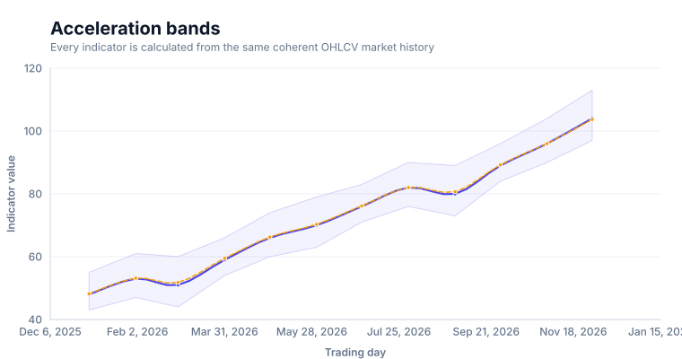](../assets/charts/acceleration-bands.svg)                                                                        | **[Awesome oscillator](#variant-awesome-oscillator)**<br>[](../assets/charts/awesome-oscillator.svg)                                                                                                |
| **[Absolute price oscillator](#variant-absolute-price-oscillator)**<br>[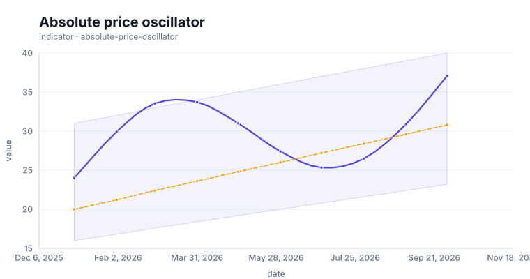](../assets/charts/absolute-price-oscillator.svg)                                     | **[Aroon indicator](#variant-aroon)**<br>[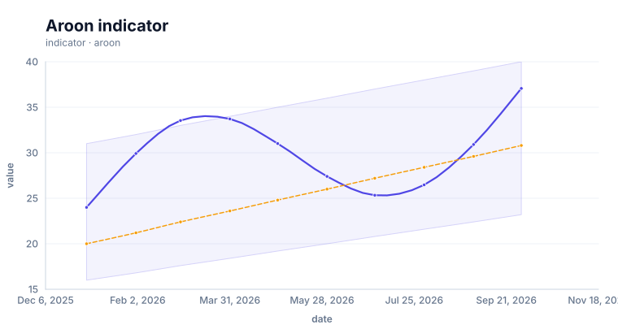](../assets/charts/aroon.svg)                                                                                                                                             |
| **[Aroon oscillator](#variant-aroon-oscillator)**<br>[](../assets/charts/aroon-oscillator.svg)                                                                                  | **[Average true range](#variant-average-true-range)**<br>[](../assets/charts/average-true-range.svg)                                                                                                |
| **[Volatility bands](#variant-volatility-bands)**<br>[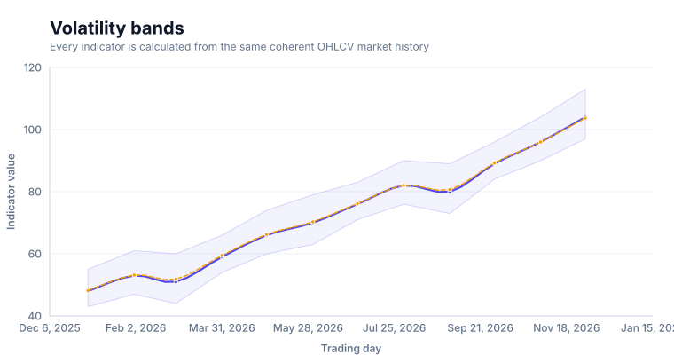](../assets/charts/volatility-bands.svg)                                                                                  | **[Commodity channel index](#variant-commodity-channel-index)**<br>[](../assets/charts/commodity-channel-index.svg)                                                                       |
| **[Chaikin oscillator](#variant-chaikin-oscillator)**<br>[](../assets/charts/chaikin-oscillator.svg)                                                                        | **[Chaikin money flow](#variant-chaikin-money-flow)**<br>[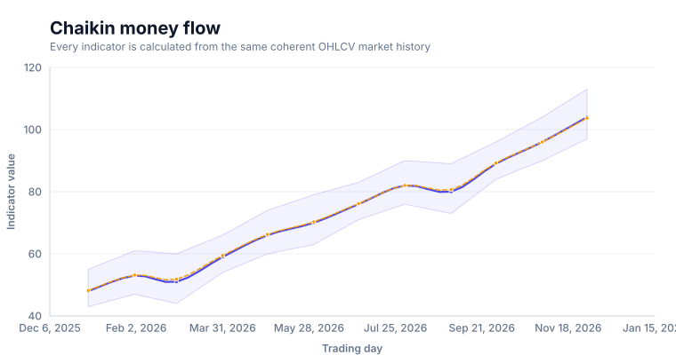](../assets/charts/chaikin-money-flow.svg)                                                                                                |
| **[Chande momentum oscillator](#variant-chande-momentum-oscillator)**<br>[](../assets/charts/chande-momentum-oscillator.svg)                                | **[Double exponential moving average](#variant-double-exponential-average)**<br>[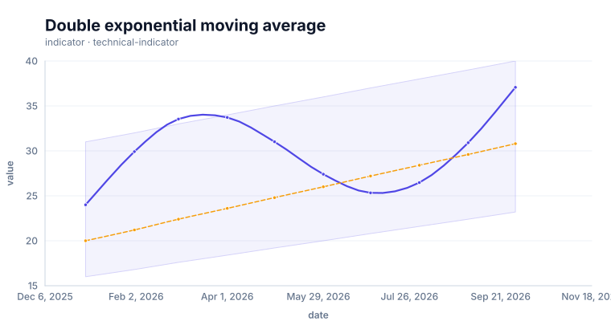](../assets/charts/double-exponential-average.svg)                                          |
| **[Disparity index](#variant-disparity-index)**<br>[](../assets/charts/disparity-index.svg)                                                                                       | **[Directional movement index](#variant-directional-movement-index)**<br>[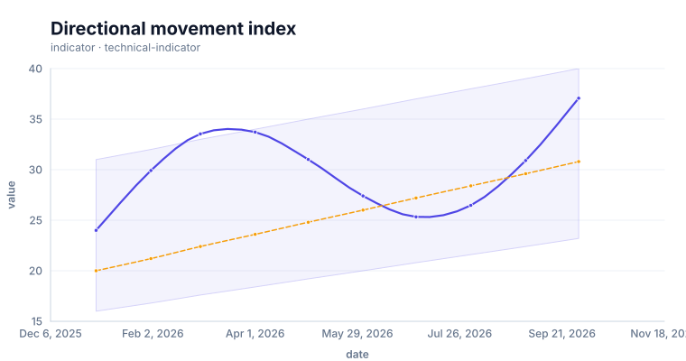](../assets/charts/directional-movement-index.svg)                                                        |
| **[Detrended price oscillator](#variant-detrended-price-oscillator)**<br>[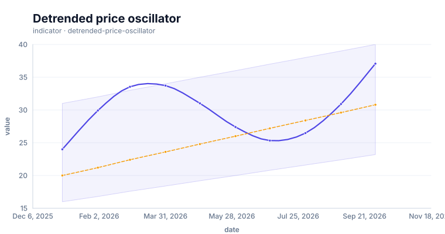](../assets/charts/detrended-price-oscillator.svg)                                | **[Exponential moving average](#variant-exponential-moving-average)**<br>[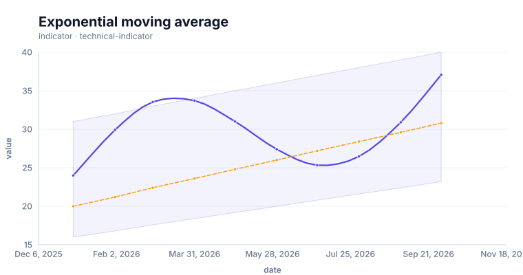](../assets/charts/exponential-moving-average.svg)                                                        |
| **[Ichimoku cloud](#variant-ichimoku-cloud)**<br>[](../assets/charts/ichimoku-cloud.svg)                                                                                            | **[Keltner channels](#variant-keltner-channels)**<br>[](../assets/charts/keltner-channels.svg)                                                                                                          |
| **[Klinger oscillator](#variant-klinger-oscillator)**<br>[](../assets/charts/klinger-oscillator.svg)                                                                        | **[Linear regression](#variant-linear-regression)**<br>[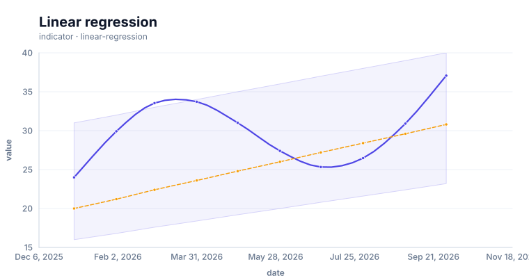](../assets/charts/linear-regression.svg)                                                                                                     |
| **[Linear regression angle](#variant-linear-regression-angle)**<br>[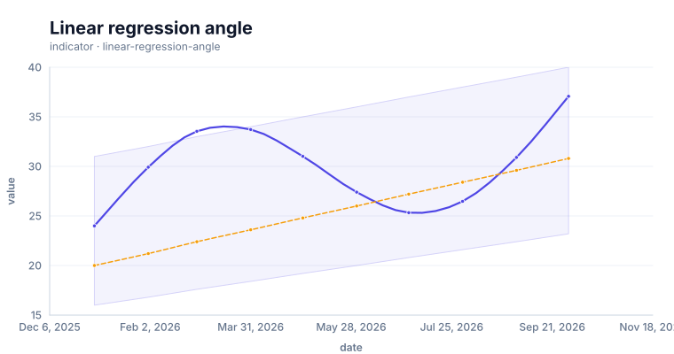](../assets/charts/linear-regression-angle.svg)                                               | **[Linear regression intercept](#variant-linear-regression-intercept)**<br>[](../assets/charts/linear-regression-intercept.svg)                                                   |
| **[Linear regression slope](#variant-linear-regression-slope)**<br>[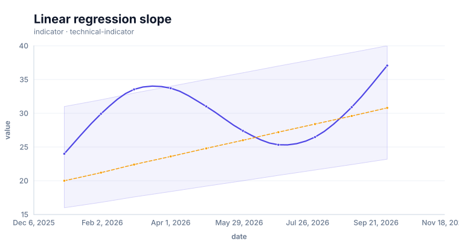](../assets/charts/linear-regression-slope.svg)                                               | **[Moving average convergence divergence](#variant-moving-average-convergence-divergence)**<br>[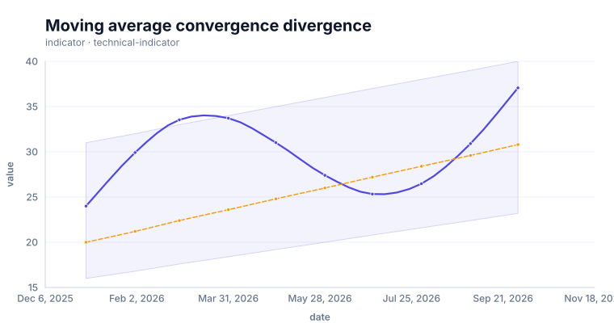](../assets/charts/moving-average-convergence-divergence.svg) |
| **[Money flow index](#variant-money-flow-index)**<br>[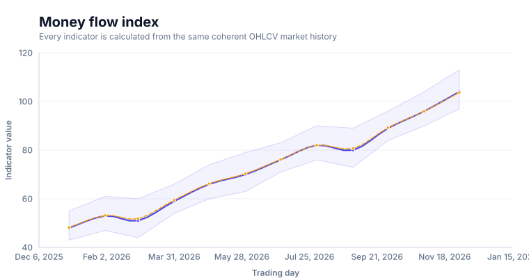](../assets/charts/money-flow-index.svg)                                                                                  | **[Momentum indicator](#variant-momentum)**<br>[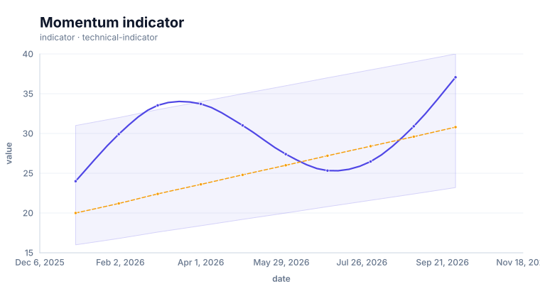](../assets/charts/momentum.svg)                                                                                                                              |
| **[Normalized average true range](#variant-normalized-average-true-range)**<br>[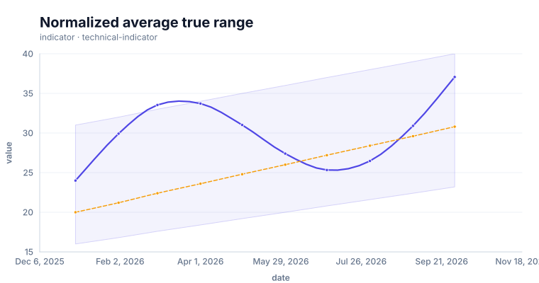](../assets/charts/normalized-average-true-range.svg)                 | **[On-balance volume](#variant-on-balance-volume)**<br>[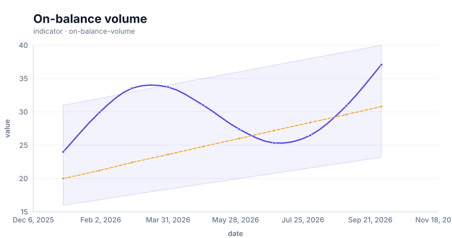](../assets/charts/on-balance-volume.svg)                                                                                                     |
| **[Price channel](#variant-price-channel)**<br>[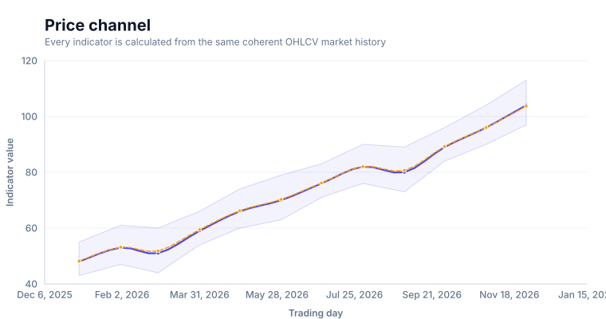](../assets/charts/price-channel.svg)                                                                                                 | **[Pivot points](#variant-pivot-points)**<br>[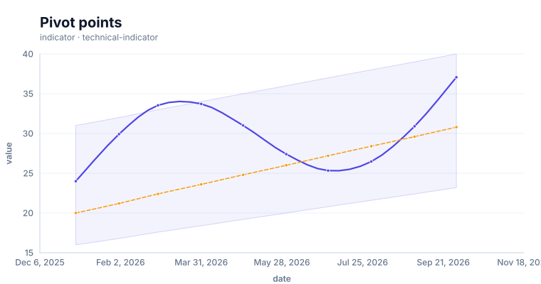](../assets/charts/pivot-points.svg)                                                                                                                              |
| **[Percentage price oscillator](#variant-percentage-price-oscillator)**<br>[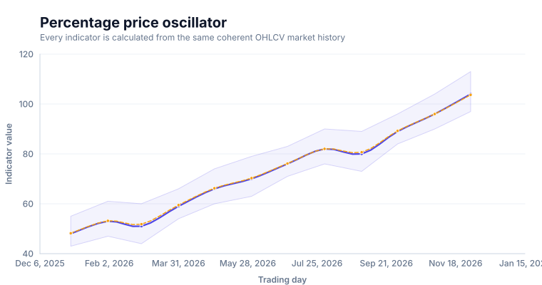](../assets/charts/percentage-price-oscillator.svg)                           | **[Price envelopes](#variant-price-envelopes)**<br>[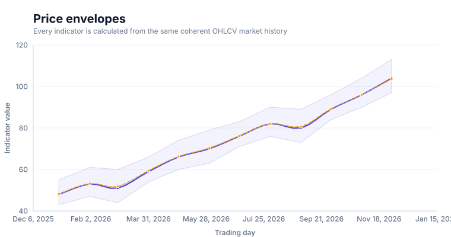](../assets/charts/price-envelopes.svg)                                                                                                               |
| **[Parabolic stop and reverse](#variant-parabolic-stop-and-reverse)**<br>[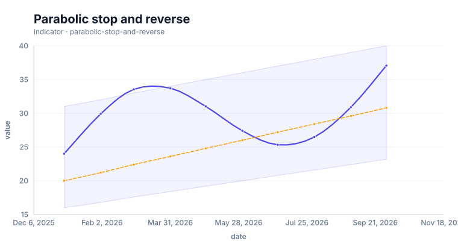](../assets/charts/parabolic-stop-and-reverse.svg)                                | **[Rate of change](#variant-rate-of-change)**<br>[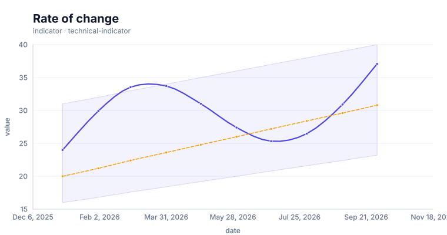](../assets/charts/rate-of-change.svg)                                                                                                                    |
| **[Relative strength index](#variant-relative-strength-index)**<br>[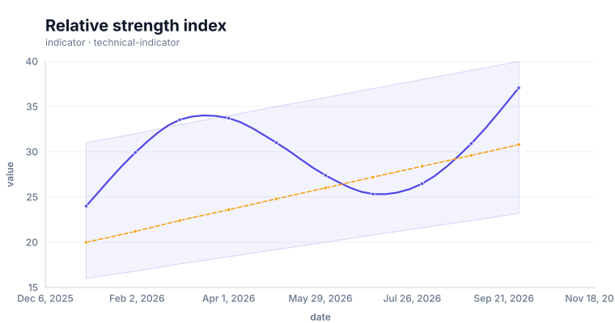](../assets/charts/relative-strength-index.svg)                                               | **[Slow stochastic oscillator](#variant-slow-stochastic)**<br>[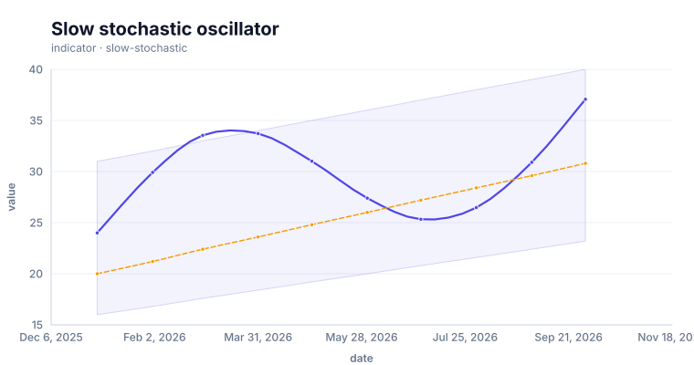](../assets/charts/slow-stochastic.svg)                                                                                         |
| **[Simple moving average](#variant-simple-moving-average)**<br>[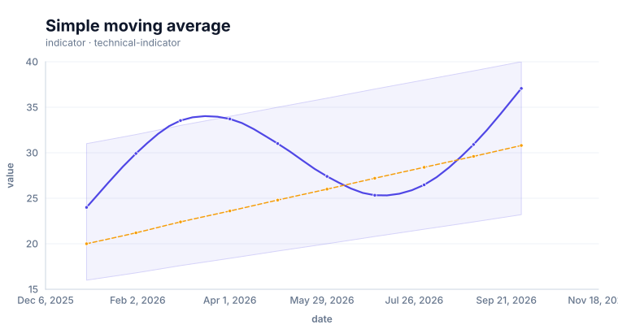](../assets/charts/simple-moving-average.svg)                                                         | **[Stochastic oscillator](#variant-stochastic)**<br>[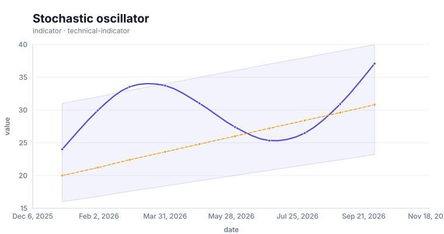](../assets/charts/stochastic.svg)                                                                                                                  |
| **[Supertrend](#variant-supertrend)**<br>[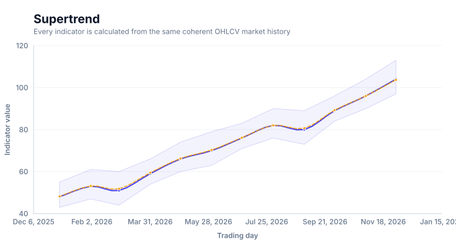](../assets/charts/supertrend.svg)                                                                                                                | **[Triple exponential moving average](#variant-triple-exponential-average)**<br>[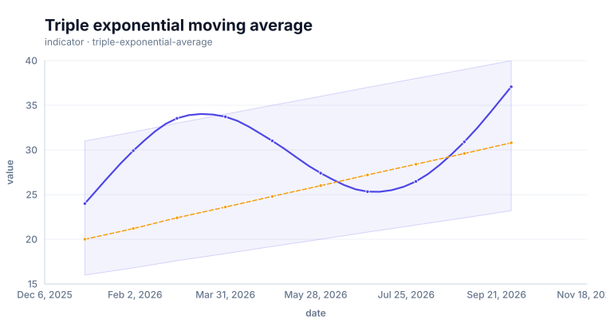](../assets/charts/triple-exponential-average.svg)                                          |
| **[Triple exponential average oscillator](#variant-triple-exponential-oscillator)**<br>[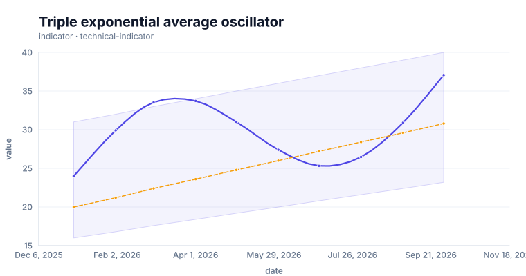](../assets/charts/triple-exponential-oscillator.svg) | **[Volume weighted average price](#variant-volume-weighted-average-price)**<br>[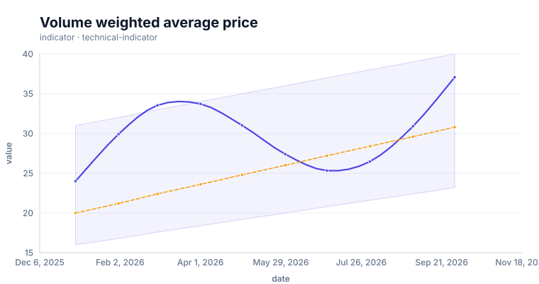](../assets/charts/volume-weighted-average-price.svg)                                         |
| **[Williams range](#variant-williams-range)**<br>[](../assets/charts/williams-range.svg)                                                                                            | **[Weighted moving average](#variant-weighted-moving-average)**<br>[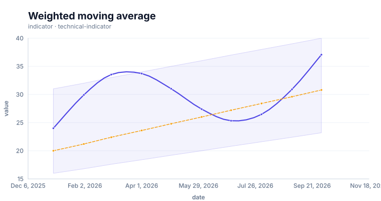](../assets/charts/weighted-moving-average.svg)                                                                       |
| **[Zigzag indicator](#variant-zigzag)**<br>[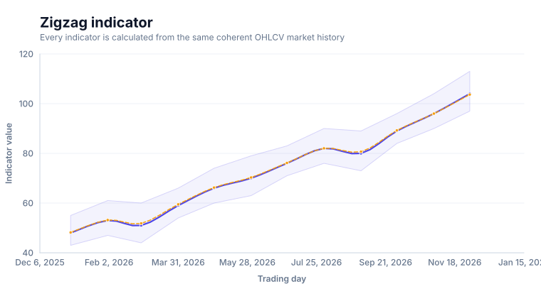](../assets/charts/zigzag.svg)                                                                                                                |                                                                                                                                                                                                                                                                                  |

## Type-by-type implementation

The snippets are minimal runnable examples. Change `#chart` to the target element and expand the inline rows with your data. Each example opts into Graflume's safe text-only tooltip with a chart-specific title and ordered fields; number and date formatting follows the declared `locale`. The Quick API applies the preset defaults while keeping the resulting specification function-free and serializable.

<a id="variant-acceleration-bands"></a>

### Acceleration bands

Use this preset when a derived or supplied market indicator must be aligned to an ordered series. Selects acceleration bands semantics and uses supplied indicator columns in the current release.

- **Quick API:** `accelerationBands()`
- **Mode:** `acceleration-bands`
- **Portable mark:** `indicator`
- **Required example fields:** `date`, `value`, `lower`, `upper`, `signal`

```js
import { accelerationBands } from 'graflume/complete';

const data = [
  {
    date: '2026-01-01',
    value: 24,
    lower: 16,
    upper: 31,
    signal: 20,
  },
  {
    date: '2026-02-01',
    value: 29.916,
    lower: 16.8,
    upper: 32,
    signal: 21.2,
  },
  {
    date: '2026-03-01',
    value: 33.54,
    lower: 17.6,
    upper: 33,
    signal: 22.4,
  },
  {
    date: '2026-04-01',
    value: 33.72,
    lower: 18.4,
    upper: 34,
    signal: 23.6,
  },
];

accelerationBands('#chart', data, {
  x: {
    field: 'date',
    type: 'temporal',
    title: 'date',
  },
  y: {
    field: 'value',
    type: 'quantitative',
    title: 'value',
  },
  title: {
    text: 'Acceleration bands',
    subtitle: 'technical-indicator family · acceleration-bands mode',
  },
  accessibility: {
    label: 'Acceleration bands example',
    description: 'A compiled acceleration bands example using the technical-indicator family.',
  },
  mark: {
    fields: {
      lower: 'lower',
      upper: 'upper',
    },
    options: {
      kind: 'acceleration-bands',
      fields: ['value', 'signal'],
    },
  },
  locale: 'en-US',
  interaction: {
    tooltip: {
      title: 'Acceleration bands',
      fields: [
        {
          field: 'date',
          label: 'date',
          format: 'date',
        },
        {
          field: 'value',
          label: 'value',
          format: 'number',
        },
        {
          field: 'lower',
          label: 'Lower',
          format: 'number',
        },
        {
          field: 'upper',
          label: 'Upper',
          format: 'number',
        },
        {
          field: 'signal',
          label: 'Signal',
          format: 'number',
        },
      ],
    },
  },
});
```

<a id="variant-awesome-oscillator"></a>

### Awesome oscillator

Use this preset when a derived or supplied market indicator must be aligned to an ordered series. Selects awesome oscillator semantics and uses supplied indicator columns in the current release.

- **Quick API:** `awesomeOscillator()`
- **Mode:** `awesome-oscillator`
- **Portable mark:** `indicator`
- **Required example fields:** `date`, `value`, `lower`, `upper`, `signal`

```js
import { awesomeOscillator } from 'graflume/complete';

const data = [
  {
    date: '2026-01-01',
    value: 24,
    lower: 16,
    upper: 31,
    signal: 20,
  },
  {
    date: '2026-02-01',
    value: 29.916,
    lower: 16.8,
    upper: 32,
    signal: 21.2,
  },
  {
    date: '2026-03-01',
    value: 33.54,
    lower: 17.6,
    upper: 33,
    signal: 22.4,
  },
  {
    date: '2026-04-01',
    value: 33.72,
    lower: 18.4,
    upper: 34,
    signal: 23.6,
  },
];

awesomeOscillator('#chart', data, {
  x: {
    field: 'date',
    type: 'temporal',
    title: 'date',
  },
  y: {
    field: 'value',
    type: 'quantitative',
    title: 'value',
  },
  title: {
    text: 'Awesome oscillator',
    subtitle: 'technical-indicator family · awesome-oscillator mode',
  },
  accessibility: {
    label: 'Awesome oscillator example',
    description: 'A compiled awesome oscillator example using the technical-indicator family.',
  },
  mark: {
    fields: {
      lower: 'lower',
      upper: 'upper',
    },
    options: {
      kind: 'awesome-oscillator',
      fields: ['value', 'signal'],
    },
  },
  locale: 'en-US',
  interaction: {
    tooltip: {
      title: 'Awesome oscillator',
      fields: [
        {
          field: 'date',
          label: 'date',
          format: 'date',
        },
        {
          field: 'value',
          label: 'value',
          format: 'number',
        },
        {
          field: 'lower',
          label: 'Lower',
          format: 'number',
        },
        {
          field: 'upper',
          label: 'Upper',
          format: 'number',
        },
        {
          field: 'signal',
          label: 'Signal',
          format: 'number',
        },
      ],
    },
  },
});
```

<a id="variant-absolute-price-oscillator"></a>

### Absolute price oscillator

Use this preset when a derived or supplied market indicator must be aligned to an ordered series. Selects absolute price oscillator semantics and uses supplied indicator columns in the current release.

- **Quick API:** `absolutePriceOscillator()`
- **Mode:** `absolute-price-oscillator`
- **Portable mark:** `indicator`
- **Required example fields:** `date`, `value`, `lower`, `upper`, `signal`

```js
import { absolutePriceOscillator } from 'graflume/complete';

const data = [
  {
    date: '2026-01-01',
    value: 24,
    lower: 16,
    upper: 31,
    signal: 20,
  },
  {
    date: '2026-02-01',
    value: 29.916,
    lower: 16.8,
    upper: 32,
    signal: 21.2,
  },
  {
    date: '2026-03-01',
    value: 33.54,
    lower: 17.6,
    upper: 33,
    signal: 22.4,
  },
  {
    date: '2026-04-01',
    value: 33.72,
    lower: 18.4,
    upper: 34,
    signal: 23.6,
  },
];

absolutePriceOscillator('#chart', data, {
  x: {
    field: 'date',
    type: 'temporal',
    title: 'date',
  },
  y: {
    field: 'value',
    type: 'quantitative',
    title: 'value',
  },
  title: {
    text: 'Absolute price oscillator',
    subtitle: 'technical-indicator family · absolute-price-oscillator mode',
  },
  accessibility: {
    label: 'Absolute price oscillator example',
    description:
      'A compiled absolute price oscillator example using the technical-indicator family.',
  },
  mark: {
    fields: {
      lower: 'lower',
      upper: 'upper',
    },
    options: {
      kind: 'absolute-price-oscillator',
      fields: ['value', 'signal'],
    },
  },
  locale: 'en-US',
  interaction: {
    tooltip: {
      title: 'Absolute price oscillator',
      fields: [
        {
          field: 'date',
          label: 'date',
          format: 'date',
        },
        {
          field: 'value',
          label: 'value',
          format: 'number',
        },
        {
          field: 'lower',
          label: 'Lower',
          format: 'number',
        },
        {
          field: 'upper',
          label: 'Upper',
          format: 'number',
        },
        {
          field: 'signal',
          label: 'Signal',
          format: 'number',
        },
      ],
    },
  },
});
```

<a id="variant-aroon"></a>

### Aroon indicator

Use this preset when a derived or supplied market indicator must be aligned to an ordered series. Selects aroon indicator semantics and uses supplied indicator columns in the current release.

- **Quick API:** `aroon()`
- **Mode:** `aroon`
- **Portable mark:** `indicator`
- **Required example fields:** `date`, `value`, `lower`, `upper`, `signal`

```js
import { aroon } from 'graflume/complete';

const data = [
  {
    date: '2026-01-01',
    value: 24,
    lower: 16,
    upper: 31,
    signal: 20,
  },
  {
    date: '2026-02-01',
    value: 29.916,
    lower: 16.8,
    upper: 32,
    signal: 21.2,
  },
  {
    date: '2026-03-01',
    value: 33.54,
    lower: 17.6,
    upper: 33,
    signal: 22.4,
  },
  {
    date: '2026-04-01',
    value: 33.72,
    lower: 18.4,
    upper: 34,
    signal: 23.6,
  },
];

aroon('#chart', data, {
  x: {
    field: 'date',
    type: 'temporal',
    title: 'date',
  },
  y: {
    field: 'value',
    type: 'quantitative',
    title: 'value',
  },
  title: {
    text: 'Aroon indicator',
    subtitle: 'technical-indicator family · aroon mode',
  },
  accessibility: {
    label: 'Aroon indicator example',
    description: 'A compiled aroon indicator example using the technical-indicator family.',
  },
  mark: {
    fields: {
      lower: 'lower',
      upper: 'upper',
    },
    options: {
      kind: 'aroon',
      fields: ['value', 'signal'],
    },
  },
  locale: 'en-US',
  interaction: {
    tooltip: {
      title: 'Aroon indicator',
      fields: [
        {
          field: 'date',
          label: 'date',
          format: 'date',
        },
        {
          field: 'value',
          label: 'value',
          format: 'number',
        },
        {
          field: 'lower',
          label: 'Lower',
          format: 'number',
        },
        {
          field: 'upper',
          label: 'Upper',
          format: 'number',
        },
        {
          field: 'signal',
          label: 'Signal',
          format: 'number',
        },
      ],
    },
  },
});
```

<a id="variant-aroon-oscillator"></a>

### Aroon oscillator

Use this preset when a derived or supplied market indicator must be aligned to an ordered series. Selects aroon oscillator semantics and uses supplied indicator columns in the current release.

- **Quick API:** `aroonOscillator()`
- **Mode:** `aroon-oscillator`
- **Portable mark:** `indicator`
- **Required example fields:** `date`, `value`, `lower`, `upper`, `signal`

```js
import { aroonOscillator } from 'graflume/complete';

const data = [
  {
    date: '2026-01-01',
    value: 24,
    lower: 16,
    upper: 31,
    signal: 20,
  },
  {
    date: '2026-02-01',
    value: 29.916,
    lower: 16.8,
    upper: 32,
    signal: 21.2,
  },
  {
    date: '2026-03-01',
    value: 33.54,
    lower: 17.6,
    upper: 33,
    signal: 22.4,
  },
  {
    date: '2026-04-01',
    value: 33.72,
    lower: 18.4,
    upper: 34,
    signal: 23.6,
  },
];

aroonOscillator('#chart', data, {
  x: {
    field: 'date',
    type: 'temporal',
    title: 'date',
  },
  y: {
    field: 'value',
    type: 'quantitative',
    title: 'value',
  },
  title: {
    text: 'Aroon oscillator',
    subtitle: 'technical-indicator family · aroon-oscillator mode',
  },
  accessibility: {
    label: 'Aroon oscillator example',
    description: 'A compiled aroon oscillator example using the technical-indicator family.',
  },
  mark: {
    fields: {
      lower: 'lower',
      upper: 'upper',
    },
    options: {
      kind: 'aroon-oscillator',
      fields: ['value', 'signal'],
    },
  },
  locale: 'en-US',
  interaction: {
    tooltip: {
      title: 'Aroon oscillator',
      fields: [
        {
          field: 'date',
          label: 'date',
          format: 'date',
        },
        {
          field: 'value',
          label: 'value',
          format: 'number',
        },
        {
          field: 'lower',
          label: 'Lower',
          format: 'number',
        },
        {
          field: 'upper',
          label: 'Upper',
          format: 'number',
        },
        {
          field: 'signal',
          label: 'Signal',
          format: 'number',
        },
      ],
    },
  },
});
```

<a id="variant-average-true-range"></a>

### Average true range

Use this preset when a derived or supplied market indicator must be aligned to an ordered series. Selects average true range semantics and uses supplied indicator columns in the current release.

- **Quick API:** `averageTrueRange()`
- **Mode:** `average-true-range`
- **Portable mark:** `indicator`
- **Required example fields:** `date`, `value`, `lower`, `upper`, `signal`

```js
import { averageTrueRange } from 'graflume/complete';

const data = [
  {
    date: '2026-01-01',
    value: 24,
    lower: 16,
    upper: 31,
    signal: 20,
  },
  {
    date: '2026-02-01',
    value: 29.916,
    lower: 16.8,
    upper: 32,
    signal: 21.2,
  },
  {
    date: '2026-03-01',
    value: 33.54,
    lower: 17.6,
    upper: 33,
    signal: 22.4,
  },
  {
    date: '2026-04-01',
    value: 33.72,
    lower: 18.4,
    upper: 34,
    signal: 23.6,
  },
];

averageTrueRange('#chart', data, {
  x: {
    field: 'date',
    type: 'temporal',
    title: 'date',
  },
  y: {
    field: 'value',
    type: 'quantitative',
    title: 'value',
  },
  title: {
    text: 'Average true range',
    subtitle: 'technical-indicator family · average-true-range mode',
  },
  accessibility: {
    label: 'Average true range example',
    description: 'A compiled average true range example using the technical-indicator family.',
  },
  mark: {
    fields: {
      lower: 'lower',
      upper: 'upper',
    },
    options: {
      kind: 'average-true-range',
      fields: ['value', 'signal'],
    },
  },
  locale: 'en-US',
  interaction: {
    tooltip: {
      title: 'Average true range',
      fields: [
        {
          field: 'date',
          label: 'date',
          format: 'date',
        },
        {
          field: 'value',
          label: 'value',
          format: 'number',
        },
        {
          field: 'lower',
          label: 'Lower',
          format: 'number',
        },
        {
          field: 'upper',
          label: 'Upper',
          format: 'number',
        },
        {
          field: 'signal',
          label: 'Signal',
          format: 'number',
        },
      ],
    },
  },
});
```

<a id="variant-volatility-bands"></a>

### Volatility bands

Use this preset when a derived or supplied market indicator must be aligned to an ordered series. Selects volatility bands semantics and uses supplied indicator columns in the current release.

- **Quick API:** `volatilityBands()`
- **Mode:** `volatility-bands`
- **Portable mark:** `indicator`
- **Required example fields:** `date`, `value`, `lower`, `upper`, `signal`

```js
import { volatilityBands } from 'graflume/complete';

const data = [
  {
    date: '2026-01-01',
    value: 24,
    lower: 16,
    upper: 31,
    signal: 20,
  },
  {
    date: '2026-02-01',
    value: 29.916,
    lower: 16.8,
    upper: 32,
    signal: 21.2,
  },
  {
    date: '2026-03-01',
    value: 33.54,
    lower: 17.6,
    upper: 33,
    signal: 22.4,
  },
  {
    date: '2026-04-01',
    value: 33.72,
    lower: 18.4,
    upper: 34,
    signal: 23.6,
  },
];

volatilityBands('#chart', data, {
  x: {
    field: 'date',
    type: 'temporal',
    title: 'date',
  },
  y: {
    field: 'value',
    type: 'quantitative',
    title: 'value',
  },
  title: {
    text: 'Volatility bands',
    subtitle: 'technical-indicator family · volatility-bands mode',
  },
  accessibility: {
    label: 'Volatility bands example',
    description: 'A compiled volatility bands example using the technical-indicator family.',
  },
  mark: {
    fields: {
      lower: 'lower',
      upper: 'upper',
    },
    options: {
      kind: 'volatility-bands',
      fields: ['value', 'signal'],
    },
  },
  locale: 'en-US',
  interaction: {
    tooltip: {
      title: 'Volatility bands',
      fields: [
        {
          field: 'date',
          label: 'date',
          format: 'date',
        },
        {
          field: 'value',
          label: 'value',
          format: 'number',
        },
        {
          field: 'lower',
          label: 'Lower',
          format: 'number',
        },
        {
          field: 'upper',
          label: 'Upper',
          format: 'number',
        },
        {
          field: 'signal',
          label: 'Signal',
          format: 'number',
        },
      ],
    },
  },
});
```

<a id="variant-commodity-channel-index"></a>

### Commodity channel index

Use this preset when a derived or supplied market indicator must be aligned to an ordered series. Selects commodity channel index semantics and uses supplied indicator columns in the current release.

- **Quick API:** `commodityChannelIndex()`
- **Mode:** `commodity-channel-index`
- **Portable mark:** `indicator`
- **Required example fields:** `date`, `value`, `lower`, `upper`, `signal`

```js
import { commodityChannelIndex } from 'graflume/complete';

const data = [
  {
    date: '2026-01-01',
    value: 24,
    lower: 16,
    upper: 31,
    signal: 20,
  },
  {
    date: '2026-02-01',
    value: 29.916,
    lower: 16.8,
    upper: 32,
    signal: 21.2,
  },
  {
    date: '2026-03-01',
    value: 33.54,
    lower: 17.6,
    upper: 33,
    signal: 22.4,
  },
  {
    date: '2026-04-01',
    value: 33.72,
    lower: 18.4,
    upper: 34,
    signal: 23.6,
  },
];

commodityChannelIndex('#chart', data, {
  x: {
    field: 'date',
    type: 'temporal',
    title: 'date',
  },
  y: {
    field: 'value',
    type: 'quantitative',
    title: 'value',
  },
  title: {
    text: 'Commodity channel index',
    subtitle: 'technical-indicator family · commodity-channel-index mode',
  },
  accessibility: {
    label: 'Commodity channel index example',
    description: 'A compiled commodity channel index example using the technical-indicator family.',
  },
  mark: {
    fields: {
      lower: 'lower',
      upper: 'upper',
    },
    options: {
      kind: 'commodity-channel-index',
      fields: ['value', 'signal'],
    },
  },
  locale: 'en-US',
  interaction: {
    tooltip: {
      title: 'Commodity channel index',
      fields: [
        {
          field: 'date',
          label: 'date',
          format: 'date',
        },
        {
          field: 'value',
          label: 'value',
          format: 'number',
        },
        {
          field: 'lower',
          label: 'Lower',
          format: 'number',
        },
        {
          field: 'upper',
          label: 'Upper',
          format: 'number',
        },
        {
          field: 'signal',
          label: 'Signal',
          format: 'number',
        },
      ],
    },
  },
});
```

<a id="variant-chaikin-oscillator"></a>

### Chaikin oscillator

Use this preset when a derived or supplied market indicator must be aligned to an ordered series. Selects chaikin oscillator semantics and uses supplied indicator columns in the current release.

- **Quick API:** `chaikinOscillator()`
- **Mode:** `chaikin-oscillator`
- **Portable mark:** `indicator`
- **Required example fields:** `date`, `value`, `lower`, `upper`, `signal`

```js
import { chaikinOscillator } from 'graflume/complete';

const data = [
  {
    date: '2026-01-01',
    value: 24,
    lower: 16,
    upper: 31,
    signal: 20,
  },
  {
    date: '2026-02-01',
    value: 29.916,
    lower: 16.8,
    upper: 32,
    signal: 21.2,
  },
  {
    date: '2026-03-01',
    value: 33.54,
    lower: 17.6,
    upper: 33,
    signal: 22.4,
  },
  {
    date: '2026-04-01',
    value: 33.72,
    lower: 18.4,
    upper: 34,
    signal: 23.6,
  },
];

chaikinOscillator('#chart', data, {
  x: {
    field: 'date',
    type: 'temporal',
    title: 'date',
  },
  y: {
    field: 'value',
    type: 'quantitative',
    title: 'value',
  },
  title: {
    text: 'Chaikin oscillator',
    subtitle: 'technical-indicator family · chaikin-oscillator mode',
  },
  accessibility: {
    label: 'Chaikin oscillator example',
    description: 'A compiled chaikin oscillator example using the technical-indicator family.',
  },
  mark: {
    fields: {
      lower: 'lower',
      upper: 'upper',
    },
    options: {
      kind: 'chaikin-oscillator',
      fields: ['value', 'signal'],
    },
  },
  locale: 'en-US',
  interaction: {
    tooltip: {
      title: 'Chaikin oscillator',
      fields: [
        {
          field: 'date',
          label: 'date',
          format: 'date',
        },
        {
          field: 'value',
          label: 'value',
          format: 'number',
        },
        {
          field: 'lower',
          label: 'Lower',
          format: 'number',
        },
        {
          field: 'upper',
          label: 'Upper',
          format: 'number',
        },
        {
          field: 'signal',
          label: 'Signal',
          format: 'number',
        },
      ],
    },
  },
});
```

<a id="variant-chaikin-money-flow"></a>

### Chaikin money flow

Use this preset when a derived or supplied market indicator must be aligned to an ordered series. Selects chaikin money flow semantics and uses supplied indicator columns in the current release.

- **Quick API:** `chaikinMoneyFlow()`
- **Mode:** `chaikin-money-flow`
- **Portable mark:** `indicator`
- **Required example fields:** `date`, `value`, `lower`, `upper`, `signal`

```js
import { chaikinMoneyFlow } from 'graflume/complete';

const data = [
  {
    date: '2026-01-01',
    value: 24,
    lower: 16,
    upper: 31,
    signal: 20,
  },
  {
    date: '2026-02-01',
    value: 29.916,
    lower: 16.8,
    upper: 32,
    signal: 21.2,
  },
  {
    date: '2026-03-01',
    value: 33.54,
    lower: 17.6,
    upper: 33,
    signal: 22.4,
  },
  {
    date: '2026-04-01',
    value: 33.72,
    lower: 18.4,
    upper: 34,
    signal: 23.6,
  },
];

chaikinMoneyFlow('#chart', data, {
  x: {
    field: 'date',
    type: 'temporal',
    title: 'date',
  },
  y: {
    field: 'value',
    type: 'quantitative',
    title: 'value',
  },
  title: {
    text: 'Chaikin money flow',
    subtitle: 'technical-indicator family · chaikin-money-flow mode',
  },
  accessibility: {
    label: 'Chaikin money flow example',
    description: 'A compiled chaikin money flow example using the technical-indicator family.',
  },
  mark: {
    fields: {
      lower: 'lower',
      upper: 'upper',
    },
    options: {
      kind: 'chaikin-money-flow',
      fields: ['value', 'signal'],
    },
  },
  locale: 'en-US',
  interaction: {
    tooltip: {
      title: 'Chaikin money flow',
      fields: [
        {
          field: 'date',
          label: 'date',
          format: 'date',
        },
        {
          field: 'value',
          label: 'value',
          format: 'number',
        },
        {
          field: 'lower',
          label: 'Lower',
          format: 'number',
        },
        {
          field: 'upper',
          label: 'Upper',
          format: 'number',
        },
        {
          field: 'signal',
          label: 'Signal',
          format: 'number',
        },
      ],
    },
  },
});
```

<a id="variant-chande-momentum-oscillator"></a>

### Chande momentum oscillator

Use this preset when a derived or supplied market indicator must be aligned to an ordered series. Selects chande momentum oscillator semantics and uses supplied indicator columns in the current release.

- **Quick API:** `chandeMomentumOscillator()`
- **Mode:** `chande-momentum-oscillator`
- **Portable mark:** `indicator`
- **Required example fields:** `date`, `value`, `lower`, `upper`, `signal`

```js
import { chandeMomentumOscillator } from 'graflume/complete';

const data = [
  {
    date: '2026-01-01',
    value: 24,
    lower: 16,
    upper: 31,
    signal: 20,
  },
  {
    date: '2026-02-01',
    value: 29.916,
    lower: 16.8,
    upper: 32,
    signal: 21.2,
  },
  {
    date: '2026-03-01',
    value: 33.54,
    lower: 17.6,
    upper: 33,
    signal: 22.4,
  },
  {
    date: '2026-04-01',
    value: 33.72,
    lower: 18.4,
    upper: 34,
    signal: 23.6,
  },
];

chandeMomentumOscillator('#chart', data, {
  x: {
    field: 'date',
    type: 'temporal',
    title: 'date',
  },
  y: {
    field: 'value',
    type: 'quantitative',
    title: 'value',
  },
  title: {
    text: 'Chande momentum oscillator',
    subtitle: 'technical-indicator family · chande-momentum-oscillator mode',
  },
  accessibility: {
    label: 'Chande momentum oscillator example',
    description:
      'A compiled chande momentum oscillator example using the technical-indicator family.',
  },
  mark: {
    fields: {
      lower: 'lower',
      upper: 'upper',
    },
    options: {
      kind: 'chande-momentum-oscillator',
      fields: ['value', 'signal'],
    },
  },
  locale: 'en-US',
  interaction: {
    tooltip: {
      title: 'Chande momentum oscillator',
      fields: [
        {
          field: 'date',
          label: 'date',
          format: 'date',
        },
        {
          field: 'value',
          label: 'value',
          format: 'number',
        },
        {
          field: 'lower',
          label: 'Lower',
          format: 'number',
        },
        {
          field: 'upper',
          label: 'Upper',
          format: 'number',
        },
        {
          field: 'signal',
          label: 'Signal',
          format: 'number',
        },
      ],
    },
  },
});
```

<a id="variant-double-exponential-average"></a>

### Double exponential moving average

Use this preset when a derived or supplied market indicator must be aligned to an ordered series. Selects double exponential moving average semantics and supports supplied values and the current `calculate: true` transform.

- **Quick API:** `doubleExponentialMovingAverage()`
- **Mode:** `double-exponential-average`
- **Portable mark:** `indicator`
- **Required example fields:** `date`, `value`, `lower`, `upper`, `signal`

```js
import { doubleExponentialMovingAverage } from 'graflume/complete';

const data = [
  {
    date: '2026-01-01',
    value: 24,
    lower: 16,
    upper: 31,
    signal: 20,
  },
  {
    date: '2026-02-01',
    value: 29.916,
    lower: 16.8,
    upper: 32,
    signal: 21.2,
  },
  {
    date: '2026-03-01',
    value: 33.54,
    lower: 17.6,
    upper: 33,
    signal: 22.4,
  },
  {
    date: '2026-04-01',
    value: 33.72,
    lower: 18.4,
    upper: 34,
    signal: 23.6,
  },
];

doubleExponentialMovingAverage('#chart', data, {
  x: {
    field: 'date',
    type: 'temporal',
    title: 'date',
  },
  y: {
    field: 'value',
    type: 'quantitative',
    title: 'value',
  },
  title: {
    text: 'Double exponential moving average',
    subtitle: 'technical-indicator family · double-exponential-average mode',
  },
  accessibility: {
    label: 'Double exponential moving average example',
    description:
      'A compiled double exponential moving average example using the technical-indicator family.',
  },
  mark: {
    fields: {
      lower: 'lower',
      upper: 'upper',
    },
    options: {
      kind: 'double-exponential-average',
      fields: ['value', 'signal'],
    },
  },
  locale: 'en-US',
  interaction: {
    tooltip: {
      title: 'Double exponential moving average',
      fields: [
        {
          field: 'date',
          label: 'date',
          format: 'date',
        },
        {
          field: 'value',
          label: 'value',
          format: 'number',
        },
        {
          field: 'lower',
          label: 'Lower',
          format: 'number',
        },
        {
          field: 'upper',
          label: 'Upper',
          format: 'number',
        },
        {
          field: 'signal',
          label: 'Signal',
          format: 'number',
        },
      ],
    },
  },
});
```

<a id="variant-disparity-index"></a>

### Disparity index

Use this preset when a derived or supplied market indicator must be aligned to an ordered series. Selects disparity index semantics and uses supplied indicator columns in the current release.

- **Quick API:** `disparityIndex()`
- **Mode:** `disparity-index`
- **Portable mark:** `indicator`
- **Required example fields:** `date`, `value`, `lower`, `upper`, `signal`

```js
import { disparityIndex } from 'graflume/complete';

const data = [
  {
    date: '2026-01-01',
    value: 24,
    lower: 16,
    upper: 31,
    signal: 20,
  },
  {
    date: '2026-02-01',
    value: 29.916,
    lower: 16.8,
    upper: 32,
    signal: 21.2,
  },
  {
    date: '2026-03-01',
    value: 33.54,
    lower: 17.6,
    upper: 33,
    signal: 22.4,
  },
  {
    date: '2026-04-01',
    value: 33.72,
    lower: 18.4,
    upper: 34,
    signal: 23.6,
  },
];

disparityIndex('#chart', data, {
  x: {
    field: 'date',
    type: 'temporal',
    title: 'date',
  },
  y: {
    field: 'value',
    type: 'quantitative',
    title: 'value',
  },
  title: {
    text: 'Disparity index',
    subtitle: 'technical-indicator family · disparity-index mode',
  },
  accessibility: {
    label: 'Disparity index example',
    description: 'A compiled disparity index example using the technical-indicator family.',
  },
  mark: {
    fields: {
      lower: 'lower',
      upper: 'upper',
    },
    options: {
      kind: 'disparity-index',
      fields: ['value', 'signal'],
    },
  },
  locale: 'en-US',
  interaction: {
    tooltip: {
      title: 'Disparity index',
      fields: [
        {
          field: 'date',
          label: 'date',
          format: 'date',
        },
        {
          field: 'value',
          label: 'value',
          format: 'number',
        },
        {
          field: 'lower',
          label: 'Lower',
          format: 'number',
        },
        {
          field: 'upper',
          label: 'Upper',
          format: 'number',
        },
        {
          field: 'signal',
          label: 'Signal',
          format: 'number',
        },
      ],
    },
  },
});
```

<a id="variant-directional-movement-index"></a>

### Directional movement index

Use this preset when a derived or supplied market indicator must be aligned to an ordered series. Selects directional movement index semantics and uses supplied indicator columns in the current release.

- **Quick API:** `directionalMovementIndex()`
- **Mode:** `directional-movement-index`
- **Portable mark:** `indicator`
- **Required example fields:** `date`, `value`, `lower`, `upper`, `signal`

```js
import { directionalMovementIndex } from 'graflume/complete';

const data = [
  {
    date: '2026-01-01',
    value: 24,
    lower: 16,
    upper: 31,
    signal: 20,
  },
  {
    date: '2026-02-01',
    value: 29.916,
    lower: 16.8,
    upper: 32,
    signal: 21.2,
  },
  {
    date: '2026-03-01',
    value: 33.54,
    lower: 17.6,
    upper: 33,
    signal: 22.4,
  },
  {
    date: '2026-04-01',
    value: 33.72,
    lower: 18.4,
    upper: 34,
    signal: 23.6,
  },
];

directionalMovementIndex('#chart', data, {
  x: {
    field: 'date',
    type: 'temporal',
    title: 'date',
  },
  y: {
    field: 'value',
    type: 'quantitative',
    title: 'value',
  },
  title: {
    text: 'Directional movement index',
    subtitle: 'technical-indicator family · directional-movement-index mode',
  },
  accessibility: {
    label: 'Directional movement index example',
    description:
      'A compiled directional movement index example using the technical-indicator family.',
  },
  mark: {
    fields: {
      lower: 'lower',
      upper: 'upper',
    },
    options: {
      kind: 'directional-movement-index',
      fields: ['value', 'signal'],
    },
  },
  locale: 'en-US',
  interaction: {
    tooltip: {
      title: 'Directional movement index',
      fields: [
        {
          field: 'date',
          label: 'date',
          format: 'date',
        },
        {
          field: 'value',
          label: 'value',
          format: 'number',
        },
        {
          field: 'lower',
          label: 'Lower',
          format: 'number',
        },
        {
          field: 'upper',
          label: 'Upper',
          format: 'number',
        },
        {
          field: 'signal',
          label: 'Signal',
          format: 'number',
        },
      ],
    },
  },
});
```

<a id="variant-detrended-price-oscillator"></a>

### Detrended price oscillator

Use this preset when a derived or supplied market indicator must be aligned to an ordered series. Selects detrended price oscillator semantics and uses supplied indicator columns in the current release.

- **Quick API:** `detrendedPriceOscillator()`
- **Mode:** `detrended-price-oscillator`
- **Portable mark:** `indicator`
- **Required example fields:** `date`, `value`, `lower`, `upper`, `signal`

```js
import { detrendedPriceOscillator } from 'graflume/complete';

const data = [
  {
    date: '2026-01-01',
    value: 24,
    lower: 16,
    upper: 31,
    signal: 20,
  },
  {
    date: '2026-02-01',
    value: 29.916,
    lower: 16.8,
    upper: 32,
    signal: 21.2,
  },
  {
    date: '2026-03-01',
    value: 33.54,
    lower: 17.6,
    upper: 33,
    signal: 22.4,
  },
  {
    date: '2026-04-01',
    value: 33.72,
    lower: 18.4,
    upper: 34,
    signal: 23.6,
  },
];

detrendedPriceOscillator('#chart', data, {
  x: {
    field: 'date',
    type: 'temporal',
    title: 'date',
  },
  y: {
    field: 'value',
    type: 'quantitative',
    title: 'value',
  },
  title: {
    text: 'Detrended price oscillator',
    subtitle: 'technical-indicator family · detrended-price-oscillator mode',
  },
  accessibility: {
    label: 'Detrended price oscillator example',
    description:
      'A compiled detrended price oscillator example using the technical-indicator family.',
  },
  mark: {
    fields: {
      lower: 'lower',
      upper: 'upper',
    },
    options: {
      kind: 'detrended-price-oscillator',
      fields: ['value', 'signal'],
    },
  },
  locale: 'en-US',
  interaction: {
    tooltip: {
      title: 'Detrended price oscillator',
      fields: [
        {
          field: 'date',
          label: 'date',
          format: 'date',
        },
        {
          field: 'value',
          label: 'value',
          format: 'number',
        },
        {
          field: 'lower',
          label: 'Lower',
          format: 'number',
        },
        {
          field: 'upper',
          label: 'Upper',
          format: 'number',
        },
        {
          field: 'signal',
          label: 'Signal',
          format: 'number',
        },
      ],
    },
  },
});
```

<a id="variant-exponential-moving-average"></a>

### Exponential moving average

Use this preset when a derived or supplied market indicator must be aligned to an ordered series. Selects exponential moving average semantics and supports supplied values and the current `calculate: true` transform.

- **Quick API:** `exponentialMovingAverage()`
- **Mode:** `exponential-moving-average`
- **Portable mark:** `indicator`
- **Required example fields:** `date`, `value`, `lower`, `upper`, `signal`

```js
import { exponentialMovingAverage } from 'graflume/complete';

const data = [
  {
    date: '2026-01-01',
    value: 24,
    lower: 16,
    upper: 31,
    signal: 20,
  },
  {
    date: '2026-02-01',
    value: 29.916,
    lower: 16.8,
    upper: 32,
    signal: 21.2,
  },
  {
    date: '2026-03-01',
    value: 33.54,
    lower: 17.6,
    upper: 33,
    signal: 22.4,
  },
  {
    date: '2026-04-01',
    value: 33.72,
    lower: 18.4,
    upper: 34,
    signal: 23.6,
  },
];

exponentialMovingAverage('#chart', data, {
  x: {
    field: 'date',
    type: 'temporal',
    title: 'date',
  },
  y: {
    field: 'value',
    type: 'quantitative',
    title: 'value',
  },
  title: {
    text: 'Exponential moving average',
    subtitle: 'technical-indicator family · exponential-moving-average mode',
  },
  accessibility: {
    label: 'Exponential moving average example',
    description:
      'A compiled exponential moving average example using the technical-indicator family.',
  },
  mark: {
    fields: {
      lower: 'lower',
      upper: 'upper',
    },
    options: {
      kind: 'exponential-moving-average',
      fields: ['value', 'signal'],
    },
  },
  locale: 'en-US',
  interaction: {
    tooltip: {
      title: 'Exponential moving average',
      fields: [
        {
          field: 'date',
          label: 'date',
          format: 'date',
        },
        {
          field: 'value',
          label: 'value',
          format: 'number',
        },
        {
          field: 'lower',
          label: 'Lower',
          format: 'number',
        },
        {
          field: 'upper',
          label: 'Upper',
          format: 'number',
        },
        {
          field: 'signal',
          label: 'Signal',
          format: 'number',
        },
      ],
    },
  },
});
```

<a id="variant-ichimoku-cloud"></a>

### Ichimoku cloud

Use this preset when a derived or supplied market indicator must be aligned to an ordered series. Selects ichimoku cloud semantics and uses supplied indicator columns in the current release.

- **Quick API:** `ichimokuCloud()`
- **Mode:** `ichimoku-cloud`
- **Portable mark:** `indicator`
- **Required example fields:** `date`, `value`, `lower`, `upper`, `signal`

```js
import { ichimokuCloud } from 'graflume/complete';

const data = [
  {
    date: '2026-01-01',
    value: 24,
    lower: 16,
    upper: 31,
    signal: 20,
  },
  {
    date: '2026-02-01',
    value: 29.916,
    lower: 16.8,
    upper: 32,
    signal: 21.2,
  },
  {
    date: '2026-03-01',
    value: 33.54,
    lower: 17.6,
    upper: 33,
    signal: 22.4,
  },
  {
    date: '2026-04-01',
    value: 33.72,
    lower: 18.4,
    upper: 34,
    signal: 23.6,
  },
];

ichimokuCloud('#chart', data, {
  x: {
    field: 'date',
    type: 'temporal',
    title: 'date',
  },
  y: {
    field: 'value',
    type: 'quantitative',
    title: 'value',
  },
  title: {
    text: 'Ichimoku cloud',
    subtitle: 'technical-indicator family · ichimoku-cloud mode',
  },
  accessibility: {
    label: 'Ichimoku cloud example',
    description: 'A compiled ichimoku cloud example using the technical-indicator family.',
  },
  mark: {
    fields: {
      lower: 'lower',
      upper: 'upper',
    },
    options: {
      kind: 'ichimoku-cloud',
      fields: ['value', 'signal'],
    },
  },
  locale: 'en-US',
  interaction: {
    tooltip: {
      title: 'Ichimoku cloud',
      fields: [
        {
          field: 'date',
          label: 'date',
          format: 'date',
        },
        {
          field: 'value',
          label: 'value',
          format: 'number',
        },
        {
          field: 'lower',
          label: 'Lower',
          format: 'number',
        },
        {
          field: 'upper',
          label: 'Upper',
          format: 'number',
        },
        {
          field: 'signal',
          label: 'Signal',
          format: 'number',
        },
      ],
    },
  },
});
```

<a id="variant-keltner-channels"></a>

### Keltner channels

Use this preset when a derived or supplied market indicator must be aligned to an ordered series. Selects keltner channels semantics and uses supplied indicator columns in the current release.

- **Quick API:** `keltnerChannels()`
- **Mode:** `keltner-channels`
- **Portable mark:** `indicator`
- **Required example fields:** `date`, `value`, `lower`, `upper`, `signal`

```js
import { keltnerChannels } from 'graflume/complete';

const data = [
  {
    date: '2026-01-01',
    value: 24,
    lower: 16,
    upper: 31,
    signal: 20,
  },
  {
    date: '2026-02-01',
    value: 29.916,
    lower: 16.8,
    upper: 32,
    signal: 21.2,
  },
  {
    date: '2026-03-01',
    value: 33.54,
    lower: 17.6,
    upper: 33,
    signal: 22.4,
  },
  {
    date: '2026-04-01',
    value: 33.72,
    lower: 18.4,
    upper: 34,
    signal: 23.6,
  },
];

keltnerChannels('#chart', data, {
  x: {
    field: 'date',
    type: 'temporal',
    title: 'date',
  },
  y: {
    field: 'value',
    type: 'quantitative',
    title: 'value',
  },
  title: {
    text: 'Keltner channels',
    subtitle: 'technical-indicator family · keltner-channels mode',
  },
  accessibility: {
    label: 'Keltner channels example',
    description: 'A compiled keltner channels example using the technical-indicator family.',
  },
  mark: {
    fields: {
      lower: 'lower',
      upper: 'upper',
    },
    options: {
      kind: 'keltner-channels',
      fields: ['value', 'signal'],
    },
  },
  locale: 'en-US',
  interaction: {
    tooltip: {
      title: 'Keltner channels',
      fields: [
        {
          field: 'date',
          label: 'date',
          format: 'date',
        },
        {
          field: 'value',
          label: 'value',
          format: 'number',
        },
        {
          field: 'lower',
          label: 'Lower',
          format: 'number',
        },
        {
          field: 'upper',
          label: 'Upper',
          format: 'number',
        },
        {
          field: 'signal',
          label: 'Signal',
          format: 'number',
        },
      ],
    },
  },
});
```

<a id="variant-klinger-oscillator"></a>

### Klinger oscillator

Use this preset when a derived or supplied market indicator must be aligned to an ordered series. Selects klinger oscillator semantics and uses supplied indicator columns in the current release.

- **Quick API:** `klingerOscillator()`
- **Mode:** `klinger-oscillator`
- **Portable mark:** `indicator`
- **Required example fields:** `date`, `value`, `lower`, `upper`, `signal`

```js
import { klingerOscillator } from 'graflume/complete';

const data = [
  {
    date: '2026-01-01',
    value: 24,
    lower: 16,
    upper: 31,
    signal: 20,
  },
  {
    date: '2026-02-01',
    value: 29.916,
    lower: 16.8,
    upper: 32,
    signal: 21.2,
  },
  {
    date: '2026-03-01',
    value: 33.54,
    lower: 17.6,
    upper: 33,
    signal: 22.4,
  },
  {
    date: '2026-04-01',
    value: 33.72,
    lower: 18.4,
    upper: 34,
    signal: 23.6,
  },
];

klingerOscillator('#chart', data, {
  x: {
    field: 'date',
    type: 'temporal',
    title: 'date',
  },
  y: {
    field: 'value',
    type: 'quantitative',
    title: 'value',
  },
  title: {
    text: 'Klinger oscillator',
    subtitle: 'technical-indicator family · klinger-oscillator mode',
  },
  accessibility: {
    label: 'Klinger oscillator example',
    description: 'A compiled klinger oscillator example using the technical-indicator family.',
  },
  mark: {
    fields: {
      lower: 'lower',
      upper: 'upper',
    },
    options: {
      kind: 'klinger-oscillator',
      fields: ['value', 'signal'],
    },
  },
  locale: 'en-US',
  interaction: {
    tooltip: {
      title: 'Klinger oscillator',
      fields: [
        {
          field: 'date',
          label: 'date',
          format: 'date',
        },
        {
          field: 'value',
          label: 'value',
          format: 'number',
        },
        {
          field: 'lower',
          label: 'Lower',
          format: 'number',
        },
        {
          field: 'upper',
          label: 'Upper',
          format: 'number',
        },
        {
          field: 'signal',
          label: 'Signal',
          format: 'number',
        },
      ],
    },
  },
});
```

<a id="variant-linear-regression"></a>

### Linear regression

Use this preset when a derived or supplied market indicator must be aligned to an ordered series. Selects linear regression semantics and uses supplied indicator columns in the current release.

- **Quick API:** `linearRegression()`
- **Mode:** `linear-regression`
- **Portable mark:** `indicator`
- **Required example fields:** `date`, `value`, `lower`, `upper`, `signal`

```js
import { linearRegression } from 'graflume/complete';

const data = [
  {
    date: '2026-01-01',
    value: 24,
    lower: 16,
    upper: 31,
    signal: 20,
  },
  {
    date: '2026-02-01',
    value: 29.916,
    lower: 16.8,
    upper: 32,
    signal: 21.2,
  },
  {
    date: '2026-03-01',
    value: 33.54,
    lower: 17.6,
    upper: 33,
    signal: 22.4,
  },
  {
    date: '2026-04-01',
    value: 33.72,
    lower: 18.4,
    upper: 34,
    signal: 23.6,
  },
];

linearRegression('#chart', data, {
  x: {
    field: 'date',
    type: 'temporal',
    title: 'date',
  },
  y: {
    field: 'value',
    type: 'quantitative',
    title: 'value',
  },
  title: {
    text: 'Linear regression',
    subtitle: 'technical-indicator family · linear-regression mode',
  },
  accessibility: {
    label: 'Linear regression example',
    description: 'A compiled linear regression example using the technical-indicator family.',
  },
  mark: {
    fields: {
      lower: 'lower',
      upper: 'upper',
    },
    options: {
      kind: 'linear-regression',
      fields: ['value', 'signal'],
    },
  },
  locale: 'en-US',
  interaction: {
    tooltip: {
      title: 'Linear regression',
      fields: [
        {
          field: 'date',
          label: 'date',
          format: 'date',
        },
        {
          field: 'value',
          label: 'value',
          format: 'number',
        },
        {
          field: 'lower',
          label: 'Lower',
          format: 'number',
        },
        {
          field: 'upper',
          label: 'Upper',
          format: 'number',
        },
        {
          field: 'signal',
          label: 'Signal',
          format: 'number',
        },
      ],
    },
  },
});
```

<a id="variant-linear-regression-angle"></a>

### Linear regression angle

Use this preset when a derived or supplied market indicator must be aligned to an ordered series. Selects linear regression angle semantics and uses supplied indicator columns in the current release.

- **Quick API:** `linearRegressionAngle()`
- **Mode:** `linear-regression-angle`
- **Portable mark:** `indicator`
- **Required example fields:** `date`, `value`, `lower`, `upper`, `signal`

```js
import { linearRegressionAngle } from 'graflume/complete';

const data = [
  {
    date: '2026-01-01',
    value: 24,
    lower: 16,
    upper: 31,
    signal: 20,
  },
  {
    date: '2026-02-01',
    value: 29.916,
    lower: 16.8,
    upper: 32,
    signal: 21.2,
  },
  {
    date: '2026-03-01',
    value: 33.54,
    lower: 17.6,
    upper: 33,
    signal: 22.4,
  },
  {
    date: '2026-04-01',
    value: 33.72,
    lower: 18.4,
    upper: 34,
    signal: 23.6,
  },
];

linearRegressionAngle('#chart', data, {
  x: {
    field: 'date',
    type: 'temporal',
    title: 'date',
  },
  y: {
    field: 'value',
    type: 'quantitative',
    title: 'value',
  },
  title: {
    text: 'Linear regression angle',
    subtitle: 'technical-indicator family · linear-regression-angle mode',
  },
  accessibility: {
    label: 'Linear regression angle example',
    description: 'A compiled linear regression angle example using the technical-indicator family.',
  },
  mark: {
    fields: {
      lower: 'lower',
      upper: 'upper',
    },
    options: {
      kind: 'linear-regression-angle',
      fields: ['value', 'signal'],
    },
  },
  locale: 'en-US',
  interaction: {
    tooltip: {
      title: 'Linear regression angle',
      fields: [
        {
          field: 'date',
          label: 'date',
          format: 'date',
        },
        {
          field: 'value',
          label: 'value',
          format: 'number',
        },
        {
          field: 'lower',
          label: 'Lower',
          format: 'number',
        },
        {
          field: 'upper',
          label: 'Upper',
          format: 'number',
        },
        {
          field: 'signal',
          label: 'Signal',
          format: 'number',
        },
      ],
    },
  },
});
```

<a id="variant-linear-regression-intercept"></a>

### Linear regression intercept

Use this preset when a derived or supplied market indicator must be aligned to an ordered series. Selects linear regression intercept semantics and uses supplied indicator columns in the current release.

- **Quick API:** `linearRegressionIntercept()`
- **Mode:** `linear-regression-intercept`
- **Portable mark:** `indicator`
- **Required example fields:** `date`, `value`, `lower`, `upper`, `signal`

```js
import { linearRegressionIntercept } from 'graflume/complete';

const data = [
  {
    date: '2026-01-01',
    value: 24,
    lower: 16,
    upper: 31,
    signal: 20,
  },
  {
    date: '2026-02-01',
    value: 29.916,
    lower: 16.8,
    upper: 32,
    signal: 21.2,
  },
  {
    date: '2026-03-01',
    value: 33.54,
    lower: 17.6,
    upper: 33,
    signal: 22.4,
  },
  {
    date: '2026-04-01',
    value: 33.72,
    lower: 18.4,
    upper: 34,
    signal: 23.6,
  },
];

linearRegressionIntercept('#chart', data, {
  x: {
    field: 'date',
    type: 'temporal',
    title: 'date',
  },
  y: {
    field: 'value',
    type: 'quantitative',
    title: 'value',
  },
  title: {
    text: 'Linear regression intercept',
    subtitle: 'technical-indicator family · linear-regression-intercept mode',
  },
  accessibility: {
    label: 'Linear regression intercept example',
    description:
      'A compiled linear regression intercept example using the technical-indicator family.',
  },
  mark: {
    fields: {
      lower: 'lower',
      upper: 'upper',
    },
    options: {
      kind: 'linear-regression-intercept',
      fields: ['value', 'signal'],
    },
  },
  locale: 'en-US',
  interaction: {
    tooltip: {
      title: 'Linear regression intercept',
      fields: [
        {
          field: 'date',
          label: 'date',
          format: 'date',
        },
        {
          field: 'value',
          label: 'value',
          format: 'number',
        },
        {
          field: 'lower',
          label: 'Lower',
          format: 'number',
        },
        {
          field: 'upper',
          label: 'Upper',
          format: 'number',
        },
        {
          field: 'signal',
          label: 'Signal',
          format: 'number',
        },
      ],
    },
  },
});
```

<a id="variant-linear-regression-slope"></a>

### Linear regression slope

Use this preset when a derived or supplied market indicator must be aligned to an ordered series. Selects linear regression slope semantics and uses supplied indicator columns in the current release.

- **Quick API:** `linearRegressionSlope()`
- **Mode:** `linear-regression-slope`
- **Portable mark:** `indicator`
- **Required example fields:** `date`, `value`, `lower`, `upper`, `signal`

```js
import { linearRegressionSlope } from 'graflume/complete';

const data = [
  {
    date: '2026-01-01',
    value: 24,
    lower: 16,
    upper: 31,
    signal: 20,
  },
  {
    date: '2026-02-01',
    value: 29.916,
    lower: 16.8,
    upper: 32,
    signal: 21.2,
  },
  {
    date: '2026-03-01',
    value: 33.54,
    lower: 17.6,
    upper: 33,
    signal: 22.4,
  },
  {
    date: '2026-04-01',
    value: 33.72,
    lower: 18.4,
    upper: 34,
    signal: 23.6,
  },
];

linearRegressionSlope('#chart', data, {
  x: {
    field: 'date',
    type: 'temporal',
    title: 'date',
  },
  y: {
    field: 'value',
    type: 'quantitative',
    title: 'value',
  },
  title: {
    text: 'Linear regression slope',
    subtitle: 'technical-indicator family · linear-regression-slope mode',
  },
  accessibility: {
    label: 'Linear regression slope example',
    description: 'A compiled linear regression slope example using the technical-indicator family.',
  },
  mark: {
    fields: {
      lower: 'lower',
      upper: 'upper',
    },
    options: {
      kind: 'linear-regression-slope',
      fields: ['value', 'signal'],
    },
  },
  locale: 'en-US',
  interaction: {
    tooltip: {
      title: 'Linear regression slope',
      fields: [
        {
          field: 'date',
          label: 'date',
          format: 'date',
        },
        {
          field: 'value',
          label: 'value',
          format: 'number',
        },
        {
          field: 'lower',
          label: 'Lower',
          format: 'number',
        },
        {
          field: 'upper',
          label: 'Upper',
          format: 'number',
        },
        {
          field: 'signal',
          label: 'Signal',
          format: 'number',
        },
      ],
    },
  },
});
```

<a id="variant-moving-average-convergence-divergence"></a>

### Moving average convergence divergence

Use this preset when a derived or supplied market indicator must be aligned to an ordered series. Selects moving average convergence divergence semantics and uses supplied indicator columns in the current release.

- **Quick API:** `movingAverageConvergenceDivergence()`
- **Mode:** `moving-average-convergence-divergence`
- **Portable mark:** `indicator`
- **Required example fields:** `date`, `value`, `lower`, `upper`, `signal`

```js
import { movingAverageConvergenceDivergence } from 'graflume/complete';

const data = [
  {
    date: '2026-01-01',
    value: 24,
    lower: 16,
    upper: 31,
    signal: 20,
  },
  {
    date: '2026-02-01',
    value: 29.916,
    lower: 16.8,
    upper: 32,
    signal: 21.2,
  },
  {
    date: '2026-03-01',
    value: 33.54,
    lower: 17.6,
    upper: 33,
    signal: 22.4,
  },
  {
    date: '2026-04-01',
    value: 33.72,
    lower: 18.4,
    upper: 34,
    signal: 23.6,
  },
];

movingAverageConvergenceDivergence('#chart', data, {
  x: {
    field: 'date',
    type: 'temporal',
    title: 'date',
  },
  y: {
    field: 'value',
    type: 'quantitative',
    title: 'value',
  },
  title: {
    text: 'Moving average convergence divergence',
    subtitle: 'technical-indicator family · moving-average-convergence-divergence mode',
  },
  accessibility: {
    label: 'Moving average convergence divergence example',
    description:
      'A compiled moving average convergence divergence example using the technical-indicator family.',
  },
  mark: {
    fields: {
      lower: 'lower',
      upper: 'upper',
    },
    options: {
      kind: 'moving-average-convergence-divergence',
      fields: ['value', 'signal'],
    },
  },
  locale: 'en-US',
  interaction: {
    tooltip: {
      title: 'Moving average convergence divergence',
      fields: [
        {
          field: 'date',
          label: 'date',
          format: 'date',
        },
        {
          field: 'value',
          label: 'value',
          format: 'number',
        },
        {
          field: 'lower',
          label: 'Lower',
          format: 'number',
        },
        {
          field: 'upper',
          label: 'Upper',
          format: 'number',
        },
        {
          field: 'signal',
          label: 'Signal',
          format: 'number',
        },
      ],
    },
  },
});
```

<a id="variant-money-flow-index"></a>

### Money flow index

Use this preset when a derived or supplied market indicator must be aligned to an ordered series. Selects money flow index semantics and uses supplied indicator columns in the current release.

- **Quick API:** `moneyFlowIndex()`
- **Mode:** `money-flow-index`
- **Portable mark:** `indicator`
- **Required example fields:** `date`, `value`, `lower`, `upper`, `signal`

```js
import { moneyFlowIndex } from 'graflume/complete';

const data = [
  {
    date: '2026-01-01',
    value: 24,
    lower: 16,
    upper: 31,
    signal: 20,
  },
  {
    date: '2026-02-01',
    value: 29.916,
    lower: 16.8,
    upper: 32,
    signal: 21.2,
  },
  {
    date: '2026-03-01',
    value: 33.54,
    lower: 17.6,
    upper: 33,
    signal: 22.4,
  },
  {
    date: '2026-04-01',
    value: 33.72,
    lower: 18.4,
    upper: 34,
    signal: 23.6,
  },
];

moneyFlowIndex('#chart', data, {
  x: {
    field: 'date',
    type: 'temporal',
    title: 'date',
  },
  y: {
    field: 'value',
    type: 'quantitative',
    title: 'value',
  },
  title: {
    text: 'Money flow index',
    subtitle: 'technical-indicator family · money-flow-index mode',
  },
  accessibility: {
    label: 'Money flow index example',
    description: 'A compiled money flow index example using the technical-indicator family.',
  },
  mark: {
    fields: {
      lower: 'lower',
      upper: 'upper',
    },
    options: {
      kind: 'money-flow-index',
      fields: ['value', 'signal'],
    },
  },
  locale: 'en-US',
  interaction: {
    tooltip: {
      title: 'Money flow index',
      fields: [
        {
          field: 'date',
          label: 'date',
          format: 'date',
        },
        {
          field: 'value',
          label: 'value',
          format: 'number',
        },
        {
          field: 'lower',
          label: 'Lower',
          format: 'number',
        },
        {
          field: 'upper',
          label: 'Upper',
          format: 'number',
        },
        {
          field: 'signal',
          label: 'Signal',
          format: 'number',
        },
      ],
    },
  },
});
```

<a id="variant-momentum"></a>

### Momentum indicator

Use this preset when a derived or supplied market indicator must be aligned to an ordered series. Selects momentum indicator semantics and supports supplied values and the current `calculate: true` transform.

- **Quick API:** `momentumIndicator()`
- **Mode:** `momentum`
- **Portable mark:** `indicator`
- **Required example fields:** `date`, `value`, `lower`, `upper`, `signal`

```js
import { momentumIndicator } from 'graflume/complete';

const data = [
  {
    date: '2026-01-01',
    value: 24,
    lower: 16,
    upper: 31,
    signal: 20,
  },
  {
    date: '2026-02-01',
    value: 29.916,
    lower: 16.8,
    upper: 32,
    signal: 21.2,
  },
  {
    date: '2026-03-01',
    value: 33.54,
    lower: 17.6,
    upper: 33,
    signal: 22.4,
  },
  {
    date: '2026-04-01',
    value: 33.72,
    lower: 18.4,
    upper: 34,
    signal: 23.6,
  },
];

momentumIndicator('#chart', data, {
  x: {
    field: 'date',
    type: 'temporal',
    title: 'date',
  },
  y: {
    field: 'value',
    type: 'quantitative',
    title: 'value',
  },
  title: {
    text: 'Momentum indicator',
    subtitle: 'technical-indicator family · momentum mode',
  },
  accessibility: {
    label: 'Momentum indicator example',
    description: 'A compiled momentum indicator example using the technical-indicator family.',
  },
  mark: {
    fields: {
      lower: 'lower',
      upper: 'upper',
    },
    options: {
      kind: 'momentum',
      fields: ['value', 'signal'],
    },
  },
  locale: 'en-US',
  interaction: {
    tooltip: {
      title: 'Momentum indicator',
      fields: [
        {
          field: 'date',
          label: 'date',
          format: 'date',
        },
        {
          field: 'value',
          label: 'value',
          format: 'number',
        },
        {
          field: 'lower',
          label: 'Lower',
          format: 'number',
        },
        {
          field: 'upper',
          label: 'Upper',
          format: 'number',
        },
        {
          field: 'signal',
          label: 'Signal',
          format: 'number',
        },
      ],
    },
  },
});
```

<a id="variant-normalized-average-true-range"></a>

### Normalized average true range

Use this preset when a derived or supplied market indicator must be aligned to an ordered series. Selects normalized average true range semantics and uses supplied indicator columns in the current release.

- **Quick API:** `normalizedAverageTrueRange()`
- **Mode:** `normalized-average-true-range`
- **Portable mark:** `indicator`
- **Required example fields:** `date`, `value`, `lower`, `upper`, `signal`

```js
import { normalizedAverageTrueRange } from 'graflume/complete';

const data = [
  {
    date: '2026-01-01',
    value: 24,
    lower: 16,
    upper: 31,
    signal: 20,
  },
  {
    date: '2026-02-01',
    value: 29.916,
    lower: 16.8,
    upper: 32,
    signal: 21.2,
  },
  {
    date: '2026-03-01',
    value: 33.54,
    lower: 17.6,
    upper: 33,
    signal: 22.4,
  },
  {
    date: '2026-04-01',
    value: 33.72,
    lower: 18.4,
    upper: 34,
    signal: 23.6,
  },
];

normalizedAverageTrueRange('#chart', data, {
  x: {
    field: 'date',
    type: 'temporal',
    title: 'date',
  },
  y: {
    field: 'value',
    type: 'quantitative',
    title: 'value',
  },
  title: {
    text: 'Normalized average true range',
    subtitle: 'technical-indicator family · normalized-average-true-range mode',
  },
  accessibility: {
    label: 'Normalized average true range example',
    description:
      'A compiled normalized average true range example using the technical-indicator family.',
  },
  mark: {
    fields: {
      lower: 'lower',
      upper: 'upper',
    },
    options: {
      kind: 'normalized-average-true-range',
      fields: ['value', 'signal'],
    },
  },
  locale: 'en-US',
  interaction: {
    tooltip: {
      title: 'Normalized average true range',
      fields: [
        {
          field: 'date',
          label: 'date',
          format: 'date',
        },
        {
          field: 'value',
          label: 'value',
          format: 'number',
        },
        {
          field: 'lower',
          label: 'Lower',
          format: 'number',
        },
        {
          field: 'upper',
          label: 'Upper',
          format: 'number',
        },
        {
          field: 'signal',
          label: 'Signal',
          format: 'number',
        },
      ],
    },
  },
});
```

<a id="variant-on-balance-volume"></a>

### On-balance volume

Use this preset when a derived or supplied market indicator must be aligned to an ordered series. Selects on-balance volume semantics and uses supplied indicator columns in the current release.

- **Quick API:** `onBalanceVolume()`
- **Mode:** `on-balance-volume`
- **Portable mark:** `indicator`
- **Required example fields:** `date`, `value`, `lower`, `upper`, `signal`

```js
import { onBalanceVolume } from 'graflume/complete';

const data = [
  {
    date: '2026-01-01',
    value: 24,
    lower: 16,
    upper: 31,
    signal: 20,
  },
  {
    date: '2026-02-01',
    value: 29.916,
    lower: 16.8,
    upper: 32,
    signal: 21.2,
  },
  {
    date: '2026-03-01',
    value: 33.54,
    lower: 17.6,
    upper: 33,
    signal: 22.4,
  },
  {
    date: '2026-04-01',
    value: 33.72,
    lower: 18.4,
    upper: 34,
    signal: 23.6,
  },
];

onBalanceVolume('#chart', data, {
  x: {
    field: 'date',
    type: 'temporal',
    title: 'date',
  },
  y: {
    field: 'value',
    type: 'quantitative',
    title: 'value',
  },
  title: {
    text: 'On-balance volume',
    subtitle: 'technical-indicator family · on-balance-volume mode',
  },
  accessibility: {
    label: 'On-balance volume example',
    description: 'A compiled on-balance volume example using the technical-indicator family.',
  },
  mark: {
    fields: {
      lower: 'lower',
      upper: 'upper',
    },
    options: {
      kind: 'on-balance-volume',
      fields: ['value', 'signal'],
    },
  },
  locale: 'en-US',
  interaction: {
    tooltip: {
      title: 'On-balance volume',
      fields: [
        {
          field: 'date',
          label: 'date',
          format: 'date',
        },
        {
          field: 'value',
          label: 'value',
          format: 'number',
        },
        {
          field: 'lower',
          label: 'Lower',
          format: 'number',
        },
        {
          field: 'upper',
          label: 'Upper',
          format: 'number',
        },
        {
          field: 'signal',
          label: 'Signal',
          format: 'number',
        },
      ],
    },
  },
});
```

<a id="variant-price-channel"></a>

### Price channel

Use this preset when a derived or supplied market indicator must be aligned to an ordered series. Selects price channel semantics and uses supplied indicator columns in the current release.

- **Quick API:** `priceChannel()`
- **Mode:** `price-channel`
- **Portable mark:** `indicator`
- **Required example fields:** `date`, `value`, `lower`, `upper`, `signal`

```js
import { priceChannel } from 'graflume/complete';

const data = [
  {
    date: '2026-01-01',
    value: 24,
    lower: 16,
    upper: 31,
    signal: 20,
  },
  {
    date: '2026-02-01',
    value: 29.916,
    lower: 16.8,
    upper: 32,
    signal: 21.2,
  },
  {
    date: '2026-03-01',
    value: 33.54,
    lower: 17.6,
    upper: 33,
    signal: 22.4,
  },
  {
    date: '2026-04-01',
    value: 33.72,
    lower: 18.4,
    upper: 34,
    signal: 23.6,
  },
];

priceChannel('#chart', data, {
  x: {
    field: 'date',
    type: 'temporal',
    title: 'date',
  },
  y: {
    field: 'value',
    type: 'quantitative',
    title: 'value',
  },
  title: {
    text: 'Price channel',
    subtitle: 'technical-indicator family · price-channel mode',
  },
  accessibility: {
    label: 'Price channel example',
    description: 'A compiled price channel example using the technical-indicator family.',
  },
  mark: {
    fields: {
      lower: 'lower',
      upper: 'upper',
    },
    options: {
      kind: 'price-channel',
      fields: ['value', 'signal'],
    },
  },
  locale: 'en-US',
  interaction: {
    tooltip: {
      title: 'Price channel',
      fields: [
        {
          field: 'date',
          label: 'date',
          format: 'date',
        },
        {
          field: 'value',
          label: 'value',
          format: 'number',
        },
        {
          field: 'lower',
          label: 'Lower',
          format: 'number',
        },
        {
          field: 'upper',
          label: 'Upper',
          format: 'number',
        },
        {
          field: 'signal',
          label: 'Signal',
          format: 'number',
        },
      ],
    },
  },
});
```

<a id="variant-pivot-points"></a>

### Pivot points

Use this preset when a derived or supplied market indicator must be aligned to an ordered series. Selects pivot points semantics and uses supplied indicator columns in the current release.

- **Quick API:** `pivotPoints()`
- **Mode:** `pivot-points`
- **Portable mark:** `indicator`
- **Required example fields:** `date`, `value`, `lower`, `upper`, `signal`

```js
import { pivotPoints } from 'graflume/complete';

const data = [
  {
    date: '2026-01-01',
    value: 24,
    lower: 16,
    upper: 31,
    signal: 20,
  },
  {
    date: '2026-02-01',
    value: 29.916,
    lower: 16.8,
    upper: 32,
    signal: 21.2,
  },
  {
    date: '2026-03-01',
    value: 33.54,
    lower: 17.6,
    upper: 33,
    signal: 22.4,
  },
  {
    date: '2026-04-01',
    value: 33.72,
    lower: 18.4,
    upper: 34,
    signal: 23.6,
  },
];

pivotPoints('#chart', data, {
  x: {
    field: 'date',
    type: 'temporal',
    title: 'date',
  },
  y: {
    field: 'value',
    type: 'quantitative',
    title: 'value',
  },
  title: {
    text: 'Pivot points',
    subtitle: 'technical-indicator family · pivot-points mode',
  },
  accessibility: {
    label: 'Pivot points example',
    description: 'A compiled pivot points example using the technical-indicator family.',
  },
  mark: {
    fields: {
      lower: 'lower',
      upper: 'upper',
    },
    options: {
      kind: 'pivot-points',
      fields: ['value', 'signal'],
    },
  },
  locale: 'en-US',
  interaction: {
    tooltip: {
      title: 'Pivot points',
      fields: [
        {
          field: 'date',
          label: 'date',
          format: 'date',
        },
        {
          field: 'value',
          label: 'value',
          format: 'number',
        },
        {
          field: 'lower',
          label: 'Lower',
          format: 'number',
        },
        {
          field: 'upper',
          label: 'Upper',
          format: 'number',
        },
        {
          field: 'signal',
          label: 'Signal',
          format: 'number',
        },
      ],
    },
  },
});
```

<a id="variant-percentage-price-oscillator"></a>

### Percentage price oscillator

Use this preset when a derived or supplied market indicator must be aligned to an ordered series. Selects percentage price oscillator semantics and uses supplied indicator columns in the current release.

- **Quick API:** `percentagePriceOscillator()`
- **Mode:** `percentage-price-oscillator`
- **Portable mark:** `indicator`
- **Required example fields:** `date`, `value`, `lower`, `upper`, `signal`

```js
import { percentagePriceOscillator } from 'graflume/complete';

const data = [
  {
    date: '2026-01-01',
    value: 24,
    lower: 16,
    upper: 31,
    signal: 20,
  },
  {
    date: '2026-02-01',
    value: 29.916,
    lower: 16.8,
    upper: 32,
    signal: 21.2,
  },
  {
    date: '2026-03-01',
    value: 33.54,
    lower: 17.6,
    upper: 33,
    signal: 22.4,
  },
  {
    date: '2026-04-01',
    value: 33.72,
    lower: 18.4,
    upper: 34,
    signal: 23.6,
  },
];

percentagePriceOscillator('#chart', data, {
  x: {
    field: 'date',
    type: 'temporal',
    title: 'date',
  },
  y: {
    field: 'value',
    type: 'quantitative',
    title: 'value',
  },
  title: {
    text: 'Percentage price oscillator',
    subtitle: 'technical-indicator family · percentage-price-oscillator mode',
  },
  accessibility: {
    label: 'Percentage price oscillator example',
    description:
      'A compiled percentage price oscillator example using the technical-indicator family.',
  },
  mark: {
    fields: {
      lower: 'lower',
      upper: 'upper',
    },
    options: {
      kind: 'percentage-price-oscillator',
      fields: ['value', 'signal'],
    },
  },
  locale: 'en-US',
  interaction: {
    tooltip: {
      title: 'Percentage price oscillator',
      fields: [
        {
          field: 'date',
          label: 'date',
          format: 'date',
        },
        {
          field: 'value',
          label: 'value',
          format: 'number',
        },
        {
          field: 'lower',
          label: 'Lower',
          format: 'number',
        },
        {
          field: 'upper',
          label: 'Upper',
          format: 'number',
        },
        {
          field: 'signal',
          label: 'Signal',
          format: 'number',
        },
      ],
    },
  },
});
```

<a id="variant-price-envelopes"></a>

### Price envelopes

Use this preset when a derived or supplied market indicator must be aligned to an ordered series. Selects price envelopes semantics and uses supplied indicator columns in the current release.

- **Quick API:** `priceEnvelopes()`
- **Mode:** `price-envelopes`
- **Portable mark:** `indicator`
- **Required example fields:** `date`, `value`, `lower`, `upper`, `signal`

```js
import { priceEnvelopes } from 'graflume/complete';

const data = [
  {
    date: '2026-01-01',
    value: 24,
    lower: 16,
    upper: 31,
    signal: 20,
  },
  {
    date: '2026-02-01',
    value: 29.916,
    lower: 16.8,
    upper: 32,
    signal: 21.2,
  },
  {
    date: '2026-03-01',
    value: 33.54,
    lower: 17.6,
    upper: 33,
    signal: 22.4,
  },
  {
    date: '2026-04-01',
    value: 33.72,
    lower: 18.4,
    upper: 34,
    signal: 23.6,
  },
];

priceEnvelopes('#chart', data, {
  x: {
    field: 'date',
    type: 'temporal',
    title: 'date',
  },
  y: {
    field: 'value',
    type: 'quantitative',
    title: 'value',
  },
  title: {
    text: 'Price envelopes',
    subtitle: 'technical-indicator family · price-envelopes mode',
  },
  accessibility: {
    label: 'Price envelopes example',
    description: 'A compiled price envelopes example using the technical-indicator family.',
  },
  mark: {
    fields: {
      lower: 'lower',
      upper: 'upper',
    },
    options: {
      kind: 'price-envelopes',
      fields: ['value', 'signal'],
    },
  },
  locale: 'en-US',
  interaction: {
    tooltip: {
      title: 'Price envelopes',
      fields: [
        {
          field: 'date',
          label: 'date',
          format: 'date',
        },
        {
          field: 'value',
          label: 'value',
          format: 'number',
        },
        {
          field: 'lower',
          label: 'Lower',
          format: 'number',
        },
        {
          field: 'upper',
          label: 'Upper',
          format: 'number',
        },
        {
          field: 'signal',
          label: 'Signal',
          format: 'number',
        },
      ],
    },
  },
});
```

<a id="variant-parabolic-stop-and-reverse"></a>

### Parabolic stop and reverse

Use this preset when a derived or supplied market indicator must be aligned to an ordered series. Selects parabolic stop and reverse semantics and uses supplied indicator columns in the current release.

- **Quick API:** `parabolicStopAndReverse()`
- **Mode:** `parabolic-stop-and-reverse`
- **Portable mark:** `indicator`
- **Required example fields:** `date`, `value`, `lower`, `upper`, `signal`

```js
import { parabolicStopAndReverse } from 'graflume/complete';

const data = [
  {
    date: '2026-01-01',
    value: 24,
    lower: 16,
    upper: 31,
    signal: 20,
  },
  {
    date: '2026-02-01',
    value: 29.916,
    lower: 16.8,
    upper: 32,
    signal: 21.2,
  },
  {
    date: '2026-03-01',
    value: 33.54,
    lower: 17.6,
    upper: 33,
    signal: 22.4,
  },
  {
    date: '2026-04-01',
    value: 33.72,
    lower: 18.4,
    upper: 34,
    signal: 23.6,
  },
];

parabolicStopAndReverse('#chart', data, {
  x: {
    field: 'date',
    type: 'temporal',
    title: 'date',
  },
  y: {
    field: 'value',
    type: 'quantitative',
    title: 'value',
  },
  title: {
    text: 'Parabolic stop and reverse',
    subtitle: 'technical-indicator family · parabolic-stop-and-reverse mode',
  },
  accessibility: {
    label: 'Parabolic stop and reverse example',
    description:
      'A compiled parabolic stop and reverse example using the technical-indicator family.',
  },
  mark: {
    fields: {
      lower: 'lower',
      upper: 'upper',
    },
    options: {
      kind: 'parabolic-stop-and-reverse',
      fields: ['value', 'signal'],
    },
  },
  locale: 'en-US',
  interaction: {
    tooltip: {
      title: 'Parabolic stop and reverse',
      fields: [
        {
          field: 'date',
          label: 'date',
          format: 'date',
        },
        {
          field: 'value',
          label: 'value',
          format: 'number',
        },
        {
          field: 'lower',
          label: 'Lower',
          format: 'number',
        },
        {
          field: 'upper',
          label: 'Upper',
          format: 'number',
        },
        {
          field: 'signal',
          label: 'Signal',
          format: 'number',
        },
      ],
    },
  },
});
```

<a id="variant-rate-of-change"></a>

### Rate of change

Use this preset when a derived or supplied market indicator must be aligned to an ordered series. Selects rate of change semantics and supports supplied values and the current `calculate: true` transform.

- **Quick API:** `rateOfChange()`
- **Mode:** `rate-of-change`
- **Portable mark:** `indicator`
- **Required example fields:** `date`, `value`, `lower`, `upper`, `signal`

```js
import { rateOfChange } from 'graflume/complete';

const data = [
  {
    date: '2026-01-01',
    value: 24,
    lower: 16,
    upper: 31,
    signal: 20,
  },
  {
    date: '2026-02-01',
    value: 29.916,
    lower: 16.8,
    upper: 32,
    signal: 21.2,
  },
  {
    date: '2026-03-01',
    value: 33.54,
    lower: 17.6,
    upper: 33,
    signal: 22.4,
  },
  {
    date: '2026-04-01',
    value: 33.72,
    lower: 18.4,
    upper: 34,
    signal: 23.6,
  },
];

rateOfChange('#chart', data, {
  x: {
    field: 'date',
    type: 'temporal',
    title: 'date',
  },
  y: {
    field: 'value',
    type: 'quantitative',
    title: 'value',
  },
  title: {
    text: 'Rate of change',
    subtitle: 'technical-indicator family · rate-of-change mode',
  },
  accessibility: {
    label: 'Rate of change example',
    description: 'A compiled rate of change example using the technical-indicator family.',
  },
  mark: {
    fields: {
      lower: 'lower',
      upper: 'upper',
    },
    options: {
      kind: 'rate-of-change',
      fields: ['value', 'signal'],
    },
  },
  locale: 'en-US',
  interaction: {
    tooltip: {
      title: 'Rate of change',
      fields: [
        {
          field: 'date',
          label: 'date',
          format: 'date',
        },
        {
          field: 'value',
          label: 'value',
          format: 'number',
        },
        {
          field: 'lower',
          label: 'Lower',
          format: 'number',
        },
        {
          field: 'upper',
          label: 'Upper',
          format: 'number',
        },
        {
          field: 'signal',
          label: 'Signal',
          format: 'number',
        },
      ],
    },
  },
});
```

<a id="variant-relative-strength-index"></a>

### Relative strength index

Use this preset when a derived or supplied market indicator must be aligned to an ordered series. Selects relative strength index semantics and supports supplied values and the current `calculate: true` transform.

- **Quick API:** `relativeStrengthIndex()`
- **Mode:** `relative-strength-index`
- **Portable mark:** `indicator`
- **Required example fields:** `date`, `value`, `lower`, `upper`, `signal`

```js
import { relativeStrengthIndex } from 'graflume/complete';

const data = [
  {
    date: '2026-01-01',
    value: 24,
    lower: 16,
    upper: 31,
    signal: 20,
  },
  {
    date: '2026-02-01',
    value: 29.916,
    lower: 16.8,
    upper: 32,
    signal: 21.2,
  },
  {
    date: '2026-03-01',
    value: 33.54,
    lower: 17.6,
    upper: 33,
    signal: 22.4,
  },
  {
    date: '2026-04-01',
    value: 33.72,
    lower: 18.4,
    upper: 34,
    signal: 23.6,
  },
];

relativeStrengthIndex('#chart', data, {
  x: {
    field: 'date',
    type: 'temporal',
    title: 'date',
  },
  y: {
    field: 'value',
    type: 'quantitative',
    title: 'value',
  },
  title: {
    text: 'Relative strength index',
    subtitle: 'technical-indicator family · relative-strength-index mode',
  },
  accessibility: {
    label: 'Relative strength index example',
    description: 'A compiled relative strength index example using the technical-indicator family.',
  },
  mark: {
    fields: {
      lower: 'lower',
      upper: 'upper',
    },
    options: {
      kind: 'relative-strength-index',
      fields: ['value', 'signal'],
    },
  },
  locale: 'en-US',
  interaction: {
    tooltip: {
      title: 'Relative strength index',
      fields: [
        {
          field: 'date',
          label: 'date',
          format: 'date',
        },
        {
          field: 'value',
          label: 'value',
          format: 'number',
        },
        {
          field: 'lower',
          label: 'Lower',
          format: 'number',
        },
        {
          field: 'upper',
          label: 'Upper',
          format: 'number',
        },
        {
          field: 'signal',
          label: 'Signal',
          format: 'number',
        },
      ],
    },
  },
});
```

<a id="variant-slow-stochastic"></a>

### Slow stochastic oscillator

Use this preset when a derived or supplied market indicator must be aligned to an ordered series. Selects slow stochastic oscillator semantics and uses supplied indicator columns in the current release.

- **Quick API:** `slowStochastic()`
- **Mode:** `slow-stochastic`
- **Portable mark:** `indicator`
- **Required example fields:** `date`, `value`, `lower`, `upper`, `signal`

```js
import { slowStochastic } from 'graflume/complete';

const data = [
  {
    date: '2026-01-01',
    value: 24,
    lower: 16,
    upper: 31,
    signal: 20,
  },
  {
    date: '2026-02-01',
    value: 29.916,
    lower: 16.8,
    upper: 32,
    signal: 21.2,
  },
  {
    date: '2026-03-01',
    value: 33.54,
    lower: 17.6,
    upper: 33,
    signal: 22.4,
  },
  {
    date: '2026-04-01',
    value: 33.72,
    lower: 18.4,
    upper: 34,
    signal: 23.6,
  },
];

slowStochastic('#chart', data, {
  x: {
    field: 'date',
    type: 'temporal',
    title: 'date',
  },
  y: {
    field: 'value',
    type: 'quantitative',
    title: 'value',
  },
  title: {
    text: 'Slow stochastic oscillator',
    subtitle: 'technical-indicator family · slow-stochastic mode',
  },
  accessibility: {
    label: 'Slow stochastic oscillator example',
    description:
      'A compiled slow stochastic oscillator example using the technical-indicator family.',
  },
  mark: {
    fields: {
      lower: 'lower',
      upper: 'upper',
    },
    options: {
      kind: 'slow-stochastic',
      fields: ['value', 'signal'],
    },
  },
  locale: 'en-US',
  interaction: {
    tooltip: {
      title: 'Slow stochastic oscillator',
      fields: [
        {
          field: 'date',
          label: 'date',
          format: 'date',
        },
        {
          field: 'value',
          label: 'value',
          format: 'number',
        },
        {
          field: 'lower',
          label: 'Lower',
          format: 'number',
        },
        {
          field: 'upper',
          label: 'Upper',
          format: 'number',
        },
        {
          field: 'signal',
          label: 'Signal',
          format: 'number',
        },
      ],
    },
  },
});
```

<a id="variant-simple-moving-average"></a>

### Simple moving average

Use this preset when a derived or supplied market indicator must be aligned to an ordered series. Selects simple moving average semantics and supports supplied values and the current `calculate: true` transform.

- **Quick API:** `simpleMovingAverage()`
- **Mode:** `simple-moving-average`
- **Portable mark:** `indicator`
- **Required example fields:** `date`, `value`, `lower`, `upper`, `signal`

```js
import { simpleMovingAverage } from 'graflume/complete';

const data = [
  {
    date: '2026-01-01',
    value: 24,
    lower: 16,
    upper: 31,
    signal: 20,
  },
  {
    date: '2026-02-01',
    value: 29.916,
    lower: 16.8,
    upper: 32,
    signal: 21.2,
  },
  {
    date: '2026-03-01',
    value: 33.54,
    lower: 17.6,
    upper: 33,
    signal: 22.4,
  },
  {
    date: '2026-04-01',
    value: 33.72,
    lower: 18.4,
    upper: 34,
    signal: 23.6,
  },
];

simpleMovingAverage('#chart', data, {
  x: {
    field: 'date',
    type: 'temporal',
    title: 'date',
  },
  y: {
    field: 'value',
    type: 'quantitative',
    title: 'value',
  },
  title: {
    text: 'Simple moving average',
    subtitle: 'technical-indicator family · simple-moving-average mode',
  },
  accessibility: {
    label: 'Simple moving average example',
    description: 'A compiled simple moving average example using the technical-indicator family.',
  },
  mark: {
    fields: {
      lower: 'lower',
      upper: 'upper',
    },
    options: {
      kind: 'simple-moving-average',
      fields: ['value', 'signal'],
    },
  },
  locale: 'en-US',
  interaction: {
    tooltip: {
      title: 'Simple moving average',
      fields: [
        {
          field: 'date',
          label: 'date',
          format: 'date',
        },
        {
          field: 'value',
          label: 'value',
          format: 'number',
        },
        {
          field: 'lower',
          label: 'Lower',
          format: 'number',
        },
        {
          field: 'upper',
          label: 'Upper',
          format: 'number',
        },
        {
          field: 'signal',
          label: 'Signal',
          format: 'number',
        },
      ],
    },
  },
});
```

<a id="variant-stochastic"></a>

### Stochastic oscillator

Use this preset when a derived or supplied market indicator must be aligned to an ordered series. Selects stochastic oscillator semantics and uses supplied indicator columns in the current release.

- **Quick API:** `stochastic()`
- **Mode:** `stochastic`
- **Portable mark:** `indicator`
- **Required example fields:** `date`, `value`, `lower`, `upper`, `signal`

```js
import { stochastic } from 'graflume/complete';

const data = [
  {
    date: '2026-01-01',
    value: 24,
    lower: 16,
    upper: 31,
    signal: 20,
  },
  {
    date: '2026-02-01',
    value: 29.916,
    lower: 16.8,
    upper: 32,
    signal: 21.2,
  },
  {
    date: '2026-03-01',
    value: 33.54,
    lower: 17.6,
    upper: 33,
    signal: 22.4,
  },
  {
    date: '2026-04-01',
    value: 33.72,
    lower: 18.4,
    upper: 34,
    signal: 23.6,
  },
];

stochastic('#chart', data, {
  x: {
    field: 'date',
    type: 'temporal',
    title: 'date',
  },
  y: {
    field: 'value',
    type: 'quantitative',
    title: 'value',
  },
  title: {
    text: 'Stochastic oscillator',
    subtitle: 'technical-indicator family · stochastic mode',
  },
  accessibility: {
    label: 'Stochastic oscillator example',
    description: 'A compiled stochastic oscillator example using the technical-indicator family.',
  },
  mark: {
    fields: {
      lower: 'lower',
      upper: 'upper',
    },
    options: {
      kind: 'stochastic',
      fields: ['value', 'signal'],
    },
  },
  locale: 'en-US',
  interaction: {
    tooltip: {
      title: 'Stochastic oscillator',
      fields: [
        {
          field: 'date',
          label: 'date',
          format: 'date',
        },
        {
          field: 'value',
          label: 'value',
          format: 'number',
        },
        {
          field: 'lower',
          label: 'Lower',
          format: 'number',
        },
        {
          field: 'upper',
          label: 'Upper',
          format: 'number',
        },
        {
          field: 'signal',
          label: 'Signal',
          format: 'number',
        },
      ],
    },
  },
});
```

<a id="variant-supertrend"></a>

### Supertrend

Use this preset when a derived or supplied market indicator must be aligned to an ordered series. Selects supertrend semantics and uses supplied indicator columns in the current release.

- **Quick API:** `supertrend()`
- **Mode:** `supertrend`
- **Portable mark:** `indicator`
- **Required example fields:** `date`, `value`, `lower`, `upper`, `signal`

```js
import { supertrend } from 'graflume/complete';

const data = [
  {
    date: '2026-01-01',
    value: 24,
    lower: 16,
    upper: 31,
    signal: 20,
  },
  {
    date: '2026-02-01',
    value: 29.916,
    lower: 16.8,
    upper: 32,
    signal: 21.2,
  },
  {
    date: '2026-03-01',
    value: 33.54,
    lower: 17.6,
    upper: 33,
    signal: 22.4,
  },
  {
    date: '2026-04-01',
    value: 33.72,
    lower: 18.4,
    upper: 34,
    signal: 23.6,
  },
];

supertrend('#chart', data, {
  x: {
    field: 'date',
    type: 'temporal',
    title: 'date',
  },
  y: {
    field: 'value',
    type: 'quantitative',
    title: 'value',
  },
  title: {
    text: 'Supertrend',
    subtitle: 'technical-indicator family · supertrend mode',
  },
  accessibility: {
    label: 'Supertrend example',
    description: 'A compiled supertrend example using the technical-indicator family.',
  },
  mark: {
    fields: {
      lower: 'lower',
      upper: 'upper',
    },
    options: {
      kind: 'supertrend',
      fields: ['value', 'signal'],
    },
  },
  locale: 'en-US',
  interaction: {
    tooltip: {
      title: 'Supertrend',
      fields: [
        {
          field: 'date',
          label: 'date',
          format: 'date',
        },
        {
          field: 'value',
          label: 'value',
          format: 'number',
        },
        {
          field: 'lower',
          label: 'Lower',
          format: 'number',
        },
        {
          field: 'upper',
          label: 'Upper',
          format: 'number',
        },
        {
          field: 'signal',
          label: 'Signal',
          format: 'number',
        },
      ],
    },
  },
});
```

<a id="variant-triple-exponential-average"></a>

### Triple exponential moving average

Use this preset when a derived or supplied market indicator must be aligned to an ordered series. Selects triple exponential moving average semantics and supports supplied values and the current `calculate: true` transform.

- **Quick API:** `tripleExponentialMovingAverage()`
- **Mode:** `triple-exponential-average`
- **Portable mark:** `indicator`
- **Required example fields:** `date`, `value`, `lower`, `upper`, `signal`

```js
import { tripleExponentialMovingAverage } from 'graflume/complete';

const data = [
  {
    date: '2026-01-01',
    value: 24,
    lower: 16,
    upper: 31,
    signal: 20,
  },
  {
    date: '2026-02-01',
    value: 29.916,
    lower: 16.8,
    upper: 32,
    signal: 21.2,
  },
  {
    date: '2026-03-01',
    value: 33.54,
    lower: 17.6,
    upper: 33,
    signal: 22.4,
  },
  {
    date: '2026-04-01',
    value: 33.72,
    lower: 18.4,
    upper: 34,
    signal: 23.6,
  },
];

tripleExponentialMovingAverage('#chart', data, {
  x: {
    field: 'date',
    type: 'temporal',
    title: 'date',
  },
  y: {
    field: 'value',
    type: 'quantitative',
    title: 'value',
  },
  title: {
    text: 'Triple exponential moving average',
    subtitle: 'technical-indicator family · triple-exponential-average mode',
  },
  accessibility: {
    label: 'Triple exponential moving average example',
    description:
      'A compiled triple exponential moving average example using the technical-indicator family.',
  },
  mark: {
    fields: {
      lower: 'lower',
      upper: 'upper',
    },
    options: {
      kind: 'triple-exponential-average',
      fields: ['value', 'signal'],
    },
  },
  locale: 'en-US',
  interaction: {
    tooltip: {
      title: 'Triple exponential moving average',
      fields: [
        {
          field: 'date',
          label: 'date',
          format: 'date',
        },
        {
          field: 'value',
          label: 'value',
          format: 'number',
        },
        {
          field: 'lower',
          label: 'Lower',
          format: 'number',
        },
        {
          field: 'upper',
          label: 'Upper',
          format: 'number',
        },
        {
          field: 'signal',
          label: 'Signal',
          format: 'number',
        },
      ],
    },
  },
});
```

<a id="variant-triple-exponential-oscillator"></a>

### Triple exponential average oscillator

Use this preset when a derived or supplied market indicator must be aligned to an ordered series. Selects triple exponential average oscillator semantics and uses supplied indicator columns in the current release.

- **Quick API:** `tripleExponentialAverageOscillator()`
- **Mode:** `triple-exponential-oscillator`
- **Portable mark:** `indicator`
- **Required example fields:** `date`, `value`, `lower`, `upper`, `signal`

```js
import { tripleExponentialAverageOscillator } from 'graflume/complete';

const data = [
  {
    date: '2026-01-01',
    value: 24,
    lower: 16,
    upper: 31,
    signal: 20,
  },
  {
    date: '2026-02-01',
    value: 29.916,
    lower: 16.8,
    upper: 32,
    signal: 21.2,
  },
  {
    date: '2026-03-01',
    value: 33.54,
    lower: 17.6,
    upper: 33,
    signal: 22.4,
  },
  {
    date: '2026-04-01',
    value: 33.72,
    lower: 18.4,
    upper: 34,
    signal: 23.6,
  },
];

tripleExponentialAverageOscillator('#chart', data, {
  x: {
    field: 'date',
    type: 'temporal',
    title: 'date',
  },
  y: {
    field: 'value',
    type: 'quantitative',
    title: 'value',
  },
  title: {
    text: 'Triple exponential average oscillator',
    subtitle: 'technical-indicator family · triple-exponential-oscillator mode',
  },
  accessibility: {
    label: 'Triple exponential average oscillator example',
    description:
      'A compiled triple exponential average oscillator example using the technical-indicator family.',
  },
  mark: {
    fields: {
      lower: 'lower',
      upper: 'upper',
    },
    options: {
      kind: 'triple-exponential-oscillator',
      fields: ['value', 'signal'],
    },
  },
  locale: 'en-US',
  interaction: {
    tooltip: {
      title: 'Triple exponential average oscillator',
      fields: [
        {
          field: 'date',
          label: 'date',
          format: 'date',
        },
        {
          field: 'value',
          label: 'value',
          format: 'number',
        },
        {
          field: 'lower',
          label: 'Lower',
          format: 'number',
        },
        {
          field: 'upper',
          label: 'Upper',
          format: 'number',
        },
        {
          field: 'signal',
          label: 'Signal',
          format: 'number',
        },
      ],
    },
  },
});
```

<a id="variant-volume-weighted-average-price"></a>

### Volume weighted average price

Use this preset when a derived or supplied market indicator must be aligned to an ordered series. Selects volume weighted average price semantics and uses supplied indicator columns in the current release.

- **Quick API:** `volumeWeightedAveragePrice()`
- **Mode:** `volume-weighted-average-price`
- **Portable mark:** `indicator`
- **Required example fields:** `date`, `value`, `lower`, `upper`, `signal`

```js
import { volumeWeightedAveragePrice } from 'graflume/complete';

const data = [
  {
    date: '2026-01-01',
    value: 24,
    lower: 16,
    upper: 31,
    signal: 20,
  },
  {
    date: '2026-02-01',
    value: 29.916,
    lower: 16.8,
    upper: 32,
    signal: 21.2,
  },
  {
    date: '2026-03-01',
    value: 33.54,
    lower: 17.6,
    upper: 33,
    signal: 22.4,
  },
  {
    date: '2026-04-01',
    value: 33.72,
    lower: 18.4,
    upper: 34,
    signal: 23.6,
  },
];

volumeWeightedAveragePrice('#chart', data, {
  x: {
    field: 'date',
    type: 'temporal',
    title: 'date',
  },
  y: {
    field: 'value',
    type: 'quantitative',
    title: 'value',
  },
  title: {
    text: 'Volume weighted average price',
    subtitle: 'technical-indicator family · volume-weighted-average-price mode',
  },
  accessibility: {
    label: 'Volume weighted average price example',
    description:
      'A compiled volume weighted average price example using the technical-indicator family.',
  },
  mark: {
    fields: {
      lower: 'lower',
      upper: 'upper',
    },
    options: {
      kind: 'volume-weighted-average-price',
      fields: ['value', 'signal'],
    },
  },
  locale: 'en-US',
  interaction: {
    tooltip: {
      title: 'Volume weighted average price',
      fields: [
        {
          field: 'date',
          label: 'date',
          format: 'date',
        },
        {
          field: 'value',
          label: 'value',
          format: 'number',
        },
        {
          field: 'lower',
          label: 'Lower',
          format: 'number',
        },
        {
          field: 'upper',
          label: 'Upper',
          format: 'number',
        },
        {
          field: 'signal',
          label: 'Signal',
          format: 'number',
        },
      ],
    },
  },
});
```

<a id="variant-williams-range"></a>

### Williams range

Use this preset when a derived or supplied market indicator must be aligned to an ordered series. Selects williams range semantics and uses supplied indicator columns in the current release.

- **Quick API:** `williamsRange()`
- **Mode:** `williams-range`
- **Portable mark:** `indicator`
- **Required example fields:** `date`, `value`, `lower`, `upper`, `signal`

```js
import { williamsRange } from 'graflume/complete';

const data = [
  {
    date: '2026-01-01',
    value: 24,
    lower: 16,
    upper: 31,
    signal: 20,
  },
  {
    date: '2026-02-01',
    value: 29.916,
    lower: 16.8,
    upper: 32,
    signal: 21.2,
  },
  {
    date: '2026-03-01',
    value: 33.54,
    lower: 17.6,
    upper: 33,
    signal: 22.4,
  },
  {
    date: '2026-04-01',
    value: 33.72,
    lower: 18.4,
    upper: 34,
    signal: 23.6,
  },
];

williamsRange('#chart', data, {
  x: {
    field: 'date',
    type: 'temporal',
    title: 'date',
  },
  y: {
    field: 'value',
    type: 'quantitative',
    title: 'value',
  },
  title: {
    text: 'Williams range',
    subtitle: 'technical-indicator family · williams-range mode',
  },
  accessibility: {
    label: 'Williams range example',
    description: 'A compiled williams range example using the technical-indicator family.',
  },
  mark: {
    fields: {
      lower: 'lower',
      upper: 'upper',
    },
    options: {
      kind: 'williams-range',
      fields: ['value', 'signal'],
    },
  },
  locale: 'en-US',
  interaction: {
    tooltip: {
      title: 'Williams range',
      fields: [
        {
          field: 'date',
          label: 'date',
          format: 'date',
        },
        {
          field: 'value',
          label: 'value',
          format: 'number',
        },
        {
          field: 'lower',
          label: 'Lower',
          format: 'number',
        },
        {
          field: 'upper',
          label: 'Upper',
          format: 'number',
        },
        {
          field: 'signal',
          label: 'Signal',
          format: 'number',
        },
      ],
    },
  },
});
```

<a id="variant-weighted-moving-average"></a>

### Weighted moving average

Use this preset when a derived or supplied market indicator must be aligned to an ordered series. Selects weighted moving average semantics and supports supplied values and the current `calculate: true` transform.

- **Quick API:** `weightedMovingAverage()`
- **Mode:** `weighted-moving-average`
- **Portable mark:** `indicator`
- **Required example fields:** `date`, `value`, `lower`, `upper`, `signal`

```js
import { weightedMovingAverage } from 'graflume/complete';

const data = [
  {
    date: '2026-01-01',
    value: 24,
    lower: 16,
    upper: 31,
    signal: 20,
  },
  {
    date: '2026-02-01',
    value: 29.916,
    lower: 16.8,
    upper: 32,
    signal: 21.2,
  },
  {
    date: '2026-03-01',
    value: 33.54,
    lower: 17.6,
    upper: 33,
    signal: 22.4,
  },
  {
    date: '2026-04-01',
    value: 33.72,
    lower: 18.4,
    upper: 34,
    signal: 23.6,
  },
];

weightedMovingAverage('#chart', data, {
  x: {
    field: 'date',
    type: 'temporal',
    title: 'date',
  },
  y: {
    field: 'value',
    type: 'quantitative',
    title: 'value',
  },
  title: {
    text: 'Weighted moving average',
    subtitle: 'technical-indicator family · weighted-moving-average mode',
  },
  accessibility: {
    label: 'Weighted moving average example',
    description: 'A compiled weighted moving average example using the technical-indicator family.',
  },
  mark: {
    fields: {
      lower: 'lower',
      upper: 'upper',
    },
    options: {
      kind: 'weighted-moving-average',
      fields: ['value', 'signal'],
    },
  },
  locale: 'en-US',
  interaction: {
    tooltip: {
      title: 'Weighted moving average',
      fields: [
        {
          field: 'date',
          label: 'date',
          format: 'date',
        },
        {
          field: 'value',
          label: 'value',
          format: 'number',
        },
        {
          field: 'lower',
          label: 'Lower',
          format: 'number',
        },
        {
          field: 'upper',
          label: 'Upper',
          format: 'number',
        },
        {
          field: 'signal',
          label: 'Signal',
          format: 'number',
        },
      ],
    },
  },
});
```

<a id="variant-zigzag"></a>

### Zigzag indicator

Use this preset when a derived or supplied market indicator must be aligned to an ordered series. Selects zigzag indicator semantics and uses supplied indicator columns in the current release.

- **Quick API:** `zigzag()`
- **Mode:** `zigzag`
- **Portable mark:** `indicator`
- **Required example fields:** `date`, `value`, `lower`, `upper`, `signal`

```js
import { zigzag } from 'graflume/complete';

const data = [
  {
    date: '2026-01-01',
    value: 24,
    lower: 16,
    upper: 31,
    signal: 20,
  },
  {
    date: '2026-02-01',
    value: 29.916,
    lower: 16.8,
    upper: 32,
    signal: 21.2,
  },
  {
    date: '2026-03-01',
    value: 33.54,
    lower: 17.6,
    upper: 33,
    signal: 22.4,
  },
  {
    date: '2026-04-01',
    value: 33.72,
    lower: 18.4,
    upper: 34,
    signal: 23.6,
  },
];

zigzag('#chart', data, {
  x: {
    field: 'date',
    type: 'temporal',
    title: 'date',
  },
  y: {
    field: 'value',
    type: 'quantitative',
    title: 'value',
  },
  title: {
    text: 'Zigzag indicator',
    subtitle: 'technical-indicator family · zigzag mode',
  },
  accessibility: {
    label: 'Zigzag indicator example',
    description: 'A compiled zigzag indicator example using the technical-indicator family.',
  },
  mark: {
    fields: {
      lower: 'lower',
      upper: 'upper',
    },
    options: {
      kind: 'zigzag',
      fields: ['value', 'signal'],
    },
  },
  locale: 'en-US',
  interaction: {
    tooltip: {
      title: 'Zigzag indicator',
      fields: [
        {
          field: 'date',
          label: 'date',
          format: 'date',
        },
        {
          field: 'value',
          label: 'value',
          format: 'number',
        },
        {
          field: 'lower',
          label: 'Lower',
          format: 'number',
        },
        {
          field: 'upper',
          label: 'Upper',
          format: 'number',
        },
        {
          field: 'signal',
          label: 'Signal',
          format: 'number',
        },
      ],
    },
  },
});
```

<!-- FAMILY_PRESETS_END -->

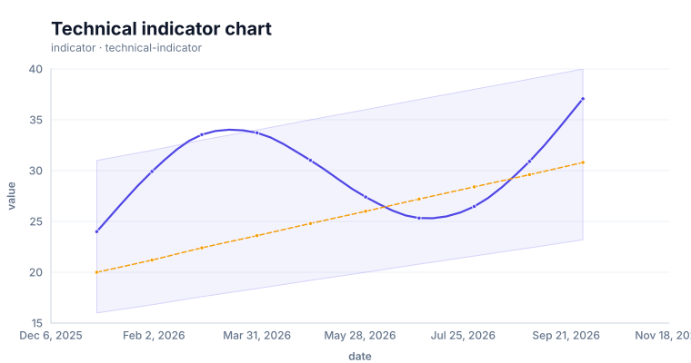

This page documents the currently implemented **Technical indicator chart** family in Graflume `0.1.0-alpha.0`. The image above is generated from the same compiled Scene used by the Canvas renderer.

## When to use it

Use this indicator chart when the visual relationship represented by **technical indicator chart** is more informative than a plain line, bar, or table. Prefer a simpler chart when the extra geometry does not add analytical meaning.

## Quick API

Import the Quick API from the opt-in complete entrypoint:

```ts
import { technicalIndicator } from 'graflume/complete';

const data = [
  {
    date: '2026-01-01',
    category: 'P1',
    value: 24,
    low: 14,
    high: 33,
    lower: 16,
    upper: 31,
    target: 29,
    width: 3,
    radius: 9,
    z: 5,
    direction: 0,
    magnitude: 5,
    speed: 10,
    signal: 20,
    secondary: 18,
    up: 42,
    down: 66,
    plus: 25,
    minus: 34,
    conversion: 21,
    base: 19,
    support: 14,
    resistance: 34,
    volume: 120,
    price: 24,
    title: 'A',
    open: 22,
    close: 25,
  },
  {
    date: '2026-02-01',
    category: 'P2',
    value: 29.915692703800314,
    low: 14.8,
    high: 34.1,
    lower: 16.8,
    upper: 32,
    target: 30,
    width: 4,
    radius: 11,
    z: 6,
    direction: 37,
    magnitude: 8,
    speed: 13,
    signal: 21.2,
    secondary: 19,
    up: 44,
    down: 64,
    plus: 26,
    minus: 33.4,
    conversion: 22,
    base: 19.9,
    support: 14.8,
    resistance: 35,
    volume: 151,
    price: 25.2,
    title: 'B',
    open: 23,
    close: 22,
  },
  {
    date: '2026-03-01',
    category: 'P3',
    value: 33.5402084373418,
    low: 15.6,
    high: 35.2,
    lower: 17.6,
    upper: 33,
    target: 31,
    width: 5,
    radius: 13,
    z: 7,
    direction: 74,
    magnitude: 11,
    speed: 16,
    signal: 22.4,
    secondary: 20,
    up: 46,
    down: 62,
    plus: 27,
    minus: 32.8,
    conversion: 23,
    base: 20.8,
    support: 15.6,
    resistance: 36,
    volume: 182,
    price: 26.4,
    title: 'C',
    open: 24,
    close: 27,
  },
  {
    date: '2026-04-01',
    category: 'P4',
    value: 33.719684225450784,
    low: 16.4,
    high: 36.3,
    lower: 18.4,
    upper: 34,
    target: 32,
    width: 6,
    radius: 15,
    z: 8,
    direction: 111,
    magnitude: 14,
    speed: 19,
    signal: 23.6,
    secondary: 21,
    up: 48,
    down: 60,
    plus: 28,
    minus: 32.2,
    conversion: 24,
    base: 21.7,
    support: 16.4,
    resistance: 37,
    volume: 213,
    price: 27.6,
    title: 'D',
    open: 25,
    close: 24,
  },
  {
    date: '2026-05-01',
    category: 'P5',
    value: 31.010335447627774,
    low: 17.2,
    high: 37.4,
    lower: 19.2,
    upper: 35,
    target: 33,
    width: 3,
    radius: 17,
    z: 9,
    direction: 148,
    magnitude: 17,
    speed: 22,
    signal: 24.8,
    secondary: 22,
    up: 50,
    down: 58,
    plus: 29,
    minus: 31.6,
    conversion: 25,
    base: 22.6,
    support: 17.2,
    resistance: 38,
    volume: 244,
    price: 28.8,
    title: 'E',
    open: 26,
    close: 29,
  },
];

technicalIndicator('#chart', data, {
  x: {
    field: 'date',
    type: 'temporal',
    title: 'date',
  },
  y: {
    field: 'value',
    type: 'quantitative',
    title: 'value',
  },
  mark: {
    fields: {
      lower: 'lower',
      upper: 'upper',
    },
    options: {
      kind: 'sma',
      fields: ['value', 'signal'],
    },
  },
  title: {
    text: 'Technical indicator chart',
    subtitle: 'indicator · technical-indicator',
  },
  accessibility: {
    label: 'Technical indicator chart example',
    description:
      'A compiled technical indicator chart example using the technical-indicator family.',
  },
});
```

## Portable ChartSpec

```json
{
  "data": [
    {
      "date": "2026-01-01",
      "category": "P1",
      "value": 24,
      "low": 14,
      "high": 33,
      "lower": 16,
      "upper": 31,
      "target": 29,
      "width": 3,
      "radius": 9,
      "z": 5,
      "direction": 0,
      "magnitude": 5,
      "speed": 10,
      "signal": 20,
      "secondary": 18,
      "up": 42,
      "down": 66,
      "plus": 25,
      "minus": 34,
      "conversion": 21,
      "base": 19,
      "support": 14,
      "resistance": 34,
      "volume": 120,
      "price": 24,
      "title": "A",
      "open": 22,
      "close": 25
    },
    {
      "date": "2026-02-01",
      "category": "P2",
      "value": 29.915692703800314,
      "low": 14.8,
      "high": 34.1,
      "lower": 16.8,
      "upper": 32,
      "target": 30,
      "width": 4,
      "radius": 11,
      "z": 6,
      "direction": 37,
      "magnitude": 8,
      "speed": 13,
      "signal": 21.2,
      "secondary": 19,
      "up": 44,
      "down": 64,
      "plus": 26,
      "minus": 33.4,
      "conversion": 22,
      "base": 19.9,
      "support": 14.8,
      "resistance": 35,
      "volume": 151,
      "price": 25.2,
      "title": "B",
      "open": 23,
      "close": 22
    },
    {
      "date": "2026-03-01",
      "category": "P3",
      "value": 33.5402084373418,
      "low": 15.6,
      "high": 35.2,
      "lower": 17.6,
      "upper": 33,
      "target": 31,
      "width": 5,
      "radius": 13,
      "z": 7,
      "direction": 74,
      "magnitude": 11,
      "speed": 16,
      "signal": 22.4,
      "secondary": 20,
      "up": 46,
      "down": 62,
      "plus": 27,
      "minus": 32.8,
      "conversion": 23,
      "base": 20.8,
      "support": 15.6,
      "resistance": 36,
      "volume": 182,
      "price": 26.4,
      "title": "C",
      "open": 24,
      "close": 27
    },
    {
      "date": "2026-04-01",
      "category": "P4",
      "value": 33.719684225450784,
      "low": 16.4,
      "high": 36.3,
      "lower": 18.4,
      "upper": 34,
      "target": 32,
      "width": 6,
      "radius": 15,
      "z": 8,
      "direction": 111,
      "magnitude": 14,
      "speed": 19,
      "signal": 23.6,
      "secondary": 21,
      "up": 48,
      "down": 60,
      "plus": 28,
      "minus": 32.2,
      "conversion": 24,
      "base": 21.7,
      "support": 16.4,
      "resistance": 37,
      "volume": 213,
      "price": 27.6,
      "title": "D",
      "open": 25,
      "close": 24
    },
    {
      "date": "2026-05-01",
      "category": "P5",
      "value": 31.010335447627774,
      "low": 17.2,
      "high": 37.4,
      "lower": 19.2,
      "upper": 35,
      "target": 33,
      "width": 3,
      "radius": 17,
      "z": 9,
      "direction": 148,
      "magnitude": 17,
      "speed": 22,
      "signal": 24.8,
      "secondary": 22,
      "up": 50,
      "down": 58,
      "plus": 29,
      "minus": 31.6,
      "conversion": 25,
      "base": 22.6,
      "support": 17.2,
      "resistance": 38,
      "volume": 244,
      "price": 28.8,
      "title": "E",
      "open": 26,
      "close": 29
    }
  ],
  "mark": {
    "type": "indicator",
    "fields": {
      "lower": "lower",
      "upper": "upper"
    },
    "options": {
      "kind": "sma",
      "fields": ["value", "signal"]
    }
  },
  "x": {
    "field": "date",
    "type": "temporal",
    "title": "date"
  },
  "y": {
    "field": "value",
    "type": "quantitative",
    "title": "value"
  },
  "title": {
    "text": "Technical indicator chart",
    "subtitle": "indicator · technical-indicator"
  },
  "accessibility": {
    "label": "Technical indicator chart example",
    "description": "A compiled technical indicator chart example using the technical-indicator family."
  }
}
```

## Canonical mapping

- User-facing family: `technical-indicator`
- Quick API: `technicalIndicator()`
- Portable mark: `indicator`
- Canonical family: `technical-indicator`
- Category: `indicator`

The family API and every compatible preset enter the same normalize, validate, scale, compiler, Scene, renderer, interaction, and accessibility path. No parallel rendering engine is created.

## Data, ordering, and missing values

The portable chart renders precomputed indicator columns. The primary line uses `y`; optional lower, upper, signal, and secondary fields are declared in `mark.fields` or `mark.options.fields`. Input order is preserved unless the mark explicitly documents a deterministic sort. Missing required values skip only the affected row; invalid specs still fail validation before compilation.

## Implemented rendering behavior

Renders portable precomputed indicator lines, bands, points, and oscillator columns using one canonical compiler. The output uses only groups, paths, lines, rectangles, circles, and text, so Canvas, snapshots, export adapters, and future renderers share the same geometry contract.

## Styling

Common `fill`, `stroke`, `opacity`, `lineWidth`, `radius`, and `cornerRadius` properties override theme defaults when the geometry supports them. Mark-specific function-free values live under `mark.options`. Themes remain responsible for background, text, grid, focus, categorical, sequential, and diverging tokens.

## Interaction and hit testing

Rendered datum shapes keep `layerId`, `rowIndex`, and the source row. Standard mode enables hit testing; large and ultra profiles may disable per-mark hit testing. Decorative grid, shadow, depth, label, and arrowhead nodes do not create duplicate datum targets.

## Accessibility

Provide a concise `accessibility.label` and a description of the main pattern. Canvas output should be paired with the runtime data-table fallback. Do not encode a required distinction only with color, depth, angle, or area.

## Performance

Scene cost is linear in rows for ordinary cases. Relationship crossings, repeated symbols, sampled curves, dense labels, and multi-line indicators can produce more than one node per row. Use `auto`, `large`, or `ultra` with aggregation when row counts grow beyond the analytical value of individual marks.

## Current limitations

Indicator values are precomputed by default. `calculate: true` currently derives SMA, EMA, WMA, DEMA, TEMA, momentum, rate of change, and relative strength; the remaining named indicators deliberately render supplied columns until the transform DAG is introduced.

## Runnable references

- Snapshot generator: [`scripts/render-series-chart-snapshots.mjs`](../../scripts/render-series-chart-snapshots.mjs)
- Catalog test: [`tests/series-chart-types.test.mjs`](../../tests/series-chart-types.test.mjs)
- Complete CDN gallery: [`examples/cdn/series-chart-types.html`](../../examples/cdn/series-chart-types.html)
