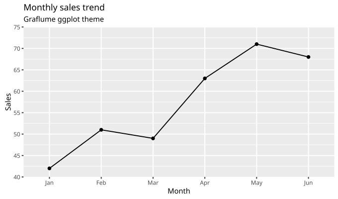

# Chart themes

Graflume ships an ordered built-in theme catalog. The current catalog is:

| Theme            | Purpose                                              |
| ---------------- | ---------------------------------------------------- |
| `graflume-light` | Graflume's presentation-oriented light design        |
| `graflume-dark`  | Graflume's presentation-oriented dark design         |
| `ggplot`         | The visual contract of ggplot2 `theme_gray()`        |
| `r-base`         | The common visual contract of R base graphics output |
| `matplotlib`     | Matplotlib 3.11.1's default visual contract          |

Do not copy that table into a closed application-side allowlist. `builtInThemeCatalog` is the ordered source of truth, and `defaultThemeId` identifies its default. A theme picker can therefore follow future built-ins without another hard-coded cycle:

```ts
import { builtInThemeCatalog, defaultThemeId } from 'graflume';

const themeOptions = builtInThemeCatalog.map(({ id, tokens }) => ({
  value: id,
  dark: tokens.mode === 'dark',
}));
```

Use the same theme name with a portable `ChartSpec`, a Quick API, or a `SpatialSpec`:

```ts
import { line } from 'graflume';

line('#chart', rows, {
  x: { field: 'month', type: 'ordinal' },
  y: { field: 'sales', type: 'quantitative' },
  theme: 'ggplot',
});
```

The named reference token objects are also exported as `graflumeGgplot`, `graflumeRBase`, and `graflumeMatplotlib`. Explicit chart, axis, legend, and mark styles continue to override the selected theme. A custom theme can extend any catalog entry without executable callbacks:

```ts
const spec = {
  // data, mark, x, and y omitted
  theme: {
    extends: 'ggplot',
    name: 'company-ggplot',
    colors: { focus: '#0057b8' },
  },
};
```

## `ggplot` reference contract

The built-in profile is pinned to ggplot2 4.0.3's default [`theme_gray()` implementation](https://github.com/tidyverse/ggplot2/blob/v4.0.3/R/theme-defaults.R). It does not silently track a future ggplot2 release.

[](../assets/charts/ggplot-theme.svg)

For Canvas charts it applies the corresponding structure and tokens:

- white plot background and `#EBEBEB` panel background, with no panel border;
- white x/y major and minor grid lines, no axis baseline, and visible `#333333` ticks;
- the 11 pt base, 8.8 pt axis/legend, and 13.2 pt plot-title typography at the browser's 96 dpi CSS conversion, all plain weight;
- ggplot2's default category-count-dependent HCL hue palette;
- the `#132B43` to `#56B1F7` default continuous colour ramp with Lab interpolation;
- square grey bars, black points and lines, `#333333` areas without an outline, butt line ends, and round joins when an equivalent Graflume mark exists.

The physical-unit conversion is fixed and tested: 11 pt is 14.6667 CSS px, 2.75 pt ticks are 3.6667 CSS px, 0.5 mm major lines are 1.8898 CSS px, and 0.25 mm minor lines are 0.9449 CSS px. Discrete colours are resolved for the complete category count instead of taking the first colours from a fixed array.

## `r-base` reference contract

The built-in profile is pinned to the [R 4.6.1 base-graphics source](https://svn.r-project.org/R/tags/R-4-6-1/src/library/graphics/R/) and [R 4.6.1 colour implementation](https://svn.r-project.org/R/tags/R-4-6-1/src/library/grDevices/R/colorstuff.R). It normalizes the device-dependent contract to a common white `png(bg = "white", pointsize = 12, res = 96)` reference and a browser canvas at 96 CSS dpi. It does not silently track a future R release.

For Canvas charts it applies the recognizable base-R defaults:

- white device, figure, and plot-region surfaces, with no automatic grid;
- black axes and outward ticks plus the complete four-sided `bty = "o"` plot box;
- the common `mar = c(5.1, 4.1, 4.1, 2.1)` and `mgp = c(3, 1, 0)` spacing mapped to the browser reference frame;
- 12 pt plain labels, centered 14.4 pt bold main titles (`adj = 0.5`, `font.main = 2`, `cex.main = 1.2`), and static rather than animated transitions;
- one-pixel black round-ended lines and an open black circle on white corresponding to `pch = 1`;
- the R 4 default palette, in order: `#000000`, `#DF536B`, `#61D04F`, `#2297E6`, `#28E2E5`, `#CD0BBC`, `#F5C710`, and `#9E9E9E`;
- square `#BEBEBE` bars with black borders, `#D3D3D3` histogram and box fills, and the base `pie()` pastel sequence of white, light blue, misty rose, light cyan, lavender, and cornsilk.

Use the same explicit override contract when the R-like chrome is wanted but a particular visual value is not:

```ts
const spec = {
  // data, mark, x, and y omitted
  theme: {
    extends: 'r-base',
    name: 'r-base-blue',
    mark: { pointFill: '#2297E6' },
    axis: { gridY: true },
  },
};
```

R high-level functions and S3 methods can choose their own domains, pretty breaks, labels, mark types, and colours. Selecting `r-base` does not run R or change Graflume data, scale, or chart-family semantics; it applies the shared visual defaults after Graflume has compiled those semantics.

## `matplotlib` reference contract

The built-in profile is pinned to Matplotlib 3.11.1's tagged [default `matplotlibrc`](https://github.com/matplotlib/matplotlib/blob/v3.11.1/lib/matplotlib/mpl-data/matplotlibrc), [tab10 colour data](https://github.com/matplotlib/matplotlib/blob/v3.11.1/lib/matplotlib/_color_data.py), and [viridis lookup table](https://github.com/matplotlib/matplotlib/blob/v3.11.1/lib/matplotlib/_cm_listed.py). It models `style.use('default')`, not the separate `classic` style, and does not silently track a future Matplotlib release.

The browser reference is Matplotlib's default 6.4 × 4.8 inch figure at 100 dpi, or 640 × 480 pixels. Its point-valued rcParams use `px = pt × 100 / 72`, so 10 pt text is 13.8889 px, a 12 pt axes title is 16.6667 px, a 1.5 pt line is 2.0833 px, a 0.8 pt spine is 1.1111 px, and a 3.5 pt tick is 4.8611 px.

For Canvas charts the profile applies the corresponding defaults:

- white figure, axes, and legend surfaces; black text; all four black 0.8 pt spines;
- primary grid lines disabled by default, with `#B0B0B0` 0.8 pt lines available when a chart enables them;
- outward primary ticks, centered normal-weight axes titles, and DejaVu Sans-first 10/12 pt typography;
- the exact ten-colour tab10 cycle beginning `#1F77B4`, `#FF7F0E`, and `#2CA02C`;
- solid 1.5 pt lines, filled 6 pt-diameter circle markers, and area fills that advance through tab10 by series, plus square 0.8-width bars, touching histogram bins, and transparent patch edges;
- unfilled black boxplots with a tab10 C1 orange median, and tab10 pie slices without visible borders;
- Matplotlib's default pie origin at zero radians and counterclockwise slice order unless the mark explicitly supplies a different start or direction;
- a white 0.8-opacity rounded legend with a `#CCCCCC` border;
- Matplotlib's complete 256-entry viridis lookup table for image, heatmap, contour, other continuous mappings, and generated continuous-legend stops. The Graflume diverging slot uses the corresponding sampled `coolwarm` reference.

These behaviours use portable generic tokens such as `colors.continuousInterpolation`, `spacing.minimumTitleBlock`, `mark.pointColorMode`, `mark.areaColorMode`, `mark.pieStartAngle`, `mark.pieDirection`, and `legend.continuousSamples`; no compiler branch checks the `matplotlib` theme id. Canvas and Spatial validation both check the new token values, so another catalog theme can reuse the same capabilities.

Matplotlib plotting functions can choose domains, locators, formatters, aspect ratios, interpolation filters, and function-specific geometry. Selecting `matplotlib` does not run Python or change Graflume data and chart-family semantics. Graflume uses responsive measured layout rather than copying fixed `figure.subplot.*` fractions at every container size; the 640 × 480 normalization reserves the same top subplot space with or without an authored title. Browser font discovery, Canvas antialiasing, WebGL lighting, and rasterisation can still differ from Matplotlib's Agg, SVG, PDF, or GUI backends.

## Coverage and limits

Every built-in theme is accepted by every one of the 41 Canvas families and all 162 Canvas presets. It also flows through all seven `graflume/spatial` variants and the Map globe mode, covering the full 44-family catalog.

For marks with a direct ggplot2 core counterpart, such as points, lines, bars, areas, intervals, distributions, tiles, contours, and flat maps, Graflume applies that counterpart's theme-facing defaults. ggplot2 core has no canonical Sankey, gauge, financial terminal chart, hierarchy, specialist 3D-style Canvas mark, WebGL volume, surface, cone, streamtube, or orbit-camera design. Those families therefore retain their Graflume geometry while inheriting the same panel, typography, hue/continuous scales, and chrome. This is the only meaningful interpretation of the ggplot2 design for a chart type that ggplot2 itself does not define.

The same boundary applies to `r-base`. Scatter, line, bar, histogram, box, pie, area, interval, contour, image, and flat-map families use the closest base-R appearance. Base graphics has no single canonical Sankey, gauge, financial terminal, hierarchy, WebGL volume, surface, cone, streamtube, or orbit-camera design. Those families keep Graflume geometry while inheriting the white plot, black typography and box, R palette, and mark chrome.

The `matplotlib` profile follows the same rule. Direct counterparts adopt the default axes, typography, tab10, patch, boxplot, pie, legend, and viridis semantics. Specialist financial, relationship, hierarchy, and WebGL families retain Graflume geometry, camera, and lighting while inheriting those surfaces, colours, and chrome.

Canvas, R graphics devices, and Matplotlib backends use different font discovery, text metrics, antialiasing, and rasterisation. The structural tokens and scale outputs are deterministic, but a browser bitmap is not promised to be byte-identical to every R or Matplotlib backend. Pin the same font, dimensions, pixel ratio, and locale when making visual reference comparisons.

Spatial WebGL has no Cartesian plot box, axes, or grid. Its viewport receives the selected panel/background, its surrounding surface and overlays receive the plot/legend colours and typography, and its mapped colours use the same theme resolvers. Camera, lighting, depth, and geometry remain Spatial concerns. Explicit `background`, layer colours, and datum colours remain authoritative.

## Theme precedence

Graflume resolves appearance in this order, from strongest to weakest:

1. explicit mark, axis, legend, or spatial background values;
2. custom values supplied by a theme extending a catalog entry;
3. the selected built-in theme profile;
4. geometry-specific safety fallbacks for an element with no direct reference counterpart.

Changing a theme never changes source data, domains, picks, datum references, interaction state, or accessibility text. It changes layout only where the selected theme's typography, margins, tick lengths, or axes require different measured space.
