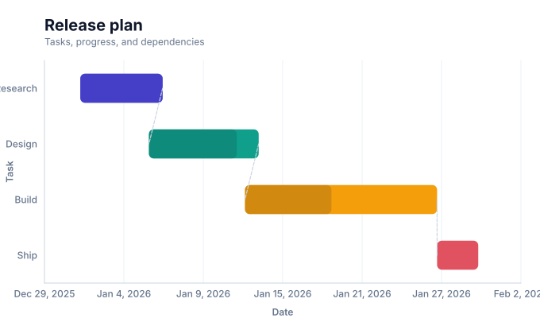
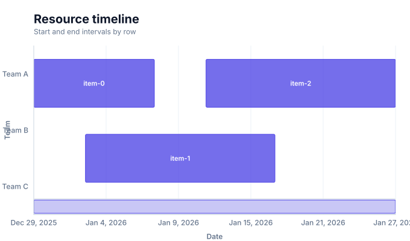
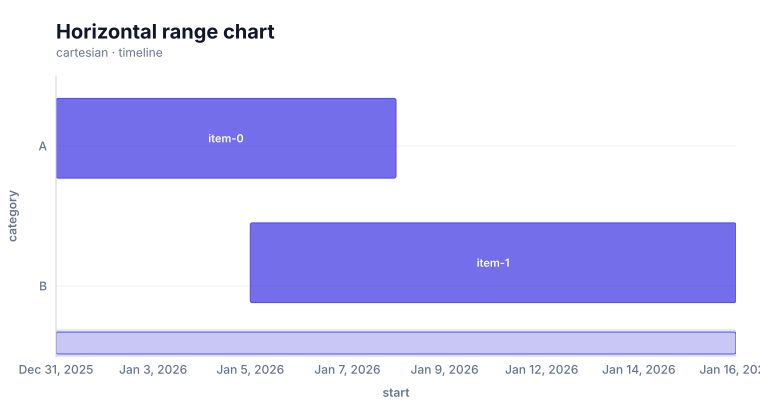

# Timelines

<!-- FAMILY_PRESETS_START -->

## Integrated presets

This is the single manual for the `timeline` family. Its canonical Quick API is `timeline()` from `graflume`, and its representative portable mark is `timeline`. The compatible names below remain callable, but they are modes or data-meaning presets rather than separate chart families.

| Compatible name                            | Quick API    | Mode      | Portable mark | Functional difference                                   |
| ------------------------------------------ | ------------ | --------- | ------------- | ------------------------------------------------------- |
| [Gantt chart](#variant-gantt)              | `gantt()`    | `gantt`   | `gantt`       | Adds task intervals, progress, and dependency fields.   |
| [Timeline](#variant-timeline)              | `timeline()` | `default` | `timeline`    | Uses dated events or intervals on an ordered time axis. |
| [Horizontal range chart](#variant-x-range) | `xRange()`   | `x-range` | `timeline`    | Uses horizontal start/end intervals per category.       |

All presets reuse the same validation, normalization, scale, compiler, renderer-neutral Scene, interaction, accessibility, and serialization contracts. Direction, curve, layout, glyph, depth, financial-body, and indicator choices stay in function-free fields or options instead of selecting a second rendering engine. The remaining manually maintained sections describe the canonical/default presentation unless a preset row above states a different behavior.

## Visual gallery

Every image below is generated from the current compiled Scene rather than drawn by hand. Select a name to jump to its data fields and implementation.

|                                                                                                                                                          |                                                                                                                                 |
| -------------------------------------------------------------------------------------------------------------------------------------------------------- | ------------------------------------------------------------------------------------------------------------------------------- |
| **[Gantt chart](#variant-gantt)**<br>[](../assets/charts/gantt.svg)                             | **[Timeline](#variant-timeline)**<br>[](../assets/charts/timeline.svg) |
| **[Horizontal range chart](#variant-x-range)**<br>[](../assets/charts/x-range.svg) |                                                                                                                                 |

## Type-by-type implementation

The snippets are minimal runnable examples. Change `#chart` to the target element and expand the inline rows with your data. Each example opts into Graflume's safe text-only tooltip with a chart-specific title and ordered fields; number and date formatting follows the declared `locale`. This family uses `trigger: "axis"` with `axis: "y"`. An exact rendered-mark hit still has priority; otherwise Graflume selects the nearest actual datum on that axis without inventing an interpolated row. Pointer tooltip triggers remain a convenience; opt into `accessibility.table` and `accessibility.navigation` for the bounded native table and keyboard mark traversal, or provide a larger domain-specific table. The Quick API applies the preset defaults while keeping the resulting specification function-free and serializable.

Every family can opt into the Canvas [inspection viewport, fullscreen, reset, and PNG controls](./interactions.md). Inspection magnifies and translates the complete already-rendered chart, including its title and axes; it is not data-domain or GIS zoom. Generated examples intentionally leave playback off. Add discrete playback only after selecting a meaningful frame field and reviewing the family-specific capability table.

Every family also accepts the shared portable [legend, highlight, selection, and callout contract](./interactions.md#legends-highlights-selection-and-callouts). Automatic legend semantics follow the compiled mark and palette where they are unambiguous; use explicit function-free items for a domain-specific series or category legend. Static datum/layer/range highlights and text-only top-level callouts remain available even when a family has no Cartesian point geometry.

<a id="variant-gantt"></a>

### Gantt chart

Use this preset when events or intervals must be placed on a temporal axis. Adds task intervals, progress, and dependency fields.

- **Quick API:** `gantt()`
- **Mode:** `gantt`
- **Portable mark:** `gantt`
- **Required example fields:** `start`, `task`, `id`, `end`, `progress`

```js
import { gantt } from 'graflume';

const data = [
  {
    start: '2026-01-01',
    task: 'Research',
    id: 'research',
    end: '2026-01-09',
    progress: 100,
  },
  {
    start: '2026-01-05',
    task: 'Data design',
    id: 'data',
    end: '2026-01-16',
    progress: 100,
  },
  {
    start: '2026-01-12',
    task: 'Prototype',
    id: 'prototype',
    end: '2026-01-25',
    progress: 86,
  },
  {
    start: '2026-01-19',
    task: 'Accessibility',
    id: 'accessibility',
    end: '2026-02-02',
    progress: 72,
  },
];

gantt('#chart', data, {
  x: {
    field: 'start',
    type: 'temporal',
    title: 'Schedule',
  },
  y: {
    field: 'task',
    type: 'ordinal',
    title: 'Workstream',
  },
  title: {
    text: 'Gantt chart',
    subtitle: 'timeline family · gantt mode',
  },
  accessibility: {
    label: 'Gantt chart: A release plan with overlapping work, progress, and a clear finish',
    description:
      'A release plan with overlapping work, progress, and a clear finish. The example uses curated, deterministic data and exposes its exact values in a semantic table.',
  },
  mark: {
    fields: {
      id: 'id',
      end: 'end',
      progress: 'progress',
    },
  },
  locale: 'en-US',
  interaction: {
    tooltip: {
      title: 'Gantt chart',
      fields: [
        {
          field: 'start',
          label: 'Schedule',
          format: 'date',
        },
        {
          field: 'task',
          label: 'Workstream',
          format: 'auto',
        },
        {
          field: 'id',
          label: 'Id',
          format: 'auto',
        },
        {
          field: 'end',
          label: 'End',
          format: 'date',
        },
        {
          field: 'progress',
          label: 'Progress',
          format: 'number',
        },
      ],
      trigger: 'axis',
      axis: 'y',
    },
  },
});
```

<a id="variant-timeline"></a>

### Timeline

Use this preset when events or intervals must be placed on a temporal axis. Uses dated events or intervals on an ordered time axis.

- **Quick API:** `timeline()`
- **Mode:** `default`
- **Portable mark:** `timeline`
- **Required example fields:** `start`, `category`, `end`

```js
import { timeline } from 'graflume';

const data = [
  {
    start: '2026-01-01',
    category: 'Research',
    end: '2026-01-09',
  },
  {
    start: '2026-01-05',
    category: 'Data design',
    end: '2026-01-16',
  },
  {
    start: '2026-01-12',
    category: 'Prototype',
    end: '2026-01-25',
  },
  {
    start: '2026-01-19',
    category: 'Accessibility',
    end: '2026-02-02',
  },
];

timeline('#chart', data, {
  x: {
    field: 'start',
    type: 'temporal',
    title: 'Schedule',
  },
  y: {
    field: 'category',
    type: 'ordinal',
    title: 'Workstream',
  },
  title: {
    text: 'Timeline',
    subtitle: 'timeline family · default mode',
  },
  accessibility: {
    label: 'Timeline: A release plan with overlapping work, progress, and a clear finish',
    description:
      'A release plan with overlapping work, progress, and a clear finish. The example uses curated, deterministic data and exposes its exact values in a semantic table.',
  },
  mark: {
    fields: {
      end: 'end',
    },
  },
  locale: 'en-US',
  interaction: {
    tooltip: {
      title: 'Timeline',
      fields: [
        {
          field: 'start',
          label: 'Schedule',
          format: 'date',
        },
        {
          field: 'category',
          label: 'Workstream',
          format: 'auto',
        },
        {
          field: 'end',
          label: 'End',
          format: 'date',
        },
      ],
      trigger: 'axis',
      axis: 'y',
    },
  },
});
```

<a id="variant-x-range"></a>

### Horizontal range chart

Use this preset when events or intervals must be placed on a temporal axis. Uses horizontal start/end intervals per category.

- **Quick API:** `xRange()`
- **Mode:** `x-range`
- **Portable mark:** `timeline`
- **Required example fields:** `start`, `category`, `end`

```js
import { xRange } from 'graflume/complete';

const data = [
  {
    start: '2026-01-01',
    category: 'Research',
    end: '2026-01-09',
  },
  {
    start: '2026-01-05',
    category: 'Data design',
    end: '2026-01-16',
  },
  {
    start: '2026-01-12',
    category: 'Prototype',
    end: '2026-01-25',
  },
  {
    start: '2026-01-19',
    category: 'Accessibility',
    end: '2026-02-02',
  },
];

xRange('#chart', data, {
  x: {
    field: 'start',
    type: 'temporal',
    title: 'Schedule',
  },
  y: {
    field: 'category',
    type: 'ordinal',
    title: 'Workstream',
  },
  title: {
    text: 'Horizontal range chart',
    subtitle: 'timeline family · x-range mode',
  },
  accessibility: {
    label:
      'Horizontal range chart: A release plan with overlapping work, progress, and a clear finish',
    description:
      'A release plan with overlapping work, progress, and a clear finish. The example uses curated, deterministic data and exposes its exact values in a semantic table.',
  },
  mark: {
    fields: {
      end: 'end',
    },
  },
  locale: 'en-US',
  interaction: {
    tooltip: {
      title: 'Horizontal range chart',
      fields: [
        {
          field: 'start',
          label: 'Schedule',
          format: 'date',
        },
        {
          field: 'category',
          label: 'Workstream',
          format: 'auto',
        },
        {
          field: 'end',
          label: 'End',
          format: 'date',
        },
      ],
      trigger: 'axis',
      axis: 'y',
    },
  },
});
```

<!-- FAMILY_PRESETS_END -->

Use a timeline to compare resource or event intervals across rows.

## Implemented appearance

This image is generated from the current Graflume `compile()` Scene, not a hand-drawn mockup.


## Quick API

`Graflume.timeline()` creates the portable `timeline` mark (or documented alias mapping) and accepts the common target, data, and options arguments.

```ts
Graflume.timeline('#chart', data, {
  x: { field: 'start', type: 'temporal' },
  y: { field: 'resource', type: 'ordinal' },
  mark: { fields: { end: 'end' } },
});
```

## Portable ChartSpec mapping

`x` names start, `fields.end` names end, and categorical `y` names the row.

The same result can be created with `Graflume.create()` and `mark: { type: 'timeline' }`. Named `mark.fields` and `mark.options` values are function-free and JSON-serializable, so they remain portable across JavaScript, future Python/R/Java builders, and stored specs.

## Data, ordering, and missing values

Start and end jointly determine the temporal domain. Each interval becomes an interactive rounded horizontal bar on a categorical y scale.

Rows keep source order unless the compiler must establish a deterministic temporal or hierarchy order. Unsafe field names are rejected, callbacks are forbidden in portable specs, and invalid or unmappable values are skipped rather than evaluated.

## Styling and themes

The mark uses shared `fill`, `stroke`, `opacity`, `lineWidth`, `radius`, and `cornerRadius` options where the geometry makes them meaningful. Default colors, text, grid, focus, and palettes come from the active design-token theme and switch at runtime.

## Interaction and accessibility

Rendered datum shapes carry layer id, row index, and the original row for hover/click hit testing in the standard profile. Supply a concise `accessibility.label`, a useful `description`, and an adjacent text or table fallback. Canvas ARIA metadata does not replace keyboard-readable page content.

Do not enable generic playback merely because this family is named Timeline. Filtering rows by their `start` value reveals whole stored intervals, including their future `end`; it is not an active-at-time calculation and it does not clip intervals at a moving cursor. A semantically correct project playback needs host logic or a future interval-aware transform. Whole-Canvas inspection remains available for visual magnification; see [Common chart interactions](./interactions.md).

## Performance profiles

The same `standard`, `large`, `ultra`, and `auto` profiles apply. Complex layout marks currently favor deterministic bounded Scene output; aggregate or filter very large source data before rendering specialized diagrams.

## Current limitations

None remain in the audited P0/current-limitations boundary as of 2026-08-26. The `current-limitations-2026-08-26` implementation moved these former limitations into executable support:

- lane packing and grouping
- milestones
- clipping and duration
- navigator

The separately cataloged P1/P2 research roadmap remains future work and is not presented as current runtime support. Exact implementation and test paths are recorded in [the completion evidence](../../catalog/graflume.current-limitations.evidence.json).

## Runnable example and regression coverage

- [default-family CDN gallery](../../examples/cdn/complete-chart-types.html)
- [Chart catalog compile tests](../../tests/extended-chart-types.test.mjs)
- [Generated visual asset](../assets/charts/timeline.svg)

[Back to chart guides](./README.md)
