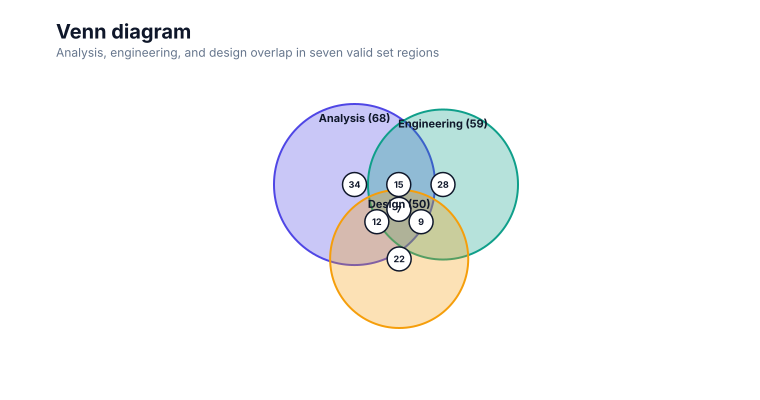

# Venn diagram

<!-- FAMILY_PRESETS_START -->

## Integrated presets

This is the single manual for the `venn` family. Its canonical Quick API is `venn()` from `graflume/complete`, and its representative portable mark is `venn`. The compatible names below remain callable, but they are modes or data-meaning presets rather than separate chart families.

| Compatible name               | Quick API | Mode      | Portable mark | Functional difference                            |
| ----------------------------- | --------- | --------- | ------------- | ------------------------------------------------ |
| [Venn diagram](#variant-venn) | `venn()`  | `default` | `venn`        | Uses the canonical presentation for this family. |

All presets reuse the same validation, normalization, scale, compiler, renderer-neutral Scene, interaction, accessibility, and serialization contracts. Direction, curve, layout, glyph, depth, financial-body, and indicator choices stay in function-free fields or options instead of selecting a second rendering engine. The remaining manually maintained sections describe the canonical/default presentation unless a preset row above states a different behavior.

## Visual gallery

Every image below is generated from the current compiled Scene rather than drawn by hand. Select a name to jump to its data fields and implementation.

|                                                                                                                             |     |
| --------------------------------------------------------------------------------------------------------------------------- | --- |
| **[Venn diagram](#variant-venn)**<br>[](../assets/charts/venn.svg) |     |

## Type-by-type implementation

The snippets are minimal runnable examples. Change `#chart` to the target element and expand the inline rows with your data. Each example opts into Graflume's safe text-only tooltip with a chart-specific title and ordered fields; number and date formatting follows the declared `locale`. This family keeps `trigger: "mark"`, so the pointer must hit rendered datum geometry. Pointer tooltip triggers remain a convenience; opt into `accessibility.table` and `accessibility.navigation` for the bounded native table and keyboard mark traversal, or provide a larger domain-specific table. The Quick API applies the preset defaults while keeping the resulting specification function-free and serializable.

Every family can opt into the Canvas [inspection viewport, fullscreen, reset, and PNG controls](./interactions.md). Inspection magnifies and translates the complete already-rendered chart, including its title and axes; it is not data-domain or GIS zoom. Generated examples intentionally leave playback off. Add discrete playback only after selecting a meaningful frame field and reviewing the family-specific capability table.

Every family also accepts the shared portable [legend, highlight, selection, and callout contract](./interactions.md#legends-highlights-selection-and-callouts). Automatic legend semantics follow the compiled mark and palette where they are unambiguous; use explicit function-free items for a domain-specific series or category legend. Static datum/layer/range highlights and text-only top-level callouts remain available even when a family has no Cartesian point geometry.

<a id="variant-venn"></a>

### Venn diagram

Use this preset when set overlap is the primary reading task. Uses the canonical presentation for this family.

- **Quick API:** `venn()`
- **Mode:** `default`
- **Portable mark:** `venn`
- **Required example fields:** `category`, `value`

```js
import { venn } from 'graflume/complete';

const data = [
  {
    category: 'P1',
    value: 24,
  },
  {
    category: 'P2',
    value: 29.916,
  },
  {
    category: 'P3',
    value: 33.54,
  },
];

venn('#chart', data, {
  x: {
    field: 'category',
    type: 'ordinal',
    title: 'category',
  },
  y: {
    field: 'value',
    type: 'quantitative',
    title: 'value',
  },
  title: {
    text: 'Venn diagram',
    subtitle: 'venn family · default mode',
  },
  accessibility: {
    label: 'Venn diagram example',
    description: 'A compiled venn diagram example using the venn family.',
  },
  axes: {
    x: false,
    y: false,
  },
  locale: 'en-US',
  interaction: {
    tooltip: {
      title: 'Venn diagram',
      fields: [
        {
          field: 'category',
          label: 'category',
          format: 'auto',
        },
        {
          field: 'value',
          label: 'value',
          format: 'number',
        },
      ],
      trigger: 'mark',
    },
  },
});
```

<!-- FAMILY_PRESETS_END -->


This page documents the currently implemented **Venn diagram** family in Graflume `0.1.0-alpha.0`. The image above is generated from the same compiled Scene used by the Canvas renderer.

## When to use it

Use this relationship chart when the visual relationship represented by **venn diagram** is more informative than a plain line, bar, or table. Prefer a simpler chart when the extra geometry does not add analytical meaning.

## Quick API

Import the Quick API from the opt-in complete entrypoint:

```ts
import { venn } from 'graflume/complete';

const data = [
  {
    date: '2026-01-01',
    category: 'P1',
    value: 24,
    low: 14,
    high: 33,
    lower: 16,
    upper: 31,
    target: 29,
    width: 3,
    radius: 9,
    z: 5,
    direction: 0,
    magnitude: 5,
    speed: 10,
    signal: 20,
    secondary: 18,
    up: 42,
    down: 66,
    plus: 25,
    minus: 34,
    conversion: 21,
    base: 19,
    support: 14,
    resistance: 34,
    volume: 120,
    price: 24,
    title: 'A',
    open: 22,
    close: 25,
  },
  {
    date: '2026-02-01',
    category: 'P2',
    value: 29.915692703800314,
    low: 14.8,
    high: 34.1,
    lower: 16.8,
    upper: 32,
    target: 30,
    width: 4,
    radius: 11,
    z: 6,
    direction: 37,
    magnitude: 8,
    speed: 13,
    signal: 21.2,
    secondary: 19,
    up: 44,
    down: 64,
    plus: 26,
    minus: 33.4,
    conversion: 22,
    base: 19.9,
    support: 14.8,
    resistance: 35,
    volume: 151,
    price: 25.2,
    title: 'B',
    open: 23,
    close: 22,
  },
  {
    date: '2026-03-01',
    category: 'P3',
    value: 33.5402084373418,
    low: 15.6,
    high: 35.2,
    lower: 17.6,
    upper: 33,
    target: 31,
    width: 5,
    radius: 13,
    z: 7,
    direction: 74,
    magnitude: 11,
    speed: 16,
    signal: 22.4,
    secondary: 20,
    up: 46,
    down: 62,
    plus: 27,
    minus: 32.8,
    conversion: 23,
    base: 20.8,
    support: 15.6,
    resistance: 36,
    volume: 182,
    price: 26.4,
    title: 'C',
    open: 24,
    close: 27,
  },
];

venn('#chart', data, {
  x: {
    field: 'category',
    type: 'ordinal',
    title: 'category',
  },
  y: {
    field: 'value',
    type: 'quantitative',
    title: 'value',
  },
  title: {
    text: 'Venn diagram',
    subtitle: 'relationship · venn',
  },
  accessibility: {
    label: 'Venn diagram example',
    description: 'A compiled venn diagram example using the venn family.',
  },
});
```

## Portable ChartSpec

```json
{
  "data": [
    {
      "date": "2026-01-01",
      "category": "P1",
      "value": 24,
      "low": 14,
      "high": 33,
      "lower": 16,
      "upper": 31,
      "target": 29,
      "width": 3,
      "radius": 9,
      "z": 5,
      "direction": 0,
      "magnitude": 5,
      "speed": 10,
      "signal": 20,
      "secondary": 18,
      "up": 42,
      "down": 66,
      "plus": 25,
      "minus": 34,
      "conversion": 21,
      "base": 19,
      "support": 14,
      "resistance": 34,
      "volume": 120,
      "price": 24,
      "title": "A",
      "open": 22,
      "close": 25
    },
    {
      "date": "2026-02-01",
      "category": "P2",
      "value": 29.915692703800314,
      "low": 14.8,
      "high": 34.1,
      "lower": 16.8,
      "upper": 32,
      "target": 30,
      "width": 4,
      "radius": 11,
      "z": 6,
      "direction": 37,
      "magnitude": 8,
      "speed": 13,
      "signal": 21.2,
      "secondary": 19,
      "up": 44,
      "down": 64,
      "plus": 26,
      "minus": 33.4,
      "conversion": 22,
      "base": 19.9,
      "support": 14.8,
      "resistance": 35,
      "volume": 151,
      "price": 25.2,
      "title": "B",
      "open": 23,
      "close": 22
    },
    {
      "date": "2026-03-01",
      "category": "P3",
      "value": 33.5402084373418,
      "low": 15.6,
      "high": 35.2,
      "lower": 17.6,
      "upper": 33,
      "target": 31,
      "width": 5,
      "radius": 13,
      "z": 7,
      "direction": 74,
      "magnitude": 11,
      "speed": 16,
      "signal": 22.4,
      "secondary": 20,
      "up": 46,
      "down": 62,
      "plus": 27,
      "minus": 32.8,
      "conversion": 23,
      "base": 20.8,
      "support": 15.6,
      "resistance": 36,
      "volume": 182,
      "price": 26.4,
      "title": "C",
      "open": 24,
      "close": 27
    }
  ],
  "mark": "venn",
  "x": {
    "field": "category",
    "type": "ordinal",
    "title": "category"
  },
  "y": {
    "field": "value",
    "type": "quantitative",
    "title": "value"
  },
  "title": {
    "text": "Venn diagram",
    "subtitle": "relationship · venn"
  },
  "accessibility": {
    "label": "Venn diagram example",
    "description": "A compiled venn diagram example using the venn family."
  },
  "axes": {
    "x": false,
    "y": false
  }
}
```

## Canonical mapping

- User-facing family: `venn`
- Quick API: `venn()`
- Portable mark: `venn`
- Canonical family: `venn`
- Category: `relationship`

The family API and every compatible preset enter the same normalize, validate, scale, compiler, Scene, renderer, interaction, and accessibility path. No parallel rendering engine is created.

## Data, ordering, and missing values

Node, parent, source, target, set, or weight fields are declared explicitly. Input order is stable and becomes the deterministic layout order. Input order is preserved unless the mark explicitly documents a deterministic sort. Missing required values skip only the affected row; invalid specs still fail validation before compilation.

## Implemented rendering behavior

Places up to six translucent value-scaled set circles in a deterministic overlap layout. The output uses only groups, paths, lines, rectangles, circles, and text, so Canvas, snapshots, export adapters, and future renderers share the same geometry contract.

## Styling

Common `fill`, `stroke`, `opacity`, `lineWidth`, `radius`, and `cornerRadius` properties override theme defaults when the geometry supports them. Mark-specific function-free values live under `mark.options`. Themes remain responsible for background, text, grid, focus, categorical, sequential, and diverging tokens.

## Interaction and hit testing

Rendered datum shapes keep `layerId`, `rowIndex`, and the source row. Standard mode enables hit testing; large and ultra profiles may disable per-mark hit testing. Decorative grid, shadow, depth, label, and arrowhead nodes do not create duplicate datum targets.

## Accessibility

Provide a concise `accessibility.label` and a description of the main pattern. Canvas output should be paired with the runtime data-table fallback. Do not encode a required distinction only with color, depth, angle, or area.

## Performance

Scene cost is linear in rows for ordinary cases. Relationship crossings, repeated symbols, sampled curves, dense labels, and multi-line indicators can produce more than one node per row. Use `auto`, `large`, or `ultra` with aggregation when row counts grow beyond the analytical value of individual marks.

## Current limitations

None remain in the audited P0/current-limitations boundary as of 2026-08-26. The `current-limitations-2026-08-26` implementation moved these former limitations into executable support:

- membership and intersection input
- proportional two/three-set solve
- quality metric and queries
- region hit

The separately cataloged P1/P2 research roadmap remains future work and is not presented as current runtime support. Exact implementation and test paths are recorded in [the completion evidence](../../catalog/graflume.current-limitations.evidence.json).

## Runnable references

- Snapshot generator: [`scripts/render-series-chart-snapshots.mjs`](../../scripts/render-series-chart-snapshots.mjs)
- Catalog test: [`tests/series-chart-types.test.mjs`](../../tests/series-chart-types.test.mjs)
- Complete CDN gallery: [`examples/cdn/series-chart-types.html`](../../examples/cdn/series-chart-types.html)
