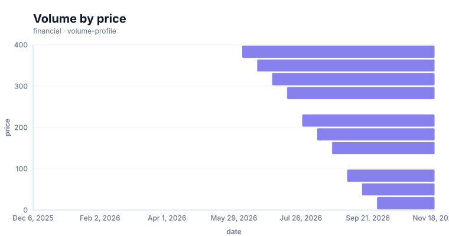
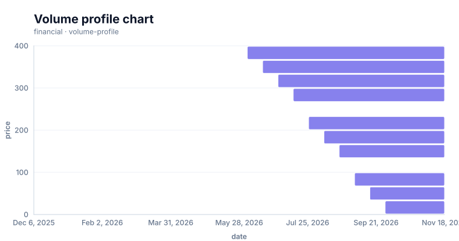

# Volume profile chart

<!-- FAMILY_PRESETS_START -->

## Integrated presets

This is the single manual for the `volume-profile` family. Its canonical Quick API is `volumeProfile()` from `graflume/complete`, and its representative portable mark is `volume-profile`. The compatible names below remain callable, but they are modes or data-meaning presets rather than separate chart families.

| Compatible name                             | Quick API         | Mode              | Portable mark    | Functional difference                                          |
| ------------------------------------------- | ----------------- | ----------------- | ---------------- | -------------------------------------------------------------- |
| [Volume by price](#variant-volume-by-price) | `volumeByPrice()` | `volume-by-price` | `volume-profile` | Bins price and aggregates volume into horizontal profile bars. |

All presets reuse the same validation, normalization, scale, compiler, renderer-neutral Scene, interaction, accessibility, and serialization contracts. Direction, curve, layout, glyph, depth, financial-body, and indicator choices stay in function-free fields or options instead of selecting a second rendering engine. The remaining manually maintained sections describe the canonical/default presentation unless a preset row above states a different behavior.

## Visual gallery

Every image below is generated from the current compiled Scene rather than drawn by hand. Select a name to jump to its data fields and implementation.

|                                                                                                                                                                    |     |
| ------------------------------------------------------------------------------------------------------------------------------------------------------------------ | --- |
| **[Volume by price](#variant-volume-by-price)**<br>[](../assets/charts/volume-by-price.svg) |     |

## Type-by-type implementation

The snippets are minimal runnable examples. Change `#chart` to the target element and expand the inline rows with your data. The Quick API applies the preset defaults while keeping the resulting specification function-free and serializable.

<a id="variant-volume-by-price"></a>

### Volume by price

Use this preset when aggregated volume must be compared across price bands. Bins price and aggregates volume into horizontal profile bars.

- **Quick API:** `volumeByPrice()`
- **Mode:** `volume-by-price`
- **Portable mark:** `volume-profile`
- **Required example fields:** `date`, `price`, `volume`

```js
import { volumeByPrice } from 'graflume/complete';

const data = [
  {
    date: '2026-01-01',
    price: 24,
    volume: 120,
  },
  {
    date: '2026-02-01',
    price: 25.2,
    volume: 151,
  },
  {
    date: '2026-03-01',
    price: 26.4,
    volume: 182,
  },
  {
    date: '2026-04-01',
    price: 27.6,
    volume: 213,
  },
];

volumeByPrice('#chart', data, {
  x: {
    field: 'date',
    type: 'temporal',
    title: 'date',
  },
  y: {
    field: 'price',
    type: 'quantitative',
    title: 'price',
  },
  title: {
    text: 'Volume by price',
    subtitle: 'volume-profile family · volume-by-price mode',
  },
  accessibility: {
    label: 'Volume by price example',
    description: 'A compiled volume by price example using the volume-profile family.',
  },
  mark: {
    fields: {
      price: 'price',
      volume: 'volume',
    },
  },
});
```

<!-- FAMILY_PRESETS_END -->



This page documents the currently implemented **Volume profile chart** family in Graflume `0.1.0-alpha.0`. The image above is generated from the same compiled Scene used by the Canvas renderer.

## When to use it

Use this financial chart when the visual relationship represented by **volume profile chart** is more informative than a plain line, bar, or table. Prefer a simpler chart when the extra geometry does not add analytical meaning.

## Quick API

Import the Quick API from the opt-in complete entrypoint:

```ts
import { volumeProfile } from 'graflume/complete';

const data = [
  {
    date: '2026-01-01',
    category: 'P1',
    value: 24,
    low: 14,
    high: 33,
    lower: 16,
    upper: 31,
    target: 29,
    width: 3,
    radius: 9,
    z: 5,
    direction: 0,
    magnitude: 5,
    speed: 10,
    signal: 20,
    secondary: 18,
    up: 42,
    down: 66,
    plus: 25,
    minus: 34,
    conversion: 21,
    base: 19,
    support: 14,
    resistance: 34,
    volume: 120,
    price: 24,
    title: 'A',
    open: 22,
    close: 25,
  },
  {
    date: '2026-02-01',
    category: 'P2',
    value: 29.915692703800314,
    low: 14.8,
    high: 34.1,
    lower: 16.8,
    upper: 32,
    target: 30,
    width: 4,
    radius: 11,
    z: 6,
    direction: 37,
    magnitude: 8,
    speed: 13,
    signal: 21.2,
    secondary: 19,
    up: 44,
    down: 64,
    plus: 26,
    minus: 33.4,
    conversion: 22,
    base: 19.9,
    support: 14.8,
    resistance: 35,
    volume: 151,
    price: 25.2,
    title: 'B',
    open: 23,
    close: 22,
  },
  {
    date: '2026-03-01',
    category: 'P3',
    value: 33.5402084373418,
    low: 15.6,
    high: 35.2,
    lower: 17.6,
    upper: 33,
    target: 31,
    width: 5,
    radius: 13,
    z: 7,
    direction: 74,
    magnitude: 11,
    speed: 16,
    signal: 22.4,
    secondary: 20,
    up: 46,
    down: 62,
    plus: 27,
    minus: 32.8,
    conversion: 23,
    base: 20.8,
    support: 15.6,
    resistance: 36,
    volume: 182,
    price: 26.4,
    title: 'C',
    open: 24,
    close: 27,
  },
  {
    date: '2026-04-01',
    category: 'P4',
    value: 33.719684225450784,
    low: 16.4,
    high: 36.3,
    lower: 18.4,
    upper: 34,
    target: 32,
    width: 6,
    radius: 15,
    z: 8,
    direction: 111,
    magnitude: 14,
    speed: 19,
    signal: 23.6,
    secondary: 21,
    up: 48,
    down: 60,
    plus: 28,
    minus: 32.2,
    conversion: 24,
    base: 21.7,
    support: 16.4,
    resistance: 37,
    volume: 213,
    price: 27.6,
    title: 'D',
    open: 25,
    close: 24,
  },
  {
    date: '2026-05-01',
    category: 'P5',
    value: 31.010335447627774,
    low: 17.2,
    high: 37.4,
    lower: 19.2,
    upper: 35,
    target: 33,
    width: 3,
    radius: 17,
    z: 9,
    direction: 148,
    magnitude: 17,
    speed: 22,
    signal: 24.8,
    secondary: 22,
    up: 50,
    down: 58,
    plus: 29,
    minus: 31.6,
    conversion: 25,
    base: 22.6,
    support: 17.2,
    resistance: 38,
    volume: 244,
    price: 28.8,
    title: 'E',
    open: 26,
    close: 29,
  },
];

volumeProfile('#chart', data, {
  x: {
    field: 'date',
    type: 'temporal',
    title: 'date',
  },
  y: {
    field: 'price',
    type: 'quantitative',
    title: 'price',
  },
  mark: {
    fields: {
      price: 'price',
      volume: 'volume',
    },
  },
  title: {
    text: 'Volume profile chart',
    subtitle: 'financial · volume-profile',
  },
  accessibility: {
    label: 'Volume profile chart example',
    description: 'A compiled volume profile chart example using the volume-profile family.',
  },
});
```

## Portable ChartSpec

```json
{
  "data": [
    {
      "date": "2026-01-01",
      "category": "P1",
      "value": 24,
      "low": 14,
      "high": 33,
      "lower": 16,
      "upper": 31,
      "target": 29,
      "width": 3,
      "radius": 9,
      "z": 5,
      "direction": 0,
      "magnitude": 5,
      "speed": 10,
      "signal": 20,
      "secondary": 18,
      "up": 42,
      "down": 66,
      "plus": 25,
      "minus": 34,
      "conversion": 21,
      "base": 19,
      "support": 14,
      "resistance": 34,
      "volume": 120,
      "price": 24,
      "title": "A",
      "open": 22,
      "close": 25
    },
    {
      "date": "2026-02-01",
      "category": "P2",
      "value": 29.915692703800314,
      "low": 14.8,
      "high": 34.1,
      "lower": 16.8,
      "upper": 32,
      "target": 30,
      "width": 4,
      "radius": 11,
      "z": 6,
      "direction": 37,
      "magnitude": 8,
      "speed": 13,
      "signal": 21.2,
      "secondary": 19,
      "up": 44,
      "down": 64,
      "plus": 26,
      "minus": 33.4,
      "conversion": 22,
      "base": 19.9,
      "support": 14.8,
      "resistance": 35,
      "volume": 151,
      "price": 25.2,
      "title": "B",
      "open": 23,
      "close": 22
    },
    {
      "date": "2026-03-01",
      "category": "P3",
      "value": 33.5402084373418,
      "low": 15.6,
      "high": 35.2,
      "lower": 17.6,
      "upper": 33,
      "target": 31,
      "width": 5,
      "radius": 13,
      "z": 7,
      "direction": 74,
      "magnitude": 11,
      "speed": 16,
      "signal": 22.4,
      "secondary": 20,
      "up": 46,
      "down": 62,
      "plus": 27,
      "minus": 32.8,
      "conversion": 23,
      "base": 20.8,
      "support": 15.6,
      "resistance": 36,
      "volume": 182,
      "price": 26.4,
      "title": "C",
      "open": 24,
      "close": 27
    },
    {
      "date": "2026-04-01",
      "category": "P4",
      "value": 33.719684225450784,
      "low": 16.4,
      "high": 36.3,
      "lower": 18.4,
      "upper": 34,
      "target": 32,
      "width": 6,
      "radius": 15,
      "z": 8,
      "direction": 111,
      "magnitude": 14,
      "speed": 19,
      "signal": 23.6,
      "secondary": 21,
      "up": 48,
      "down": 60,
      "plus": 28,
      "minus": 32.2,
      "conversion": 24,
      "base": 21.7,
      "support": 16.4,
      "resistance": 37,
      "volume": 213,
      "price": 27.6,
      "title": "D",
      "open": 25,
      "close": 24
    },
    {
      "date": "2026-05-01",
      "category": "P5",
      "value": 31.010335447627774,
      "low": 17.2,
      "high": 37.4,
      "lower": 19.2,
      "upper": 35,
      "target": 33,
      "width": 3,
      "radius": 17,
      "z": 9,
      "direction": 148,
      "magnitude": 17,
      "speed": 22,
      "signal": 24.8,
      "secondary": 22,
      "up": 50,
      "down": 58,
      "plus": 29,
      "minus": 31.6,
      "conversion": 25,
      "base": 22.6,
      "support": 17.2,
      "resistance": 38,
      "volume": 244,
      "price": 28.8,
      "title": "E",
      "open": 26,
      "close": 29
    }
  ],
  "mark": {
    "type": "volume-profile",
    "fields": {
      "price": "price",
      "volume": "volume"
    }
  },
  "x": {
    "field": "date",
    "type": "temporal",
    "title": "date"
  },
  "y": {
    "field": "price",
    "type": "quantitative",
    "title": "price"
  },
  "title": {
    "text": "Volume profile chart",
    "subtitle": "financial · volume-profile"
  },
  "accessibility": {
    "label": "Volume profile chart example",
    "description": "A compiled volume profile chart example using the volume-profile family."
  }
}
```

## Canonical mapping

- User-facing family: `volume-profile`
- Quick API: `volumeProfile()`
- Portable mark: `volume-profile`
- Canonical family: `volume-profile`
- Category: `financial`

The family API and every compatible preset enter the same normalize, validate, scale, compiler, Scene, renderer, interaction, and accessibility path. No parallel rendering engine is created.

## Data, ordering, and missing values

Time or ordered categories use `x`. Price, volume, event, and open/high/low/close channels use `y` plus the named `mark.fields` shown in the example. Input order is preserved unless the mark explicitly documents a deterministic sort. Missing required values skip only the affected row; invalid specs still fail validation before compilation.

## Implemented rendering behavior

Bins price and aggregates volume into horizontal bars aligned to the price range. The output uses only groups, paths, lines, rectangles, circles, and text, so Canvas, snapshots, export adapters, and future renderers share the same geometry contract.

## Styling

Common `fill`, `stroke`, `opacity`, `lineWidth`, `radius`, and `cornerRadius` properties override theme defaults when the geometry supports them. Mark-specific function-free values live under `mark.options`. Themes remain responsible for background, text, grid, focus, categorical, sequential, and diverging tokens.

## Interaction and hit testing

Rendered datum shapes keep `layerId`, `rowIndex`, and the source row. Standard mode enables hit testing; large and ultra profiles may disable per-mark hit testing. Decorative grid, shadow, depth, label, and arrowhead nodes do not create duplicate datum targets.

## Accessibility

Provide a concise `accessibility.label` and a description of the main pattern. Canvas output should be paired with the runtime data-table fallback. Do not encode a required distinction only with color, depth, angle, or area.

## Performance

Scene cost is linear in rows for ordinary cases. Relationship crossings, repeated symbols, sampled curves, dense labels, and multi-line indicators can produce more than one node per row. Use `auto`, `large`, or `ultra` with aggregation when row counts grow beyond the analytical value of individual marks.

## Current limitations

This alpha implementation covers the documented data meaning and Scene output. Domain-specific editing tools, animation choreography, and very-large-data GPU paths remain separate follow-up work.

## Runnable references

- Snapshot generator: [`scripts/render-series-chart-snapshots.mjs`](../../scripts/render-series-chart-snapshots.mjs)
- Catalog test: [`tests/series-chart-types.test.mjs`](../../tests/series-chart-types.test.mjs)
- Complete CDN gallery: [`examples/cdn/series-chart-types.html`](../../examples/cdn/series-chart-types.html)
