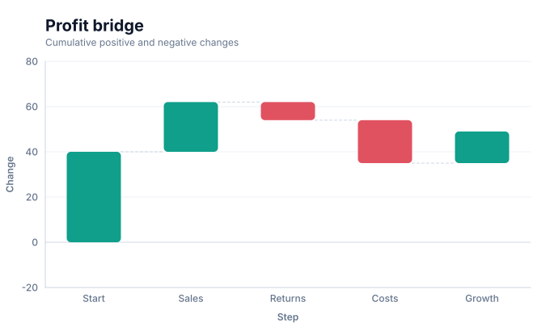

# Waterfall charts

<!-- FAMILY_PRESETS_START -->

## Integrated presets

This is the single manual for the `waterfall` family. Its canonical Quick API is `waterfall()` from `graflume`, and its representative portable mark is `waterfall`. The compatible names below remain callable, but they are modes or data-meaning presets rather than separate chart families.

| Compatible name                       | Quick API     | Mode      | Portable mark | Functional difference                            |
| ------------------------------------- | ------------- | --------- | ------------- | ------------------------------------------------ |
| [Waterfall chart](#variant-waterfall) | `waterfall()` | `default` | `waterfall`   | Uses the canonical presentation for this family. |

All presets reuse the same validation, normalization, scale, compiler, renderer-neutral Scene, interaction, accessibility, and serialization contracts. Direction, curve, layout, glyph, depth, financial-body, and indicator choices stay in function-free fields or options instead of selecting a second rendering engine. The remaining manually maintained sections describe the canonical/default presentation unless a preset row above states a different behavior.

## Visual gallery

Every image below is generated from the current compiled Scene rather than drawn by hand. Select a name to jump to its data fields and implementation.

|                                                                                                                                                  |     |
| ------------------------------------------------------------------------------------------------------------------------------------------------ | --- |
| **[Waterfall chart](#variant-waterfall)**<br>[](../assets/charts/waterfall.svg) |     |

## Type-by-type implementation

The snippets are minimal runnable examples. Change `#chart` to the target element and expand the inline rows with your data. Each example opts into Graflume's safe text-only tooltip with a chart-specific title and ordered fields; number and date formatting follows the declared `locale`. This family uses `trigger: "axis"` with `axis: "x"`. An exact rendered-mark hit still has priority; otherwise Graflume selects the nearest actual datum on that axis without inventing an interpolated row. Tooltip interaction is a pointer-only convenience, so keep a readable summary or data table available for exact values and keyboard access. The Quick API applies the preset defaults while keeping the resulting specification function-free and serializable.

<a id="variant-waterfall"></a>

### Waterfall chart

Use this preset when a sequence of positive and negative contributions must explain a total. Uses the canonical presentation for this family.

- **Quick API:** `waterfall()`
- **Mode:** `default`
- **Portable mark:** `waterfall`
- **Required example fields:** `category`, `value`

```js
import { waterfall } from 'graflume';

const data = [
  {
    category: 'Start',
    value: 40,
  },
  {
    category: 'Sales',
    value: 22,
  },
  {
    category: 'Returns',
    value: -8,
  },
  {
    category: 'Costs',
    value: -19,
  },
];

waterfall('#chart', data, {
  x: {
    field: 'category',
    type: 'ordinal',
    title: 'category',
  },
  y: {
    field: 'value',
    type: 'quantitative',
    title: 'value',
  },
  title: {
    text: 'Waterfall chart',
    subtitle: 'waterfall family · default mode',
  },
  accessibility: {
    label: 'Waterfall chart example',
    description: 'A compiled waterfall chart example using the waterfall family.',
  },
  locale: 'en-US',
  interaction: {
    tooltip: {
      title: 'Waterfall chart',
      fields: [
        {
          field: 'category',
          label: 'category',
          format: 'auto',
        },
        {
          field: 'value',
          label: 'value',
          format: 'number',
        },
      ],
      trigger: 'axis',
      axis: 'x',
    },
  },
});
```

<!-- FAMILY_PRESETS_END -->

Use a waterfall chart to explain how signed changes lead from one cumulative state to another.

## Implemented appearance

This image is generated from the current Graflume `compile()` Scene, not a hand-drawn mockup.


## Quick API

`Graflume.waterfall()` creates the portable `waterfall` mark (or documented alias mapping) and accepts the common target, data, and options arguments.

```ts
Graflume.waterfall('#chart', data, {
  x: { field: 'step', type: 'ordinal' },
  y: { field: 'delta', type: 'quantitative' },
});
```

## Portable ChartSpec mapping

`x` supplies ordered step labels and quantitative `y` supplies signed deltas.

The same result can be created with `Graflume.create()` and `mark: { type: 'waterfall' }`. Named `mark.fields` and `mark.options` values are function-free and JSON-serializable, so they remain portable across JavaScript, future Python/R/Java builders, and stored specs.

## Data, ordering, and missing values

The y domain includes every cumulative intermediate total. Positive and negative bars use different colors and connectors preserve the running level.

Rows keep source order unless the compiler must establish a deterministic temporal or hierarchy order. Unsafe field names are rejected, callbacks are forbidden in portable specs, and invalid or unmappable values are skipped rather than evaluated.

## Styling and themes

The mark uses shared `fill`, `stroke`, `opacity`, `lineWidth`, `radius`, and `cornerRadius` options where the geometry makes them meaningful. Default colors, text, grid, focus, and palettes come from the active design-token theme and switch at runtime.

## Interaction and accessibility

Rendered datum shapes carry layer id, row index, and the original row for hover/click hit testing in the standard profile. Supply a concise `accessibility.label`, a useful `description`, and an adjacent text or table fallback. Canvas ARIA metadata does not replace keyboard-readable page content.

## Performance profiles

The same `standard`, `large`, `ultra`, and `auto` profiles apply. Complex layout marks currently favor deterministic bounded Scene output; aggregate or filter very large source data before rendering specialized diagrams.

## Current limitations

Explicit subtotal/total rows, horizontal orientation, stack segments, and data labels are not implemented yet.

## Runnable example and regression coverage

- [default-family CDN gallery](../../examples/cdn/complete-chart-types.html)
- [Chart catalog compile tests](../../tests/extended-chart-types.test.mjs)
- [Generated visual asset](../assets/charts/waterfall.svg)

[Back to chart guides](./README.md)
