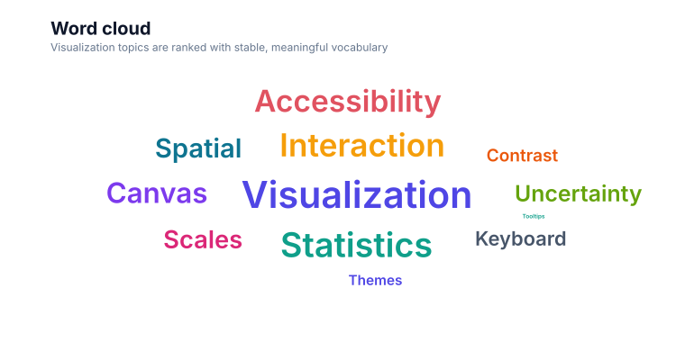

# Word cloud

<!-- FAMILY_PRESETS_START -->

## Integrated presets

This is the single manual for the `word-cloud` family. Its canonical Quick API is `wordCloud()` from `graflume/complete`, and its representative portable mark is `word-cloud`. The compatible names below remain callable, but they are modes or data-meaning presets rather than separate chart families.

| Compatible name                   | Quick API     | Mode      | Portable mark | Functional difference                            |
| --------------------------------- | ------------- | --------- | ------------- | ------------------------------------------------ |
| [Word cloud](#variant-word-cloud) | `wordCloud()` | `default` | `word-cloud`  | Uses the canonical presentation for this family. |

All presets reuse the same validation, normalization, scale, compiler, renderer-neutral Scene, interaction, accessibility, and serialization contracts. Direction, curve, layout, glyph, depth, financial-body, and indicator choices stay in function-free fields or options instead of selecting a second rendering engine. The remaining manually maintained sections describe the canonical/default presentation unless a preset row above states a different behavior.

## Visual gallery

Every image below is generated from the current compiled Scene rather than drawn by hand. Select a name to jump to its data fields and implementation.

|                                                                                                                                           |     |
| ----------------------------------------------------------------------------------------------------------------------------------------- | --- |
| **[Word cloud](#variant-word-cloud)**<br>[](../assets/charts/word-cloud.svg) |     |

## Type-by-type implementation

The snippets are minimal runnable examples. Change `#chart` to the target element and expand the inline rows with your data. The Quick API applies the preset defaults while keeping the resulting specification function-free and serializable.

<a id="variant-word-cloud"></a>

### Word cloud

Use this preset when relative word weight needs a compact overview. Uses the canonical presentation for this family.

- **Quick API:** `wordCloud()`
- **Mode:** `default`
- **Portable mark:** `word-cloud`
- **Required example fields:** `word`, `weight`

```js
import { wordCloud } from 'graflume/complete';

const data = [
  {
    word: 'Analytics',
    weight: 92,
  },
  {
    word: 'Canvas',
    weight: 76,
  },
  {
    word: 'Portable',
    weight: 69,
  },
  {
    word: 'Scene',
    weight: 61,
  },
];

wordCloud('#chart', data, {
  x: {
    field: 'word',
    type: 'ordinal',
    title: 'word',
  },
  y: {
    field: 'weight',
    type: 'quantitative',
    title: 'weight',
  },
  title: {
    text: 'Word cloud',
    subtitle: 'word-cloud family · default mode',
  },
  accessibility: {
    label: 'Word cloud example',
    description: 'A compiled word cloud example using the word-cloud family.',
  },
  axes: {
    x: false,
    y: false,
  },
});
```

<!-- FAMILY_PRESETS_END -->


This page documents the currently implemented **Word cloud** family in Graflume `0.1.0-alpha.0`. The image above is generated from the same compiled Scene used by the Canvas renderer.

## When to use it

Use this relationship chart when the visual relationship represented by **word cloud** is more informative than a plain line, bar, or table. Prefer a simpler chart when the extra geometry does not add analytical meaning.

## Quick API

Import the Quick API from the opt-in complete entrypoint:

```ts
import { wordCloud } from 'graflume/complete';

const data = [
  {
    word: 'Analytics',
    weight: 92,
  },
  {
    word: 'Canvas',
    weight: 76,
  },
  {
    word: 'Portable',
    weight: 69,
  },
  {
    word: 'Scene',
    weight: 61,
  },
  {
    word: 'Scale',
    weight: 53,
  },
];

wordCloud('#chart', data, {
  x: {
    field: 'word',
    type: 'ordinal',
    title: 'word',
  },
  y: {
    field: 'weight',
    type: 'quantitative',
    title: 'weight',
  },
  title: {
    text: 'Word cloud',
    subtitle: 'relationship · word-cloud',
  },
  accessibility: {
    label: 'Word cloud example',
    description: 'A compiled word cloud example using the word-cloud family.',
  },
});
```

## Portable ChartSpec

```json
{
  "data": [
    {
      "word": "Analytics",
      "weight": 92
    },
    {
      "word": "Canvas",
      "weight": 76
    },
    {
      "word": "Portable",
      "weight": 69
    },
    {
      "word": "Scene",
      "weight": 61
    },
    {
      "word": "Scale",
      "weight": 53
    }
  ],
  "mark": "word-cloud",
  "x": {
    "field": "word",
    "type": "ordinal",
    "title": "word"
  },
  "y": {
    "field": "weight",
    "type": "quantitative",
    "title": "weight"
  },
  "title": {
    "text": "Word cloud",
    "subtitle": "relationship · word-cloud"
  },
  "accessibility": {
    "label": "Word cloud example",
    "description": "A compiled word cloud example using the word-cloud family."
  },
  "axes": {
    "x": false,
    "y": false
  }
}
```

## Canonical mapping

- User-facing family: `word-cloud`
- Quick API: `wordCloud()`
- Portable mark: `word-cloud`
- Canonical family: `word-cloud`
- Category: `relationship`

The family API and every compatible preset enter the same normalize, validate, scale, compiler, Scene, renderer, interaction, and accessibility path. No parallel rendering engine is created.

## Data, ordering, and missing values

Node, parent, source, target, set, or weight fields are declared explicitly. Input order is stable and becomes the deterministic layout order. Input order is preserved unless the mark explicitly documents a deterministic sort. Missing required values skip only the affected row; invalid specs still fail validation before compilation.

## Implemented rendering behavior

Maps weight into type size and places words on a deterministic spiral. The output uses only groups, paths, lines, rectangles, circles, and text, so Canvas, snapshots, export adapters, and future renderers share the same geometry contract.

## Styling

Common `fill`, `stroke`, `opacity`, `lineWidth`, `radius`, and `cornerRadius` properties override theme defaults when the geometry supports them. Mark-specific function-free values live under `mark.options`. Themes remain responsible for background, text, grid, focus, categorical, sequential, and diverging tokens.

## Interaction and hit testing

Rendered datum shapes keep `layerId`, `rowIndex`, and the source row. Standard mode enables hit testing; large and ultra profiles may disable per-mark hit testing. Decorative grid, shadow, depth, label, and arrowhead nodes do not create duplicate datum targets.

## Accessibility

Provide a concise `accessibility.label` and a description of the main pattern. Canvas output should be paired with the runtime data-table fallback. Do not encode a required distinction only with color, depth, angle, or area.

## Performance

Scene cost is linear in rows for ordinary cases. Relationship crossings, repeated symbols, sampled curves, dense labels, and multi-line indicators can produce more than one node per row. Use `auto`, `large`, or `ultra` with aggregation when row counts grow beyond the analytical value of individual marks.

## Current limitations

The deterministic spiral is bounded for portability; it does not run an iterative collision solver or rotate text arbitrarily.

## Runnable references

- Snapshot generator: [`scripts/render-series-chart-snapshots.mjs`](../../scripts/render-series-chart-snapshots.mjs)
- Catalog test: [`tests/series-chart-types.test.mjs`](../../tests/series-chart-types.test.mjs)
- Complete CDN gallery: [`examples/cdn/series-chart-types.html`](../../examples/cdn/series-chart-types.html)
