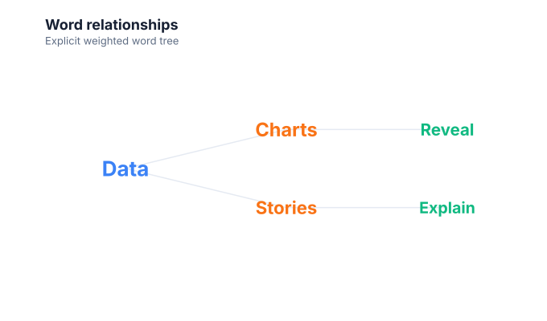

# Word trees

Use a word tree to show an explicit weighted hierarchy of terms.

## Implemented appearance

This image is generated from the current Graflume `compile()` Scene, not a hand-drawn mockup.



## Quick API

`Graflume.wordTree()` creates the portable `word-tree` mark (or documented alias mapping) and accepts the common target, data, and options arguments.

```ts
Graflume.wordTree('#chart', data, {
  x: { field: 'word', type: 'nominal' },
  y: { field: 'weight', type: 'quantitative' },
  mark: { fields: { parent: 'parent' } },
});
```

## Portable ChartSpec mapping

`x` names the word/node, `y` supplies weight, and `fields.parent` supplies the parent word. A blank parent creates a root.

The same result can be created with `Graflume.create()` and `mark: { type: 'word-tree' }`. Named `mark.fields` and `mark.options` values are function-free and JSON-serializable, so they remain portable across JavaScript, future Python/R/Java builders, and stored specs.

## Data, ordering, and missing values

Words are arranged by hierarchy depth, connected with branch lines, and sized by the square root of weight.

Rows keep source order unless the compiler must establish a deterministic temporal or hierarchy order. Unsafe field names are rejected, callbacks are forbidden in portable specs, and invalid or unmappable values are skipped rather than evaluated.

## Styling and themes

The mark uses shared `fill`, `stroke`, `opacity`, `lineWidth`, `radius`, and `cornerRadius` options where the geometry makes them meaningful. Default colors, text, grid, focus, and palettes come from the active design-token theme and switch at runtime.

## Interaction and accessibility

Rendered datum shapes carry layer id, row index, and the original row for hover/click hit testing in the standard profile. Supply a concise `accessibility.label`, a useful `description`, and an adjacent text or table fallback. Canvas ARIA metadata does not replace keyboard-readable page content.

## Performance profiles

The same `standard`, `large`, `ultra`, and `auto` profiles apply. Complex layout marks currently favor deterministic bounded Scene output; aggregate or filter very large source data before rendering specialized diagrams.

## Current limitations

Implicit phrase tokenization, prefix/suffix/double modes, collision avoidance, and click-to-reroot navigation are not implemented yet.

## Runnable example and regression coverage

- [31-type standalone CDN gallery](../../examples/cdn/complete-chart-types.html)
- [Chart catalog compile tests](../../tests/extended-chart-types.test.mjs)
- [Generated visual asset](../assets/charts/word-tree.svg)

[Back to chart guides](./README.md)
