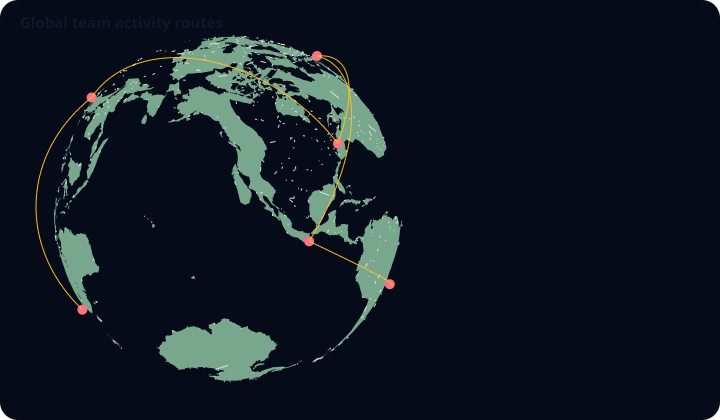

# Map: globe spatial mode

`globe()` extends the existing canonical `map` family with an opt-in spherical mode. It is deliberately cataloged as `map / globe`, not as another canonical family.



The compiler wraps the bundled Natural Earth 1:110m Admin-0 country polygons around a sphere, renders land, ocean, and country outlines, and can add point observations and great-circle routes.

```js
const chart = GraflumeSpatial.globe(
  '#world',
  {
    points: [
      { longitude: 126.978, latitude: 37.5665, label: 'Seoul', value: 96 },
      { longitude: -74.006, latitude: 40.7128, label: 'New York', value: 88 },
    ],
    routes: [
      {
        from: [126.978, 37.5665],
        to: [-74.006, 40.7128],
        label: 'Seoul–New York',
      },
    ],
  },
  {
    oceanColor: '#0f2f57',
    landColor: '#84a98c',
    borderColor: '#d7e3d5',
    pointColor: '#fb7185',
    routeColor: '#fbbf24',
  },
);
```

## Data and interaction

Point longitude is bounded to `-180..180` and latitude to `-90..90`; `label`, `value`, `color`, and `size` are optional. Routes require `from` and `to` longitude/latitude pairs and may add `label`, `value`, and `color`. `routeSegments` is bounded to 8 through 128.

Orbit is the natural primary navigation. Exact projected point, route midpoint, and country-label targets feed the tooltip through a depth-aware identifier pass, so a target on the far side of the sphere cannot win from its two-dimensional proximity alone. The accessible table prioritizes supplied point and route rows, then includes bounded country rows. The spherical map has no Cartesian axes.

## Source and boundary

The Natural Earth data bundled in `src/geography/natural-earth-world-110m.generated.ts` is public-domain data. Graflume itself remains `UNLICENSED`; the data terms do not create a software license. The small-scale boundary data follows Natural Earth's de facto boundary policy and is intended for statistical reference, not legal or diplomatic authority.

No tile provider, geocoder, basemap API, network fetch, access token, or request quota is involved at browser runtime. This mode is a statistical globe, not a street map or general GIS engine. The land fill uses the bundled polygon rings on the sphere; very detailed local geography is outside the 1:110m source resolution.
