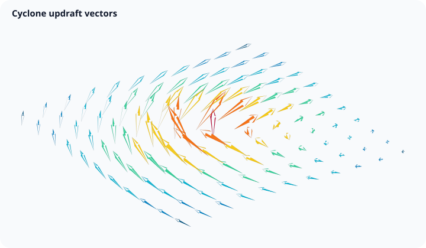
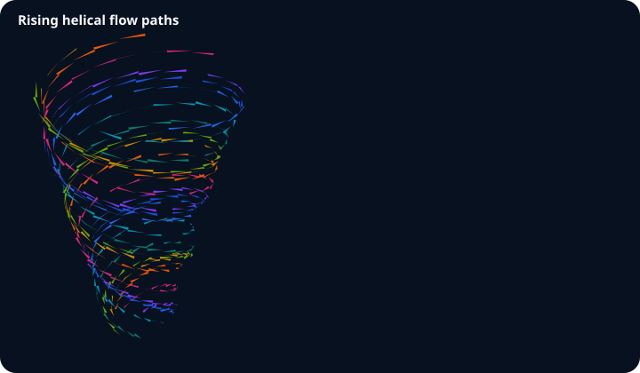
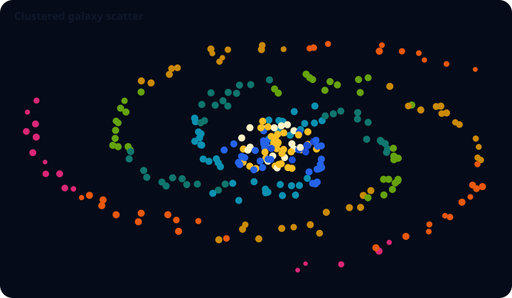

# Spatial vector

`spatial-vector` combines directional glyphs, ordered flow paths, and unconnected spatial observations. These modes share the camera, lighting, interaction, renderer, and `SpatialSpec 0.1` lifecycle while preserving distinct data meanings.

## Vector cone



`vectorCone()` pairs every origin with one vector. The vector controls direction and magnitude; `scale` affects length and `radius` scales the cone base.

```js
GraflumeSpatial.vectorCone(
  '#vectors',
  {
    origins: [
      [0, 0, 0],
      [1, 0, 0],
    ],
    vectors: [
      [0.3, 1, 0.2],
      [-0.4, 0.8, 0.5],
    ],
    labels: ['north flow', 'cross flow'],
  },
  { radius: 0.12, scale: 0.8, segments: 12 },
);
```

Zero-length vectors do not emit geometry. A pick exposes `x`, `y`, `z`, `dx`, `dy`, `dz`, `magnitude`, and `label`.

## Streamtube



`streamtube()` wraps a connected tube around each ordered path. It communicates the trajectory already present in the input; it does not numerically integrate a vector field.

```js
GraflumeSpatial.streamtube(
  '#streams',
  {
    paths: [
      [
        [0, 0, 0],
        [1, 0.4, 0.2],
        [2, 0.8, -0.1],
      ],
    ],
    labels: ['primary flow'],
    colors: ['#2563eb'],
  },
  { radius: 0.04, segments: 10 },
);
```

Every path needs at least two points. A pick exposes `path`, `point`, `x`, `y`, `z`, and `label`.

## Spatial scatter



`spatialScatter()` draws depth-tested point observations. Optional `values`, `sizes`, `colors`, and `labels` are parallel to `positions`.

```js
GraflumeSpatial.spatialScatter(
  '#observations',
  {
    positions: [
      [-1, 0, 0],
      [0, 1, 0.5],
      [1, -0.2, -0.5],
    ],
    values: [12, 20, 16],
    sizes: [6, 10, 8],
    labels: ['A', 'B', 'C'],
  },
  { pointSize: 7 },
);
```

A pick exposes `x`, `y`, `z`, `value`, `size`, and `label`. This mode belongs to the spatial-vector entry because it shares its unstructured spatial-coordinate contract; it does not replace the normal 2D scatter family.

## Bounds and performance

Cone mode accepts at most 250,000 origin/vector pairs. Streamtube mode accepts at most 4,096 paths and 1,000,000 total input points. Cone and tube cross-sections accept 5 through 48 segments. Scatter accepts at most 1,000,000 input points. Parallel arrays must have exact matching lengths, and all coordinates must be finite. Scene-wide derived geometry, index, pick-target, and estimated-memory budgets are checked after applying cone or tube segments, so these independent input maxima cannot all be reached at once. Reduce tube segments and accessible rows before increasing scene density.
