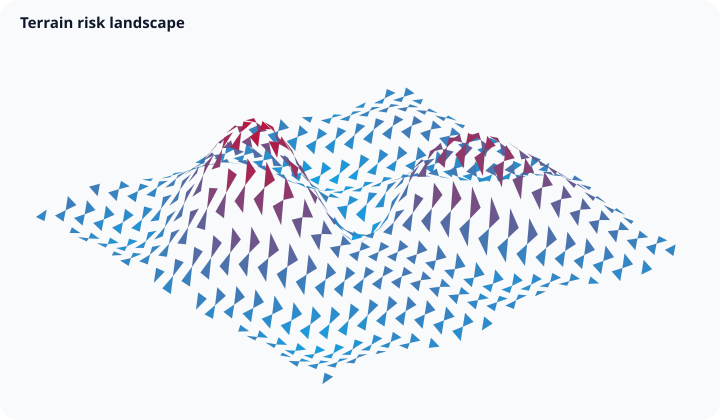
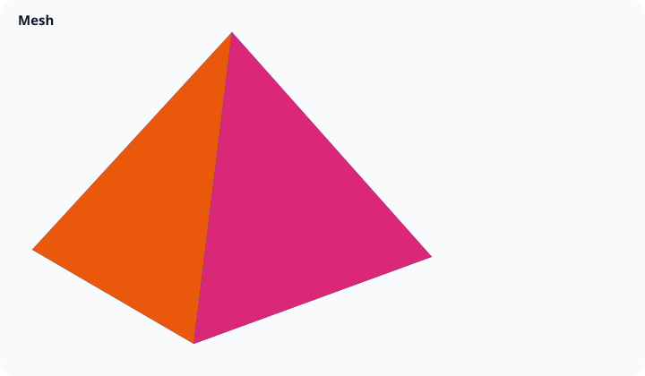

# Surface and mesh

The `surface` canonical family contains two modes with different data topology. Both compile to lit, depth-tested GPU triangles and expose vertex-level pick targets.

## Surface grid



Use `surface()` for a regular `rows × columns` grid. `z` supplies height values in row-major order. Optional `x` and `y` arrays replace column and row indices; optional `values` drives the color gradient while `z` still controls geometry.

The compiled preview and browser gallery use a filled 35×35 terrain with two peaks, a basin, and a rippled ridge. Its 1,225 vertices receive a continuous scalar color gradient, generated normals, two-sided lighting, and a camera framed to keep the terrain prominent. `wireframe` remains an explicit diagnostic/style option rather than the representative default.

```html
<div id="terrain" style="height: 420px"></div>
<script>
  const chart = GraflumeSpatial.surface(
    '#terrain',
    {
      rows: 3,
      columns: 3,
      x: [-1, 0, 1],
      y: [-1, 0, 1],
      z: [0, 0.4, 0, 0.4, 1, 0.4, 0, 0.4, 0],
    },
    {
      title: 'Response surface',
      color: '#6d28d9',
      interaction: { tooltip: true, controls: true, wheel: 'modifier' },
    },
  );
</script>
```

Required invariants:

- `rows` and `columns` are integers from 2 through 2,048.
- `rows × columns` is at most 1,000,000.
- `z` and `values` have exactly `rows × columns` finite values.
- `x` has exactly `columns` values and `y` exactly `rows` when provided.

`normalMode: "smooth"` (the default) averages adjacent unit-face normals at shared vertices. `normalMode: "flat"` deterministically expands the indexed surface into a triangle soup so each face owns one exact normal. `wireframe: true` keeps the legacy wire-only primitive. Use `wireOverlay` to draw the filled triangles and their GPU line edges together:

```js
GraflumeSpatial.surface('#terrain', data, {
  normalMode: 'flat',
  wireOverlay: { color: '#111827', opacity: 0.75 },
});
```

The renderer offsets the filled surface before drawing the coplanar line overlay, avoiding a hidden or flickering diagnostic grid while preserving depth testing against other layers.

## Contour projection

`contours` runs a bounded triangle-isoline extractor on either grid or indexed mesh input. Explicit `levels` and derived `count` are mutually exclusive. `projection: "surface"` keeps interpolated 3D positions, `"base"` projects them to `baseHeight` (or the minimum surface height), and `"both"` emits both line geometries.

```js
GraflumeSpatial.surface('#terrain', data, {
  wireOverlay: true,
  contours: {
    count: 8,
    projection: 'both',
    baseHeight: -1.5,
    color: '#0f172a',
    maxSegments: 50000,
  },
});
```

`maxSegments` is a deterministic total budget across levels and projections. Contour picks expose `level`, `projection`, and `sourceTriangle`; the compiled geometry records `triangle-contour-projection` provenance.

## Indexed mesh



Use `mesh()` when connectivity is explicit. `positions` contains `[x, y, z]` vertices and `triangles` contains zero-based index triples. Optional `normals`, `colors`, and `labels` are parallel to `positions`; normals are derived when omitted.

The representative shell uses 900 vertices and 1,728 indexed triangles with a height- and angle-dependent palette. This exercises closed connectivity, per-vertex colors, derived smooth normals, filled back faces, depth testing, and lighting rather than reducing mesh mode to one tetrahedron.

```js
const chart = GraflumeSpatial.mesh(
  '#mesh',
  {
    positions: [
      [0, 1, 0],
      [-1, -1, 1],
      [1, -1, 1],
      [0, -1, -1],
    ],
    triangles: [
      [0, 1, 2],
      [0, 2, 3],
      [0, 3, 1],
      [1, 3, 2],
    ],
    labels: ['peak', 'west', 'east', 'back'],
  },
  { title: 'Indexed tetrahedron', opacity: 0.9 },
);
```

The code above is the minimum data shape; the generated preview is the richer shell scene described above. The input-shape limit is 1,000,000 vertices and 2,000,000 triangles. Every triangle index must address an existing vertex. `wireframe: true` renders all three triangle edges as GPU lines. The lower scene-wide derived-output and pick-target budgets still apply, so reaching both input maxima in one scene is intentionally rejected.

## Interaction, accessibility, and limits

Grid tooltips expose `row`, `column`, `x`, `y`, `z`, and `value`. Mesh tooltips expose `x`, `y`, `z`, and `label`. Contours add their level and projection. The same semantic picks populate the accessible table and GPU roving traversal. Every compiled surface geometry includes bounded source/derived counts and its normal, overlay, or contour operation as provenance. `computeSurfaceNormalGeometry()` and `extractSurfaceContourSegments()` expose the same deterministic CPU reference used before WebGL upload. A surface does not add Cartesian axes; camera orbit, projection, lighting, and the geometry itself define the spatial view.

Missing grid cells are not inferred. Split discontinuous surfaces into separate layers rather than inserting non-finite values. For very large meshes, reduce labels and accessible table rows, use stable indices, and prefer precomputed normals when their exact smoothing is important.

## Current limitations

None remain in the audited P0/current-limitations boundary as of 2026-08-26. The completion release moved flat/smooth normal modes, filled-plus-wire overlays, and contour projection into executable support. Separately cataloged P1/P2 work such as materials, clipping, animation, and progressive LOD remains future roadmap rather than current runtime support. Exact source and test paths are recorded in [the completion evidence](../../catalog/graflume.current-limitations.evidence.json).
