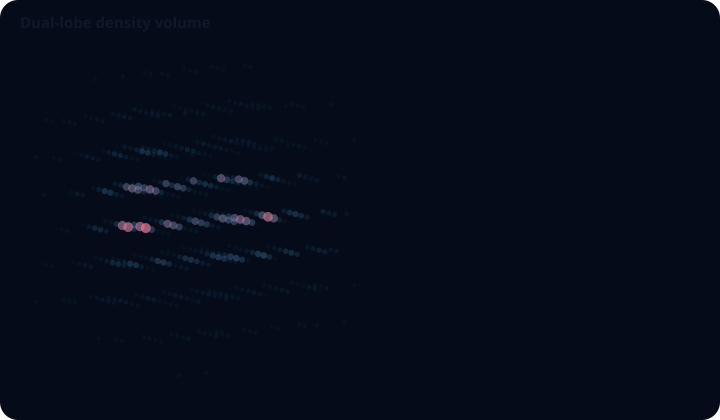
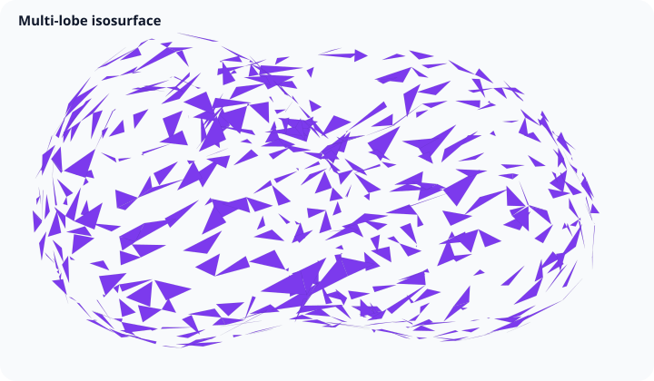

# Volume and isosurface

The `volume` canonical family consumes a bounded scalar lattice. `dimensions` are `[x, y, z]`, `values` use `z * x * y + y * x + x` order, and optional `origin` and positive `spacing` place the lattice in the scene.

## Volume sampling



`volume()` samples evenly across the flattened lattice order and draws depth-tested GPU points. It is useful for an overview of scalar density where every retained voxel needs a tooltip target.

```js
const values = [0, 0.1, 0.2, 0.4, 0.3, 0.5, 0.7, 1];
const chart = GraflumeSpatial.volume(
  '#volume',
  { dimensions: [2, 2, 2], values, origin: [-1, -1, -1], spacing: [2, 2, 2] },
  {
    maxSamples: 80000,
    pointSize: 5,
    opacity: 0.42,
    colorLow: '#38bdf8',
    colorHigh: '#fb7185',
  },
);
```

`maxSamples` is a strict upper bound from 1 through 250,000, including anisotropic lattices. Selection is deterministic, preserves both ends when the budget allows, and never emits an extra endpoint beyond the requested count.

## Isosurface extraction



`isosurface()` extracts the requested constant-value boundary into triangles with marching tetrahedra, then calculates face-derived lighting normals.

```js
const chart = GraflumeSpatial.isosurface(
  '#iso',
  { dimensions: [2, 2, 2], values: [0, 0, 0, 0, 0, 0, 0, 1] },
  { isoValue: 0.5, colorHigh: '#7c3aed', opacity: 0.84 },
);
```

When `isoValue` is omitted, the compiler uses the midpoint of the finite minimum and maximum. Cells entirely on one side of the threshold emit no triangles.

## Contract, picking, and limits

Each dimension is an integer from 2 through 256, the product is at most 4,194,304, and `values.length` must equal that product. All values, origins, and spacing entries are finite; spacing must be positive.

Volume picks expose lattice `x`, `y`, `z`, and `value`. Isosurface picks expose source cell `x`, `y`, `z`, and `isoValue`. Both feed tooltips and the accessible table. The current volume appearance is bounded point sampling rather than ray marching. Isosurface polygons are ordered in their extraction plane with low-to-high scalar winding before triangulation; the extractor does not smooth or decimate its output. The scene-level derived-output budget rejects an extraction whose safe worst-case geometry would be too large.
